# Unmanned Aerial Vehicle With Underlaid Device-to-Device Communications: Performance and Tradeoffs

Mohammad Mozaffari, Student Member, IEEE, Walid Saad, Senior Member, IEEE, Mehdi Bennis, Senior Member, IEEE, and Mérouane Debbah, Fellow, IEEE

Abstract—In this paper, the deployment of an unmanned aerial vehicle (UAV) as a flying base station used to provide the fly wireless communications to a given geographical area is analyzed. In particular, the coexistence between the UAV, that is transmitting data in the downlink, and an underlaid device-to-device (D2D) communication network is considered. For this model, a tractable analytical framework for the coverage and rate analysis is derived. Two scenarios are considered: a static UAV and a mobile UAV. In the first scenario, the average coverage probability and the system sum-rate for the users in the area are derived as a function of the UAV altitude and the number of D2D users. In the second scenario, using the disk covering problem, the minimum number of stop points that the UAV needs to visit in order to completely cover the area is computed. Furthermore, considering multiple retransmissions for the UAV and D2D users, the overall outage probability of the D2D users is derived. Simulation and analytical results show that, depending on the density of D2D users, the optimal values for the UAV altitude, which lead to the maximum system sum-rate and coverage probability, exist. Moreover, our results also show that, by enabling the UAV to intelligently move over the target area, the total required transmit power of UAV while covering the entire area, can be minimized. Finally, in order to provide full coverage for the area of interest, the tradeoff between the coverage and delay, in terms of the number of stop points, is discussed.

Index Terms—Device-to-device communication, stochastic geomtery, UAV deployment, unmanned aerial vehicle.

# I. INTRODUCTION

T HE use of unmanned aerial vehicles (UAVs) as flyingbase stations that can boost the capacity and coverage of existing wireless networks has recently attracted significant attention [1] and [2]. One key feature of a UAV that can potentially lead to the coverage and rate enhancement is having line-of-sight (LoS) connections towards the users. Moreover,

Manuscript received August 31, 2015; revised December 29, 2015; accepted February 2, 2016. Date of publication February 18, 2016; date of current version June 7, 2016. This work was supported in part by the U.S. National Science Foundation under Grant AST-1506297, in part by the Academy of Finland, and in part by the ERC Starting Grant 305123 MORE (Advanced Mathematical Tools for Complex Network Engineering). The associate editor coordinating the review of this paper and approving it for publication was J. Zhang.

M. Mozaffari and W. Saad are with the Wireless@VT, Electrical and Computer Engineering Department, Virginia Tech, Blacksburg, VA 24061 USA (e-mail: mmozaff@vt.edu; walids@vt.edu).

M. Bennis is with the CWC—Centre for Wireless Communications, Oulu 90570, Finland (e-mail: bennis@ee.oulu.fi).

M. Debbah is with the Mathematical and Algorithmic Sciences Laboratory, Huawei France R&D, Paris, France and with the Large Systems and Networks Group (LANEAS), CentraleSupélec, Université Paris-Saclay, France (e-mail: merouane.debbah@huawei.com).

Color versions of one or more of the figures in this paper are available online at http://ieeexplore.ieee.org.

Digital Object Identifier 10.1109/TWC.2016.2531652

owing to their agility and mobility, UAVs can be quickly and efficiently deployed to support cellular networks and enhance their quality-of-service (QoS). On the one hand, UAV-based aerial base stations can be deployed to enhance the wireless capacity and coverage at temporary events or hotspots such as sport stadiums and outdoor events. On the other hand, they can be used in public safety scenarios to support disaster relief activities and to enable communications when conventional terrestrial networks are damaged [1]. Another important application of UAVs is in the Internet of Things (IoT) in which the devices have small transmit power and may not be able to communicate over a long range. In this case, a UAV can provide a means to collect the IoT data from one device and transmit it to the intended receiver [3] and [4]. Last but not least, in regions or countries in which building a complete cellular infrastructure is very expensive, deploying UAVs is highly beneficial as it removes the need for towers and cables. In order to reap the benefits of UAV deployments for communication purposes, one must address a number of technical challenges that include performance analysis, channel modeling, optimal deployment, resource management, and energy efficiency [5]–[16].

The most significant existing body of work on UAV communications focuses on the air-to-ground channel modeling [5]–[8]. For instance, in [5] and [6], the probability of line of sight (LoS) for air-to-ground communication as a function of the elevation angle and average height of buildings in a dense urban area was derived. The air-to-ground path loss model has been further studied in [7] and [8]. As discussed in [8], due to path loss and shadowing, the characteristics of the air-to-ground channel are shown to depend on the height of the aerial base stations.

To address the UAV deployment challenge, the authors in [9] derived the optimal altitude enabling a single, static UAV to achieve a maximum coverage radius. However, in this work, the authors simply defined a deterministic coverage by comparing the path loss with a specified threshold and did not consider the coverage probability. The work in [10] extends the results of [9] to the case of two UAVs while considering interference between the UAVs. In [11], the authors studied the optimal placement of UAVs for public safety communications in order to enhance the coverage performance. However, the results presented in [11] are based on simulations and there is no significant analytical analysis. The use of UAVs for supplementing existing cellular infrastructure was discussed in [12] which provides a general view of practical considerations for integrating UAVs with cellular networks. The work in [13] considered the use of

UAVs to compensate for the cell overload and outage in cellular networks. However, [12] did not provide any analysis on the coverage performance of UAVs and their optimal deployment methods. In [14], the authors investigated how to optimally move UAVs for improving connectivity of ad-hoc networks. However, [14] only focused on an ad-hoc network and assumed that the UAV have complete information about the location of nodes. In [15], considering static ground users, the optimal trajectory and heading of UAVs equipped with multiple antennas for ground to air uplink scenario was derived. The work in [16] proposed a power efficient deployment and cell association for multiple UAVs in downlink transmissions.

For scenarios in which there is limited or no infrastructure support, beyond the use of UAVs, there has been considerable recent studies on device-to-device (D2D) communications between wireless users over the licensed spectrum [17]. Such D2D communications have been shown to improve coverage and capacity of existing wireless networks such as cellular systems. In particular, in hotspot areas or public safety scenarios, D2D will allow users to communicate directly with one another without significant infrastructure. D2D communications are typically deployed using underlaid transmission links which reuse existing licensed spectrum resources [18]. Therefore, deploying a UAV over a spectrum band that must be shared with an underlaid D2D network will introduce important interference management challenges. In the literature, there are some studies on the coexistence of the underlaid D2D and cellular communications with a single base station [19]. Furthermore, the authors in [20] exploited the interplay between the massive MIMO and underlaid D2D communications for a single cell case. The authors in [21] extended the previous work on the D2D/massive MIMO coexistence to the multi-cell scenario. However, none of these prior work studied the coexistence of UAVs and underlaid D2D communications. In particular, a comprehensive analysis to evaluate this coexistence in terms of different performance metrics, such as coverage and rate, is lacking in the current state-of-the-art [9], [14], [19]–[21].

Compared to the previous studies on the coexistence of D2D and cellular networks such as [20] and [21], the presence of an aerial UAV base station along with D2D links introduces new challenges. First, the channel model between the UAV and ground users will no longer follow a classical fading channel, instead, it will be based on probabilistic LoS and non-line-ofsight (NLoS) links [5] and [6]. Meanwhile, the channel between a base station and the users will still follow a Rayleigh fading model. Second, unlike conventional, fixed base stations, the height of a UAVs is adjustable which will impact the channel characteristics and the coverage performance. Third, the potential mobility of a UAV introduces new dimensions to the problem and the impact of such mobility on D2D and network performance must be analyzed. Prior studies on UAVs such as [5]–[14] have not addressed the third challenge. In particular, the interplay between UAVs and D2D communications and the existing challenges and tradeoffs have not been investigated in these literature. To our best knowledge, this paper will provide the first comprehensive fundamental analysis on the performance of UAV communication in the presence of underlaid D2D links.

The main contribution of this paper is to analyze the coverage and rate performance of UAV-based wireless communication in the presence of underlaid D2D communication links. In particular, we consider a network in which a single UAV must provide downlink transmission support to a number of users within a given area. In this area, a subset of the devices is also engaged in D2D transmissions that operate in an underlay fashion over the UAV’s transmission. We consider two types of users, namely downlink users (DUs) which receive data from the UAV, and D2D users which communicate directly with one another. Here, the UAV must communicate with the DUs while taking into account the potential interference stemming from the underlaid D2D transmissions. For this network, we analyze two key cases: static UAV and mobile UAV. Using tools from stochastic geometry, for both scenarios, we derive the average downlink coverage probabilities for DUs and D2D users and we analyze the impact of the UAV altitude and density of the D2D users on the overall performance. For the static case, we find the optimal values for the UAV altitude which leads to a maximum coverage probability for DUs. In addition, considering both DUs and D2D users, an optimal altitude which maximizes the system sum-rate is computed. Our results demonstrate that the optimal UAV altitude decreases as the density of D2D users increases. The results show that a maximum system sum-rate can be achieved if the UAV altitude is appropriately adjusted based on the D2D users’ density. Furthermore, for a given UAV altitude, we show that an optimal value for the number of D2D users that maximizes the system sum-rate exists.

For the mobile UAV case, we assume that the UAV can travel over the area while stopping at some given locations in order to serve the downlink users. Using the disk covering problem, we find a minimum number of stop points that the UAV needs to to completely cover the area. This can be interpreted as the fastest way to cover the whole area with a minimum required transmit power. In addition, we analyze the tradeoff between the number of stop points, which is considered as delay here, and the coverage probability for the downlink users. Moreover, considering retransmissions at different time instances, we derive the overall outage probability for the D2D communications. We show that, in order to enhance the coverage for DUs, the UAV should stop in more locations over the target area which can, in turn, lead an increased delay for DUs and higher outage probability for D2D users. For example, our results show that for a given density of D2D users, to increase the DU coverage probability from 0.4 to 0.7, the number of stop points should be increased from 5 to 23. Furthermore, the number of stop points is shown to significantly depend on the number of D2D users. For instance, if the average number of D2D users in the area increases from 50 to 100, in order to maintain the DUs’ coverage requirement, the number of stop points should be increased from 20 to 55.

The rest of this paper is organized as follows. Section II presents the system model and describes the air-to-ground channel model. In Section III, coverage probabilities for DUs and D2D users are derived for a single static UAV. Section IV presents the performance evaluation for the mobile UAV which is used to provide full coverage for the target area. Section V presents the simulation results while Section VI draws some conclusions.

# II. SYSTEM MODEL

Consider a circular area with a radius $R _ { c }$ in which a number of wireless users are deployed. In this area, as shown in Figure 1, a UAV (at low altitude platform) is deployed to act as a flying base station and to serve a subset of those users. In this network, the users are divided into two groups: downlink users located uniformly in the cell with density $\lambda _ { d u }$ (number of users per $\mathrm { m } ^ { 2 } ) ,$ , and D2D users whose distribution follows a homogeneous Poisson point process (PPP) $\Phi _ { \mathrm { B } }$ [22] with density $\lambda _ { d }$ (number of D2D pairs per $\mathrm { m } ^ { 2 } )$ . Note that, the average number of users in a given area is equal to the density of the users multiplied by the size of the area. Here, we focus on the downlink scenario for the UAV and we assume that the D2D users communicate in an underlay fashion. Furthermore, we assume that a D2D receiver connects to its corresponding D2D transmitter pair located at a fixed distance away from it in an isotropic direction [19]. Therefore, the received signals at the D2D receiver include the desired signal from the D2D transmitter pair and the interference from the UAV and other D2D transmitters. A downlink user, on the other hand, receives the desired signal from the UAV but it also experiences interference from all the D2D transmitters. It should be noted that, in our model, the UAV provides service for downlink users (DUs) located inside a given, finite area with radius $R _ { c } .$ . Nonetheless, we assume that the D2D users are spatiality distributed according to a PPP over an infinite area. In other words, each user receives interference from an infinite number of D2D transmitters. This is a typical assumption in PPP analysis which ensures that the average interference from D2D transmitters does not depend on the location of the users [20], [23], and [24].

The signal-to-interference-plus-noise ratio (SINR) expression for a D2D receiver is:

$$
\gamma_ {d} = \frac {P _ {r , d}}{I _ {d} ^ {c} + I _ {u} + N}, \tag {1}
$$

where $P _ { r , d }$ is the received signal power from the D2D transmitter, $I _ { d } ^ { c }$ is the total interference from other D2D users, $I _ { u }$ is the interference from the UAV, and N is the noise power. Moreover, we have:

$$
P _ {r, d} = P _ {d} d _ {0} ^ {- \alpha_ {d}} g _ {0}, \tag {2}
$$

$$
I _ {d} ^ {c} = \sum_ {i \neq 0} P _ {d} d _ {i} ^ {- \alpha_ {d}} g _ {i}, \tag {3}
$$

$$
I _ {d} = \sum_ {i} P _ {d} d _ {i} ^ {- \alpha_ {d}} g _ {i}, \tag {4}
$$

where the index $i = 0$ is used for the selected D2D transmitter/receiver pair, g0 and $g _ { i }$ are, respectively, the channel gains between a D2D receiver and its corresponding D2D transmitter, and the $i ^ { t h }$ interfering D2D transmitters. For the D2D transmission, we assume a Rayleigh fading channel model [19], [21], and [25]. $P _ { d }$ is the D2D transmit power which is assumed to be fixed and equal for all the users, $d _ { i }$ is the distance between a D2D receiver and the $i ^ { t h }$ D2D transmitter, $d _ { 0 }$ is the fixed distance between the D2D receiver and transmitter of the selected D2D pair, and $\alpha _ { d }$ is the path loss exponent between D2D users. Note that the received signal powers as well as the noise power are normalized by a path loss coefficient.

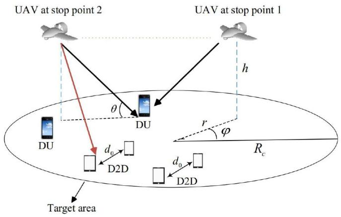

flowchart

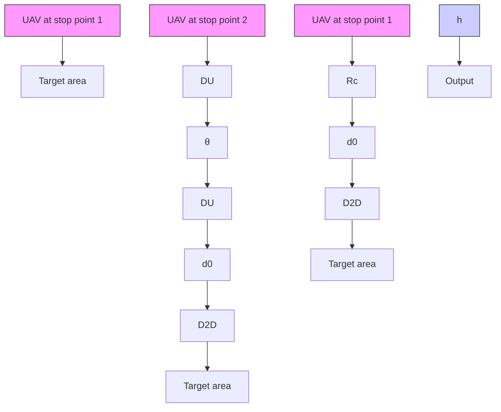

${ \mathrm { F i g . } }$ . 1. Network model including a UAV, downlink users and D2D.

The SINR expression for a DU user that can connect to the UAV is:

$$
\gamma_ {u} = \frac {P _ {r , u}}{I _ {d} + N}, \tag {5}
$$

where $P _ { r , u }$ is the received signal power from the UAV and $I _ { d }$ is the total interference power from D2D transmitters. Finally, the SINR-based coverage probability for the downlink users and the D2D users is given by:

$$
P _ {\text { cov }, d u} (\beta) = \mathbb {P} \left[ \gamma_ {u} \geq \beta \right], \tag {6}
$$

$$
P _ {\text { cov }, d} (\beta) = \mathbb {P} \left[ \gamma_ {d} \geq \beta \right], \tag {7}
$$

where $\gamma _ { u }$ and $\gamma _ { d }$ are, respectively, the SINR values at the location of the downlink users and the D2D users, and $\beta$ is the SINR threshold.

# A. Air-to-Ground Channel Model

As discussed in [5] and [9], the ground receiver can receive three groups of signals including LoS, strong reflected NLoS signals, and multiple reflected components which cause multipath fading. These groups can be considered separately with different probabilities of occurrence as shown in [5] and [8]. Typically, it is assumed that the received signal is categorized in only one of those groups [9]. Each group has a specific probability of occurrence which is a function of environment, density and height of buildings, and elevation angle. Note that the probability of having the multipath fading is significantly lower than the LoS and NLoS groups [9]. Therefore, the impact of small scale fading can be neglected in this case [5]. One common approach for modeling air-to-ground propagation channel is to consider LoS and NLoS components along with their occurrence probabilities separately as shown in [5] and [8]. Note that for NLoS connections due to the shadowing effect and the reflection of signals from obstacles, path loss is higher than in LoS. Hence, in addition to the free space propagation loss, different excessive path loss values are assigned to LoS and NLoS links. Depending on the LoS or NLoS connection between the user and UAV, the received signal power at each user location is given by [9]:

$$
P _ {r, u} = \left\{ \begin{array}{l l} P _ {u} | X _ {u} | ^ {- \alpha_ {u}} & \text {   LoS   link,   } \\ \eta P _ {u} | X _ {u} | ^ {- \alpha_ {u}} & \text {   NLoS   link,   } \end{array} \right. \tag {8}
$$

where $P _ { u }$ is the UAV transmit power, $\vert X _ { u } \vert$ is the distance between a generic user and the UAV, $\alpha _ { u }$ is the path loss exponent over the user-UAV link, and η is an additional attenuation factor due to the NLoS connection. Here, the probability of LoS connection depends on the environment, density and height of buildings, the location of the user and the UAV, and the elevation angle between the user and the UAV. The LoS probability can be expressed as follows [9]:

$$
P _ {\mathrm{LoS}} = \frac {1}{1 + C \exp (- B [ \theta - C ])}, \tag {9}
$$

where C and B are constant values which depend on the environment (rural, urban, dense urban, or others) and θ is the elevation angle. Clearly, $\begin{array} { r } { \theta = \frac { 1 8 0 } { \pi } \times \sin ^ { - 1 } \Big ( \frac { h } { | X _ { u } | } \Big ) , | X _ { u } | = } \end{array}$ $\sqrt { h ^ { 2 } + r ^ { 2 } }$ and also, probability of NLoS is $P _ { \mathrm { N L o S } } = 1 - P _ { \mathrm { L o S } }$ . As observed from (9), the LoS probability increases as the elevation angle between the user and UAV increases.

Given this model, we will consider two scenarios: a static UAV and a mobile UAV. For each scenario, we will derive the coverage probabilities and average rate for DUs and D2D users. Once those metrics are derived, considering the D2D users density, we obtain optimal values for the UAV altitude that maximize the coverage probability and average rate.

# III. NETWORK WITH A STATIC UAV

In this section, we evaluate the coverage performance of the users in the scenario in which one UAV located at the altitude of h in the center of the area serves the downlink users in the presence of underlaid D2D communications. It can be shown that, for a uniform distribution of users over the given area, palcing the UAV in the center of the area can maximize the coverage probability of the downlink users.

# A. Coverage Probability for D2D Users

Consider a D2D receiver located at $( r , \varphi )$ , where r and ϕ are the radius and angle in a polar coordinate system assuming that the UAV is located at the center of the area of interest. The distance between the D2D transmitter and its corresponding receiver is fixed and it is denoted by $d _ { 0 }$ . In this case, for underlaid D2D communication, the coverage probability for the D2D users can be derived as follows:

Theorem 1: The coverage probability for a D2D receiver, at the location (r, φ), connecting to its D2D transmitter located at a distance d0 away from it, is given by:

$$
\begin{array}{l} P _ {\text { cov }, d} (r, \varphi , \beta) = \exp \left(\frac {- 2 \pi^ {2} \lambda_ {d} \beta^ {2 / \alpha_ {d}} d _ {0} ^ {2}}{\alpha_ {d} \sin (2 \pi / \alpha_ {d})} - \frac {\beta d _ {0} ^ {\alpha_ {d}} N}{P _ {d}}\right) \\ \times \left[ P _ {\mathrm{LoS}} \exp \left(\frac {- \beta d _ {0} ^ {\alpha_ {d}} P _ {u} | X _ {u} | ^ {- \alpha_ {u}}}{P _ {d}}\right) \right. \\ \left. + P _ {\mathrm{NLoS}} \exp \left(\frac {- \beta d _ {0} ^ {\alpha_ {d}} \eta P _ {u} | X _ {u} | ^ {- \alpha_ {u}}}{P _ {d}}\right) \right], \tag {10} \\ \end{array}
$$

where $| X _ { u } | = \sqrt { h ^ { 2 } + r ^ { 2 } } .$ .

Proof: See Appendix A.

From this theorem, we can make several key observations. First, considering the fact that the UAV creates interference on the D2D users, increasing the UAV altitude to increase its distance from the D2D users does not necessarily reduces the interference on the D2D users. As will be shown later by numerical simulations, by increasing the UAV altitude the D2D coverage probability decreases first, and then increases. This is due to the fact that, considering (9) and (10), although increasing the UAV altitude increases the path loss term, it also leads to a higher LoS probability. In general, the D2D users prefer to have the NLoS view towards the UAV and have a maximum distance from it, however, these two objectives conflicts with each other. Second, increasing the D2D transmit power $( P _ { d } )$ , always enhances the D2D coverage probability, even in an interference limited scenario where noise is ignored. Typically, in the interference limited scenarios, increasing the transmit power of the D2D users does not improve the coverage performance due to the increased interference from other D2D transmitters. According to Theorem 1, although in the interference limited scenario (N = 0) the first multiplying term in (10) is independent of $P _ { d }$ due to the interference from D2D transmitters, the second term is an increasing function of $P _ { d } .$ . Finally, the D2D coverage probability in (10) decreases when the UAV transmit power increases. To cope with this situation, the D2D users can increase their transmit power or reduce the fixed distance parameter (d0). In addition, decreasing the D2D user density improves the coverage probability due to decreasing the interference. Note that the result presented in Theorem 1 corresponds to the coverage probability for a D2D user located at $( r , \varphi )$ . To compute the average coverage probability in the cell, we consider a uniform distribution of users over the area with $\begin{array} { r } { f ( r , \varphi ) = \frac { r } { \pi R _ { \ast } ^ { 2 } } , ~ 0 \leq r \leq R _ { c } , ~ 0 \leq \varphi \leq 2 \pi ^ { 1 } } \end{array}$ = rπ R2 , 0 ≤ r ≤ Rc, 0 ≤ ϕ ≤ 2π 1, where Rc is $R _ { c }$ the radius of the desired circular area. Then, we compute the average over the desired area. The average coverage probability for D2D users will be:

$$
\begin{array}{l} \bar {P} _ {\mathrm{cov}, d} (\beta) = \mathbb {E} _ {r, \varphi} \left[ P _ {\mathrm{cov}, d} (r, \varphi , \beta) \right] \\ = \exp \left(\frac {- 2 \pi^ {2} \lambda_ {d} \beta^ {2 / \alpha_ {d}} d _ {0} ^ {2}}{\alpha_ {d} \sin (2 \pi / \alpha_ {d})} - \frac {\beta d _ {0} ^ {\alpha_ {d}} N}{P _ {d}}\right) \\ \times \int_ {0} ^ {R _ {c}} \mathbb {E} _ {I _ {u}} \left[ \exp \left(\frac {- \beta d _ {0} ^ {\alpha_ {d}} I _ {u}}{P _ {d}}\right) \right] f (r, \varphi) \mathrm{d} r \mathrm{d} \varphi \\ = \exp \left(\frac {- 2 \pi^ {2} \lambda_ {d} \beta^ {2 / \alpha_ {d}} d _ {0} ^ {2}}{\alpha_ {d} \sin (2 \pi / \alpha_ {d})} - \frac {\beta d _ {0} ^ {\alpha_ {d}} N}{P _ {d}}\right) \\ \times \int_ {0} ^ {R _ {c}} \mathbb {E} _ {I _ {u}} \left[ \exp \left(\frac {- \beta d _ {0} ^ {\alpha_ {d}} I _ {u}}{P _ {d}}\right) \right] \frac {2 r}{R _ {c} ^ {2}} \mathrm{d} r. \tag {11} \\ \end{array}
$$

From (11), we can see that the average coverage probability for D2D users increases as the size of the area, $R _ { c }$ , increases. In fact, when the UAV serves a larger area, the average distance of D2D users from the UAV increases and on the average they

1Note that the number of users follows a Poisson distribution but uniform distribution over the area.

receive lower interference from it. Next, we provide a special case for (11) in which the UAV has a very high altitude or very small transmit power.

Remark 1: For $P _ { u } = 0$ or $h  \infty$ , the average coverage probability for the D2D users is simplified to [24]:

$$
\bar {P} _ {\text { cov,d }} (\beta) = \exp \left(\frac {- 2 \pi^ {2} \lambda_ {d} \beta^ {2 / \alpha_ {d}} d _ {0} ^ {2}}{\alpha_ {d} \sin (2 \pi / \alpha_ {d})} - \frac {\beta d _ {0} ^ {\alpha_ {d}} N}{P _ {d}}\right), \tag {12}
$$

Note that, (12) corresponds to the coverage probability in overlay D2D communication in which there is no interference between the UAV and the D2D transmitters. It should be noted that, this result is also related to the success probability in a bipolar ad-hoc network [24].

# B. Coverage Probability for Downlink Users

Here, we first derive the upper bound and lower bound for the downlink users’ coverage probability.

Theorem 2: The lower bound and upper bound of the average coverage probability for DUs in the area of interest is given by:

$$
\begin{array}{l} \bar {P} _ {\text { cov,du }} ^ {L} (\beta , h) = \int_ {0} ^ {R _ {c}} P _ {\text { LoS }} (r, h) L _ {I} \left(\frac {P _ {u} | X _ {u} | ^ {- \alpha_ {u}}}{\beta} - N\right) \frac {2 r}{R _ {c} ^ {2}} \mathrm{d} r \\ + \int_ {0} ^ {R _ {c}} P _ {\mathrm{NLoS}} (r, h) L _ {I} \left(\frac {\eta P _ {u} | X _ {u} | ^ {- \alpha_ {u}}}{\beta} - N\right) \frac {2 r}{R _ {c} ^ {2}} \mathrm{d} r, \tag {13} \\ \end{array}
$$

$$
\begin{array}{l} \bar {P} _ {\text { cov,du }} ^ {U} (\beta , h) = \int_ {0} ^ {R _ {c}} P _ {\text { LoS }} (r, h) U _ {I} \left(\frac {P _ {u} | X _ {u} | ^ {- \alpha_ {u}}}{\beta} - N\right) \frac {2 r}{R _ {c} ^ {2}} \mathrm{d} r \\ + \int_ {0} ^ {R _ {c}} P _ {\mathrm{NLoS}} (r, h) U _ {I} \left(\frac {\eta P _ {u} | X _ {u} | ^ {- \alpha_ {u}}}{\beta} - N\right) \frac {2 r}{R _ {c} ^ {2}} \mathrm{d} r, \tag {14} \\ \end{array}
$$

where $\beta N < P _ { u } | | X _ { u } | | ^ { - \alpha _ { u } }$ , and for any $T > 0$ ,

$$
\begin{array}{l} L _ {I} (T) = \left[ 1 - \frac {2 \pi \lambda_ {d} \Gamma (1 + 2 / \alpha_ {d})}{\alpha_ {d} - 2} \left(\frac {T}{P _ {d}}\right) ^ {- 2 / \alpha_ {d}} \right] \\ \times \exp \left(- \pi \lambda_ {d} \left(\frac {T}{P _ {d}}\right) ^ {- 2 / \alpha_ {d}} \Gamma (1 + 2 / \alpha_ {d})\right), \tag {15} \\ \end{array}
$$

$$
U _ {I} (T) = \exp \left(- \pi \lambda_ {d} \left(\frac {T}{P _ {d}}\right) ^ {- 2 / \alpha_ {d}} \Gamma (1 + 2 / \alpha_ {d})\right). \tag {16}
$$

Also, $\Gamma ( t ) = \intop _ { 0 } ^ { \infty } x ^ { t - 1 } e ^ { - x }$ dx is the gamma function [26].

Proof: See Appendix B.

From Theorem 2, we can first see that, for $T > > P _ { d }$ , given that $e ^ { - x } \approx 1 - x$ when $x \to 0$ , we have $U _ { I } ( T ) = L _ { I } ( T )$ ≈ $\begin{array} { r } { 1 - \pi \lambda _ { d } \Big ( \frac { T } { P _ { d } } \Big ) ^ { - 2 / \alpha _ { d } } \Gamma ( 1 + 2 / \alpha _ { d } ) } \end{array}$ −2/αd . This means that the lower bound and upper bound become tighter for lower transmit power of D2D users. Moreover, from (15) and (16), when $\lambda _ { d } \to \infty$ , the number of D2D users tends to infinity and $U _ { I } =$ $L _ { I } = 0$ . Consequently, the downlink users experience an infinite interference from the D2D users which results in $\bar { P } _ { \mathrm { c o v , d u } } = 0$ .

Furthermore, considering (9), (13), and (14), we can see that increasing the UAV altitude (h), can enhance the LoS probability and the coverage probability. On the other hand, due to increasing $| X _ { u } | , L _ { I }$ and $U _ { I }$ decrease, and hence the coverage probability for downlink users decreases. Therefore, in order to achieve the maximum coverage, the altitude of the UAV should be carefully adjusted.

As per Theorem 2, increasing $R _ { c }$ decreases the average coverage probability for the downlink users. However, higher $R _ { c }$ results in a higher D2D average coverage probability. Moreover, the average coverage probability for downlink users decreases as the density of the D2D users increases. In this case, to improve the DUs coverage performance, one must increase $P _ { u }$ or reduce $R _ { c }$ . Next, we derive the DU coverage probability in the absence of the D2D users.

Proposition 1: For low density and transmit power of D2D users, the interference from D2D users is negligible compared to the UAV, then, the exact average coverage probability for the downlink users can be expressed as:

$$
\begin{array}{l} \bar {P} _ {\text { cov,du }} (\beta) = \int_ {0} ^ {\min \left[ \left(\frac {P _ {u}}{\beta N}\right) ^ {1 / \alpha_ {u}}, R _ {c} \right]} P _ {\text { LoS }} (r) \frac {2 r}{R _ {c} ^ {2}} \mathrm{d} r \\ + \int_ {0} ^ {\min \left[ \left(\frac {\eta P _ {u}}{\beta N}\right) ^ {1 / \alpha_ {u}}, R _ {c} \right]} P _ {\mathrm{NLoS}} (r) \frac {2 r}{R _ {c} ^ {2}} \mathrm{d} r. \tag {17} \\ \end{array}
$$

Proof: For a DU located at $( r , \varphi )$ , the coverage probability in absence of D2D users becomes

$$
\begin{array}{l} P _ {\text { cov,du }} (r, \varphi , \beta) = \mathbb {P} [ \gamma_ {u} \geq \beta ] = P _ {\text { LoS }} (r) \mathbb {P} [ \gamma_ {u} \geq \beta | \text { LoS } ] \\ + P _ {\mathrm{NLoS}} (r) \mathbb {P} [ \gamma_ {u} \geq \beta | \mathrm{NLoS} ] \\ = P _ {\mathrm{LoS}} (r) \mathbb {1} \left[ r \leq \left(\frac {P _ {u}}{\beta N}\right) ^ {1 / \alpha_ {u}} \right] \\ + P _ {\mathrm{NLoS}} (r) \mathbb {1} \left[ r \leq \left(\frac {\eta P _ {u}}{\beta N}\right) ^ {1 / \alpha_ {u}} \right]. \tag {18} \\ \end{array}
$$

Now, the average coverage probability is computed by taking the average of $P _ { \mathrm { c o v , d u } } ( r , \varphi , \beta )$ over the cell with the radius $R _ { c } .$ .

$$
\begin{array}{l} P _ {\operatorname{cov}, d u} (r, \varphi , \beta) = \mathbb {E} _ {r, \varphi} \left[ P _ {\operatorname{cov}, d u} (r, \varphi , \beta) \right] \\ = \int_ {0} ^ {\min \left[ \left(\frac {P _ {u}}{\beta N}\right) ^ {1 / \alpha_ {u}}, R _ {c} \right]} P _ {\mathrm{LoS}} (r) \frac {2 r}{R _ {c} ^ {2}} \mathrm{d} r \\ + \int_ {0} ^ {\min \left[ \left(\frac {\eta P _ {u}}{\beta N}\right) ^ {1 / \alpha_ {u}}, R _ {c} \right]} P _ {\mathrm{NLoS}} (r) \frac {2 r}{R _ {c} ^ {2}} \mathrm{d} r. \tag {19} \\ \end{array}
$$

Proposition 1 gives the exact expression for the downlink users’ coverage probability when the interference from D2D users, due to their low density and low transmit power, is negligible compared to the UAV. Therefore, the result of Proposition 1 shows the maximum achievable coverage performance for downlink users when the received signal from the

UAV is dominant compared to the interference from the D2D transmitters.

# C. System Sum-Rate

Now, we investigate the average achievable rates for the DUs and D2D users which can be expressed as in [20]:

$$
\bar {C} _ {d u} = W \log_ {2} (1 + \beta) \bar {P} _ {\text { cov }, d u} (\beta), \tag {20}
$$

$$
\bar {C} _ {d} = W \log_ {2} (1 + \beta) \bar {P} _ {\text { cov }, d} (\beta), \tag {21}
$$

where W is the transmission bandwidth. Considering the whole DUs and D2D users in the cell, the system sum-rate, $\bar { C } _ { \mathrm { s u m } }$ , can be derived as a function of the coverage probabilities and the number of users as follows:

$$
\bar {C} _ {\text { sum }} = R _ {c} ^ {2} \pi \lambda_ {d u} \bar {C} _ {d u} + R _ {c} ^ {2} \pi \lambda_ {d} \bar {C} _ {d}. \tag {22}
$$

Assuming $\begin{array} { r } { \mu = \frac { \lambda _ { d u } } { \lambda _ { d } } } \end{array}$ λdu λd , we have

$$
\bar {C} _ {\text { sum }} = \lambda_ {d} R _ {c} ^ {2} \pi \left[ \mu \bar {P} _ {\text { cov }, d u} (\beta) + \bar {P} _ {\text { cov }, d} (\beta) \right] W \log_ {2} (1 + \beta), \tag {23}
$$

where ${ R _ { c } } ^ { 2 } \pi \lambda _ { d }$ and ${ R _ { c } } ^ { 2 } \pi \lambda _ { d u }$ are the number of DUs and D2D users in the target area respectively.

From (23), observe that, on the one hand, $\bar { C } _ { \mathrm { s u m } }$ is directly proportional to $\lambda _ { d }$ , but on the other hand, it depends on the coverage probabilities of DUs and D2D users which both are decreasing functions of D2D user density. Therefore, in general, increasing $\lambda _ { d }$ does not necessarily enhance the rate. Note that, considering (11), (13), (14), and (23), for both $\lambda _ { d } \to 0$ and $\lambda _ { d } \to \infty$ cases the system sum-rate tend to zero. Hence, there is an optimum value for $\lambda _ { d }$ that maximizes $\bar { C } _ { \mathrm { s u m } }$ .

According to (23), $\bar { C } _ { \mathrm { s u m } }$ is a function of the coverage probability and a logarithmic function of the threshold (β). The former is a decreasing function of $\beta$ whereas the latter is an increasing function of $\beta .$ . In other words, although increasing the threshold is desirable for the rate due to increasing the logarithmic function, it also reduces the coverage probability. Therefore, in order to achieve a maximum rate, a proper value for the threshold can be adopted. It should be noted that, the SINR threshold, $\beta ,$ is typically fixed and cannot be set lower than the receiver sensitivity. However, the analysis of different values of $\beta$ brings value in order to understand how one could change the SINR threshold value (in the future) through proper resource allocation or just system design (change in the number of users, etc).

# IV. NETWORK WITH A MOBILE UAV

Now, we assume that the UAV can move around the area of radius $R _ { c }$ in order to provide coverage for all the downlink users in the target area. In particular, we consider a UAV that moves over the target area and only transmits at a given geographical location (area) which we hereinafter refer to as “stop points”. Each stop point represents a location over which the UAV stops and serves the present downlink users. Here, our first goal is to minimize the number of stop points (denoted by M) and determine their optimal location. The objective of the UAV is to cover the entire area and ensure that the coverage requirements for all DUs are satisfied with a minimum UAV transmit power and minimum number of stop points. In other words, we find the minimum number and location of stop points for the UAV to completely cover the area. We model this problem by exploiting the so-called disk covering problem [27]. In the disk covering problem, given a unit disk, the objective is to find the smallest radius required for M equal smaller disks to completely cover the unit disk. In the dual form of the problem, for a given radius of small disks, the minimum number of disks required to cover a bigger disk is found.

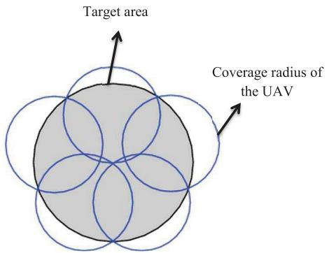

text_image

Target area
Coverage radius of
the UAV

Fig. 2. Five disks covering problem.

TABLE I NUMBER AND RADII OF DISKS IN THE COVERING PROBLEM 

<table><tr><td>Number of stop points</td><td>Minimum required coverage radius  $\left( {R}_{\min }\right)$ </td></tr><tr><td> $M = 1,2$ </td><td> ${R}_{c}$ </td></tr><tr><td> $M = 3$ </td><td> $\frac{\sqrt{3}}{2}{R}_{c}$ </td></tr><tr><td> $M = 4$ </td><td> $\frac{\sqrt{2}}{2}{R}_{c}$ </td></tr><tr><td> $M = 5$ </td><td> ${0.61}{R}_{c}$ </td></tr><tr><td> $M = 6$ </td><td> ${0.556}{R}_{c}$ </td></tr><tr><td> $M = 7$ </td><td> ${0.5}{R}_{c}$ </td></tr><tr><td> $M = 8$ </td><td> ${0.437}{R}_{c}$ </td></tr><tr><td> $M = 9$ </td><td> ${0.422}{R}_{c}$ </td></tr><tr><td> $M = {10}$ </td><td> ${0.398}{R}_{c}$ </td></tr><tr><td> $M = {11}$ </td><td> ${0.38}{R}_{c}$ </td></tr><tr><td> $M = {12}$ </td><td> ${0.361}{R}_{c}$ </td></tr></table>

In Figure 2, we provide an illustrative example to show the mapping between the mobile UAV communication problem and the disk covering problem. In this figure, the center of small disks can be considered as the location of stop points and the radius of the disk is the coverage radius of the UAV. Using the disk covering problem analysis, in Table I, we present, for different number of stop points, the minimum required coverage radius of a UAV for completely covering the target area [27], [28]. Thereby, using the dual disk covering problem, for a given maximum coverage radius of a UAV, we can find the minimum number of stop points for covering the entire area. The detailed steps for finding the minimum number of stop points are provided next.

First, we compute the coverage radius of the UAV based on the minimum requirement for the DU coverage probability. The coverage radius is defined as the maximum radius within which the coverage probability for all DUs (located inside the coverage range) is greater than a specified threshold, 
. In this case, the UAV satisfies the coverage requirement of each DU which is inside its coverage range. The maximum coverage radius for the UAV at an altitude h transmitting with a power $P _ { u }$ will be given by:

$$
R _ {m} = \max \{R | P _ {\text { cov }, d u} (\beta , R) \geq \varepsilon , P _ {u}, h \} = P _ {\text { cov }, d u} ^ {- 1} (\beta , \varepsilon), \tag {24}
$$

where ε is the threshold for the average coverage probability in the cell (area covered by the UAV). Note that, a user is considered to be in coverage if it is in the coverage range of the UAV. The minimum required number of stop points for the full coverage is:

$$
\left\{ \begin{array}{l} L = \min \{M \}, \\ P _ {\text { cov }, d u} (r, \varphi , \beta) \geq \varepsilon , \end{array} \right. \tag {25}
$$

where M represents the number of stop points, the second condition guarantees that the area is completely covered by the UAV, and L is the minimum value for the number of stop points if the following condition holds:

$$
R _ {\min, L} \leq R _ {m} \leq R _ {\min, L - 1} \rightarrow \min \{M \} = L. \tag {26}
$$

By using Table I, we see that, $R _ { \mathrm { m i n } , L - 1 }$ and $R _ { \mathrm { m i n } , L }$ are, respectively, the minimum radius required to cover the entire target area with L − 1 and L disks. After finding the minimum M, we can reduce the UAV transmission power such that the coverage radius decreases to the minimum required radius $( R _ { \mathrm { m i n } , L } )$ . In this way, the UAV transmit power is minimized. Thus, we have:

$$
P _ {u, \min} = \underset {P _ {u}} {\operatorname{argmin}} \left\{P _ {\text { cov }, d u} ^ {- 1} (\beta , \varepsilon) = R _ {\min, L} | h \right\}, \tag {27}
$$

where $P _ { u , \mathrm { m i n } }$ is the minimum UAV transmit power. Thereby, the minimum number of stop points leads to a full coverage at a minimum time with a minimum required transmit power.

In summary, the proposed UAV deployment method that leads to the complete coverage with a minimum time and transmission power proceeds as follows. First, depending on the parameters of the problem such as density of users and threshold, we compute the maximum coverage radius of a UAV at the optimal altitude that can serve the DUs. Second, considering the size of target area, using the disk covering problem, we find the minimum required number of transmission points along with the coverage radius at each point. Third, we reduce the transmission power of UAV such that its maximum coverage radius becomes equal to the required coverage radius found in the previous step. Using the proposed method, the target area can be completely covered by the UAV with a minimum required transmit power and minimum number of stop points. Next, we investigate the impact of the number of stop points on the full coverage time of the downlink users, and the overall outage probability of the D2D users.

We consider the network during M time instances in which the UAV and D2D users will execute M retransmissions. Note that, our system model considers the downlink, therefore, the retransmissions are essentially from the UAV to the DUs, and from D2D transmitters to corresponding receivers. The moving UAV satisfies the coverage requirements of the downlink users in M retransmissions from different locations. Clearly, as the number of stop points (M) increases, the time required for UAV to completely cover the desired area, increases. Here, the time that the UAV needs to provide the full coverage for the area by visiting all the stop points, is called delay. Hence, the delay depends on the travel time of the UAV between the stop points, and the time that UAV spends at each stop point for transmissions. Thus, the delay can be written as:

$$
\tau = T _ {t r} + M T _ {s}, \tag {28}
$$

where $T _ { t r }$ is the total UAV travel time, M is the number of stop points, and $T _ { s }$ is the time that the UAV stays at each stop point. Clearly, the travel time depends on the travel distance and location of the stop points, and the speed of the UAV. The total travel time will clearly increase as the number of stop points increases. However, in general, the exact relationship between $T _ { t r }$ and M strongly depends on the locations of the stop points which do not necessary follow a fixed path/distribution for different values of M. As an example, it can be shown that the exact travel time for M = 3 and $\begin{array} { r } { M = 4 \mathrm { i s } \frac { \sqrt { 3 } R _ { c } } { \nu } } \end{array}$ and $\frac { 3 R _ { c } } { \nu }$ respectively, where v is the speed of the UAV, and $R _ { c }$ is the radius of the desired area. The residence time, $T _ { s }$ , depends on the multiple access method. If the UAV adopts a time division multiple access (TDMA) technique, the residence time will be a function of the number of stop points. Note that, a higher number of stop points corresponds to a smaller coverage region of the UAV. Hence, at each stop point, the UAV needs to provide service for a fewer number of users. Therefore, by increasing the number of stop points, the residence time can be decreased in the TDMA case. Considering a uniform distribution of the users, the residence time is approximately computed as:

$$
T _ {s} \approx T _ {s, 1} \frac {R _ {\min} ^ {2} (M)}{R _ {c} ^ {2}} U, \tag {29}
$$

where $T _ { s , 1 }$ is the service time of UAV for each downlink user, U is the number of downlink users, $R _ { \mathrm { m i n } }$ is the coverage radius of the UAV which depends on M, the number of the stop points, and $R _ { c }$ is the radius of the desired area. However, if the UAV uses a frequency division multiple access (FDMA) technique, the users can be served simultaneously. In other words, the UAV does not need to use different time slots to serve the users. Therefore, if users are of homogeneous traffic type, the residence time of the UAV at each stop point does not depend on the number of the users, and hence it can be fixed. In this case, the residence time at each stop point will be constant and it does not depend on the coverage radius of the UAV and the number of stop points. As a result, $T _ { s } = T _ { s , 1 }$ . In our model, we have considered FDMA for multiple access. Hence, the residence time is the same for all values of M. In Figure 3, we have shown the total delay versus the number of stop points for two values of residence time, and $\nu = 1 0 \mathrm { m / s }$ . As expected, the total delay increases as the number of stop points increases. Moreover, when the residence time of the UAV at each stop point increases, the additional delay due to a higher number of stop points increases. As we can see from Figure 3, for $T _ { s , 1 } =$ 20 s, the delay increases from 230 s to 480 s if the number of stop points increases from 3 to 10. However, for $T _ { s , 1 } = 4 0$ s the delay increases from 295 s to 690 s. Clearly, the delay and the number of stop points are directly related. It should be noted that, for our simulations, we consider the number of stop points as delay.

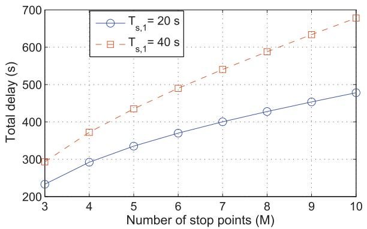

line

| Number of stop points (M) | T_s,1 = 20 s | T_s,1 = 40 s |
| ------------------------- | ------------ | ------------ |
| 3                         | 230          | 290          |
| 4                         | 290          | 370          |
| 5                         | 330          | 430          |
| 6                         | 370          | 490          |
| 7                         | 400          | 540          |
| 8                         | 430          | 590          |
| 9                         | 460          | 630          |
| 10                        | 480          | 680          |

Fig. 3. Total delay increases as the number of stop points.

Next, we derive the overall outage probability for a typical D2D user in M time instances for the mobile UAV case. The outage probability is the probability of having at least one failure during M retransmissions. Assume that the relative location of the $i ^ { t h }$ stop point with respect to the D2D user is $( r _ { i } , h _ { i } )$ where $r _ { i }$ is the distance between the projection of the UAV on the ground and D2D user and $h _ { i }$ is the UAV altitude. Clearly, the distance between the user and UAV is $\left| { { X } _ { u , i } } \right| = \sqrt { { h } _ { i } ^ { 2 } + { r } _ { i } ^ { 2 } }$ . For different time slots, the Rayleigh fading changes and can be considered independent [23]. However, since locations of the D2D users do not significantly change during the multiple time slots, the interference from the D2D users are correlated. Then, the overall outage probability for D2D users can be found in the next theorem.

Theorem 3: The overall outage probability for D2D users in M retransmissions considering the moving UAV is given by:

$$
\begin{array}{l} P _ {o u t, d} = 1 - \exp \left(- \lambda_ {d} \int_ {R ^ {2}} \left[ 1 - \left(\frac {1}{1 + \frac {\beta | x | ^ {- \alpha_ {d}}}{d _ {0} ^ {- \alpha_ {d}}}}\right) ^ {M} \right] \mathrm{d} x\right) \\ \times \prod_ {i = 1} ^ {M} \mathbb {E} _ {I _ {u, i}} \left[ \exp \left(\frac {- d _ {0} ^ {\alpha_ {d}} \beta I _ {u , i}}{P _ {d}}\right) \right] \exp \left(\frac {- d _ {0} ^ {\alpha_ {d}} \beta M N}{P _ {d}}\right), \tag {30} \\ \end{array}
$$

where M is the number of retransmissions, $I _ { u , i }$ is the interference from the UAV at $i ^ { t h }$ retransmission, and $E _ { I _ { u , i } } ( . )$ is:

$$
\begin{array}{l} \mathbb {E} _ {I _ {u, i}} \left[ \exp \left(\frac {- d _ {0} ^ {\alpha_ {d}} \beta I _ {u , i}}{P _ {d}}\right) \right] \\ = P _ {\mathrm{LoS}, i} \exp \left(\frac {- \beta d _ {0} ^ {\alpha_ {d}} P _ {u} | X _ {u , i} | ^ {- \alpha_ {d}}}{P _ {d}}\right) \\ + P _ {\mathrm{NLoS}, i} \exp \left(\frac {- \beta d _ {0} ^ {\alpha_ {d}} \eta P _ {u} | X _ {u , i} | ^ {- \alpha_ {d}}}{P _ {d}}\right). \tag {31} \\ \end{array}
$$

Proof: See Appendix C.

From Theorem 3, we can observe that, increasing M leads to a higher outage probability. In fact, as the number of stop points

TABLE II SIMULATION PARAMETERS 

<table><tr><td>Description</td><td>Parameter</td><td>Value</td></tr><tr><td>UAV transmit power</td><td> $P_u$ </td><td>5 W</td></tr><tr><td>D2D transmit power</td><td> $P_d$ </td><td>100 mW</td></tr><tr><td>Path loss coefficient</td><td>K</td><td>-30 dB</td></tr><tr><td>Path loss exponent for UAV-user link</td><td> $\alpha_d$ </td><td>2</td></tr><tr><td>Path loss exponent for D2D link</td><td> $\alpha_u$ </td><td>3</td></tr><tr><td>Noise power</td><td>N</td><td>-120 dBm</td></tr><tr><td>Bandwidth</td><td>W</td><td>1 MHz</td></tr><tr><td>D2D pair fixed distance</td><td> $d_0$ </td><td>20 m</td></tr><tr><td>Excessive attenuation factor for NLoS</td><td>η</td><td>20 dB</td></tr><tr><td>Parameters for dense urban environment</td><td>B, C</td><td>0.136, 11.95</td></tr></table>

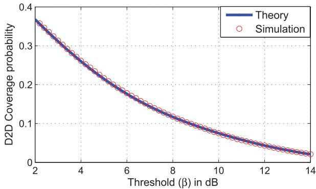

line

| Threshold (β) in dB | Theory | Simulation |
| ------------------- | ------ | ---------- |
| 2                   | 0.37   | 0.37       |
| 4                   | 0.28   | 0.28       |
| 6                   | 0.19   | 0.19       |
| 8                   | 0.12   | 0.12       |
| 10                  | 0.07   | 0.07       |
| 12                  | 0.04   | 0.04       |
| 14                  | 0.02   | 0.02       |

Fig. 4. D2D coverage probability vs. SINR threshold.

increases, the UAV creates a stronger interference on the D2D users. Consequently, $P _ { o u t , d }$ tends to 1 for $M \to \infty$ . However, the higher number of stop points for UAV enhances the coverage performance of the downlink users. Hence, a tradeoff between coverage performance of downlink users and the outage of D2D communications should be taking into account. Moreover, Theorem 3 shows that, in order to guarantee that the outage probability does not exceed a specified threshold for different values of M, we should adaptively reduce the distance between the D2D transmitter and receiver (d0), or have orthogonal spectrum.

# V. SIMULATION RESULTS AND ANALYSIS

# A. The Static UAV Scenario

First, we compare our analytical results of the coverage probabilities with the simulation results. Table II lists parameters used in the simulation and statistical analysis. These parameters are set based on typical values such as in [9] and [20]. Here, we will analyze the impact of the various parameters such as the UAV altitude, D2D density, and SINR threshold on the performance evaluation metrics.

In Figures 4 and 5, we show, respectively, the D2D coverage probability and the lower and upper bounds for the DU coverage probability for different SINR detection threshold values. From these figures, we can clearly see that, the analytical and simulation results for D2D match perfectly and the analytical bounds for DU coverage probability and the exact simulation results are close. Figures 4 and 5 show that, by increasing the threshold, the coverage probability for D2D users and DUs will decrease.

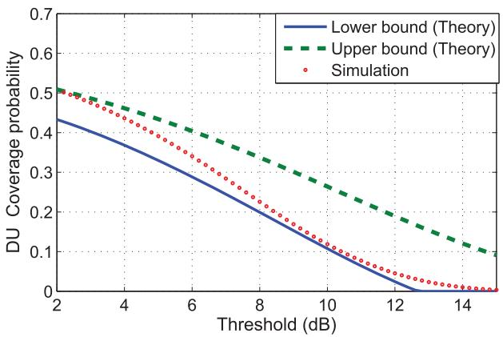

line

| Threshold (dB) | Lower bound (Theory) | Upper bound (Theory) | Simulation |
| -------------- | -------------------- | -------------------- | ---------- |
| 2              | 0.43                 | 0.51                 | 0.50       |
| 4              | 0.35                 | 0.47                 | 0.46       |
| 6              | 0.28                 | 0.41                 | 0.39       |
| 8              | 0.20                 | 0.34                 | 0.32       |
| 10             | 0.12                 | 0.27                 | 0.25       |
| 12             | 0.05                 | 0.20                 | 0.18       |
| 14             | 0.01                 | 0.13                 | 0.12       |
| 15             | 0.00                 | 0.10                 | 0.10       |

Fig. 5. DU coverage probability vs. SINR threshold.

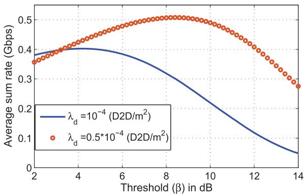

line

| Threshold (β) in dB | Average sum rate (Gbps) for λ_d = 10^-4 (D2D/m^2) | Average sum rate (Gbps) for λ_d = 0.5*10^-4 (D2D/m^2) |
| ------------------- | ----------------------------------------------- | ---------------------------------------------------- |
| 2                   | 0.38                                            | 0.36                                                 |
| 4                   | 0.40                                            | 0.42                                                 |
| 6                   | 0.38                                            | 0.48                                                 |
| 8                   | 0.35                                            | 0.50                                                 |
| 10                  | 0.25                                            | 0.48                                                 |
| 12                  | 0.15                                            | 0.42                                                 |
| 14                  | 0.05                                            | 0.28                                                 |

Fig. 6. System sum-rate vs. SINR threshold.

Figure 6 illustrates the system sum-rate (Gbps) versus the threshold for 1 MHz transmission bandwidth, $\lambda _ { d u } = 1 0 ^ { - 4 }$ , $h = 5 0 0 \mathrm { m }$ , and two different values of $\lambda _ { d }$ . By inspecting (23) in Section III, we can see that the rate depends on the coverage probability, which is a decreasing function of the threshold, $\beta ,$ , and an increasing logarithmic function of it. Clearly, for high values of $\beta ,$ the received SINR cannot exceed the threshold and, thus, the coverage probabilities tend to zero. On the other hand, according to (20) and (21), as $\beta$ increases, $\log _ { 2 } ( 1 + \beta )$ increases accordingly. However, since the coverage probability exponentially decreases but $\log _ { 2 } ( 1 + \beta )$ increases logarithmically, the average rate tends to zero for the high values of $\beta .$ . Furthermore, for $\beta  0 .$ , since $\log _ { 2 } ( 1 + \beta )$ tends to zero and the coverage probabilities approach one, the rate becomes zero.

Figure 7 shows the impact of D2D density on the sumrate. In this figure, we can see that a low D2D density yields low interference. However, naturally, decreasing the number of D2D users in an area will also decrease the sum-rate. For high D2D density, high interference reduces the coverage probability and consequently the data rate for each user. However, since the sum-rate is directly proportional to the number of D2D users, increasing the D2D density can also improve the sum-rate. According to the Figure $^ { 6 , }$ as the density of downlink users increases, the optimal $\lambda _ { d }$ that maximizes the sum-rate decreases. This is due to the fact that, as $\lambda _ { d u }$ increases, the contribution of DUs in the system sum-rate increases and hence increasing the rate of each DU enhances the system sum-rate. To increase the rate of a DU, the number of D2D users as the interference source for DUs should be reduced. As a result, the optimal $\lambda _ { d }$ decreases as as $\lambda _ { d u }$ increases. For instance as shown in the figure, by increasing $\lambda _ { d u }$ from $1 0 ^ { - 4 } \mathrm { t o } 4 \times 1 0 ^ { - 4 }$ , the optimal λd decreases from 0.9 × 10−4 to 0.3 × 10−4. $\lambda _ { d }$ $0 . 9 \times 1 0 ^ { - 4 } \mathrm { t o } { 0 . 3 } \times 1 0 ^ { - 4 }$

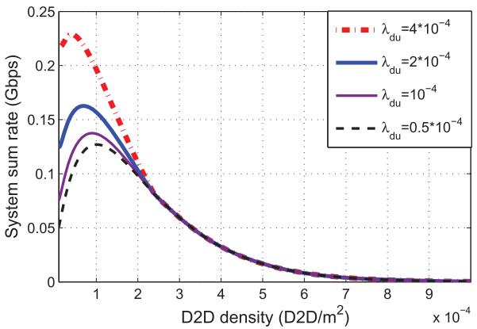

line

| D2D density (D2D/m²) | λ_du = 4*10⁻⁴ | λ_du = 2*10⁻⁴ | λ_du = 10⁻⁴ | λ_du = 0.5*10⁻⁴ |
| --------------------- | -------------- | -------------- | ----------- | ---------------- |
| 0                     | 0.23           | 0.13           | 0.08        | 0.05             |
| 1e-4                  | 0.22           | 0.16           | 0.14        | 0.12             |
| 2e-4                  | 0.10           | 0.10           | 0.10        | 0.10             |
| 3e-4                  | 0.05           | 0.05           | 0.05        | 0.05             |
| 4e-4                  | 0.03           | 0.03           | 0.03        | 0.03             |
| 5e-4                  | 0.02           | 0.02           | 0.02        | 0.02             |
| 6e-4                  | 0.01           | 0.01           | 0.01        | 0.01             |
| 7e-4                  | 0.01           | 0.01           | 0.01        | 0.01             |
| 8e-4                  | 0.01           | 0.01           | 0.01        | 0.01             |
| 9e-4                  | 0.01           | 0.01           | 0.01        | 0.01             |

Fig. 7. System sum-rate vs. D2D density (number of D2D pairs per m2).

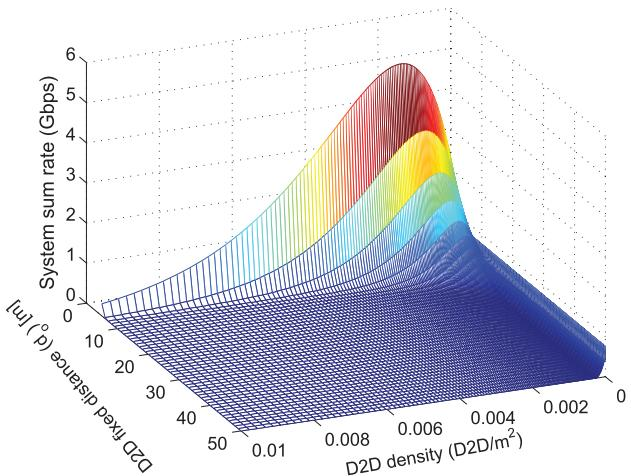

area

| D2D fixed distance (°) | System sum rate (Gbps) |
| ---------------------- | ---------------------- |
| 0                      | 0                      |
| 10                     | 0.5                    |
| 20                     | 1.0                    |
| 30                     | 1.5                    |
| 40                     | 2.0                    |
| 50                     | 2.5                    |
| 0.008                  | 3.0                    |
| 0.006                  | 3.5                    |
| 0.004                  | 4.0                    |
| 0.002                  | 4.5                    |
| 0                      | 5.0                    |

Fig. 8. System sum-rate vs. D2D density and $d _ { 0 }$

It is important to note that the value of the fixed distance, $d _ { 0 } .$ between the D2D pair significantly impacts the rate performance. Figure 8 shows the $\bar { C } _ { \mathrm { s u m } }$ as a function of the density of D2D users and $d _ { 0 }$ . From this figure, we can see that, the rate increases as the fixed distance between a D2D receiver and its corresponding transmitter decreases. Moreover, the optimal D2D density which leads to a maximum $\bar { C } _ { \mathrm { s u m } }$ , increases by decreasing $d _ { 0 } .$ . In fact, for lower values of $d _ { 0 }$ we can have more D2D users in the network. For instance, by reducing $d _ { 0 }$ from 8 m to 5 m, the optimum average number of D2D users increases by a factor of 3.

Figure 9 shows the coverage probability for DUs and D2D users as a function of the UAV altitude. From the $\mathrm { D U s } ^ { \prime }$ perspective, the UAV should be at an optimal altitude such that it can provide a maximum coverage. In fact, the UAV should not position itself at very low altitudes, due to high shadowing and a low probability of LoS connections towards the DUs. On the other hand, at very high altitudes, LoS links exist with a high probability but the large distance between UAV and DUs results in a high the path loss. As shown in Figure 9, for $h = 5 0 0$ m the DU coverage probability is maximized. Note that from a

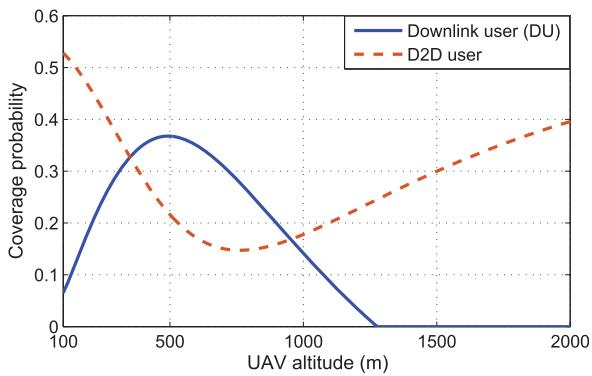

line

| UAV altitude (m) | Downlink user (DU) | D2D user |
| ---------------- | ------------------ | -------- |
| 100              | 0.06               | 0.55     |
| 500              | 0.37               | 0.25     |
| 1000             | 0.15               | 0.18     |
| 1500             | 0.00               | 0.30     |
| 2000             | 0.00               | 0.40     |

Fig. 9. Coverage probability vs. UAV altitude.

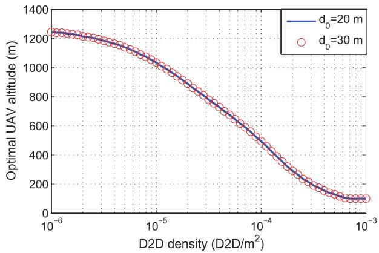

line

| D2D density (D2D/m²) | Optimal UAV altitude (m) for d₀=20 m | Optimal UAV altitude (m) for d₀=30 m |
| --------------------- | ------------------------------------ | ------------------------------------ |
| 1e-6                  | 1250                                 | 1240                                 |
| 1e-5                  | 1000                                 | 980                                  |
| 1e-4                  | 500                                  | 480                                  |
| 1e-3                  | 100                                  | 90                                   |

Fig. 10. Optimal UAV altitude vs. D2D density.

D2D user perspective, the UAV creates interference on the D2D receiver. Therefore, D2D users prefer the UAV to be at an altitude for which it provides a minimum coverage radius. As seen in Figure 9, for $h  \infty$ , the D2D users achieve the maximum performance. However, $h = 8 0 0 \mathrm { m }$ results in a minimum D2D coverage probability due the high interference from the UAV.

Figure 10 shows the optimal UAV altitude that maximizes DU coverage probability versus the D2D users’ density. As we can see from Figure 10, the optimal UAV altitude for downlink users decreases as the number of D2D users increases. This is due to the fact that a higher density of D2D users creates higher interference on the downlink users, and consequently the UAV reduces its altitude to improve SINR value for the downlink users. In other words, the UAV positions itself closer to the downlink users to cope with the high interference caused by the increased number of D2D users. From Figure 10, we can see that, the optimal UAV altitude is independent of the fixed distance, $d _ { 0 } ,$ between the D2D transmitter and receiver pair. In fact, the distance between D2D users does not affect the amount interference generated on the downlink users. Therefore, the optimal altitude of the UAV does not change if $d _ { 0 }$ changes.

Figure 11 shows $\bar { C } _ { \mathrm { s u m } }$ versus the UAV altitude for different values of the fixed distance, d , the fixed distance between a D2D transmitter/receiver pair. The optimum values for the height which lead to a maximum $\bar { C } _ { \mathrm { s u m } }$ are around 300 m, 350 m, and 400 m for $d _ { 0 } = 2 0 \mathrm { m }$ , 25 m and 30 m. Note that the optimal h that maximizes the sum-rate depends on the density of DU and D2D users. From Figure 11, considering $d _ { 0 } = 2 0$ m as an example, we can see that for $h > 1 3 0 0 \mathrm { m } .$ , the system sum-rate starts increasing. This stems from the fact that the DU coverage probability tends to zero and, thus, only D2D users impact $\bar { C } _ { \mathrm { s u m } }$ . Hence, as the UAV moves up in altitude, the interference on D2D users decreases and $\bar { C } _ { \mathrm { d } }$ increases. Moreover, for 300 m $< h < 1 3 0 0 \mathrm { m }$ , Figure 11 shows that the coverage probability and, consequently, the average rate for the downlink users decrease as the altitude increases. However, increasing the UAV altitude reduces the interference on the D2D users and improves the average rate for D2D users. In addition, in this range of h, since DUs have more contributions on $\bar { C } _ { \mathrm { s u m } }$ than the D2D users, $\bar { C } _ { \mathrm { s u m } }$ is a decreasing function of altitude.

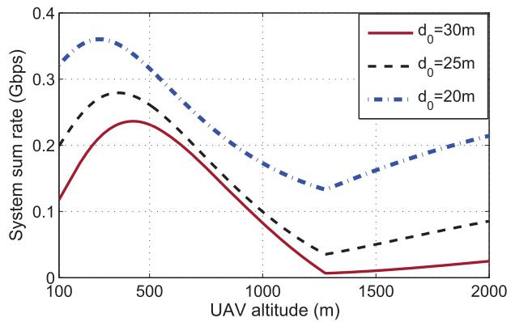

line

| UAV altitude (m) | d₀=30m | d₀=25m | d₀=20m |
| ---------------- | ------ | ------ | ------ |
| 100              | 0.12   | 0.20   | 0.33   |
| 500              | 0.24   | 0.28   | 0.36   |
| 1000             | 0.15   | 0.18   | 0.25   |
| 1500             | 0.01   | 0.05   | 0.15   |
| 2000             | 0.02   | 0.09   | 0.21   |

Fig. 11. System sum-rate vs. UAV altitude.   
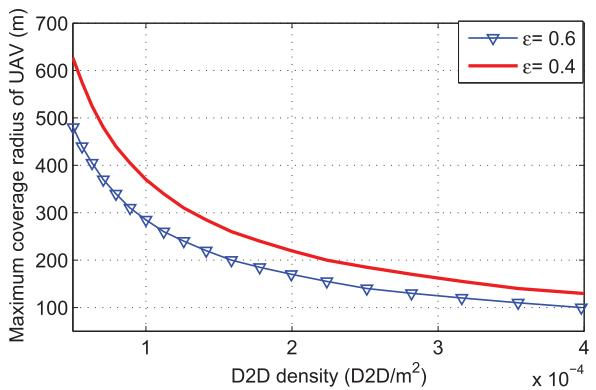

line

| D2D density (D2D/m²) | ε=0.6 | ε=0.4 |
| --------------------- | ----- | ----- |
| 0                     | 500   | 600   |
| 1e-4                  | 250   | 350   |
| 2e-4                  | 180   | 250   |
| 3e-4                  | 130   | 180   |
| 4e-4                  | 100   | 130   |

Fig. 12. Maximum UAV coverage radius vs. D2D density (number of D2D pairs per m2).

# B. The Mobile UAV Scenario

Here, we study the mobile UAV scenario. In this case, the UAV can satisfy the coverage requirement for all the DUs. In fact, the UAV moves over the target area and attempts to serve the DUs at the stop points to guarantee that all the DUs will be in its coverage radius.

Figure 12 shows the coverage radius of the mobile UAV when it is located at the optimal altitude as the D2D density varies. As expected, the coverage radius decreases as the D2D density increases. For instance, for $\varepsilon = 0 . 6$ , when $\lambda _ { d }$ increases from $1 0 ^ { - 5 }$ to $1 0 ^ { - 4 }$ , the coverage radius decreases from 1600 m to 300 m. Moreover, by reducing the minimum coverage requirement of DUs, the UAV can cover a larger area. For instance, reducing 
 from 0.6 to 0.4 increases the UAV coverage radius from 290 m to 380 m for $\lambda _ { d } = 1 0 ^ { - 4 }$ . Note that, since the main goal of the UAV is to provide coverage for the entire target area, to compensate for the low coverage radius, we should increase the number of stop points for serving the DUs and consequently the full coverage time increases.

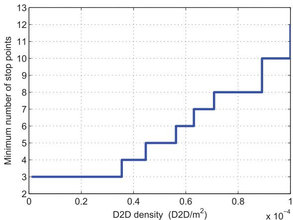

line

| D2D density (D2D/m²) | Minimum number of stop points |
| --------------------- | ------------------------------ |
| 0.0                   | 3                              |
| 0.35                  | 4                              |
| 0.45                  | 5                              |
| 0.55                  | 6                              |
| 0.65                  | 7                              |
| 0.75                  | 8                              |
| 0.9                   | 10                             |
| 1.0                   | 12                             |

Fig. 13. Number of stop points vs. D2D density.

In Figure 13, we show the minimum number of stop points as a function of the D2D user density. In this figure, we can see that, as expected, the number of stop points must increase when the density of D2D users increases. In fact, to overcome the higher interference caused by increasing the number of D2D users, the UAV will need more stop points to satisfy the DUs’ coverage constraints. For instance, when $\lambda _ { d }$ increases from $0 . 2 \times 1 0 ^ { - 4 } \mathrm { ~ t o ~ } 0 . 8 \times 1 0 ^ { - 4 }$ , the number of stop points must be increased from 3 to 8. Note that, when computing the minimum number of stop points for each $\lambda _ { d }$ , we considered optimal values for the UAV altitude such that it can provide a maximum coverage for the DUs. Therefore, the UAV’s altitude changes according to the D2D density. Moreover, as seen from Figure 13, the minimum number of stop points remains constant for a range of $\lambda _ { d } .$ . This is due to the fact that the number of stop points is an integer and hence, for different values of $\lambda _ { d } ,$ , the integer value will be the same. However, although the minimum number of stop points for two different D2D densities are the same, the UAV can transmit with lower power in the case of lower D2D density.

In Figure 14, we show the minimum number of stop points as a function of the UAV altitude for $\lambda _ { d } = 1 0 ^ { - 4 }$ . Figure 14 shows that, for some values of h which correspond to the optimal UAV altitude, the minimum number of stop points is minimized. For example, the range of optimal h for $\epsilon = 0 . 4$ and 
 = 0.6 is, respectively, 400 m < h < 500 m and 300 m < h < 350 m. As expected, the minimum number of stop points is lower for the lower value of 
.

Figure 15 shows the tradeoff between the downlink coverage probability and the delay which is considered to be proportional to the number of stop points. In Figure 15, we can see that, in order to guarantee a higher coverage probability for DUs, the UAV should stop at more locations. As observed in this Figure, for $\lambda _ { d } = 1 0 ^ { - 4 }$ , to increase the DU coverage probability from 0.4 to 0.7, the number of stop points should increase from 5 to 23. For a higher number of stop points, the UAV is closer to the DUs and, thus, it has a higher chance of LoS. However, on the average, a DU should wait for a longer time to be covered by the UAV that reaches its vicinity. In addition, as the density of D2D users increases, the number of stop points (delay) increases especially when a higher coverage probability for DUs must be satisfied. For instance, if $\lambda _ { d }$ increases from $0 \dot { . } 5 \times 1 0 ^ { - 4 } \mathrm { t o } 1 0 ^ { - 4 }$ , or equivalently from 50 to 100 for the given area, the number of stop points should increase from 4 to 9 to satisfy a 0.5 DU coverage probability, and from 20 to 55 for a 0.8 coverage requirement.

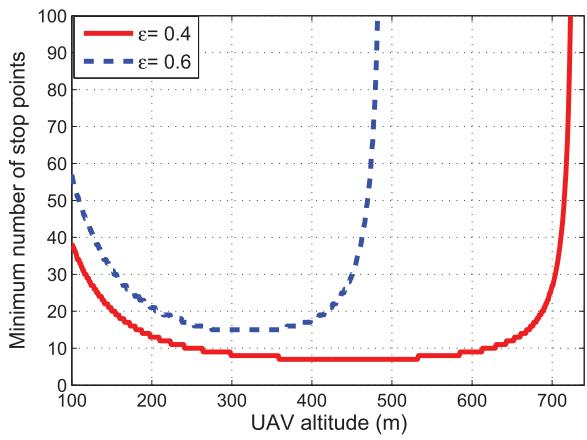

line

| UAV altitude (m) | ε=0.4 | ε=0.6 |
| ---------------- | ----- | ----- |
| 100              | 40    | 55    |
| 200              | 15    | 25    |
| 300              | 10    | 15    |
| 400              | 8     | 20    |
| 500              | 8     | 95    |
| 600              | 10    | 15    |
| 700              | 10    | 10    |

Fig. 14. Minimum number of stop points vs. UAV altitude.

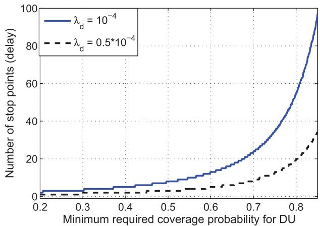

line

| Minimum required coverage probability for DU | Number of stop points (delay) for λ_d = 10^-4 | Number of stop points (delay) for λ_d = 0.5*10^-4 |
| ------------------------------------------- | ----------------------------------------------- | ------------------------------------------------- |
| 0.2                                         | 0                                               | 0                                                 |
| 0.3                                         | 0                                               | 0                                                 |
| 0.4                                         | 0                                               | 0                                                 |
| 0.5                                         | 5                                               | 0                                                 |
| 0.6                                         | 15                                              | 5                                                 |
| 0.7                                         | 30                                              | 10                                                |
| 0.8                                         | 60                                              | 20                                                |
| 0.9                                         | 95                                              | 35                                                |

Fig. 15. Minimum number of stop points vs. coverage probability (coveragedelay tradeoff).

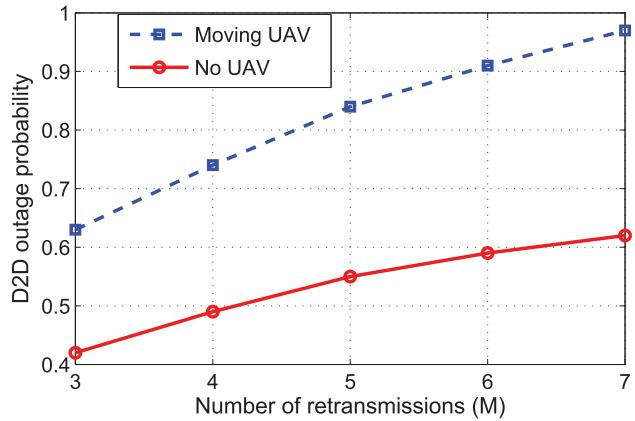

line

| Number of retransmissions (M) | Moving UAV | No UAV |
| ----------------------------- | ---------- | ------ |
| 3                             | 0.64       | 0.42   |
| 4                             | 0.74       | 0.49   |
| 5                             | 0.84       | 0.55   |
| 6                             | 0.91       | 0.59   |
| 7                             | 0.97       | 0.62   |

Fig. 16. Overall D2D outage probability vs. number of retransmissions.

Figure 16 shows the overall outage probability for D2D users versus the number of retransmissions. As the number of retransmissions (time slots) increases, the overall outage probability also increases. In other words, for higher number of time slots, the possibility that a failure happens during retransmissions, increases. Furthermore, since the UAV is an interference source for the D2D users, the higher number of stop points leads to a higher outage probability. From Figure 16, we can see that, the increase in the outage probability of D2D users due to the UAV is 0.20 for $M = 3$ , and is 0.38 for $M = 7$ . Therefore, when the number of stop points increases due to the higher density of D2D users or a higher coverage requirement of the downlink users, the D2D communications are more prone to a failure.

# VI. CONCLUSIONS

In this paper, we have studied the performance of a UAV that acts as a flying base station in an area in which users are engaged in the D2D communication. We have considered two types of users in the network: the downlink users served by the UAV and D2D users that communicate directly with one another. For both types, we have derived tractable expressions for the coverage probabilities as the main performance evaluation metrics. The results have shown that a maximum system sum-rate can be achieved if the UAV altitude is appropriately adjusted based on the D2D users density. In the mobile UAV scenario, using the disk covering problem, the entire target area (cell) can be completely covered by the UAV in a shortest time with a minimum required transmit power. Moreover, in this case, we have derived the overall outage probability for D2D users, and have shown that the outage probability increases as the number of stop point increases. Finally, we have analyzed the tradeoff between the coverage and the time required for covering the entire target area (delay) by the mobile UAV. The results have shown that, the number of stop points must be significantly increased as the minimum coverage requirement for DUs increases.

# APPENDIX

A. Proof of Theorem 1

$$
\begin{array}{l} P _ {\mathrm{cov}, d} (r, \varphi , \beta) = \mathbb {P} [ \gamma_ {d} \geq \beta ] = \mathbb {P} \left[ \frac {P _ {d} d _ {0} ^ {- \alpha_ {d}} g}{I _ {d} ^ {c} + I _ {u} + N} \geq \beta \right] \\ = \mathbb {P} \left[ g \geq \frac {\beta d _ {0} ^ {\alpha_ {d}} (I _ {d} ^ {c} + I _ {u} + N)}{P _ {d}} \right] \\ \stackrel {(a)} {=} \mathbb {E} _ {I _ {u}, I _ {d} ^ {c}} \left[ \exp \left(\frac {- \beta d _ {0} ^ {\alpha_ {d}} (I _ {d} ^ {c} + I _ {u} + N)}{P _ {d}}\right) \right] \\ \stackrel {(b)} {=} \mathbb {E} _ {I _ {u}} \left[ \exp \left(\frac {- \beta d _ {0} ^ {\alpha_ {d}} I _ {u}}{P _ {d}}\right) \right] \mathbb {E} _ {I _ {d} ^ {c}} \left[ \exp \left(\frac {- \beta d _ {0} ^ {\alpha_ {d}} I _ {d} ^ {c}}{P _ {d}}\right) \right] \\ \times \exp \left(\frac {- \beta d _ {0} ^ {\alpha_ {d}} N}{P _ {d}}\right), \tag {32} \\ \end{array}
$$

where g is an exponential random variable with a mean value of one $( \mathrm { i . e . } \ g \sim \mathrm { e x p } ( 1 ) )$ , (a) follows from the exponential distribution of $g$ based on the Rayleigh fading assumption, and taking the expectation over $I _ { u }$ and $I _ { d } ^ { c }$ (as random variables). Step (b) comes from the fact that $I _ { u }$ and $I _ { d } ^ { c }$ are independent because the interference stems from different sources which are spatially uncorrelated.

Here, $\mathbb { E } _ { I _ { u } }$ and $\mathbb { E } _ { I _ { d } ^ { c } }$ are given by:

$$
\begin{array}{l} \mathbb {E} _ {I _ {u}} \left[ \exp \left(\frac {- \beta d _ {0} ^ {\alpha_ {d}} I _ {u}}{P _ {d}}\right) \right] = P _ {\text { LoS }} \exp \left(\frac {- \beta d _ {0} ^ {\alpha_ {d}} P _ {u} | X _ {u} | ^ {- \alpha_ {u}}}{P _ {d}}\right) \\ + P _ {\mathrm{NLoS}} \exp \left(\frac {- \beta d _ {0} ^ {\alpha_ {d}} \eta P _ {u} | X _ {u} | ^ {- \alpha_ {u}}}{P _ {d}}\right), \tag {33} \\ \end{array}
$$

$$
\begin{array}{l} \mathbb {E} _ {I _ {d} ^ {c}} \left[ \exp \left(\frac {- \beta d _ {0} ^ {\alpha_ {d}} I _ {d} ^ {c}}{P _ {d}}\right) \right] = \mathbb {E} _ {d _ {i}, g _ {i}} \left[ \prod_ {i} \exp \left(\frac {- \beta d _ {0} ^ {\alpha_ {d}}}{P _ {d}} P _ {d} d _ {i} ^ {- \alpha_ {d}} g _ {i}\right) \right] \\ \stackrel {(a)} {=} \exp \left(\frac {- 2 \pi^ {2} \lambda_ {d} \beta^ {2 / \alpha_ {d}} d _ {0} ^ {2}}{\alpha_ {d} \sin (2 \pi / \alpha_ {d})}\right), \tag {34} \\ \end{array}
$$

where the details of step (a) follow directly from the results in [23].

Finally, using (31), (32) and (33) Theorem 1 is proved.

# B. Proof of Theorem 2

The coverage probability for a cellular user located at $( r , \varphi )$ is written as:

$$
\begin{array}{l} P _ {\mathrm{cov}, d u} (r, \varphi , \beta) = \mathbb {P} [ \gamma_ {u} \geq \beta ] = P _ {\mathrm{LoS}} (r) \mathbb {P} \left[ \frac {P _ {u} r ^ {- \alpha_ {u}}}{I _ {d} + N} \geq \beta \right] \\ + P _ {\mathrm{NLoS}} (r) \mathbb {P} \left[ \frac {\eta P _ {u} r ^ {- \alpha_ {u}}}{I _ {d} + N} \geq \beta \right] \\ = P _ {\mathrm{LoS}} (r) \mathbb {P} \left[ I _ {d} \leq \frac {P _ {u} r ^ {- \alpha_ {u}} - \beta N}{\beta} \right] \\ + P _ {\mathrm{NLoS}} (r) \mathbb {P} \left[ I _ {d} \leq \frac {\eta P _ {u} r ^ {- \alpha_ {u}} - \beta N}{\beta} \right]. \tag {35} \\ \end{array}
$$

Note that, there is no closed-form expression for the cumulative distribution function (CDF) of the interference from D2D users [29] and [30]. Here, we provide lower and upper bounds for the CDF of interference. First, we divide the interfering D2D transmitters into two subsets [23]:

$$
\left\{ \begin{array}{l} \Phi_ {1} = \{\Phi_ {\mathrm{B}} | P _ {d} d _ {i} ^ {- \alpha_ {d}} g _ {i} \geq T \}, \\ \Phi_ {2} = \{\Phi_ {\mathrm{B}} | P _ {d} d _ {i} ^ {- \alpha_ {d}} g _ {i} \leq T \}, \end{array} \right. \tag {36}
$$

where $T$ is a threshold which is used to derive the CDF of the interference from D2D users.

Now, considering the interference power from D2D users located in $\Phi _ { 1 }$ and $\Phi _ { 2 }$ as $I _ { d , \Phi _ { 1 } }$ and $I _ { d , \Phi _ { 2 } }$ , we have:

$$
\begin{array}{l} \mathbb {P} \left[ I _ {d} \leq T \right] = \mathbb {P} \left[ I _ {d, \Phi_ {1}} + I _ {d, \Phi_ {2}} \leq T \right] \leq \mathbb {P} \left[ I _ {d, \Phi_ {1}} \leq T \right] \\ = \mathbb {P} \left[ \Phi_ {1} = 0 \right] = \mathbb {E} \left[ \prod_ {\Phi_ {B}} \mathbb {P} (P _ {d} d _ {i} ^ {- \alpha_ {d}} g _ {i} <   T) \right] \\ \end{array}
$$

$$
= \mathbb {E} \left[ \prod_ {\Phi_ {B}} \mathbb {P} \left(g _ {i} <   \frac {T d _ {i} ^ {\alpha_ {d}}}{P _ {d}}\right) \right]
$$

$$
\stackrel {(a)} {=} \mathbb {P} \left[ \prod_ {\Phi_ {B}} 1 - \exp \left(- \frac {T d _ {i} ^ {\alpha_ {d}}}{P _ {d}}\right) \right]
$$

$$
\stackrel {(b)} {=} \exp \left(- \lambda_ {d} \int_ {0} ^ {\infty} \exp \left(- \frac {T r ^ {\alpha_ {d}}}{P _ {d}}\right) r \mathrm{d} r\right)
$$

$$
= \exp \left(- \pi \lambda_ {d} \left(\frac {T}{P _ {d}}\right) ^ {- 2 / \alpha_ {d}} \Gamma (1 + 2 / \alpha_ {d})\right), \tag {37}
$$

where (a) and (b) come from the Rayleigh fading assumption and PGFL of the PPP.

The upper bound is derived as follows:

$$
\mathbb {P} \left[ I _ {d} \leq T \right] = 1 - \mathbb {P} \left[ I _ {d} \geq T \right]
$$

$$
= 1 - \left(\mathbb {P} \left[ I _ {d} \geq T | I _ {d, \Phi_ {1}} \geq T \right] \mathbb {P} \left[ I _ {d, \Phi_ {1}} \geq T \right] \right.
$$

$$
\left. + \mathbb {P} \left[ I _ {d} \geq T \mid I _ {d, \Phi_ {1}} \leq T \right] \mathbb {P} \left[ I _ {d, \Phi_ {1}} \leq T \right]\right)
$$

$$
= 1 - \left(\mathbb {P} \left[ I _ {d, \Phi_ {1}} \geq T \right] + \mathbb {P} \left[ I _ {d} \geq T | I _ {d, \Phi_ {1}} \leq T \right] \right.
$$

$$
\times \mathbb {P} \left[ I _ {d, \Phi_ {1}} \leq T \right])
$$

$$
= 1 - \left(1 - \mathbb {P} \left[ \Phi_ {1} = 0 \right] + \mathbb {P} \left[ I _ {d} \geq T | I _ {d, \Phi_ {1}} \leq T \right] \right.
$$

$$
\times \mathbb {P} [ \Phi_ {1} = 0 ])
$$

$$
= \mathbb {P} \left[ \Phi_ {1} = 0 \right] (1 - \mathbb {P} \left[ I _ {d} \geq T | \Phi_ {1} = 0 \right]). \tag {38}
$$

Also,

$$
\mathbb {P} \left[ I _ {d} \geq T | \Phi_ {1} = 0 \right] \stackrel {(a)} {\leq} \frac {\mathbb {E} \left[ I _ {d} \geq T | \Phi_ {1} = 0 \right]}{T}
$$

$$
= \frac {1}{T} \mathbb {E} \left[ \sum_ {\Phi} P _ {d} d _ {i} ^ {- \alpha_ {d}} g _ {i} \mathbb {1} \left(P _ {d} d _ {i} ^ {- \alpha_ {d}} g _ {i} \leq T\right) \right]
$$

$$
= \frac {1}{T} \mathbb {E} _ {d _ {i}} \left[ \sum_ {\Phi} P _ {d} d _ {i} ^ {- \alpha_ {d}} \mathbb {E} _ {g _ {i}} \left[ g _ {i} \mathbb {1} \left(g _ {i} \leq \frac {T d _ {i} ^ {\alpha_ {d}}}{P _ {d}}\right) \right] \right]
$$

$$
= \frac {1}{T} \mathbb {E} _ {d _ {i}} \left[ \sum_ {\Phi} P _ {d} d _ {i} ^ {- \alpha_ {d}} \left[ \int_ {0} ^ {\frac {T d _ {i} ^ {\alpha_ {d}}}{P _ {d}}} g e ^ {- g} \mathrm{d} g \right] \right]
$$

$$
= \frac {2 \pi P _ {d} \lambda_ {d}}{T} \int_ {0} ^ {\infty} r ^ {- \alpha_ {d}} \left(\int_ {0} ^ {\frac {T r ^ {\alpha_ {d}}}{P _ {d}}} g e ^ {- g} \mathrm{d} g\right) r \mathrm{d} r
$$

$$
= \frac {2 \pi \lambda_ {d} \Gamma (1 + 2 / \alpha_ {d})}{\alpha_ {d} - 2} \left(\frac {T}{P _ {d}}\right) ^ {- 2 / \alpha_ {d}}, \tag {39}
$$

where (a) is based on the Markov’s inequality which is stated as follows: for any non-negative integrable random variable X and positive L, $\begin{array} { r } { \check { P } ( X \geq L ) \leq \frac { \mathbb { E } [ X ] } { L } } \end{array}$ E[X ]L . Also, 1(.) is the indicator

function which can only be equal to 1 or 0. Hence, the lower $( L _ { I } )$ and upper $( U _ { I } )$ bounds for the CDF of interference become:

$$
\begin{array}{l} L _ {I} (T) = \left[ 1 - \frac {2 \pi \lambda_ {d} \Gamma (1 + 2 / \alpha_ {d})}{\alpha_ {d} - 2} \left(\frac {T}{P _ {d}}\right) ^ {- 2 / \alpha_ {d}} \right] \\ \times \exp \left(- \pi \lambda_ {d} \left(\frac {T}{P _ {d}}\right) ^ {- 2 / \alpha_ {d}} \Gamma (1 + 2 / \alpha_ {d})\right), \tag {40} \\ \end{array}
$$

$$
U _ {I} (T) = \exp \left(- \pi \lambda_ {d} \left(\frac {T}{P _ {d}}\right) ^ {- 2 / \alpha_ {d}} \Gamma (1 + 2 / \alpha_ {d})\right). \tag {41}
$$

Thus, we have $L _ { I } ( T ) \le \mathbb { P } \{ I _ { d } \le T \} \le U _ { I } ( T )$ .

Finally, considering (35), (40), and (41), the lower bound and upper bound of the average coverage probability for DUs in the cell is expressed as:

$$
\begin{array}{l} \bar {P} _ {\text { cov,du }} ^ {L} (\beta) = \int_ {0} ^ {R _ {c}} P _ {\text { LoS }} (r) L _ {I} \left(\frac {P _ {u} | X _ {u} | ^ {- \alpha_ {u}}}{\beta} - N\right) \frac {2 r}{R _ {c} ^ {2}} \mathrm{d} r \\ + \int_ {0} ^ {R _ {c}} P _ {\mathrm{NLoS}} (r) L _ {I} \left(\frac {\eta P _ {u} \left| X _ {u} \right| ^ {- \alpha_ {u}}}{\beta} - N\right) \frac {2 r}{R _ {c} ^ {2}} \mathrm{d} r, \tag {42} \\ \end{array}
$$

$$
\bar {P} _ {\text { cov,du }} ^ {U} (\beta) = \int_ {0} ^ {R _ {c}} P _ {\text { LoS }} (r) U _ {I} \left(\frac {P _ {u} | X _ {u} | ^ {- \alpha_ {u}}}{\beta} - N\right) \frac {2 r}{R _ {c} ^ {2}} \mathrm{d} r
$$

$$
+ \int_ {0} ^ {R _ {c}} P _ {\mathrm{NLoS}} (r) U _ {I} \left(\frac {\eta P _ {u} | X _ {u} | ^ {- \alpha_ {u}}}{\beta} - N\right) \frac {2 r}{R _ {c} ^ {2}} \mathrm{d} r, \tag {43}
$$

and Theorem 2 is proved.

# C. Proof of Theorem 3

Consider $\gamma _ { d , i }$ and $g _ { i } ,$ respectively, the SINR and the channel gain (with exponential distribution) at $i ^ { t h }$ retransmission, for $1 \leq i \leq M$ . The outage probability is the probability of having at least one failure during M retransmissions. Then, we have:

$$
P _ {o u t, d} = 1 - \mathbb {P} \left[ \gamma_ {d, 1} \geq \beta , \dots , \gamma_ {d, M} \geq \beta \right]
$$

$$
= 1 - \mathbb {P} \left[ \frac {P _ {d} d _ {0} ^ {- \alpha_ {d}} g _ {1}}{I _ {d , 1} ^ {c} + I _ {u , 1} + N} \geq \beta , \dots , \frac {P _ {d} d _ {0} ^ {- \alpha_ {d}} g _ {M}}{I _ {d , M} ^ {c} + I _ {u , M} + N} \geq \beta \right]
$$

$$
\begin{array}{l} = 1 - \mathbb {P} \left[ g _ {1} \geq \frac {d _ {0} ^ {\alpha_ {d}} \beta (I _ {d , 1} ^ {c} + I _ {u , 1} + N)}{P _ {d}}, \dots , g _ {M} \right. \\ \geq \frac {d _ {0} ^ {\alpha_ {d}} \beta (I _ {d , M} ^ {c} + I _ {u , M} + N)}{P _ {d}} \Biggr ] \\ \end{array}
$$

$$
\stackrel {(a)} {=} 1 - \mathbb {E} \left[ \prod_ {i = 1} ^ {M} \exp \left(\frac {- d _ {0} ^ {\alpha_ {d}} \beta (I _ {d , i} ^ {c} + I _ {u , i} + N)}{P _ {d}}\right) \right]
$$

$$
\stackrel {(b)} {=} 1 - \mathbb {E} \left[ \prod_ {i = 1} ^ {M} \exp \left(\frac {- d _ {0} ^ {\alpha_ {d}} \beta I _ {d , i} ^ {c}}{P _ {d}}\right) \right] \mathbb {E} \left[ \prod_ {i = 1} ^ {M} \exp \left(\frac {- d _ {0} ^ {\alpha_ {d}} \beta I _ {u , i}}{P _ {d}}\right) \right]
$$

$$
\times \exp \left(\frac {- d _ {0} ^ {\alpha_ {d}} \beta M N}{P _ {d}}\right), \tag {44}
$$

where (a) follows the assumption that the fading is independent in different retransmissions, and step (b) comes from the fact that interference due to D2D users, interference from UAV, and noise are all independent. Also,

$$
\mathbb {E} \left[ \prod_ {i = 1} ^ {M} \exp \left(\frac {- d _ {0} ^ {\alpha_ {d}} \beta I _ {d , i} ^ {c}}{P _ {d}}\right) \right] = \mathbb {E} \left[ \exp \left(\frac {- d _ {0} ^ {\alpha_ {d}} \beta \sum_ {i = 1} ^ {M} I _ {d , i} ^ {c}}{P _ {d}}\right) \right]
$$

$$
\stackrel {(c)} {=} \exp \left(- \lambda_ {d} \int_ {R ^ {2}} \left[ 1 - \left(\frac {1}{1 + \frac {\beta | x | ^ {- \alpha_ {d}}}{d _ {0} ^ {- \alpha_ {d}}}}\right) ^ {M} \right] \mathrm{d} x\right), \tag {45}
$$

where details of (c) can be found in [23] where the correlation between D2D interference in different retransmissions is taken into account. Finally,

$$
\prod_ {i = 1} ^ {M} \mathbb {E} _ {I _ {u, i}} \left[ \exp \left(\frac {- d _ {0} ^ {\alpha_ {d}} \beta I _ {u , i}}{P _ {d}}\right) \right]
$$

$$
\stackrel {(d)} {=} \prod_ {i = 1} ^ {M} \left[ P _ {\text {LoS}, i} \exp \left(\frac {- \beta d _ {0} ^ {\alpha_ {d}} P _ {u} | X _ {u , i} | ^ {- \alpha_ {d}}}{P _ {d}}\right) \right.
$$

$$
\left. + P _ {\mathrm{NLoS}, i} \exp \left(\frac {- \beta d _ {0} ^ {\alpha_ {d}} \eta P _ {u} \left| X _ {u , i} \right| ^ {- \alpha_ {d}}}{P _ {d}}\right) \right], \tag {46}
$$

where step (d) is based on the fact that the interference from the UAV can be treated as independent in different retransmissions. Finally, using (44), (45), and (46), Theorem 3 is proved.

# REFERENCES

[1] I. Bucaille, S. Hethuin, A. Munari, R. Hermenier, T. Rasheed, and S. Allsopp, “Rapidly deployable network for tactical applications: Aerial base station with opportunistic links for unattended and temporary events absolute example,” in Proc. IEEE Mil. Commun. Conf. (MILCOM), San Diego, CA, USA, Nov. 2013, pp. 1116–1120.   
[2] P. Zhan et al., “Wireless relay communications with unmanned aerial vehicles: Performance and optimization,” IEEE Trans. Aerosp. Electron. Syst., vol. 47, no. 3, pp. 2068–2085, Jul. 2011.   
[3] S.-Y. Lien, K.-C. Chen, and Y. Lin, “Toward ubiquitous massive accesses in 3GPP machine-to-machine communications,” IEEE Commun. Mag., vol. 49, no. 4, pp. 66–74, Apr. 2011.   
[4] H. S. Dhillon, H. Huang, and H. Viswanathan, “Wide-area wireless communication challenges for the internet of things,” arxiv.org/abs/1504.03242, 2015.   
[5] A. Hourani, S. Kandeepan, and A. Jamalipour, “Modeling air-to-ground path loss for low altitude platforms in urban environments,” in Proc. IEEE Global Telecommun. Conf. (GLOBECOM), Austin, TX, USA, Dec. 2014, pp. 2898–2904.   
[6] Q. Feng, E. K. Tameh, A. R. Nix, and J. McGeehan, “Modelling the likelihood of line-of-sight for air-to-ground radio propagation in urban environments,” in Proc. IEEE Global Telecommun. Conf. (GLOBECOM), San Diego, CA, USA, Nov. 2006, pp. 1–5.   
[7] Q. Feng, J. McGeehan, E. K. Tameh, and A. R. Nix, “Path loss models for air-to-ground radio channels in urban environments,” in Proc. IEEE Veh. Technol. Conf. (VTC), Melbourne, Vic, Australia, May 2006, pp. 2901– 2905.   
[8] J. Holis and P. Pechac, “Elevation dependent shadowing model for mobile communications via high altitude platforms in built-up areas,” IEEE Trans. Antennas Propag., vol. 56, no. 4, pp. 1078–1084, Apr. 2008.   
[9] A. Hourani, K. Sithamparanathan, and S. Lardner, “Optimal LAP altitude for maximum coverage,” IEEE Wireless Commun. Lett., vol. 3, no. 6, pp. 569–572, Dec. 2014.

[10] M. Mozaffari, W. Saad, M. Bennis, and M. Debbah, “Drone small cells in the clouds: Design, deployment and performance analysis,” IEEE Global Commun. Conf. (GLOBECOM), San Diego, CA, USA, Dec. 2015, to be published.   
[11] J. Kosmerl and A. Vilhar, “Base stations placement optimization in wireless networks for emergency communications,” in Proc. IEEE Int. Conf. Commun. (ICC), Sydney, Australia, Jun. 2014, pp. 200–205.   
[12] K. Daniel and C. Wietfeld, “Using public network infrastructures for UAV remote sensing in civilian security operations,” Defense Technical Information Center (DTIC) document, Technical University of Dortmund, Germany, Mar. 2011.   
[13] S. Rohde and C. Wietfeld, “Interference aware positioning of aerial relays for cell overload and outage compensation,” in Proc. IEEE Veh. Technol. Conf. (VTC), Quebec, QC, Canada, Sep. 2012, pp. 1–5.   
[14] Z. Han, A. L. Swindlehurst, and K. Liu, “Optimization of MANET connectivity via smart deployment/movement of unmanned air vehicles,” IEEE Trans. Veh. Technol., vol. 58, no. 7, pp. 3533–3546, Dec. 2009.   
[15] F. Jiang and A. L. Swindlehurst, “Optimization of UAV heading for the ground-to-air uplink,” IEEE J. Sel. Areas Commun., vol. 30, no. 5, pp. 993–1005, Jun. 2012.   
[16] M. Mozaffari, W. Saad, M. Bennis, and M. Debbah, “Optimal transport theory for power-efficient deployment of unmanned aerial vehicles,” in Proc. IEEE Int. Conf. Commun. (ICC), Kuala Lumpur, Malaysia, May. 2016.   
[17] E. Yaacoub and O. Kubbar, “Energy-efficient device-to-device communications in LTE public safety networks,” in Proc. IEEE Global Telecommun. Conf. (GLOBECOM), Workshop Green Internet Things, Anaheim, CA, USA, Dec. 2012, pp. 391–395.   
[18] K. Doppler, M. Rinne, C. Wijting, C. B. Ribeiro, and K. Hugl, “Deviceto-device communication as an underlay to LTE-advanced networks,” IEEE Commun. Mag., vol. 47, no. 12, pp. 42–49, Dec. 2009.   
[19] N. Lee, X. Lin, J. G. Andrews, and R. Heath, “Power control for D2D underlaid cellular networks: Modeling, algorithms, and analysis,” IEEE J. Sel. Areas Commun., vol. 33, no. 1, pp. 1–13, Feb. 2015.   
[20] S. Shalmashi, E. Björnson, M. Kountouris, K. W. Sung, and M. Debbah, “Energy efficiency and sum rate tradeoffs for massive MIMO systems with underlaid device-to-device communications,” arxiv.org/abs/1506.00598, 2015.   
[21] X. Lin, R. Heath, and J. Andrews, “The interplay between massive MIMO and underlaid D2D networking,” IEEE Trans. Wireless Commun., vol. 14, no. 6, pp. 3337–3351, Jun. 2015.   
[22] M. Haenggi, Stochastic Geometry for Wireless Networks. Cambridge, U.K.: Cambridge Univ. Press, 2012.   
[23] M. Haenggi and R. K. Ganti, “Interference in large wireless networks,” Found. Trends Netw., vol. 3, no. 2, pp. 127–248, 2008.   
[24] F. Baccelli and B. Blaszczyszyn, “Stochastic geometry and wireless networks, volume II—Applications,” Found. Trends Netw., vol. 4, pp. 1–312, 2009.   
[25] M. Afshang, H. S. Dhillon, and P. H. J. Chong, “Modeling and performance analysis of clustered device-to-device networks,” arxiv.org/abs/:1508.02668, 2015.   
[26] E. Artin, The Gamma Function. New York, NY, USA: Dover, 2015.   
[27] R. Kershner, “The number of circles covering a set,” Amer. J. Math., vol. 61, pp. 665–671, 1939.   
[28] G. F. Tóth, “Thinnest covering of a circle by eight, nine, or ten congruent circles,” Comb. Comput. Geom., vol. 52, no. 361, p. 59, 2005.   
[29] R. K. Ganti, “A stochastic geometry approach to the interference and outage characterization of large wireless networks,” Ph.D. dissertation, Dept. Electr. Eng., Univ. Notre Dame, Notre Dame, IN, USA, 2009.   
[30] S. P. Weber, X. Yang, J. G. Andrews, and G. De Veciana, “Transmission capacity of wireless ad hoc networks with outage constraints,” IEEE Trans. Inf. Theory, vol. 51, no. 12, pp. 4091–4102, Nov. 2005.

natural_image

Portrait of a man with short dark hair and beard wearing a blue checkered shirt (no text or symbols visible)

Mohammad Mozaffari (S’15) received the B.S. degree in electrical engineering from Sharif University of Technology, Tehran, Iran, and the M.S. degree in electrical engineering from the University of Calgary, Calgary, AB, Canada. He is currently pursuing the Ph.D. degree at the Bradley Department of Electrical and Computer Engineering, Virginia Tech, Blacksburg, VA, USA. His research interests include wireless communications and statistical signal processing with focus on unmanned aerial vehicle (UAV) communications, device-to-device

(D2D) communication, sensor networks, and localization.

natural_image

Portrait of a man in business attire (no text or symbols visible)

Walid Saad (S’07–M’10–SM’15) received the Ph.D. degree from the University of Oslo, Oslo, Norway, in 2010. Currently, he is an Assistant Professor and the Steven O. Lane Junior Faculty Fellow with the Department of Electrical and Computer Engineering, Virginia Tech, Blacksburg, VA, USA, where he leads the Network Science, Wireless, and Security (NetSciWiS) Laboratory, within the Wireless@VT Research Group. His research interests include wireless networks, game theory, cybersecurity, and cyber-physical systems. He serves as an Editor for the IEEE TRANSACTIONS ON WIRELESS COMMUNICATIONS, the IEEE TRANSACTIONS ON COMMUNICATIONS, and IEEE TRANSACTIONS ON INFORMATION FORENSICS AND SECURITY. He was the recipient of the NSF CAREER Award in 2013, the AFOSR Summer Faculty Fellowship in 2014, and the Young Investigator Award from the Office of Naval Research (ONR) in 2015. He was the author/coauthor of five conference best paper awards at WiOpt in 2009, ICIMP in 2010, the IEEE WCNC in 2012, the IEEE PIMRC in 2015, and the IEEE SmartGridComm in 2015. He was also the recipient of the 2015 Fred W. Ellersick Prize from the IEEE Communications Society.

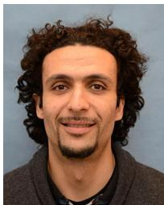

natural_image

Portrait of a man with curly hair and beard (no text or symbols visible)

Mehdi Bennis (S’07–AM’08–SM’15) received the M.Sc. degree in electrical engineering jointly from the EPFL, Lausanne, Switzerland, and the Eurecom Institute, France, in 2002, and the Ph.D. degree in spectrum sharing for future mobile cellular systems, in 2009. From 2002 to 2004, he worked as a Research Engineer with IMRA-EUROPE investigating adaptive equalization algorithms for mobile digital TV. In 2004, he joined the Centre for Wireless Communications (CWC), University of Oulu, Oulu, Finland, as a Research Scientist. In 2008, he was a Visiting Researcher at the Alcatel-Lucent Chair on Flexible Radio, SUPELEC. He has coauthored one book and published more than 100 research papers in international conferences, journals and book chapters. His research interests include radio resource management, heterogeneous networks, game theory and machine learning in 5G networks and beyond. He serves as an Editor for the IEEE TRANSACTIONS ON WIRELESS COMMUNICATIONS and is an Adjunct Professor with the University of Oulu. He was the recipient of the prestigious 2015 Fred W. Ellersick Prize from the IEEE Communications Society.

natural_image

Portrait of a smiling man in a light blue shirt, standing in front of a whiteboard with faint mathematical formulas (no readable text or symbols)

Mérouane Debbah (S’01–AM’03–M’04–SM’08– F’15) received the M.Sc. and Ph.D. degrees from the Ecole Normale Supérieure de Cachan, France, in 1996, respectively. He worked for Motorola Labs, Saclay, France, from 1999 to 2002 and the Vienna Research Center for Telecommunications, Vienna, Austria, until 2003. From 2003 to 2007, he was with the Department of Mobile Communications, Institut Eurecom, Sophia Antipolis, France, as an Assistant Professor. Since 2007, he has been a Full Professor with CentraleSupelec, Gif-sur-Yvette, France. From 2007 to 2014, he was the Director of the Alcatel-Lucent Chair on Flexible Radio. Since 2014, he has been a Vice-President of the Huawei France R&D Center and the Director of the Mathematical and Algorithmic Sciences Laboratory. His research interests include fundamental mathematics, algorithms, statistics, information, and communication sciences research. He is an Associate Editor-in-Chief of the journal Random Matrix: Theory and Applications and was an Associate and Senior Area Editor for the IEEE TRANSACTIONS ON SIGNAL PROCESSING, respectively, from 2011 to 2013 and 2013 to 2014. He was the recipient of the ERC grant MORE (Advanced Mathematical Tools for Complex Network Engineering). He is a WWRF Fellow and a member of the academic senate of Paris-Saclay. He has managed eight EU projects and more than 24 national and international projects. He was the recipient of 14 best paper awards, among which the 2007 IEEE GLOBECOM Best Paper Award, the Wi-Opt 2009 Best Paper Award, the 2010 Newcom++ Best Paper Award, the WUN CogCom Best Paper 2012 and 2013 Award, the 2014 WCNC Best Paper Award, the 2015 ICC Best Paper Award, the 2015 IEEE Communications Society Leonard G. Abraham Prize and the 2015 IEEE Communications Society Fred W. Ellersick Prize as well as the Valuetools 2007, Valuetools 2008, CrownCom2009, Valuetools 2012 and SAM 2014 Best Student Paper Awards. He was also the recipient of the Mario Boella Award in 2005, the IEEE Glavieux Prize Award in 2011, and the Qualcomm Innovation Prize Award in 2012.