# Unpredictable Trajectory Optimization for UAV-Assisted Anti-Jamming Data Collection

Tiedan Hua , Yang Chen , Member, IEEE, Xi Chen, Member, IEEE, and Zhen-Hua Zhu

Abstract—Uncrewed Aerial Vehicle (UAV) is widely used in Internet of Things (IoT) network applications, especially for data collection. However, the UAV’s predictable trajectory makes it vulnerable to jamming attacks. This paper optimizes the UAV’s control input by introducing the stochastic control method to make the UAV’s trajectory unpredictable to potential attackers. Based on the stochastic control method, where a random input is added into the control law, the control input optimization problem is decomposed into the navigation optimization problem and the stochastic optimization problem. The navigation optimization problem optimizes the UAV’s guidance toward its final destination while considering the constraints of its data collection mission. Meanwhile, the stochastic optimization problem minimizes external factors and internal costs while considering unpredictability. The two optimization problems are addressed using an MPC-based method and a modified gradient descent algorithm, respectively. Simulation results are provided to validate the efectiveness of the proposed unpredictable optimization strategy and the proposed method.

Index Terms—UAV-assisted data collection, trajectory planning, anti-jamming, wireless communication, unpredictable trajectory.

## I. INTRODUCTION

W <sup>ITH</sup> <sup>the</sup> <sup>popularization</sup> <sup>of</sup> <sup>the</sup> <sup>fifth</sup> <sup>generation</sup> <sup>(5G)</sup> of mobile communication networks, a number of new compelling wireless communication applications have emerged, such as data collection, persistent surveillance, and package delivery [1], [2], [3]. These applications have increased the demands on the quality of communications [4]. Uncrewed Aerial Vehicle (UAV), which is considered to be an important component in future communication systems, is a promising solution to provide communication services for these applications due to its low operation cost, high mobility, and strong Line-of-Sight (LoS) link [5]. As a mobile relay station, the UAV is capable to overcome the bottleneck of ground-based multihop communication compared to terrestrial base stations.

Collecting data from Internet of Things (IoT) devices is one of the most promising applications for UAV-assisted systems.

In these applications, the UAV flies near IoT devices, establishing a direct communication link to receive data. However, due to the broadcast nature of wireless transmissions, data collection can be vulnerable to jamming attacks in the presence of malicious jammers [6]. By transmitting interference signals, malicious jammers degrade the signal-to-interference-plusnoise ratio (SINR), which directly increases packet loss rates and disrupts UAV-IoT communication links. Moreover, mobile jammers equipped with trajectory observation capabilities pose an even greater threat. These jammers can observe the UAV’s movement patterns and predict its future positions, especially if the UAV follows predictable or straightforward trajectories. By leveraging these predictions, jammers can strategically position themselves to maximize interference strength. This significantly increases the level of disruption in communications. Therefore, the UAV risks working in a dynamic environment under the threat of mobile jammers, increasing the complexity of the data collection process. Consequently, developing efective anti-jamming strategies against mobile jammers is a critical challenge in UAV-assisted data collection.

This paper proposes the unpredictable trajectory framework (UTF) based on the stochastic control method to address the above issue [7], [8]. In this method, a stochastic input is added to the navigation input at each step, introducing unpredictability into the system’s states and complicating predictions for potential jammers. The navigation input ensures the control performance necessary for completing the data collection mission. The stochastic input induces random behavior in the UAV’s movement, making future trajectories dificult for malicious attackers to predict accurately. The optimal combination of navigation and stochastic inputs is critical for balancing unpredictability and control performance. However, designing an efective optimization strategy is challenging due to input constraints and nonlinear dynamics.

In this paper, the navigation optimization problem and the stochastic optimization problem are formulated. To solve these problems, an MPC-based method is employed to obtain the navigation input and ensure mission performance. Meanwhile, a modified gradient descent algorithm is utilized to determine the stochastic input, introducing unpredictability into the system. By integrating these approaches, the proposed framework efectively balances mission requirements with trajectory randomness.

## A. Related Work

The UAV can enhance existing wireless networks as a mobile aerial station, prompting extensive eforts to improve communication quality. In recent years, UAV-assisted systems have attracted increasing attention, enabling the expansion of their potential applications in various scenarios. For example, to address the limitations of IoT devices—such as their low transmission power and restricted communication range—UAVs serve as mobile aerial platforms, equipped with sensors to gather data from the designated area efectively [9], [10], [11]. Liu et al. [9] proposed a hybrid data collection framework that integrates UAV-enabled and worker-based models, and further introduced a trust evaluation model to enhance both the reliability and quality of data collection. By studying the scenario of a rotorcraft UAV hovering on an IoT device for data collection and refueling simultaneously, Han et al. [10] proposed an online trajectory planning method for UAVs with multi-objective optimization. Duan et al. [11] used UAVs as data relay stations for IoT devices and the heterogeneous cloud system, and proposed an energy-eficient scheme of data transmission.

Introducing UAVs into IoT networks has been proven to enhance communication eficiency. However, achieving efective anti-jamming performance remains challenging in most UAV-assisted systems. Anti-jamming involves reducing jammer signal strength, enabling robust transmission, and improving communication quality. Despite the dificulty of optimizing communication quality in the presence of jammers, several approaches have been developed to address these issues. To address the anti-interference problem in communication transmission for metaverse-based collaborative computing, an intelligent game-resistant computing model was proposed, and a learning-based algorithm is developed to proactively predict and counteract jamming behavior through intelligent anti-jamming strategies [12]. To resist the jamming of smart agents in cellular systems applied by the UAV-assisted cellular framework, reinforcement learning was employed to design the relay policy [6]. Anti-jamming transmission is a critical challenge in UAV communication, motivating studies on UAV anti-jamming strategies such as transmission power optimization and altitude design [13].

Trajectory planning, which aims to design an optimal flight path for the UAV, is also an efective strategy for anti-jamming. To address the anti-jamming challenges, many studies have focused on trajectory optimization in UAV-based data collection networks, and the optimization method can be roughly divided into two types: joint optimization [14], [15] and single optimization [16], [17]. In joint optimization, the UAV trajectory is optimized in conjunction with one or more other communication resources such as transmit power and transmit scheduling. For example, Duo et al. [14] jointly optimized the scheduling of ground sensor transmissions and the horizontal and vertical trajectories of the UAV. Chai et al. [15] considered the physical location distribution of wireless sensor networks, jointly optimizing the UAV trajectory and the sensor network clustering strategy. The advantage of joint optimization is that the optimal or suboptimal trajectory of the UAV can be obtained based on the characteristics of specific application scenarios. Another optimization strategy is the single-trajectory approach, which integrates the mobility of the UAV with environmental conditions into the design and optimization process of the UAV’s flight path. For example, Wu et al. [16] optimized trajectory with UAV mobility constraints such as position, velocity, and accelera tion. Wang and Gursoy [17] utilized reinforcement learning to determine the optimal trajectory for a UAV. Their approach takes into account collision avoidance, mission completion time, and kinematic constraints, all while operating under the challenging conditions of signal jamming. Single trajectory optimization considers both internal and external constraints, which is more applicable to various scenarios. This paper adopts single optimization and focuses on developing a more general and adaptive anti-jamming data collection trajectory.

Several studies have investigated the development of antijamming trajectory planning methods. A target protection problem that employs the deception strategy to alter the beliefs of jammers is addressed in [18]. By leveraging the belief dynamics of jammers, the problem is formulated as a Perfect Bayesian Nash Equilibrium (PBNE), and dynamic programming is used to obtain the optimal control strategy. A Dueling double deep Q-network (D3QN) method aimed at maximizing data collection in the presence of jamming attacks is introduced in [19]. This approach uses reward functions to balance motion, mission, and communication performance. A near-optimal solution is found by an improved multiobjective grasshopper algorithm (IMOGOA) to minimize the achievable sum rate of the jammers [20]. The algorithm is proposed to enhance secure communication in IoT networks.

Although significant progress has been made in the field of anti-jamming trajectory planning, several challenges still persist. The trajectory of the UAV can be observed, which means that intelligent jammers can easily predict future positions and destinations if the UAV moves in a straightforward pattern. Thus, the attacks can be carried out by jammers according to the accurately predicted future positions of the UAV [21]. Moreover, the presence of mobile jammers dynamically alter the working environment for the UAV, making it challenging to determine the optimal strategy that minimizes jamming interference while ensuring the completion of the collection mission within the allocated time frame. To the best of our knowledge, the above issues have not been fully discussed.

The stochastic control method introduces stochasticity into the agent’s movement by incorporating a random input into the control law [22], [23]. In contrast to methods such as Markov decision process and reinforcement learning, which rely on computing a global policy over the entire state space, this method adopts a rolling horizon strategy that enables real-time adaptation to environmental uncertainties. This characteristic makes it efective in dynamic environments, where it can mitigate jamming interference through adaptive decisionmaking. Compared to deceptive trajectory planning method [18], which focus on altering the beliefs of jammers, the stochastic control method emphasizes self-state optimization and does not require direct interaction with jammers to develop its strategy. Compared to exploration-based algorithms [19], [20], stochastic control is capable of satisfying the requirements of an optimal strategy while addressing the problem. This paper proposes the UTF using the stochastic control method. The stochastic nature of the system makes it dificult for malicious attackers to predict future trajectories accurately. However, it also poses challenges in optimizing both navigation input and stochastic input. To address these challenges, this paper adopts a two-step approach. Firstly, the navigation optimization problem is formulated, and an MPC-based method is employed to obtain the navigation input while ensuring mission performance. Secondly, the stochastic optimization problem is formulated, and a modified gradient descent algorithm is utilized to determine the stochastic input, thereby introducing unpredictability into the system.

## B. Contributions

Motivated by these observations, this paper proposes the UTF that simultaneously ensures the UAV’s ability to complete the data collection mission while rendering the trajectory unpredictable. The main contributions of this paper can be summarized as follows.

The stochastic control method in UTF is proposed in this paper. However, designing an efective optimization strategy in UTF is challenging due to input constraints and nonlinear dynamics. Unlike state-of-the-art strategies, which typically treat the control law as a single problem, this paper divides the control law into two distinct parts: the navigation optimization problem and the stochastic optimization problem.

• To improve data collection eficiency, the navigation input is optimized in the navigation optimization problem. An MPC-based method, which discretizes the range of inputs to construct a set of constant control inputs, is introduced to obtain the navigation input while considering interference and mission execution dynamics.

• To achieve an optimal trade-of between unpredictability and internal-external factors, the stochastic input is optimized in the stochastic optimization problem. A modified gradient descent algorithm based on a multi-threading approach is proposed to obtain the stochastic input and evaluate the unpredictable performance.

## C. Paper Organization

The rest of this paper is organized as follows. Section II describes the system model and formulates the trajectory planning problem with the objective of minimizing interference from jamming. Section III details the proposed UTF. Section IV characterizes the proposed method for addressing the optimization challenges. In Section V, simulation results are presented to show the advantage of the proposed framework. Finally, we conclude the work in Section VI.

## II. SYSTEM MODEL AND PROBLEM FORMULATION

## A. UAV-Assisted Data Collection System

In a typical UAV-assisted data collection application, one or more IoT devices are distributed across the area, and the UAV collects data from each IoT device sequentially. The UAV first selects an IoT device, moves next to it, and then begins the collection process. Once the collection is complete, the UAV selects the next IoT device and repeats this procedure.

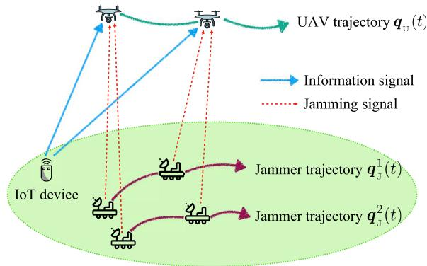  
Fig. 1. The UAV completes its data collection mission while minimizing the efects of the jamming and ensuring its trajectory remains unpredictable.

This paper focuses on the process by which the UAV collects data from an IoT device, assuming that during data collection, several malicious jammers disrupt the communication between the IoT device and the UAV. Therefore, the UAV must complete its data collection mission while minimizing the efects of the jamming and making its trajectory unpredictable. The scenario is shown in Fig. 1.

The area of interest contains a UAV, several jammers, and an IoT device. The UAV flies horizontally at a constant altitude H and can maintain a reliable communication link with the IoT device. The location of the UAV projected on the ground plane at time t is ${ \pmb q } _ { \mathrm { u } } ( t ) = [ x _ { \mathrm { u } } ( t ) , y _ { \mathrm { u } } ( t ) ] \in \mathbb { R } ^ { 2 } , t \in [ 0 , T ]$ , where T is the time endurance required for the UAV to complete the data collection mission. All jammers are located on the ground and can be stationary or mobile. The coordinates of jammer m is $\pmb { q } _ { \mathrm { _ J } } ^ { m } ( t ) = [ x _ { \mathrm { _ J } } ^ { m } ( t ) , y _ { \mathrm { _ J } } ^ { m } ( t ) ]$ , m ∈ [1 M], where M is the number of the jammers. The coordinates of all jammers at time t are represented by a set $\mathcal { T } ( t ) = \left\{ \pmb q _ { \mathrm { \scriptscriptstyle t } } ^ { m } ( t ) \ \vert \ m \in [ 1 , M ] \right\} , \ t \in [ 0 , T ]$

<sup>, ,</sup>The jamming power of all jammers remains equal and constant, and in barrage jamming mode, they are capable of jamming the entire bandwidth [24]. The ground IoT device is situated in a fixed position $\pmb { q } _ { \mathrm { G } } = [ x _ { \mathrm { G } } , y _ { \mathrm { G } } ]$ and uploads data to the UAV via the uplink transmission. It is assumed that the IoT device can provide suficient and constant transmission power. Both the UAV and the jammers are equipped with advanced sensors, enabling them to detect each other’s coordinates and track each other’s current and past trajectory data.

To facilitate derivation of the system model, the trajectory of the UAV is discretized during the computation [25]. Let denotes the size of the time slot, which should be selected small enough to make the discretized trajectory close to the continuous one [26]. Assuming that the total mission time is divided into N time slots, i.e., $T ~ = ~ N \delta .$ . Based on the <sup>δ</sup>time discretization, the trajectories of the UAV and jammers can be rewritten as ${ \pmb q } _ { _ \mathrm { 1 } } [ n ] \ = \ [ x _ { \mathrm { U } } [ n ] , y _ { \mathrm { U } } [ n ] ] , \ n \ \in \ [ 1 , N ]$ and $\pmb { q } _ { \mathrm { _ { J } } } ^ { m } [ n ] = [ x _ { \mathrm { _ { J } } } ^ { m } [ n ] , y _ { \mathrm { _ { J } } } ^ { m } [ n ] ] , \bar { n } \in [ 1 , N ]$ <sup>, ,</sup>, respectively. Similarly, the <sup>, ,</sup>discretized set of all jammer coordinates at time step n is rewritten as $\mathcal { T } [ n ] = \big \{ \pmb { q } _ { \mathfrak { r } } ^ { m } [ n ] \ | \ m \in [ 1 , M ] \big \} , \ n \in [ 1 , N ]$

<sup>, ,</sup>It is assumed that the UAV is modeled as an agent with a given speed and a variable heading, following the dynamics of Dubins’ vehicle. The discrete form of the motion model is expressed as:

$$
x _ { \mathrm { u } } [ n + 1 ] = x _ { \mathrm { u } } [ n ] + \nu \cos ( \theta [ n ] ) \delta ,\tag{1a}
$$

$$
y _ { \mathrm { v } } [ n + 1 ] = y _ { \mathrm { v } } [ n ] + \nu \sin ( \theta [ n ] ) \delta ,\tag{1b}
$$

$$
\theta [ n + 1 ] = \theta [ n ] + \omega [ n ] \delta ,\tag{1c}
$$

$$
\omega _ { \mathrm { m i n } } \le \omega [ n ] \le \omega _ { \mathrm { m a x } } ,\tag{1d}
$$

where [n] is the heading angular velocity at the nth time slot, [n] is the UAV’s heading relative to the x-axis, $\omega _ { \mathrm { m a x } }$ and $\omega _ { \mathrm { m i n } }$ are given constants that indicates the maximum and minimum angular velocity of the UAV, and v is the speed of UAV that indicates UAV flies at a constant speed. The state variables are $x _ { \mathrm { { U } } } [ n ] , y _ { \mathrm { { U } } } [ n ]$ and $\theta [ n ]$ . The control input variable is [n].

Suppose there are jammers that can obtain exact knowledge of both the UAV’s real-time states and input, using sensors to track past trajectory data. By analyzing the history of states and input over time, these jammers can employ data fusion or learning methods, such as the Kalman filter, to estimate and predict the UAV’s future states. The discrete form of the prediction model used by the jammers can be described as follows:

$$
\hat { x } _ { \mathrm { u } } [ n + 1 ] = \hat { x } _ { \mathrm { u } } [ n ] + \nu \cos ( \hat { \theta } [ n ] ) \delta ,\tag{2a}
$$

$$
\hat { y } _ { \mathrm { u } } [ n + 1 ] = \hat { y } _ { \mathrm { u } } [ n ] + \nu \sin ( \hat { \theta } [ n ] ) \delta ,\tag{2b}
$$

$$
\hat { \theta } [ n + 1 ] = \hat { \theta } [ n ] + \hat { \omega } [ n ] \delta ,\tag{2c}
$$

where $\hat { x } _ { \mathrm { u } } [ n + 1 ] , \hat { y } _ { \mathrm { u } } [ n + 1 ] , \hat { \theta } [ n + 1 ]$ and ˆ [n] represent the predictions of the UAV’s states and input based on observations. Let $\hat { \pmb q } _ { \mathrm { u } } [ n + 1 ] = [ \hat { x } _ { \mathrm { u } } [ n + 1 ] , \hat { y } _ { \mathrm { u } } [ n + 1 ] ]$ denote the predicted position of the UAV at time step n + 1. The prediction error is expressed as the Euclidean distance between the predicted position and the actual position. Let $e [ n + 1 ]$ denotes the jammers’ prediction error at time step $n + 1$ and $e [ n + 1 ]$ is expressed as

$$
e [ n + 1 ] = \left\| \hat { \pmb q } _ { \mathrm { u } } [ n + 1 ] - \pmb q _ { \mathrm { u } } [ n + 1 ] \right\| _ { 2 } .\tag{3}
$$

## B. Transmission Channel Model

In this scenario, the link between the IoT device and the UAV is LoS. Let $h _ { \mathrm { { u G } } } [ n ]$ denote the channel coeficient between the IoT device and the UAV at time step n. As characterized in $[ 2 7 ] , h _ { \mathrm { { u G } } } [ n ]$ is expressed as $h _ { \mathrm { { \scriptscriptstyle U G } } } [ n ] = \sqrt { \beta _ { \mathrm { { \scriptscriptstyle U G } } } [ n ] } \rho _ { \mathrm { { \scriptscriptstyle U G } } } [ n ]$ , where $\beta _ { \mathrm { u G } } [ n ]$ represents the large-scale fading coeficient and $\rho _ { \mathrm { { U G } } } [ n ]$ represents the small-scale fading coeficient. $\beta _ { \mathrm { u G } } [ n ]$ <sup>ρ</sup> can be expressed as $\begin{array} { r l r } { \beta _ { _ \mathrm { U G } } [ n ] } & { { } = } & { \frac { \beta _ { 0 } } { d _ { _ \mathrm { U G } } ^ { \alpha } [ n ] } ~ = ~ \frac { \beta _ { 0 } } { ( H ^ { 2 } + \Vert q _ { _ \mathrm { U } } [ n ] - q _ { _ \mathrm { G } } \Vert ^ { 2 } ) ^ { \alpha / 2 } } } \end{array}$ , where $\beta _ { 0 }$ denotes the channel power gain at the reference distance of 1m, $d _ { \mathrm { u G } } [ n ]$ denote the distance between the UAV and the IoT device and $d _ { \mathrm { u G } } [ n ] = ( H ^ { 2 } + \Vert \pmb { q } _ { \mathrm { u } } [ n ] - \pmb { q } _ { \mathrm { G } } \Vert ^ { 2 } ) ^ { \frac 1 2 }$ , denotes the path loss exponent and $\alpha \geq 2 .$ . It is assumed that the smallscale fading coeficient $\rho _ { \mathrm { { U G } } } [ n ]$ follows a Rician fading channel model with Rician factor K [28]. Then, $\rho _ { \mathrm { { U G } } } [ n ]$ is given by $\begin{array} { r } { \rho _ { \mathrm { { { U G } } } } [ n ] = \sqrt { \frac { K } { K + 1 } } \overline { { \rho } } + \sqrt { \frac { 1 } { K + 1 } } \widetilde { \rho } , } \end{array}$ where $\overline { \rho }$ is a LoS component with $| \overline { { \rho } } | = \mathrm { 1 } , \widetilde { \rho }$ is a random Non-line-of-sight (NLoS) component and is a zero-mean unit-variance circularly symmetric complex Gaussian random variable with $\widetilde { \rho } \sim C N ( 0 , 1 )$ . Consequently, the expected value of $| \rho _ { \mathrm { U G } } [ n ] | ^ { 2 }$ <sup>ρ</sup>is $E [ | \rho _ { \mathrm { { u G } } } [ n ] | ^ { 2 } ] = 1$ and the variance of $\rho _ { \mathrm { { u G } } } [ n ]$ is $\begin{array} { r } { D [ \rho _ { \mathrm { { u g } } } [ n ] ] = \frac { 1 } { K + 1 } } \end{array}$

Jammers and the IoT device are both on the ground and the link between jammers and the UAV is also LoS. Thus, the channel coeficients between jammers and the UAV are similar to the one between the IoT device and the UAV. Let $h _ { \mathrm { U J } } ^ { m } [ n ]$ denote the channel coeficient between the mth jammer and the UAV, and $h _ { _ \mathrm { U J } } ^ { m } [ n ] = \ \sqrt { \beta _ { _ \mathrm { U J } } ^ { m } [ n ] } \rho _ { _ { \mathrm { U J } } } ^ { m } [ n ]$ , where $\beta _ { \mathrm { U J } } ^ { m } [ n ]$ <sup>β ρ β</sup>represents the large-scale fading coeficient between the mth jammer and the $\mathrm { U A V , } \rho _ { \mathrm { U } } ^ { m } [ n ]$ represents the small-scale fading coeficient between the mth jammer and the UAV. $\beta _ { \mathrm { U J } } ^ { m } [ n ]$ can be expressed as $\begin{array} { r } { \beta _ { _ \mathrm { U J } } ^ { m } [ n ] = \frac { \beta _ { 0 } } { ( H ^ { 2 } + \| \boldsymbol { q } _ { _ \mathrm { U J } } [ n ] - \boldsymbol { q } _ { _ \mathrm { I } } ^ { m } [ n ] \| ^ { 2 } ) ^ { \alpha / 2 } } } \end{array}$ . The expected value of $| \rho _ { _ { \mathrm { I I I } } } ^ { m } [ n ] | ^ { 2 }$ is $E [ | \rho _ { _ \mathrm { U J } } ^ { m } [ n ] | ^ { 2 } ] = \stackrel { \cdot } { _ \mathrm { 1 } }$ , and the variance of $\rho _ { \mathrm { U J } } ^ { m } [ n ]$ is $\begin{array} { r } { D [ \rho _ { \mathrm { { u J } } } ^ { m } [ n ] ] = \frac { 1 } { K + 1 } } \end{array}$

Thus, in the presence of jammers, the access rate between the UAV and the IoT device, measured in bits per second (bps) at time step n, can be expressed as

$$
\begin{array} { r l } & { r [ n ] = B \log _ { 2 } \left( 1 + \frac { p _ { \mathrm { { u } } } | h _ { \mathrm { { u G } } } [ n ] | ^ { 2 } } { p _ { \mathrm { { J } } } \sum _ { m = 1 } ^ { M } | h _ { \mathrm { { u } } } ^ { m } [ n ] | ^ { 2 } + \sigma ^ { 2 } } \right) } \\ & { \qquad = B \log _ { 2 } \left( 1 + \frac { p _ { \mathrm { { u } } } \beta _ { \mathrm { { u G } } } [ n ] | \rho _ { \mathrm { { u G } } } [ n ] | ^ { 2 } } { p _ { \mathrm { { J } } } \sum _ { m = 1 } ^ { M } ( \beta _ { \mathrm { { u } } } ^ { m } [ n ] | \rho _ { \mathrm { { u } } } ^ { m } [ n ] | ^ { 2 } ) + \sigma ^ { 2 } } \right) , } \end{array}\tag{4}
$$

where $p _ { \mathrm { { U } } }$ and $p _ { \mathrm { { J } } }$ are constants that denote the transmit power of the IoT device and jamming power of jammers, respectively; $\sigma$ denotes the noise power of the additive white Gaussian noise at the UAV receiver; B denotes the channel bandwidth in Hertz (Hz).

As described in [29], the lower bound for the average rate $E [ r [ n ] ]$ is adopted in the UAV trajectory framework only when the channel distribution information knowledge is known. Thus, the lower bound of $E [ r [ n ] ]$ is defined as

$$
\begin{array} { r l } & { E [ r [ n ] ] } \\ & { \geq B \mathrm { l o g } _ { 2 } \left( 1 + \frac { p _ { \mathrm { u } } E [ | h _ { \mathrm { u g } } [ n ] | ^ { 2 } ] } { p _ { \mathrm { u } } D [ h _ { \mathrm { u G } } [ n ] ] + p _ { \mathrm { p } } \sum _ { m = 1 } ^ { M } E [ | h _ { \mathrm { u p } } ^ { m } [ n ] | ^ { 2 } ] + \sigma ^ { 2 } } \right) } \\ & { = B \mathrm { l o g } _ { 2 } \left( 1 + \frac { p _ { \mathrm { u } } \beta _ { \mathrm { u G } } [ n ] } { p _ { \mathrm { u } } \frac { \beta _ { \mathrm { u G } } [ n ] } { K + 1 } + p _ { \mathrm { p } } \sum _ { m = 1 } ^ { M } \beta _ { \mathrm { u } } ^ { m } [ n ] + \sigma ^ { 2 } } \right) \triangleq R _ { \mathrm { u G } } [ n ] . } \end{array}\tag{5}
$$

## C. Problem Formulation

The provided total operation mission time T is suficient for the UAV to fly from the start point $\pmb q _ { \mathrm { v } } [ 1 ]$ to the end point $\smash { q _ { \mathrm { u } } [ N ] }$ while completing the data collection mission. The objective of this paper is to minimize the impact of interference signals on UAV while meeting the requirements for data collection to the fullest extent possible. Thus, only the interference from jammers is taken into account when making the trajectory unpredictable.

The total transmitted data from the IoT device within the whole duration can be constrained as

$$
\sum _ { n = 1 } ^ { N } R _ { \mathrm { { \scriptscriptstyle U G } } } [ n ] \geq S ,\tag{6}
$$

where S denotes the expected number of information bits to be collected during the data collection mission. This constraint specifies a minimum value for the total amount of data transmitted from the IoT device to the UAV.

The aim is to minimize the overall interference caused by jammers by optimizing the heading angular velocity of the UAV, given the constant horizontal velocity of the UAV and the task completed time. The traditional UAV trajectory planning problem can be formulated as

$$
P _ { 1 } : \underset { \omega [ n ] } { \mathrm { m i n } } \ p _ { \mathrm { { J } } } \sum _ { n = 1 } ^ { N } \sum _ { m = 1 } ^ { M } \beta _ { \mathrm { { u } } } ^ { m } [ n ] ,\tag{7a}
$$

$$
\mathrm { s . t . } \sum _ { n = 1 } ^ { N } R _ { \mathrm { { \scriptscriptstyle U G } } } [ n ] \geq S ,\tag{7b}
$$

$$
\pmb { q } _ { \mathrm { _ U } } [ 1 ] = [ x _ { \mathrm { _ U } } [ 1 ] , y _ { \mathrm { _ U } } [ 1 ] ] ,\tag{7c}
$$

$$
\begin{array} { r } { \pmb q _ { \mathrm { { u } } } [ N ] = [ x _ { \mathrm { { u } } } [ N ] , y _ { \mathrm { { u } } } [ N ] ] , } \end{array}\tag{7d}
$$

where $\pmb { q } _ { \mathrm { u } } [ 1 ]$ and $\smash { \boldsymbol { q } _ { \mathrm { u } } [ N ] }$ are the start point and the end point, respectively.

It is obvious that the ultimate goal of $P _ { 1 }$ is to determine the set of optimal inputs [n] for the UAV, achievable through optimization algorithms. However, a critical limitation arises that $\omega [ n ]$ is inherently a set of fixed values. Using predetermined $\omega [ n ]$ introduces predictability, increasing the risk of adversarial prediction. Intelligent mobile jammers could exploit this to predict the $\mathrm { U A V } ^ { \prime } \mathbf { s }$ trajectory, compromising its efectiveness. To address this issue, the next section proposes the UTF, ensuring the $\mathrm { U A V } \mathbf { \hat { s } }$ trajectory exhibits stochastic characteristics. Additionally, based on $P _ { 1 }$ , new problem formulations are required to address the complexities arising from trajectory stochasticity.

## III. UNPREDICTABLE TRAJECTORY FRAMEWORK

It can be seen that intelligent jammers may predict the $\mathrm { U A V } \mathbf { \hat { s } }$ optimal inputs and future movements by observing its historical trajectories in $P _ { 1 }$ . To improve trajectory secrecy, this section proposes the UTF for the UAV-assisted data collection system.

The concepts of navigation control law and stochastic control law are prerequisites for describing the framework. For convenience, the motion model of UAV in (1a)-(1c) can be rewritten as:

$$
\lambda [ n + 1 ] = \lambda [ n ] + G ( \lambda [ n ] , \omega [ n ] ) \delta ,\tag{8}
$$

where $\lambda [ n ] ~ = ~ [ x _ { _ \mathrm { U } } [ n ] , y _ { _ \mathrm { U } } [ n ] , \theta [ n ] ] ^ { T }$ is the vector of the state variables and $G ( \lambda [ n ] , \omega [ n ] )$ <sup>,</sup> <sup>θ</sup> is a function of [n] and [n].

## A. Navigation Control Law

In the data collection scenario, if there is a control scheme that generates a vector $\omega _ { \mathrm { n c } } [ n ]$ guiding the UAV to the end point, this control scheme is called the navigation control law.

If the navigation control law is implemented, i.e. [n] = $\omega _ { \mathrm { n c } } [ n ]$ , (8) is expressed as

$$
\lambda [ n + 1 ] = \lambda [ n ] + G ( \lambda [ n ] , \omega _ { \mathrm { n c } } [ n ] ) \delta .\tag{9}
$$

However, this control law makes the UAV move in a straightforward pattern, which is vulnerable to jamming attacks. To make the sequence of $\lambda [ n ]$ unpredictable, an extra input is added to $\omega _ { \mathrm { n c } } [ n ]$ , i.e.:

$$
\lambda [ n + 1 ] = \lambda [ n ] + G ( \lambda [ n ] , \omega _ { \mathrm { n c } } [ n ] + \omega _ { \mathrm { s c } } [ n ] ) \delta ,\tag{10}
$$

where $\omega _ { \mathrm { s c } } [ n ]$ is a stochastic vector generated by a control scheme. Obviously, due to the influence of $\omega _ { \mathrm { s c } } [ n ]$ , [n] also reflects trajectory’s stochasticity. The jammers are hard to predict further trajectory of the UAV even if prediction model is used [22].

## B. Stochastic Control Law

If there is a control scheme, $\omega _ { \mathrm { s c } } [ n ]$ , which makes the trajectory of the UAV unpredictable, this control scheme is called the stochastic control law.

Fig. 2 illustrates the proposed framework. In this framework, the control law is decomposed into two parts: the navigation control law and the stochastic control law. Each part presents an optimization challenge. The framework follows a threepart design: 1) solving the navigation optimization problem to determine the navigation input; 2) solving the stochastic optimization problem to obtain stochastic input based on the navigation input; 3) combining the navigation and stochastic inputs to achieve a comprehensive solution. By combining these elements, the framework produces a trajectory that confuses adversaries while satisfying data collection constraints.

Thus, the control input at time step n can be written as

$$
\omega [ n ] = \omega _ { \mathrm { n c } } [ n ] + \omega _ { \mathrm { s c } } [ n ] ,
$$

$$
\omega _ { \mathrm { n c } } [ n ] = f _ { \mathrm { n c } } ( { \mathcal I } [ n ] , \lambda [ n ] ) ,\tag{11a}
$$

$$
\omega _ { \mathrm { s c } } [ n ] = f _ { \mathrm { s c } } ( \mathcal { T } [ n ] , \lambda [ n ] ) ,\tag{11b}
$$

(11c)

$$
\omega _ { \mathrm { ( m i n , n c ) } } \leq \omega _ { \mathrm { n c } } [ n ] \leq \omega _ { \mathrm { ( m a x , n c ) } } ,\tag{11d}
$$

$$
\omega _ { ( \mathrm { m i n } , \mathrm { s c } ) } \leq \omega _ { \mathrm { s c } } [ n ] \leq \omega _ { ( \mathrm { m a x } , \mathrm { s c } ) } ,\tag{11e}
$$

where ${ \mathcal { I } } [ n ]$ is the set of all jammer coordinates, $f _ { \mathrm { n c } } ( \mathcal { I } [ n ] , \lambda [ n ] )$ and $f _ { \mathrm { s c } } ( \mathcal { I } [ n ] , \lambda [ n ] )$ denote the function that obtaining the navigation input and stochastic input, respectively, $\omega _ { \mathrm { n c } } [ n ]$ denote the navigation input generated by navigation control optimization $f _ { \mathrm { n c } } ( \mathcal { I } [ n ] , \lambda [ n ] )$ , and $\omega _ { \mathrm { s c } } [ n ]$ denote the stochastic input generated by stochastic control optimization $f _ { \mathrm { s c } } ( \mathcal { I } [ n ] , \lambda [ n ] )$ . <sub>(min nc)</sub> and $\omega _ { \mathrm { ( m a x , n c ) } }$ are the given bounds, i.e., lower and upper bound, of navigation input, respectively. Similarly, $\omega _ { \mathrm { ( m i n , s c ) } }$ and $\omega _ { \mathrm { ( m a x , s c ) } }$ are the given bounds of stochastic input, respectively. Obviously, $\omega _ { \mathrm { ( m i n , n c ) } } + \omega _ { \mathrm { ( m i n , s c ) } } \geq \omega _ { \mathrm { m i n } }$ and $\omega _ { \mathrm { ( m a x , n c ) } } + \omega _ { \mathrm { ( m a x , s c ) } } \leq \omega _ { \mathrm { m a x } }$

The UTF integrates navigation input and stochastic input to provide a comprehensive solution for enhancing trajectory unpredictability. However, determining the optimal combination of navigation input and stochastic input remains a significant challenge in $f _ { \mathrm { n c } } ( \mathcal { I } [ n ] , \lambda [ n ] )$ and $f _ { \mathrm { s c } } ( \mathcal { I } [ n ] , \lambda [ n ] )$ . To address this issue, in the next section, we formulate optimization problems aimed at obtaining the optimal inputs.

## IV. METHODS FOR ADDRESSING OPTIMIZATION CHALLENGES

## A. Navigation Control Law

This subsection details the navigation optimization problem inherent in the functions $f _ { \mathrm { n c } } ( \mathcal { I } [ n ] , \lambda [ n ] )$ and provides an optimization method. The objective of the navigation control law is to guide the UAV towards its final destination while completing its data collection mission. Consequently, the navigation optimization problem is formulated and an objective function is designed to account for the remaining time and the amount of data yet to be collected, with these two factors being interdependent constraints.

At time step n, the rate of data yet to be collected and the remaining time are articulated by the expression:

$$
Q [ n ] = { \frac { C [ n ] } { N - n } } ,\tag{12}
$$

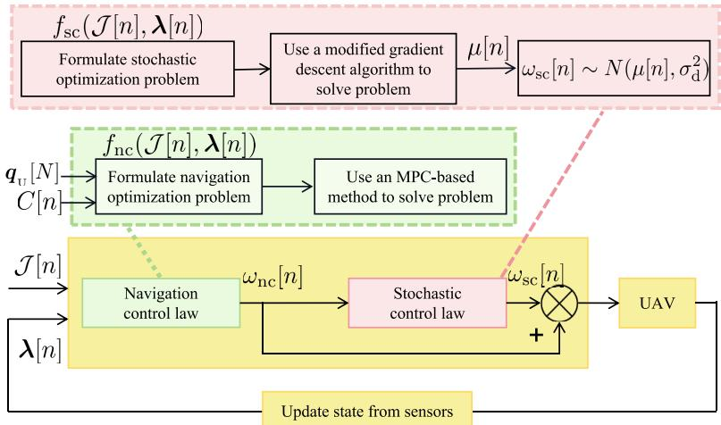  
Fig. 2. The proposed UTF.

where $C [ n ] = \operatorname* { m a x } \big ( 0 , \big ( S - \sum _ { k = 1 } ^ { n } R _ { \mathrm { { u G } } } [ k ] \big ) \big )$ represents the data quantity to be collected. Q[n] is significant because it reflects the progress toward mission completion and supports future planning. It determines whether the UAV should proceed towards the IoT device for further data collection or navigate towards the end point to conclude the operation.

Therefore, the following navigation objective function is defined at time step n for the navigation trajectory

$$
J _ { \mathrm { n c } } [ n ] = { \cal Q } [ n ] + \| { \pmb q } _ { \mathrm { v } } [ N ] - { \pmb q } _ { \mathrm { v } } [ n ] \| ,\tag{13}
$$

where $\lVert \pmb q _ { \mathrm { u } } [ N ] - \pmb q _ { \mathrm { u } } [ n ] \rVert$ represents the distance from the current position of UAV to the end point.

Thus, the optimal navigation input at time step n is obtained according to the following navigation optimization problem:

$$
\begin{array} { r l } { P _ { 2 } : } & { \underset { \omega _ { \mathrm { n c } } [ n ] } { \mathrm { m i n } } J _ { \mathrm { n c } } ( \omega _ { \mathrm { n c } } [ n ] ) } \\ & { \mathrm { s . t . } ( 1 1 \mathbf { b } ) - ( 1 1 \mathbf { e } ) . } \end{array}\tag{14}
$$

For the navigation optimization problem, to obtain $\omega _ { \mathrm { n c } } ^ { * } [ n ] .$ an MPC-based method is employed within the framework. In this MPC-based method, assume the receding horizon length is $K _ { \mathrm { p } }$ . At time step n, the navigation inputs are determined using a predictive model over the horizon $[ n , n + K _ { \mathrm { p } } ]$ . Since the UAV cannot predict the jammers information, J [n] is used as a set of constant values for future prediction, even though the actual positions of jammers position are variable. Let $\omega _ { \mathrm { n c } } [ n : n + K _ { \mathrm { p } } ] = \{ \omega _ { \mathrm { n c } } [ n + k _ { \mathrm { p } } ] | k _ { \mathrm { p } } \in [ 0 , K _ { \mathrm { p } } ] \}$ denote the set of navigation inputs over the horizon [n $n + K _ { \mathrm { p } } ] .$ The corresponding set of objective values is denoted by $J _ { \mathrm { n c } } ( \omega _ { \mathrm { n c } } [ n : n + K _ { \mathrm { p } } ] ) = \{ J _ { \mathrm { n c } } ( \omega _ { \mathrm { n c } } [ n + k _ { \mathrm { p } } ] ) \ | \ k _ { \mathrm { p } } \ \in [ 0 , K _ { \mathrm { p } } ] \}$ . By computing the minimum value of $J _ { \mathrm { n c } } ( \omega _ { \mathrm { n c } } [ n + K _ { \mathrm { p } } ] )$ , the navigation optimization problem is transformed into the following problem:

$$
\begin{array} { r l } { P _ { 3 } : } & { \underset { \omega _ { \mathrm { n c } } [ n : n + K _ { \mathrm { p } } ] } { \mathrm { m i n } } J _ { \mathrm { n c } } ( \omega _ { \mathrm { n c } } [ n + K _ { \mathrm { p } } ] ) } \\ & { \mathrm { s . t . } ( 1 1 \mathbf { b } ) - ( 1 1 \mathbf { e } ) . } \end{array}\tag{15}
$$

For $P _ { 3 } ,$ , the optimal set of navigation inputs is obtained and denoted by $\omega _ { \mathrm { n c } } ^ { \mathrm { o } } [ n : n + K _ { \mathrm { p } } ] = \{ \omega _ { \mathrm { n c } } ^ { \mathrm { o } } [ n + k _ { \mathrm { p } } ] \mid k _ { \mathrm { p } } \in [ 0 , K _ { \mathrm { p } } ] \}$ . At the next time step, the optimal navigation input $\omega _ { \mathrm { n c } } ^ { * } [ n ]$ is selected as the first element in $\omega _ { \mathrm { n c } } ^ { * } [ n : n + K _ { \mathrm { p } } ] .$ , i.e., $\omega _ { \mathrm { n c } } ^ { * } [ n ] = \omega _ { \mathrm { n c } } ^ { 0 } [ n ]$ <sup>ω ω</sup>After the UAV moves to a new position at time step $n + 1$ these procedures are repeated until the end of the mission.

The primary challenge of $P _ { 3 }$ lies in its real-time performance requirements. To address this challenge, motivated by [30], this MPC-based method takes into account the range of the input and discretizes it, constructing a set of constant control inputs. The control inputs are represented by a set $\omega _ { ( \mathrm { n c } , i ) } [ n ] = \left\{ \omega _ { ( \mathrm { n c } , 0 ) } [ n ] , \omega _ { ( \mathrm { n c } , 1 ) } [ n ] , \ldots , \omega _ { ( \mathrm { n c } , n _ { d } - 1 ) } [ n ] \right\}$ , where $n _ { d }$ is the degree of discreteness of control input variable. For the navigation input, the control variable $\omega _ { \mathrm { n c } } [ n ]$ is bounded by $\omega _ { \mathrm { ( m i n , n c ) } }$ and $\omega _ { \mathrm { ( m a x , n c ) } } .$ . Thus, $\omega _ { ( \mathrm { n c } , i ) } [ n ]$ is defined as follows:

$$
\begin{array} { r } { \omega _ { \mathrm { ( n c , } i \mathrm { ) } } [ n ] = \omega _ { \mathrm { ( m i n , n c ) } } + g _ { d } i , \quad \quad \quad } \\ { i = 0 , 1 , \ldots , n _ { d } - 1 . \quad \quad } \end{array}\tag{16}
$$

where $\begin{array} { r } { g _ { d } = \frac { \omega _ { \mathrm { ( m a x , n c ) } } - \omega _ { \mathrm { ( m i n , n c ) } } } { n _ { d } - 1 } } \end{array}$ is the step size.

Algorithm 1 MPC-based Method   
Input: The coordinates of jammers ${ \mathcal { T } } [ n ] ,$ , and the state vari  
ables of UAV [n].   
1 Initialize $n _ { d }$ <sup>λ</sup>and $K _ { \mathfrak { p } }$   
2 for $l \gets ~ 1 , \ldots , n _ { d } ^ { K _ { \mathrm { p } } }$ do   
3 <sup>,</sup> <sup>.</sup> <sup>.</sup> <sup>.</sup> <sup>,</sup>Obtain the lth candidate set $\omega _ { \mathrm { n c } } [ n : n + K _ { \mathrm { p } } ] ( l )$   
4 Calculate $J _ { \mathrm { n c } } ( \omega _ { \mathrm { n c } } [ n : n + K _ { \mathrm { p } } ] ( l ) )$ using (13)   
5 end   
6 Obtain the minimum value in $J _ { \mathrm { n c } } ( \omega _ { \mathrm { n c } } [ n + K _ { \mathrm { p } } ] )$ and the   
corresponding $\omega _ { \mathrm { n c } } ^ { \mathrm { o } } [ n : n + K _ { \mathrm { p } } ]$   
Output: $\omega _ { \mathrm { n c } } ^ { * } [ n ] = \omega _ { \mathrm { n c } } ^ { \mathrm { o } } [ n ] .$

It is obvious that the MPC-based method involves $n _ { d } ^ { K _ { \mathrm { p } } }$ candidate sets. The optimal solution for the next time step execution is selected from these input combinations. The details of the algorithm are presented in Algorithm 1. It is noteworthy that the complexity of the algorithm at any given time is ${ \cal O } [ n _ { d } ^ { K _ { \mathrm { p } } } ]$ .

## B. Stochastic Control Law

The MPC-based method used to solve the navigation control problem requires discretization of the control input variable.

However, the finite number of discrete values makes the inputs and states more susceptible to exposure. Therefore, a stochastic input is introduced to ensure unpredictability in this framework. The value of the stochastic input is based on a given navigation input value. Specifically, let $\omega _ { \mathrm { r e f } } [ n ]$ denote the nominal control input, where $\omega _ { \mathrm { r e f } } [ n ] = \omega _ { \mathrm { n c } } [ n ]$ . The bounds of the stochastic input are assumed to be relevant to the step size of the discretized control input $g _ { d }$ in (16). Thus, the $\omega _ { \mathrm { ( m i n , s c ) } }$ and $\omega _ { \mathrm { ( m a x , s c ) } }$ are assigned as follows:

$$
\begin{array} { r } { \omega _ { ( \mathrm { m i n } , \mathrm { s c } ) } = - \eta g _ { d } , } \end{array}\tag{17a}
$$

$$
\begin{array} { r } { \omega _ { ( \mathrm { m a x , s c } ) } = \eta g _ { d } , } \end{array}\tag{17b}
$$

where $\eta$ is a regulating coeficient.

Besides, for the stochastic optimization problem inherent in the functions $f _ { \mathrm { s c } } ( \mathcal { I } [ n ] , \lambda [ n ] )$ , the objective of $f _ { \mathrm { s c } } ( \mathcal { I } [ n ] , \lambda [ n ] )$ is to design a control strategy at time step n that makes the trajectory of UAV unpredictable while minimizing the efects of disturbances. Thus, $\omega _ { \mathrm { s c } } [ n ]$ is chosen as a random variable that satisfies a certain distribution $F _ { \mathrm { d } } ( \omega _ { \mathrm { s c } } [ n ] )$ , making UAV trajectory dificult to predict accurately.

In this framework, the normal distribution is chosen for $F _ { \mathrm { d } } ( \omega _ { \mathrm { s c } } [ n ] )$ . Its probability density function is

$$
f _ { \mathrm { d } } ( \omega _ { \mathrm { s c } } [ n ] ) = \frac { 1 } { \sqrt { 2 \pi } \sigma _ { \mathrm { d } } } \exp { \left( - \frac { ( \omega _ { \mathrm { s c } } [ n ] - \mu [ n ] ) ^ { 2 } } { 2 \sigma _ { \mathrm { d } } ^ { 2 } } \right) } ,\tag{18}
$$

where $\mu [ n ]$ is the expected value, i.e., $E [ { \omega _ { \mathrm { s c } } } [ n ] ] ~ = ~ \mu [ n ]$ $\sigma _ { \mathrm { d } } ^ { 2 }$ <sup>µ</sup>is the variance, i.e., $D [ \omega _ { \mathrm { s c } } [ n ] ] ~ = ~ \sigma _ { \mathrm { d } } ^ { 2 } . ~ \sigma _ { \mathrm { d } } ^ { 2 }$ <sup>µ</sup>is a fixed constant during the mission, and the larger the value of $\sigma _ { \mathrm { d } } ^ { 2 }$ is, the more unpredictable the UAV’s trajectory becomes for jammers [22].

The value of [n] fluctuates and is influenced by two factors: the external environment and the internal cost. On the one hand, $\mu [ n ]$ is strategically adjusted to mitigate interference imposed by jammers, even within the stochastic process. Therefore, considering the current coordinates of jammers and the UAV, the jamming cost function at time step n is defined as

$$
\begin{array} { l } { { \displaystyle { J _ { \mathrm { 1 } } [ n ] = p _ { \mathrm { , } } \sum _ { m = 1 } ^ { M } \beta _ { \mathrm { u l } } ^ { m } [ n + 2 | n ] } } \ ~ } \\ { { \displaystyle ~ = \sum _ { m = 1 } ^ { M } \frac { p _ { \mathrm { , } } \beta _ { 0 } } { \left( H ^ { 2 } + { \lVert { \pmb q _ { \mathrm { , } } [ n + 2 ] - \pmb q _ { \mathrm { , } } ^ { m } [ n ] \rVert } ^ { 2 } } \right) ^ { \alpha / 2 } } } , } \end{array}\tag{19}
$$

where ${ \bf q } _ { _ \mathrm { U } } [ n + 2 ] \ = \ [ x _ { _ \mathrm { U } } [ n + 2 ] , y _ { _ \mathrm { U } } [ n + 2 ] ] , \ x _ { _ \mathrm { U } } [ n + 2 ] \ =$ $x _ { \mathrm { u } } [ n + 1 ] + \nu \cos ( \theta [ n ] + ( \mu [ n ] + \omega _ { \mathrm { r e f } } [ n ] ) \delta ) \delta = x _ { \mathrm { u } } [ n ] +$ v $\begin{array} { r } { \cos ( \theta [ n ] ) \delta + \nu \cos ( \theta [ n ] + ( \mu [ n ] + \omega _ { \mathrm { r e f } } [ n ] ) \delta ) , y _ { \mathrm { u } } [ n + 2 ] \ = } \end{array}$ $y _ { \mathrm { v } } [ n + 1 ] + \nu \sin ( \theta [ n ] + ( \mu [ n ] + \omega _ { \mathrm { r e f } } [ n ] ) \delta ) \delta = y _ { \mathrm { u } } [ n ] + \nu \sin ( \theta [ n ] ) \delta +$ $\nu \sin ( \theta [ n ] + ( \mu [ n ] + \omega _ { \mathrm { r e f } } [ n ] ) \delta ) \delta .$

<sup>θ µ ω δ δ</sup>On the other hand, the UAV tries to complete the mission steadily, but the presence of the unpredictable input will burden the control. The increase in the value of $\mu [ n ]$ results in an increase in the control cost. Therefore, the control cost function at time step n is defined as

$$
J _ { 2 } [ n ] = \left( E [ \omega _ { \mathrm { s c } } [ n ] ] + \omega _ { \mathrm { r e f } } [ n ] \right) ^ { 2 } = \left( \mu [ n ] + \omega _ { \mathrm { r e f } } [ n ] \right) ^ { 2 } .\tag{20}
$$

Considering the above two aspects, the stochastic control law optimizes the objective in the traditional UAV trajectory

planning problem $( P _ { 1 } )$ , and $\mu [ n ]$ is determined by the following stochastic optimization problem:

$$
\begin{array} { r l l } { { } } & { { P _ { 4 } : ~ \displaystyle \operatorname* { m i n } _ { \mu \left[ n \right] } ~ J _ { \mathrm { s c } } [ n ] } } \\ { { } } & { { } } \\ { { } } & { { \mathrm { s . t . } ~ - \eta g _ { d } \leq \mu [ n ] \leq \eta g _ { d } , } } \end{array}\tag{21}
$$

where $J _ { \mathrm { s c } } [ n ] = J _ { 1 } [ n ] + J _ { 2 } [ n ]$ is the stochastic objective equation at time step n.

For the stochastic optimization problem, although there is only one variable to be solved and this variable exists in every sub-term of the polynomial, it is dificult to express the optimal solution of this variable using mathematical formulas. In the following, the existence of the optimal expected value is proven in the presence of a jammer disrupting the communication.

Theorem 1: Let $\mu ^ { * } [ n ]$ denote the optimal expected value of $F _ { \mathrm { d } } ( \omega _ { \mathrm { s c } } [ n ] )$ at time step n. The position of the jammer is denoted by ${ \pmb q } _ { \mathrm { , } } [ n ] = [ x _ { \mathrm { , } } [ n ] , y _ { \mathrm { , } } [ n ] ]$ . Given that $- \pi \leq ( \mu ^ { * } [ n ] +$ $\omega _ { \mathrm { r e f } } [ n ] ) \delta \leq \pi$ and that there is only one jammer interrupting the communication, i.e., $M = 1 , \mu ^ { * } [ n ] + \omega _ { \mathrm { r e f } } [ n ]$ is consistently present within $J _ { 1 } [ n ]$ and is given by

$$
\left| \tan { ( \theta [ n ] + ( \mu ^ { * } [ n ] + \omega _ { \mathrm { r e f } } [ n ] ) } \delta ) \right| = \frac { | y _ { \mathrm { U } } [ n + 2 ] - y _ { \mathrm { J } } [ n ] | } { | x _ { \mathrm { U } } [ n + 2 ] - x _ { \mathrm { J } } [ n ] | } .\tag{22}
$$

Proof: If $M = 1$ and the UAV knows the jammer’s position, the jamming cost function at time step n is defined as follows:

$$
J _ { 1 } [ n ] = \frac { p _ { \mathrm { } } \beta _ { 0 } } { \left( H ^ { 2 } + \Vert \pmb { q } _ { \mathrm { u } } [ n + 2 ] - \pmb { q } _ { , } [ n ] \Vert ^ { 2 } \right) ^ { \alpha / 2 } } .\tag{23}
$$

Let $\hat { \mu } [ n ] = \mu [ n ] + \omega _ { \mathrm { r e f } } [ n ]$ , since there is only one variable in this equation, it can be directly diferentiated as follows:

$$
\frac { d ( J _ { 1 } [ n ] ) } { d ( \mu [ n ] ) } = - \frac { \alpha } { 2 } p _ { \scriptscriptstyle , } \beta _ { 0 } ( H ^ { 2 } + g ( \hat { \mu } [ n ] ) ^ { - \left( \frac { \alpha } { 2 } + 1 \right) } g ^ { \prime } ( \hat { \mu } [ n ] ) ,\tag{24}
$$

where $g ( \hat { \mu } [ n ] ) = \| \pmb { q } _ { \mathrm { u } } [ n + 2 ] - \pmb { q } _ { \mathrm { , } } [ n ] \| ^ { 2 } = ( x _ { \mathrm { u } } [ n + 2 ] - x _ { \mathrm { , } } [ n ] ) ^ { 2 } +$ $( y _ { \mathrm { { u } } } [ n + 2 ] - y _ { \mathrm { { J } } } [ n ] ) ^ { 2 }$ .

We can further get:

$$
\begin{array} { r l } & { g ^ { \prime } ( \hat { \mu } [ n ] ) = - 2 \nu \delta ( x _ { \mathrm { u } } [ n + 2 ] - x _ { \mathrm { J } } [ n ] ) \sin ( \theta [ n ] + \hat { \mu } [ n ] \delta ) } \\ & { ~ + ~ 2 \nu \delta ( y _ { \mathrm { u } } [ n + 2 ] - y _ { \mathrm { J } } [ n ] ) \cos ( \theta [ n ] + \hat { \mu } [ n ] \delta ) . } \end{array}\tag{25}
$$

When $g ^ { \prime } ( \hat { \mu } [ n ] ) = 0 , J _ { 1 } [ n ]$ can obtain its minimum value:

$$
\begin{array} { r l } & { - \left( x _ { \mathrm { u } } [ n + 2 ] - x _ { \mathrm { J } } [ n ] \right) \sin ( \theta [ n ] + \hat { \mu } [ n ] \delta ) } \\ & { \quad + \left( y _ { \mathrm { u } } [ n + 2 ] - y _ { \mathrm { J } } [ n ] \right) \cos ( \theta [ n ] + \hat { \mu } [ n ] \delta ) = 0 . } \end{array}\tag{26}
$$

It is obvious that if |tan $\begin{array} { r l } { ( \theta [ n ] + ( \mu ^ { * } [ n ] + \omega _ { \mathrm { r e f } } [ n ] ) \delta ) | } & { { } = } \end{array}$ $\frac { | y _ { \mathrm { U } } [ n + 2 ] - y _ { \mathrm { J } } [ n ] | } { | x _ { \mathrm { U } } [ n + 2 ] - x _ { \mathrm { J } } [ n ] | }$ , the optimal solution is obtained.

Theorem 1is proved.

In the following, the existence of the optimal solution in $P _ { 4 }$ is proven.

Theorem 2: Assuming $- \pi \leq ( \mu [ n ] + \omega _ { \mathrm { r e f } } [ n ] ) \delta \leq \pi .$ , the minimum solution exists in $P _ { 4 }$

Proof: The resulting polynomial remains continuous after continuous monomials are added. Thus, $J _ { 1 } [ n ]$ is a continuous polynomial. $J _ { 2 } [ n ]$ is a quadratic function and is continuous, so $J _ { \mathrm { s c } } [ n ]$ is continuous. According to the extreme value theorem, a function that is continuous over a closed interval is guaranteed to have a minimum value over a closed interval. Theorem 2 is proved. 

```tcl
Algorithm 2 Modified Gradient Descent Algorithm
Input: The coordinates of jammers $\overline { { \mathcal { I } [ n ] } }$ , and the state vari
ables of UAV [n].
1 for $i  \ 1 , \ldots , M$ in parallel do
2 <sup>,</sup> <sup>.</sup>Initialize $\mu _ { i } ^ { 0 } [ n ] , J _ { \mathrm { ( s c } , i ) } ^ { 0 ^ { \mathrm { - } } } [ n ] , l _ { i } = 1$ and learning rate r
3 <sup>µ ,</sup>Obtain the ith jammer’s coordinate and calculate the
initial point <sub>i</sub>[n] using (27)
4 Set $\mu _ { i } ^ { 0 } [ n ] \ = \ \mu _ { i } [ n ]$ and obtain $J _ { ( \mathrm { s c } , i ) } ^ { 0 } [ n ]$ with variable
$\mu _ { i } ^ { 0 } [ n ]$
5 <sup>µ</sup>repeat
6 Calculate $G ( \mu _ { i } ^ { ( l _ { i } - 1 ) } [ n ] )$ using (28)
7 Update $\mu _ { i , \cdot } ^ { ( l _ { i } ) } [ \dot { n } ] = \mu _ { i } ^ { ( l _ { i } - 1 ) } [ n ] \stackrel {  } { - } G ( \mu _ { i , \cdot } ^ { ( l _ { i } - 1 ) } [ n ] ) r$
8 Update $J _ { ( \mathrm { s c } , i ) } ^ { \dot { ( l _ { i } ) } } [ n ]$ with variable $\mu _ { i } ^ { ( l _ { i } ) } [ n ]$
9 Update $l _ { i } \gets l _ { i } + 1$
10 until Some termination conditions are met
11 end
12 Obtain the minimum value $J _ { \mathrm { ( s c , m i n ) } } [ n ]$ in
$\left\{ J _ { ( \mathrm { s c } , 1 ) } ^ { ( l _ { 1 } ) } [ n ] , \ldots , J _ { ( \mathrm { s c } , M ) } ^ { ( l _ { M } ) } [ n ] \right\}$ and the corresponding $\mu ^ { * } [ n ]$
Output: $\mu ^ { * } [ n ] .$
```

Theorem 1 proves the existence of the optimal expected value. However, solving for this value is challenging as per (22). Theorem 3 subsequently ofers an approximate equation to address this problem.

Theorem 3: When the UAV and the jammer are farther apart, the optimal expected value $\mu ^ { * } [ n ] + \omega _ { \mathrm { r e f } } [ n ]$ is approximately given by

$$
\left| \tan \left( \theta [ n ] + ( \mu ^ { * } [ n ] + \omega _ { \mathrm { r e f } } [ n ] ) \delta \right) \right| = \frac { \left| y _ { \mathrm { u } } [ n ] - y _ { \mathrm { J } } [ n ] \right| } { \left| x _ { \mathrm { u } } [ n ] - x _ { \mathrm { J } } [ n ] \right| } .\tag{27}
$$

Proof: In the case of long distance between the UAV and the jammer, it has $x _ { \scriptscriptstyle \mathrm { U } } [ n + 2 ] - x _ { \scriptscriptstyle \mathrm { J } } [ n ] \gg$ v and $y _ { \mathrm { u } } [ n + 2 ] - y _ { \mathrm { , } } [ n ] \gg$ v . Thus, $x _ { \mathrm { u } } [ n ] - x _ { \mathrm { \ell } } [ n ] + \nu \cos ( \theta [ n ] ) \delta + \nu \cos ( \theta [ n ] + ( \mu ^ { * } [ n ] +$ $\omega _ { \mathrm { r e f } } [ n ] ) \delta ) \delta \approx x _ { \mathrm { u } } [ n ] - x _ { \mathrm { \scriptscriptstyle J } } [ n ]$ <sup>θ</sup> and $y _ { \mathrm { v } } [ n ] - y _ { \mathrm { , } } [ n ] + \nu \sin ( \theta [ n ] +$ $( \mu ^ { * } [ n ] + \omega _ { \mathrm { r e f } } [ n ] ) \delta ) \delta + \nu \sin ( \theta [ n ] + ( \mu ^ { * } [ n ] + \omega _ { \mathrm { r e f } } [ n ] ) \delta ) \delta \approx y _ { \mathrm { u } } [ n ] -$ $y _ { j [ n ] } .$ <sup>ω δ δ</sup>. Theorem 3 is proved. 7

Since $P _ { 4 }$ is hard to use formulas to express directly, the numerical optimal solution can be obtained by the optimization algorithm. This framework proposes a modified gradient descent algorithm, as shown in Algorithm 2, to obtain the optimal stochastic input. Unlike traditional gradient descent algorithms, this algorithm leverages the approximate optimal solution from Theorem 3 to select the initial point for gradient descent. It runs with M threads in parallel, where each thread uses its respective jammer coordinate to compute the initial point. Once all threads complete their execution, a comparison is made among the M threads to identify the minimum objective value and determine the corresponding optimal input $\mu ^ { * } [ n ]$

To calculate the gradient, the central diference method is used:

$$
G ( \mu [ n ] ) = \frac { f ( \mu [ n ] + \Delta ) - f ( \mu [ n ] - \Delta ) } { 2 \Delta } ,\tag{28}
$$

where ∆ is a small incremental value.

Algorithm 3 The process of UTF   
1 Initialize $\overline { { N , \tau _ { t } , C [ 0 ] , \mathcal { I } [ 0 ] } }$ and [0].   
2 for $n  ~ 1 , \ldots , N$ do   
3 <sup>,</sup> <sup>.</sup> <sup>.</sup> <sup>.</sup> <sup>,</sup>Obtain [n] according to (29)   
4 <sup>ω</sup>Control the UAV according to (1a)-(1c)   
5 Update $C [ n ]$ using (5)   
6 Update [n]   
7 Update ${ \mathcal { I } } [ n ]$   
8 end

Although this algorithm employs a multi-threading approach, its convergence performance is comparable to that of a standard single-thread algorithm. The convergence performance is proven in [31]. Since the algorithm executes multiple gradient descent processes in parallel and updates a single variable per iteration, its computational complexity is determined by the number of iterations required for convergence. If L represents the total number of iterations, the time complexity of the algorithm is O[L].

## C. Combination of Stochastic Input and Navigation Input

The control input [n] is a combination of the navigation input $\omega _ { \mathrm { n c } } [ n ]$ and the stochastic input $\omega _ { \mathrm { s c } } [ n ]$ according to (11a). However, achieving precise arrival at the final destination is nearly unattainable for the UAV due to the inherent randomness in its control input. To mitigate this issue, this framework establishes a circular area with a radius denoted as $\tau _ { t } .$ Once the UAV enters this area, the framework switches to the navigation input to guide the UAV towards the end point. Therefore, the control input can be given as:

$$
\begin{array} { r } { \omega [ n ] = \left\{ \begin{array} { l l } { \omega _ { \mathrm { n c } } [ n ] + \omega _ { \mathrm { s c } } [ n ] , } & { \mathrm { i f ~ } \pmb { q } _ { \mathrm { u } } [ N ] - \pmb { q } _ { \mathrm { u } } [ n ] \ge \tau _ { t } , } \\ { \omega _ { \mathrm { n c } } [ n ] , } & { \mathrm { o t h e r w i s e } . } \end{array} \right. } \end{array}\tag{29}
$$

The detailed process of UTF throughout the mission is shown in Algorithm 3. As described in the algorithm, navigation optimization accounts for environmental factors to generate a control input that reflects the UAV’s mission objective. Based on this input, the stochastic optimization stage adjusts the trajectory to mitigate the impact of jamming interference. These two stages are executed sequentially at each time step, ultimately producing a comprehensive control input for the UAV.

To avoid local optimization, the navigation optimization discretizes the input space and evaluates all feasible control inputs within a defined range, thereby facilitating a more global search. In the stochastic optimization stage, the gradient descent algorithm is enhanced by running multiple threads in parallel, each based on diferent jammer coordinates. This enables the selection of the input that yields the minimum objective value, thus improving the convergence performance. The integration of navigation and stochastic optimization efectively enhances the overall robustness against local optima.

The overall time complexity of the UTF is $O ( L + n _ { d } ^ { K _ { \mathrm { p } } } )$ . In practice, the dominant term will depend on the relative growth rates of these two components.

TABLE I  
MAIN PARAMETERS USED IN THE SIMULATIONS
<table><tr><td rowspan=1 colspan=1>Notation</td><td rowspan=1 colspan=1>Parameters</td><td rowspan=1 colspan=1>Values</td></tr><tr><td rowspan=1 colspan=1>H</td><td rowspan=1 colspan=1>The altitude of UAV</td><td rowspan=1 colspan=1>100 m [21]</td></tr><tr><td rowspan=1 colspan=1>B</td><td rowspan=1 colspan=1>The channel bandwidth</td><td rowspan=1 colspan=1>1 MHz</td></tr><tr><td rowspan=1 colspan=1> $v$ </td><td rowspan=1 colspan=1>The speed of UAV</td><td rowspan=1 colspan=1>10 m/s [30]</td></tr><tr><td rowspan=1 colspan=1> $p _ { \mathrm { { U } } }$ </td><td rowspan=1 colspan=1>The transmit power of IoT device</td><td rowspan=1 colspan=1>50 mW [21]</td></tr><tr><td rowspan=1 colspan=1> $\overline { { \theta } }$ </td><td rowspan=1 colspan=1>The initial yaw of UAV</td><td rowspan=1 colspan=1>90°</td></tr><tr><td rowspan=1 colspan=1> ${ \underline { { \omega } } } _ { \mathrm { ( m i n , n c ) } }$ </td><td rowspan=1 colspan=1>Lower bound of navigation input</td><td rowspan=1 colspan=1>-0.5 rad/s [30]</td></tr><tr><td rowspan=1 colspan=1> $\omega _ { \mathrm { ( m a x , n c ) } }$ </td><td rowspan=1 colspan=1>Upper bound of navigation input</td><td rowspan=1 colspan=1>0.5 rad/s [30]</td></tr><tr><td rowspan=1 colspan=1>α</td><td rowspan=1 colspan=1>The path loss exponent</td><td rowspan=1 colspan=1>2.3 [21]</td></tr><tr><td rowspan=1 colspan=1> $\overline { { \beta _ { 0 } } }$ </td><td rowspan=1 colspan=1>The reference channel power gain</td><td rowspan=1 colspan=1>-60 dB [21]</td></tr><tr><td rowspan=1 colspan=1> $\overline { { K } }$ </td><td rowspan=1 colspan=1>The Rician factor</td><td rowspan=1 colspan=1>20 [21]</td></tr><tr><td rowspan=1 colspan=1> $\overline { { \sigma ^ { 2 } } }$ </td><td rowspan=1 colspan=1>The noise power</td><td rowspan=1 colspan=1>-110 dBm [21]</td></tr><tr><td rowspan=1 colspan=1> $\underline { { p _ { \mathrm { J } } } }$ </td><td rowspan=1 colspan=1>The jamming power</td><td rowspan=1 colspan=1>80 mW [21]</td></tr><tr><td rowspan=1 colspan=1> $\delta$ </td><td rowspan=1 colspan=1>The size of the time slot</td><td rowspan=1 colspan=1>1 s</td></tr></table>

## V. SIMULATION RESULTS

This section presents simulation results that validate the proposed UTF. All simulations are conducted using MATLAB. Table I provides a summary of the key parameters employed in these simulations. The parameters for UAV and IoT device are designed based on real-world deployments of UAV-assisted data collection systems. Additionally, the parameters for the communication channel model are obtained from [21] and [30]. The designated data collection area spans 1 km ×1 km. The UAV’s starting position is at the coordinates (0 m, 0 m), with the end point positioned at (1000 m, 1000 m). The IoT device is located at (0 m, 500 m), while the jammers are dispersed randomly near the IoT device.

## A. Performance Comparison

This part covers two scenarios: data collection with stationary jammers (Case 1) and with mobile jammers (Case 2). It is presumed that the jammers are aware of the UAV’s input variable, which is the yaw angular velocity, and have access to historical input data. In Case 1, six jammers are located at fixed positions and constantly transmit jamming signals. The parameters are as follows: $N = 2 0 0 , \sigma _ { \mathrm { d } } ^ { 2 } = 1 0 , S = 4 \mathrm { M b i t } .$ $n _ { d } = 5 , K _ { \mathrm { p } } = 3 , \eta = 1 . 5$ and $\tau _ { t } = 0 . 2 5$ km. In Case 2, the same parameters as in Case 1 are used, but six jammers are mobile. All jammers try to minimize the distance to the UAV and move towards the UAV’s current position for maximum jamming efect. The speed of all jammers is set to 5 m/s.

To evaluate the efectiveness of our proposed framework, we introduce two benchmark methods for comparison: State unPredictable Optimal Control (SPOC) [8] and Intrinsic Belief Update Rule (IBUR) [18]. Both methods focus on planning an optimal trajectory for agents operating in adversarial environments. Below is a brief description of each benchmark.

• SPOC introduces a stochastic disturbance into the system and computes the optimal variance based on an entropybased utility function.

• IBUR uses deception to conceal the intentions and alter the beliefs of intruders. The optimal input is solved by minimizing the expected costs of intruders under deception.

In addition, we also use Enhanced Multiobjective Particle Swarm Optimization (EMOPSO) [32] as a benchmark for comparison. This method incorporates a global-best (gbest)

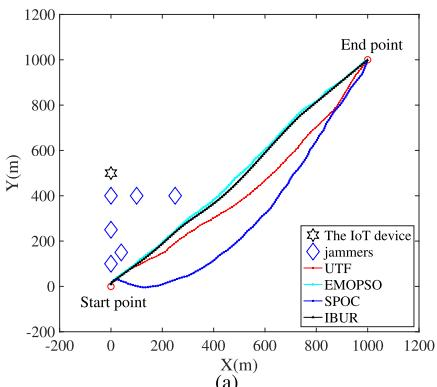  
(a)

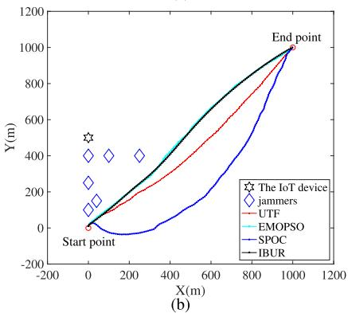  
Fig. 3. Trajectory performance in data collection under interruption. (a) Stationary Jammers. (b) Mobile Jammers.

selection strategy to calculate the flight trajectory, allowing for improved optimization performance in multiobjective problems. This benchmark considers two conflicting objectives: $J _ { \mathrm { n c } } [ n ]$ and $J _ { \mathrm { s c } } [ n ]$

1) Trajectory Performance: Fig. 3 illustrates the trajectory performance of diferent strategies in Case 1 and Case 2. It can be clearly seen that the our framework’s trajectory tend to be more irregular in the short term and approach the end point in the long period. In comparison, the SPOC strategy results in even higher irregularity, which leads to a significantly longer path. On the other hand, both EMOPSO and IBUR produce trajectories with less irregularity, indicating a reduction in unpredictability compared to the proposed framework.

The changes in the state variable [n] and the control input variable [n] at each step are shown in Fig. 4 and Fig. 5. It can be observed that both [n] and [n] always fluctuate around a convergent constant value due to the presence of random distribution. Furthermore, it is evident that the proposed framework achieves greater irregularity in both the state and input variables at each time slot compared to other strategies. This demonstrates the superior performance of the proposed framework in introducing unpredictability while maintaining stability under random distribution.

2) Unpredictability Performance: To demonstrate the unpredictability of the proposed framework, we use a Kalman filter for one-step predictions. The prediction errors are presented in Fig. 6. It is clear that our framework consistently increases the prediction errors compared to other strategies throughout the data collection process. To further quantify this unpredictability, we analyze three metrics: the maximum (max) prediction error, the average (avg) prediction error, and the standard deviation (std) of the prediction errors across the entire data collection period. A performance comparison between the proposed framework and three other strategies is summarized in Table II. It can be observed that the proposed framework achieves better performance in terms of both avg prediction errors and std prediction errors compared to the other strategies. Additionally, while the max prediction error of the proposed framework is greater than that of EMOPSO and IBUR, it is only slightly inferior to SPOC. Despite this minor drawback, the overall performance of the proposed framework remains outstanding, efectively enhancing the unpredictability.

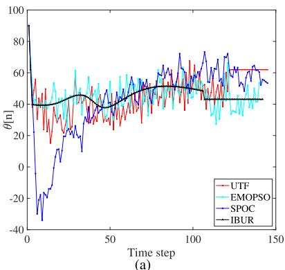

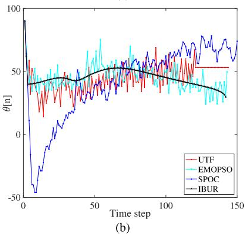

Fig. 4. Change of state [n] at each step. (a) Stationary Jammers. (b) Mobile Jammers.  
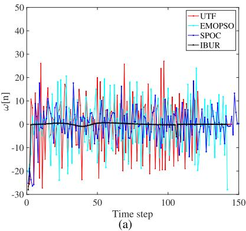

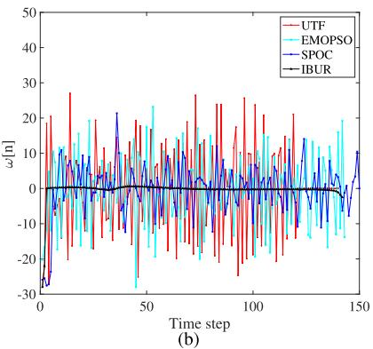  
Fig. 5. Change of input [n] at each step. (a) Stationary Jammers. (b) Mobile Jammers.

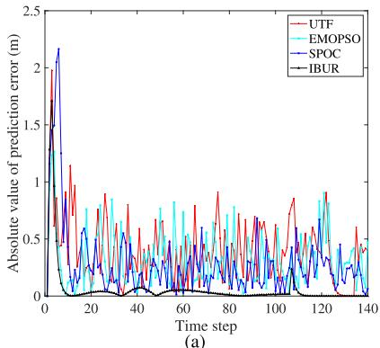

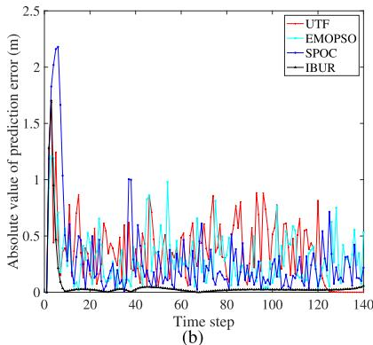  
Fig. 6. Prediction error comparison between diferent strategies under Kalman filter. (a) Stationary Jammers. (b) Mobile Jammers.

TABLE II  
COMPARISON OF PREDICTION ERRORS
<table><tr><td rowspan="2">strategy</td><td colspan="3">Jammers are stationary</td><td colspan="3">Jammers are mobile</td></tr><tr><td>max</td><td>avg</td><td>std</td><td>max</td><td>avg</td><td>std</td></tr><tr><td>UTF</td><td>1.98</td><td>0.40</td><td>0.29</td><td>1.69</td><td>0.37</td><td>0.30</td></tr><tr><td>EMOPSO</td><td>1.26</td><td>0.32</td><td>0.25</td><td>1.21</td><td>0.31</td><td>0.23</td></tr><tr><td>SPOC</td><td>2.16</td><td>0.28</td><td>0.28</td><td>2.18</td><td>0.29</td><td>0.29</td></tr><tr><td>IBUR</td><td>1.71</td><td>0.06</td><td>0.20</td><td>1.70</td><td>0.05</td><td>0.20</td></tr></table>

3) Data Collection Performance: The amount of remaining data at each step is illustrated in Fig. 7. It can be observed that the proposed framework demonstrates a higher data collection eficiency. This indicates that the framework is not only efective in enhancing unpredictability but also maintains superior performance in terms of data collection.

## B. Evaluation on Parameters

In the stochastic optimization problem, the variance $\sigma _ { \mathrm { d } } ^ { 2 }$ is <sup>σ</sup>an important parameter for the stability of trajectory. The trajectory performance for the UAV is easily afected by this parameter. Consequently, choosing the appropriate value of $\sigma _ { \mathrm { d } } ^ { 2 }$ is the premise of data collection mission. The goal of this subsection is to find an appropriate $\sigma _ { \mathrm { d } } ^ { 2 }$ to increase unpredictable behavior while guiding the UAV for data collection. In these simulations, the proposed framework is used and the parameters in navigation trajectory are fixed, i.e. $n _ { d } = 5$ $\eta \ : = \ : 1$ and $K _ { \mathsf { p } } ~ = ~ 3$ . The initial yaw angle of UAV is 90<sup>o</sup>. The variable $\sigma _ { \mathrm { d } } ^ { 2 }$ is set as $\sigma _ { \mathrm { d } } ^ { 2 } = 3 , \sigma _ { \mathrm { d } } ^ { 2 } = 1 0$ and $\sigma _ { \mathrm { d } } ^ { 2 } = 2 0$ respectively. The trajectories under diferent $\sigma _ { \mathrm { d } } ^ { 2 }$ are shown in Fig. 8 when the jammers are stationary. Overall, the UTF achieves the better results. As the values of $\sigma _ { \mathrm { d } } ^ { 2 }$ increases, the propose framework generate more complicated trajectories with stochastic behavior. Trajectories become irregular after increase the value of $\sigma _ { \mathrm { d } } ^ { 2 } .$ . As the values of $\sigma _ { \mathrm { d } } ^ { 2 }$ increase, the advantages of unpredictability become increasingly obvious, but also brings the disadvantage of not being able to achieve a better navigation. Generally speaking, the irregularity of the UAV’s flight trajectories significantly hinders malicious jammers from accurately predicting subsequent movements and efectively inducing interference based on past trajectory observation.

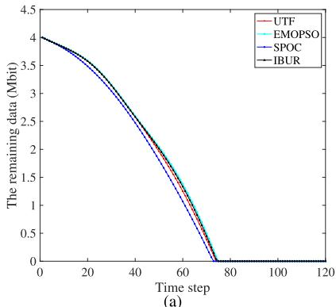

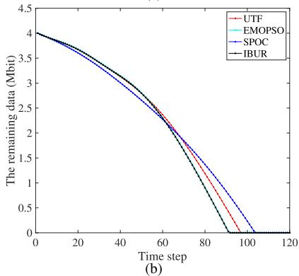

Fig. 7. The remaining data to be collected at each step. (a) Stationary Jammers. (b) Mobile Jammers.  
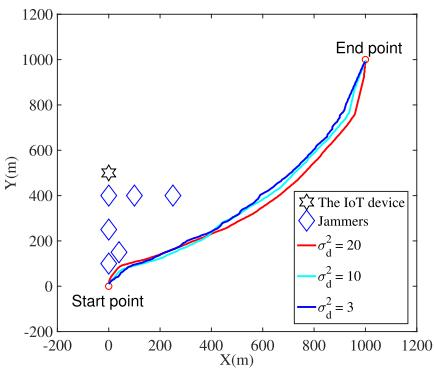  
Fig. 8. UAV trajectories with diferent $\sigma _ { \mathrm { d } } ^ { 2 }$ when jammers are stationary.

TABLE III  
THE EXECUTION TIME OF THE PROPOSED MPC-BASED METHOD WITH DIFFERENT VALUE OF PARAMETERS (MS)
<table><tr><td></td><td> $K _ { \mathrm { p } } = 2$ </td><td> $K _ { \mathrm { p } } = 3$ </td><td> $K _ { \mathrm { p } } = 4$ </td><td> $K _ { \mathrm { p } } = 5$ </td><td> $K _ { \mathrm { p } } = 6$ </td></tr><tr><td> $n _ { d } = 3$ </td><td> $\overline { { 4 . 1 2 } }$ </td><td> $\overline { { 5 . 5 4 } }$ </td><td> $\overline { { 8 . 1 9 } }$ </td><td> $\overline { { 1 6 . 4 3 } }$ </td><td> $\overline { { 4 9 . 2 1 } }$ </td></tr><tr><td> ${ n _ { d } } = 5$ </td><td>4.51</td><td>8.52</td><td>28.76</td><td>163.03</td><td>924.20</td></tr><tr><td> $n _ { d } = 7$ </td><td>4.84</td><td>15.76</td><td>104.23</td><td>829.90</td><td>6939.81</td></tr><tr><td> $n _ { d } = 9$ </td><td>5.77</td><td>30.10</td><td>266.01</td><td>2951.68</td><td>33032.99</td></tr></table>

To demonstrate the suitability of the proposed MPC-based method, diferent value of $n _ { d }$ and $K _ { \mathrm { p } }$ are considered. In this scenario, the gradient descent algorithm converges rapidly, making the computational complexity primarily determined by the MPC-based optimization process. Consequently, the overall time complexity can be approximated as $\bar { O } ( n _ { d } ^ { K _ { \mathfrak { p } } } )$ . Table III illustrates the measured execution time with diferent $n _ { d }$ and $K _ { \mathfrak { p } } .$ . It can be seen that as the values of $n _ { d }$ and $K _ { \mathrm { p } }$ increase, the time cost of the method also increases. While higher values for $n _ { d }$ and $K _ { \mathrm { p } }$ mean better algorithmic performance, the selection of these parameters must take into account the constraints imposed by hardware configurations. Furthermore, the majority of the execution times are less than the 1- second control time step. This indicates that the proposed method satisfies the real-time computational requirements in the considered application.

## VI. CONCLUSION

In this paper, we investigate the scenario of UAV-assisted anti-jamming data collection, where the UAV is employed to gather data in the presence of potential malicious jammers. To enhance information security, we proposed UTF based on stochastic control method. However, this approach introduces the challenge of optimizing both navigation input and stochastic input. To address this challenge, an MPC-based method is employed to compute the navigation input, ensuring mission completion. A modified gradient descent algorithm is introduced to optimize the stochastic input, thereby enhancing trajectory unpredictability. The integration of these two components enables the UTF to achieve a balanced tradeof between control performance and trajectory randomness. Experimental results demonstrate that the proposed framework outperforms benchmark methods in terms of performance under adversarial conditions. Comprehensive parameter analysis further validates the adaptability of the UTF.

For future work, eforts could focus on extending the framework to multiple UAVs and achieving a balance between enhancing unpredictability and maintaining team formation in adversarial environments.

## REFERENCES

[1] X. Li, J. Tan, A. Liu, P. Vijayakumar, N. Kumar, and M. Alazab, “A novel UAV-enabled data collection scheme for intelligent transportation system through UAV speed control,” IEEE Trans. Intell. Transp. Syst., vol. 22, no. 4, pp. 2100–2110, Apr. 2021.

[2] S. Han, K. Zhu, M. Zhou, and X. Liu, “Joint deployment optimization and flight trajectory planning for UAV assisted IoT data collection: A bilevel optimization approach,” IEEE Trans. Intell. Transp. Syst., vol. 23, no. 11, pp. 21492–21504, Nov. 2022.

[3] N. Dilshad, J. Hwang, J. Song, and N. Sung, “Applications and challenges in video surveillance via drone: A brief survey,” in Proc. Int. Conf. Inf. Commun. Technol. Converg. (ICTC), Oct. 2020, pp. 728–732.

[4] J. Liu, Y. Shi, Z. M. Fadlullah, and N. Kato, “Space-air-ground integrated network: A survey,” IEEE Commun. Surveys Tuts., vol. 20, no. 4, pp. 2714–2741, 4th Quart., 2018.

[5] M. Vaezi et al., “Cellular, wide-area, and non-terrestrial IoT: A survey on 5G advances and the road toward 6G,” IEEE Commun. Surveys Tuts., vol. 24, no. 2, pp. 1117–1174, 2nd Quart., 2022.

[6] X. Lu, L. Xiao, C. Dai, and H. Dai, “UAV-aided cellular communications with deep reinforcement learning against jamming,” IEEE Wireless Commun., vol. 27, no. 4, pp. 48–53, Aug. 2020.

[7] L. Guo, H. Pan, X. Duan, and J. He, “Balancing eficiency and unpredictability in multi-robot patrolling: A MARL-based approach,” in Proc. IEEE Int. Conf. Robot. Autom. (ICRA), May 2023, pp. 3504–3509.

[8] C. Qu, J. He, J. Li, X. Duan, and Y. Mo, “Optimal control for mobile agents considering state unpredictability,” IEEE Trans. Autom. Control, vol. 69, no. 6, pp. 1–8, Jun. 2024.

[9] Y. Liu, Q. Deng, Z. Zeng, A. Liu, and Z. Li, “A hybrid optimization framework for age of information minimization in UAV-assisted MCS,” IEEE Trans. Services Comput., vol. 18, no. 2, pp. 527–542, Mar. 2025.

[10] R. Han, Y. Wen, L. Bai, J. Liu, and J. Choi, “Age of information aware UAV deployment for intelligent transportation systems,” IEEE Trans. Intell. Transp. Syst., vol. 23, no. 3, pp. 2705–2715, Mar. 2022.

[11] R. Duan, J. Wang, C. Jiang, Y. Ren, and L. Hanzo, “The transmit-energy vs computation-delay trade-of in gateway-selection for heterogenous cloud aided multi-UAV systems,” IEEE Trans. Commun., vol. 67, no. 4, pp. 3026–3039, Apr. 2019.

[12] M. Chen, A. Liu, N. N. Xiong, H. Song, and V. C. M. Leung, “SGPL: An intelligent game-based secure collaborative communication scheme for metaverse over 5G and beyond networks,” IEEE J. Sel. Areas Commun., vol. 42, no. 3, pp. 767–782, Mar. 2024.

[13] H. Pirayesh and H. Zeng, “Jamming attacks and anti-jamming strategies in wireless networks: A comprehensive survey,” IEEE Commun. Surveys Tuts., vol. 24, no. 2, pp. 767–809, 2nd Quart., 2022.

[14] B. Duo, Q. Wu, X. Yuan, and R. Zhang, “Anti-jamming 3D trajectory design for UAV-enabled wireless sensor networks under probabilistic LoS channel,” IEEE Trans. Veh. Technol., vol. 69, no. 12, pp. 16288–16293, Dec. 2020.

[15] R. Chai, Y. Gao, R. Sun, L. Zhao, and Q. Chen, “Time-oriented joint clustering and UAV trajectory planning in UAV-assisted WSNs: Leveraging parallel transmission and variable velocity scheme,” IEEE Trans. Intell. Transp. Syst., vol. 24, no. 11, pp. 12092–12106, Nov. 2023.

[16] Y. Wu, W. Yang, X. Guan, and Q. Wu, “Energy-eficient trajectory design for UAV-enabled communication under malicious jamming,” IEEE Wireless Commun. Lett., vol. 10, no. 2, pp. 206–210, Feb. 2021.

[17] X. Wang and M. C. Gursoy, “Resilient UAV path planning for data collection under adversarial attacks,” in Proc. IEEE Int. Conf. Commun., May 2022, pp. 625–630.

[18] L. Huang and Q. Zhu, “A dynamic game framework for rational and persistent robot deception with an application to deceptive pursuitevasion,” IEEE Trans. Autom. Sci. Eng., vol. 19, no. 4, pp. 2918–2932, Oct. 2022.

[19] X. Wang and M. C. Gursoy, “Resilient path planning for UAVs in data collection under adversarial attacks,” IEEE Trans. Inf. Forensics Security, vol. 18, pp. 2766–2779, 2023.

[20] C. Zhang et al., “UAV swarm-enabled collaborative secure relay communications with time-domain colluding eavesdropper,” IEEE Trans. Mobile Comput., vol. 23, no. 9, pp. 8601–8619, Sep. 2024.

[21] H. Wang, G. Ding, J. Chen, Y. Zou, and F. Gao, “UAV anti-jamming communications with power and mobility control,” IEEE Trans. Wireless Commun., vol. 22, no. 7, pp. 4729–4744, Jul. 2023.

[22] J. Li, J. He, Y. Li, and X. Guan, “Unpredictable trajectory design for mobile agents,” in Proc. Amer. Control Conf. (ACC), Jul. 2020, pp. 1471–1476.

[23] C. Qu, J. He, and J. Li, “Multi-period optimal control for mobile agents considering state unpredictability,” in Proc. IEEE 96th Veh. Technol. Conf. (VTC-Fall), Sep. 2022, pp. 1–5.

[24] N. Gao, Z. Qin, X. Jing, Q. Ni, and S. Jin, “Anti-intelligent UAV jamming strategy via deep Q-networks,” IEEE Trans. Commun., vol. 68, no. 1, pp. 569–581, Jan. 2020.

[25] Y. Zhang, J. Lyu, and L. Fu, “Energy-eficient trajectory design for UAVaided maritime data collection in wind,” IEEE Trans. Wireless Commun., vol. 21, no. 12, pp. 10871–10886, Dec. 2022.

[26] X. Chen, N. Zhao, Z. Chang, T. Ham¨ al¨ ainen, and X. Wang, “UAV-¨ aided secure short-packet data collection and transmission,” IEEE Trans. Commun., vol. 71, no. 4, pp. 2475–2486, Apr. 2023.

[27] C. Zhan and Y. Zeng, “Aerial–ground cost tradeof for multi-UAVenabled data collection in wireless sensor networks,” IEEE Trans. Commun., vol. 68, no. 3, pp. 1937–1950, Mar. 2020.

[28] M. M. Azari, F. Rosas, K.-C. Chen, and S. Pollin, “Ultra reliable UAV communication using altitude and cooperation diversity,” IEEE Trans. Commun., vol. 66, no. 1, pp. 330–344, Jan. 2018.

[29] Y. Zeng and R. Zhang, “Energy-eficient UAV communication with trajectory optimization,” IEEE Trans. Wireless Commun., vol. 16, no. 6, pp. 3747–3760, Jun. 2017.

[30] H. Huang, A. V. Savkin, and W. Ni, “Decentralized navigation of a UAV team for collaborative covert eavesdropping on a group of mobile ground nodes,” IEEE Trans. Autom. Sci. Eng., vol. 19, no. 4, pp. 3932–3941, Oct. 2022.

[31] S. P. Boyd and L. Vandenberghe, Convex Optimization. Cambridge, U.K.: Cambridge Univ. Press, 2004.

[32] Q. Fu, R. Jia, F. Lyu, F. Lin, Z. Zheng, and M. Li, “Collection point matters in time–energy tradeof for UAV-enabled data collection of IoT devices,” IEEE Internet Things J., vol. 11, no. 19, pp. 31492–31506, Oct. 2024.

  
Tiedan Hua received the M.S. degree in control theory and control engineering from the Huazhong University of Science and Technology, Wuhan, China, in 2017. He is currently pursuing the Ph.D. degree in control science and engineering with Wuhan University of Science and Technology, Wuhan. He is with the School of Artificial Intelligence and Automation, Wuhan University of Science and Technology. His research interests include UAV communications and path planning of mobile robotic systems.


Yang Chen (Member, IEEE) received the Ph.D. degree from the State Key Laboratory of Robotics, Shenyang Institute of Automation, Chinese Academy of Sciences. He is currently a Professor with the School of Artificial Intelligence and Automation, Wuhan University of Science and Technology. His research focuses on the modeling, planning, and control of mobile robots. His main research interests include multirobot collaborative path planning for applications, such as persistent monitoring, emergency rescue, agricultural spraying,

and building inspection.


Xi Chen (Member, IEEE) received the B.S. degree in automation from the Huazhong University of Science and Technology, Wuhan, China, in 2009, the M.S. degree in information science and technology from Xiamen University, Xiamen, China, in 2012, and the Ph.D. degree in electrical engineering from The University of Newcastle, Callaghan, NSW, Australia, in 2015. He is currently a Professor with Wuhan University of Science and Technology, Wuhan. His research interests include visual sensors networks and multiagent systems.


Zhen-Hua Zhu received the B.S. degree in measurement and control technology and instrumentation from Wuhan Institute of Technology, Wuhan, China, in 2014, and the M.S. degree in water conservancy engineering and the Ph.D. degree in control science and engineering from the Huazhong University of Science and Technology, Wuhan, in 2016 and 2021, respectively. Since July 2021, he has been with the School of Artificial Intelligence and Automation, Wuhan University of Science and Technology. His research interests include networked control sys-

tems, signed networks, and singular systems.