# User-Centric Beam-Delay Alignment Transmission for Low-Altitude Coverage via Wideband Cell-Free Massive MIMO

Ziyao Hong , Graduate Student Member, IEEE, Ting Li , Shu Xu , Member, IEEE, Chunguo Li , Senior Member, IEEE, Dongming Wang , Member, IEEE, and Xiaohu You , Fellow, IEEE

Abstract—Cell-free is seen as one of the most important technology for the future wireless communications. In this paper, we adopt a wideband cell-free to implement low-altitude coverage to serve multiple uncrewed aerial vehicles (UAVs) in the city playing the core role of low-altitude economy. For practice, distributed computation, asynchronous effects, beam split and imperfect channel state information are considered. We mainly rely on perbeam synchronization (PBS) and discuss different architecture implementations. A wideband asynchronous architecture that reuses the time delay modules exploited in wideband beam split calibration is proposed. In addition, a semi-synchronized path set (SSP-Set) is derived to eliminate asynchronous interference and a geometric scattering graphic convolutional network is used to acquire the (sub)-optimal SSP-Set. Based on these two technologies, a beam-delay alignment transmission (BDAT) scheme is obtained and we implement it with a distributed paradigm. The numerical results demonstrate the proposed BDAT can benefit from the cooperative downlink beamforming and provide a uniformly good service for UAVs.

Index Terms—User-centric cell-free, asynchronous downlink, wideband beamforming, time delay.

## I. INTRODUCTION

OW-ALTITUDE economy attracts attentions from crucial component of smart cities and transportation [1], [2]. To support the implementation of low-altitude economy, the deployment of a low-altitude-covered wireless communication network is the pivot to provide a wireless communication service with high performance. The existing aircraft mainly rely on simple point-to-point communication over the unlicensed band without unified control, which brings chaos and leads to poor performance [2], [3], [4]. There are few works specifically focusing on low-altitude coverage and our previous work [5] explores this issue in a cell-free massive multiple-input and multiple-output (CF-mMIMO) [6], [7], [8], [9] where the spec tral efficiency (SE) is analyzed for uncrewed aerial vehicles (UAVs) and common user equipments (UEs). However, [5] does not provide a good cooperative precoding method and the naive completely distributed local precoding methods are used for analysis convenience. We investigate the recent works about cell-free for UAV communications. Reference [10] con siders UAVs powered by wireless power transfer (WPT) in a cell-free massive MIMO network. Closed-form expressions for harvested energy and spectral efficiency are derived, and several UAV trajectory designs are proposed to enhance overal communication efficiency. Reference [11] addresses pilot contamination for UAV users in cell-free massive MIMO systems. A structured CP tensor decomposition method is proposed, where received signals are modeled as second-order tensors, allowing channel estimation using linear algebra without iter ative methods. Reference [12] investigates power control for UAV communications under ultra-reliable low-latency communication (URLLC) constraints with short blocklengths. Two optimization schemes are proposed to approximate the nonconvex URLLC rate function, improving system performance via iterative convex approximation. Using stochastic geometry, [13] analyzes the performance of aerial users in cell-free mMIMO systems. SINR and rate coverage expressions are derived, demonstrating the advantages of the cell-free architec ture over traditional small cell systems, especially under low SINR thresholds. Focusing on UAVs operating at low altitude in cell-free, [14] proposes a hybrid initial access and AP handover strategy to manage high mobility. A multi-objective optimization balances uplink performance with handover fre quency, effectively reducing signaling overhead in dynamic UAV scenarios. It is worth noticing that all of these works do not consider the asynchronous downlink, which is an important problem for low-altitude coverage and our paper bridges this gap properly.

Current technologies including low earth orbit (LEO) satellite [15], high altitude platform station (HAPS) [16] and

5G massive MIMO are not ideal candidates for low-altitude coverage because of the unaffordable delay in the first two technologies and the inter-cell interference in the last one. Cell-free, as the ultimate evolution of distributed antenna system (DAS) or cooperative multiple points (CoMP), can provide seamless uniformly good service and is appreciated for low-altitude coverage [17]. Unfortunately, the existing works [18], [19], [20], [21], [22] mostly assume that the system is synchronized perfectly and the propagation delay is totally ignored in the channel model, which is not practical. Reference [23] analyzes the asynchronous downlink effects in a distributed MIMO with orthogonal frequency division multiplexing (OFDM) and inter-carrier interference (ICI) and inter-symbol interference (ISI) are caused by asynchronicity when the tail of the received signal exceeds the duration of cyclic prefix (CP). There are some previous works discussed asynchronous cell-free [24], [25], [26], [27], [28]. Our early work [24] proposes an asynchronous uplink channel estimation, in which the minimal mean square error (MMSE) channel estimation considering the phase shift brought by the geographical distance difference is derived and the downlink signal-to-interference-and-noise (SINR) expressions using conventional maximal ratio and zero-forcing precoding are derived. Reference [25] analyzed the asynchronous effects and oscillator phase error in downlink and the journal version [26] further introduced rate-splitting to provide a strategy to combat the asynchronous impact. For multi-carrier setups, [27] and [28] considered the inter-carrier and inter-symbol effects. Reference [27] adopted filter-bank multi-carrier (FBMC) instead of conventional OFDM and concludes that FBMC has a better asynchronicity-robustness compared to OFDM. Reference [28] derived asynchronous uplink for CF-mMIMO-OFDM carefully including asynchronous channel estimation and asynchronous user uplink transmission. What is more, we aim to obtain a distributed precoding to combat the asynchronous impact, which is not considered for any previous works.

Besides sub-6GHz, [29] and [30] consider millimeter wavebased cell-free asynchronous reception where Winner filter and Bayes learning are proposed to mitigate asynchronous interference for unicast and multicast scenes. However, these works cannot support a cooperative beamforming and benefit from asynchronous precoding. Per-beam synchronization (PBS) is proposed in [31] and [32], which derive the independence of the mmWave channel in time and frequency domain and the potential of synchronization for each beam. Unfortunately, PBS provides a methodology instead of detailed implementations and the suppression of asynchronous interference is not discussed.

In addition, the classic hybrid precoding is based on the narrowband assumption and is difficult to directly applied to wideband communications because classical analog precoding is typically implemented using a phase shifter array, where phase shifters can only achieve frequency-independent phase shifts [33]. This leads to severe beam splitting, where the beams generated by phase shifters propagate in different directions at different frequency points, deviating from the intended user direction and causing significant array gain loss. Reference [34] designs a semi-definitive programming algorithm to minimize the splitting while the performance is limited. References [35] and [36] propose the idea that the phase shifters can be replaced by time delay modules which is optimal with high costs. A good tradeoff can be obtained in [37], where the authors use a small size time delay network between radio frequency (RF) chains and phase shifters.

## A. Motivation

A low-altitude covered cell-free serving UAVs is crucial for the development of low-altitude economy and we adopt wideband CF-mMIMO in this paper. However, the current theory and practice cannot provide a wireless communication scheme with uniformly good service due to the following constraints:

1) it is necessary to consider asynchronous effects in a mmWave CF-mMIMO deployed especially with 5G new radio (NR) short CP standards [38] devised for lowlatent communications;

2) existing works prefer to erase asynchronous effects rather than benefit from the joint asynchronous beamforming;

3) the current PBS does not provide a detailed hardware implementation architecture;

4) a asynchronous beamforming method with imperfect or statistic channel state information (CSI) and several hardware constraints as a realistic consideration;

5) distributed processing instead of conventional centralized processing should be carefully considered in a CF-mMIMO;

6) and mmWave can provide rich spectral resources while beam split is the bottleneck of the performance enhancement.

Therefore, we aim at a low-cost wideband CF-mMIMO which implements cooperative beamforming with realistic considerations including distributed computation, asynchronous effects, beam split and imperfect CSI.

## B. Contributions

To the best of our knowledge, this is the first work considering asynchronous reception in mmWave CF-mMIMO, providing an effective architecture and proposing a corresponding algorithm with realistic constraints. The conference paper [39] takes a trial about beam delay alignment, which is naive and different from this paper: Firstly, the conference version does not consider the hybrid implementation, which is necessary in mmWave massive MIMO; Secondly, the perfect CSI is assumed in the conference paper, and we assume the statistic CSI in this journal paper; Thirdly, wideband asynchronous downlink is considered in this paper; Finally, we have put a lot of effort in the derivation of the proposed set of techniques, which is brought by the consideration of the hardware implementation including digital/analog precoders and digital/analog delay modules. The main contributions are enumerated as follows:

• Inspired by PBS, we investigate the implementation of PBS in a widely-covered cell-free to serve as a low-altitude-covered network. A user-centric beam-delay alignment transmission (BDAT) is proposed which conducts different delay for beams, in which asynchronous interference signals can be erased completely and an asynchronous cooperative downlink is obtained.

Considering practice, it is assumed that only statistics including large scale fading factors, delay factors and angle of departure (AoD) can be obtained by access points (APs). We also append the strict per AP power constraint and hardware resources (including RF chain, delay module and data stream numbers) constraint.

Both digital delay module and analog digital module are discussed and we find that BDAT prefers analog delay and analog beamforming implementation, which can erase all asynchronous interference and exploit multi-path gain. What is more important, a wideband asynchronous architecture is proposed which reuses the delay-network widely adopted for combating beam split. Based on a given association strategy, the optimal asynchronous cooperative beamforming method is derived analytically.

• A semi-synchronized path set (SSP-Set) strategy is proposed to select serving user paths to avoid asynchronous interference after proper delay, which views user paths as a graph and an SSP-Set is a ‘clique’ in graph theory. Then, a geometric scattering graph convolutional network (GCN) is adopted to acquire a (sub)-optimal SSP-Set. This GCN can be seen as a node feature refiner which uses the delay compensation as input and outputs the maximal clique probability. Compared with conventional maximal clique detection methods such as typical Bron-Kerbosch, the adopted GCN can give a set of maximal cliques containing the most nodes with stable complexity.

## C. Paper Organization

This paper is organized as follows: Section II introduces the considered scenario, channel model and the asynchronous downlink; Section III is dedicated to the discussion of the implementation including digital delay modules, analog delay modules and hybrid precoding architectures; Section IV further proposes a wideband asynchronous architecture and a GCN based SSP-Set acquisition method to benefit from wide area cooperative downlink without asynchronous interference; Section V demonstrates the effectiveness of the proposed architecture and BDAT method; Finally, Section VI summarizes the paper.

Notation: We use the following notations throughout this paper. Boldface lower case like x means a vector, calligraphy upper case X is a set and boldface upper case is a matrix as X. Superscript $( \cdot ) ^ { \mathrm { T } } , ( \cdot ) ^ { \dagger }$ , and $( \cdot ) ^ { - 1 }$ are used to note transpose, conjugate transpose and inverse of a matrix, respectively. Subscript $( \cdot ) _ { [ i ] } \mathrm { ~ o r ~ } ( \cdot ) _ { [ i : j ] }$ means the indexed element or slice for a vector or a matrix. \* is used to notate the convolution between two time region function. Finally, π denotes permutation if stated specifically and otherwise the corresponding mathematical constant.

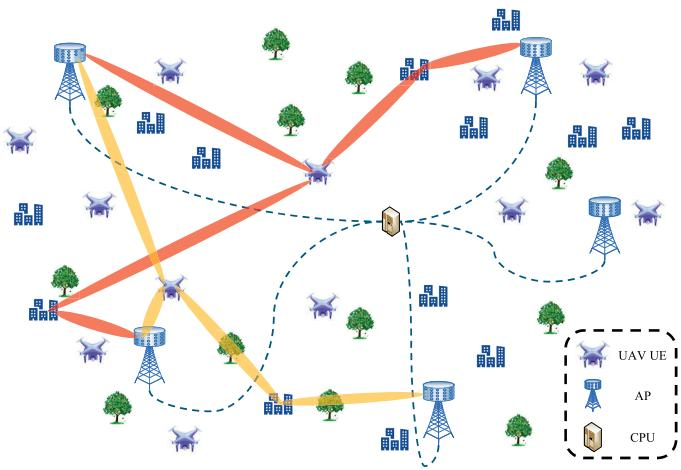  
Fig. 1. Low-altitude-covered mmWave CF-mMIMO.

## II. SYSTEM MODEL

In this paper, we consider a low-altitude covered CFmMIMO in the city and UAVs in our system are UES instead of base stations or relays. The scenario and channel model are given as well as the common architectures utilized in mmWave mMIMO.

## A. Physical Model

The considered low-altitude coverage CF-mMIMO is demonstrated in Fig. 1, which serves K UAVs as UEs. There are L mmWave APs with each one equipped with N antennas. We assume uniform linear array (ULA) with an antenna interval $\begin{array} { r } { d = \frac { \lambda _ { \mathrm { c } } } { 2 } } \end{array}$ where $\lambda _ { \mathrm { c } }$ is the central carrier wavelength. The ULA response is widely known as

$$
\mathbf { a } = { \frac { 1 } { \sqrt { N } } } \left[ 1 , \cdots \cdot , e ^ { j \pi n \sin \phi } , \cdots \cdot , e ^ { j \pi ( N - 1 ) \sin \phi } \right] ^ { \mathrm { T } } \in \mathbb { C } ^ { N \times 1 } ,\tag{1}
$$

where φ is the AoD. To simplify the problem, single antenna is equipped in each UAV and the total number of UAVs is K.

## B. Channel Model

Considering the deployed environment, Salen-Valenzula is adopted in this paper, in which channel gain from the l-th AP to the k-th UE can be expressed as

$$
{ \bf h } _ { l k } [ t ] = \sum _ { p = 1 } ^ { P } { \bf h } _ { l k p } \delta [ t - \tau _ { l k p } ] ,\tag{2}
$$

where we consider up to $P$ multi-paths with $p = 1$ indicating line of sight (LoS) and $p > 1$ for non-LOS (NLoS).<sup>1</sup> NLoS paths are considered here because UAVs serving for lowaltitude economy often hover or fly in the city where there are complicated scatters as shown in Fig. 1. $\tau _ { l k p }$ is the total delay composed of multi-path delay and propagation delay $d _ { l k } / c _ { \mathrm { i } }$ , where $d _ { l k }$ is the distance between l-th AP and k-th UE and c is the speed of the light. Each multi-path channel $\mathbf { h } _ { l k p }$ is as

$$
\begin{array} { r } { \mathbf { h } _ { l k p } = h _ { l k p } ^ { \ast } \mathbf { a } _ { l k p } , } \end{array}\tag{3}
$$

<sup>1</sup>The corresponding multi-path channel can be zero if nonexistent.

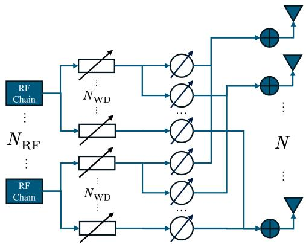  
Fig. 2. The adopted time delay network for wideband beam split.

where $\mathbf { a } _ { l k p }$ is the array response in l-th AP for k-th UE in p-th path and $h _ { l k p }$ is the complex channel gain whose variance is $\beta _ { l k p }$ . We use the conjugate here for convenience in the following sections. In this paper, we assume APs can only acquire statistic CSI such AoD $\phi _ { l k p }$ and delay $\tau _ { l k p }$ to conduct beamforming considering the mobility of UAVs.

## C. Phase Shifter and Time Delay

Because a large ULA is adapted to provide a high gain in APs, conventional transceiver architecture in sub-6G cannot be utilized for mmWave APs. Considering the sparsity of the mmWave channel, it is not economical to equip an RF chain for every antenna, i.e., $N _ { R F } < N$ , where $N _ { R F }$ is the number of RF chains. Phase shifters are often used to modify the signal phase in analog region which serve as the so-called ‘analog precoder

$$
\tilde { \mathbf { F } } = \frac { 1 } { \sqrt { N } } \left[ \begin{array} { c c c c } { e ^ { j \theta _ { 1 1 } } } & { e ^ { j \theta _ { 1 2 } } } & { \ddots } & { e ^ { j \theta _ { 1 N _ { \mathrm { R F } } } } } \\ { e ^ { j \theta _ { 2 1 } } } & { e ^ { j \theta _ { 2 2 } } } & { \ddots } & { e ^ { j \theta _ { 2 N _ { \mathrm { R F } } } } } \\ { \vdots } & { \vdots } & { \vdots } & { \vdots } \\ { e ^ { j \theta _ { N 1 } } } & { e ^ { j \theta _ { N 2 } } } & { \ddots } & { e ^ { j \theta _ { N N _ { \mathrm { R F } } } } } \end{array} \right] \in \mathbb { C } ^ { N \times N _ { \mathrm { R F } } } ,\tag{4}
$$

where $\theta _ { n r }$ is the shifted phase in n-th antenna from r-th RF chain. Then shifted signals from all $N _ { \mathrm { R F } }$ RF chains are summarized antenna by antenna to transmit. This leads to the hybrid precoding architecture where a digital precoder W and the analog precoder precode the signals in digital region and analog region respectively as

$$
\begin{array} { r } { \tilde { \mathbf { F } } \mathbf { W } \mathbf { s } [ t ] , } \end{array}\tag{5}
$$

where $\mathbf { W } \in \mathbb { C } ^ { N _ { \mathrm { R F } } \times K }$ and $\mathbf s [ t ] \in \mathbb { C } ^ { K \times 1 }$ being the user signals. We adopt analog precoder to match the array response if the AP serve the UE via it in this paper. In addition, the cascaded precoder FW<sup>˜</sup> is notated as $\mathbf { F } \in \mathbb { C } ^ { N \times K }$

In narrowband or a single carrier, it is easy to match the channel response $\mathbf { a } _ { l k p }$ using phase shifts. However, the antenna array shifts between different carriers as

$$
\mathbf { a } = { \frac { 1 } { \sqrt { N } } } \left[ 1 , \cdots , e ^ { j \pi n { \frac { f _ { m } } { f _ { \mathrm { c } } } } \sin \phi } , \cdots , e ^ { j \pi ( N - 1 ) { \frac { f _ { m } } { f _ { \mathrm { c } } } } \sin \phi } \right] ^ { \mathrm { T } } ,\tag{6}
$$

which equals to (1) exactly when $f _ { m } \ = \ f _ { \mathrm { c } }$ . The shift $\frac { f _ { m } } { f _ { c } }$ cannot be ignored when the carrier frequency $f _ { m }$ is much different from the central carrier. Reference [37] adopts a time delay network, as shown in Fig. 2, to append a frequencyaware phase shift for the antenna response. Each $\mathrm { R F }$ chain is equipped with $N _ { \mathrm { W D } }$ time delay modules which separate the corresponding set of phase shifters into $N _ { \mathrm { W D } }$ groups and phase shifters undergo the same time delay leading to the same frequency-aware appended phase shift $e ^ { - j 2 \pi \bar { f _ { m } } \varDelta }$ where $\varDelta$ is the time delay. The proposed algorithm in [37] is effective and the array response can match the channel almost perfectly. In this paper, we investigate the architecture combing asynchronous beamforming and wideband beamforming based on the architecture in [37].

## D. Asynchronous Downlink

Different from many previous works assuming perfect synchronization, we consider asynchronous downlink in which the received signal in $k ^ { \prime } \mathrm { - t h }$ UE can be written as

$$
\begin{array} { l } { { \displaystyle y _ { k ^ { \prime } } [ t ] = \sum _ { l } \mathbf h _ { l k } ^ { \dagger } [ t ] * { \bf F } { \bf s } [ t ] } } \\ { { \displaystyle ~ = \sum _ { l } \left\{ \sum _ { p = 1 } { \bf h } _ { l k p } ^ { \dagger } \delta [ t - \tau _ { l k p } ] \right\} * \left\{ \sum _ { k , p } \alpha _ { l k p } \mathbf f _ { l k p } s _ { k } [ t ] \right\} } } \\ { { \displaystyle ~ = \sum _ { l , k , p , m } \alpha _ { l k m } { \bf h } _ { l k p } ^ { \dagger } \mathbf f _ { l k m } s _ { k } [ t - \tau _ { l k p } ] } , }  \end{array}\tag{}
$$

where $\alpha _ { l k p }$ is an indicator implying whether l-th AP serves k-th UE in p-th path or not. According to [23], asynchronous reception brings two kinds of interference. The first one is asynchronous phase-shifting which can be expressed by timefrequency domain conversion as described in the previous subsection, i.e., $s _ { k } [ t - \tau _ { l k p } ] ~ = ~ e ^ { j \tau _ { l k p } \omega _ { m } } s _ { k } [ t ]$ . The second one is the adaptive extra interference including ICI and ISI which exist when $\tau _ { l k p }$ exceeds the coverage of CP duration. Unfortunately, in the low-altitude coverage scenario, $\tau _ { l k p }$ is often larger than CP length because of the wide serving area.

## III. BDAT IMPLEMENTED ON HYBRID PRECODING

In this section, we introduce our BDAT methodology and discuss the implementations, including digital and analog delays. To avoid ICI and ISI, an SSP-Set is proposed to define a subset of UEs which eliminates asynchronous interference. Owing to delay module enabling asynchronous cooperative downlink and SSU-Set preventing asynchronous interference, BDAT can be implemented in mmWave CF-mMIMO.

## A. BDAT

The core methodology of BDAT is to justify the transmitting signals in the time domain directly symbol by symbol. We aim to coordinate each multi-path to realize a synchronized reception, and the process is illustrated in Fig. 3.

Based on the mechanism in Fig. 3, the received signal for UE k<sup>0</sup> can be rewritten as (37) in Appendix 1. To align $s _ { k ^ { \prime } } \left[ t - \varDelta _ { l k ^ { \prime } p } - \tau _ { l k ^ { \prime } p } \right]$ for different l and $p ,$ we have $\varDelta _ { l k p } =$ $\tau _ { k } ^ { \mathrm { m a x } } - \tau _ { l k p } ,$ where $\tau _ { k } ^ { \mathrm { m a x } } = \mathrm { m a x } _ { l , p } \tau _ { l k p }$ . Then (37) can be rewritten as

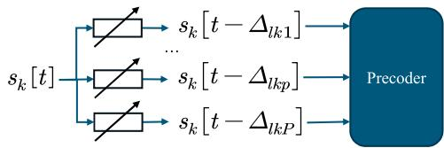  
Fig. 3. The symbol is conducted through different delay modules to match different multi-path delay in BDAT.

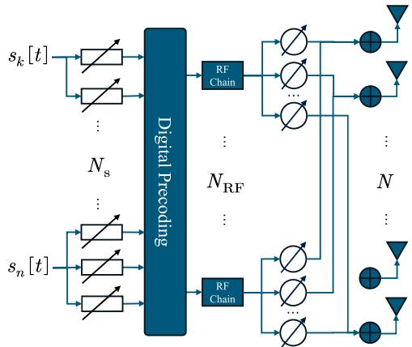  
Fig. 4. Digital delay based BDAT architecture.

$$
\begin{array} { l } { { \displaystyle = \left( \sum _ { l = 1 } ^ { L } \sum _ { p = 1 } ^ { P } \alpha _ { l k ^ { \prime } p } { \bf h } _ { l k ^ { \prime } p } ^ { \dagger } { \bf f } _ { l k ^ { \prime } p } \right) s _ { k ^ { \prime } } \left[ t - \tau _ { k ^ { \prime } } ^ { \mathrm { m a x } } \right] + n _ { k ^ { \prime } } \left[ t \right] } } \\ { { \displaystyle ~ + \sum _ { l = 1 } ^ { L } \sum _ { p = 1 } ^ { P } \sum _ { m \neq p } \alpha _ { l k ^ { \prime } m } { \bf h } _ { l k ^ { \prime } p } ^ { \dagger } { \bf f } _ { l k ^ { \prime } m } s _ { k ^ { \prime } } \left[ t - \tau _ { k ^ { \prime } } ^ { \mathrm { m a x } } + \nu _ { k ^ { \prime } k ^ { \prime } p m } ^ { l } \right] } } \\ { { \displaystyle ~ + \sum _ { l = 1 } ^ { L } \sum _ { k \neq k ^ { \prime } } \sum _ { p = 1 } ^ { P } \sum _ { m = 1 } ^ { P } \alpha _ { l k m } { \bf h } _ { l k ^ { \prime } p } ^ { \dagger } { \bf f } _ { l k m } s _ { k } \left[ t - \tau _ { k ^ { \prime } } ^ { \mathrm { m a x } } + \nu _ { k ^ { \prime } k p m } ^ { l } \right] } , } \end{array}\tag{8}
$$

where

$$
\nu _ { k ^ { \prime } k p m } ^ { l } = \tau _ { k ^ { \prime } } ^ { \operatorname* { m a x } } - \tau _ { l k ^ { \prime } p } - ( \tau _ { k } ^ { \operatorname* { m a x } } - \tau _ { l k m } ) .\tag{9}
$$

A simple method to eliminate signals not synchronized is to zero-force by precoders, which leads to

$$
y _ { k ^ { \prime } } \left[ t \right] = \left( \sum _ { l = 1 } ^ { L } \sum _ { p = 1 } ^ { P } \alpha _ { l k ^ { \prime } p } { \bf h } _ { l k ^ { \prime } p } ^ { \dagger } { \bf f } _ { l k ^ { \prime } p } \right) s _ { k ^ { \prime } } \left[ t - \tau _ { k ^ { \prime } } ^ { \mathrm { m a x } } \right] + n _ { k ^ { \prime } } \left[ t \right] ,\tag{10}
$$

and the optimal precoders satisfying this zero-forcing property can be obtained by the following optimization

$$
\operatorname* { m a x } _ { \{ \mathbf { f } _ { l k p } \} , \{ \alpha _ { l k p } \} } \operatorname* { m i n } _ { k } \frac { \left| \sum _ { l = 1 } ^ { L } \sum _ { p = 1 } ^ { P } \alpha _ { l k p } \mathbf { h } _ { l k p } ^ { \dagger } \mathbf { f } _ { l k p } \right| ^ { 2 } } { \sigma _ { k } ^ { 2 } }\tag{11}
$$

$$
\mathbf { s . t . } ~ \alpha _ { l k p } \mathbf { h } _ { l k m } ^ { \dagger } \mathbf { f } _ { l k p } = 0 , \forall l , k , p \neq m\tag{11-a}
$$

$$
\alpha _ { l k p } \mathbf { h } _ { l k ^ { \prime } m } ^ { \dagger } \mathbf { f } _ { l k p } = 0 , \forall l , k ^ { \prime } , k \neq k ^ { \prime } , p , m\tag{11-b}
$$

$$
\sum _ { k = 1 } ^ { K } \sum _ { p = 1 } ^ { P } \alpha _ { l k p } \left\| \mathbf { f } _ { l k p } \right\| ^ { 2 } \leqslant P _ { \mathrm { A P } } , \forall l\tag{11-c}
$$

$$
\sum _ { k = 1 } ^ { K } \sum _ { p = 1 } ^ { P } \alpha _ { l k p } \leqslant N _ { \mathrm { s } } , \forall l\tag{11-d}
$$

$$
\alpha _ { l k p } \in \left\{ 0 , 1 \right\} , \forall l , k , p\tag{11-e}
$$

where constraints (11-a) and (11-b) are defined to zero-force asynchronous signals, (11-c) is the AP-aware power constraint, and (11-d) is the AP-aware data-stream number constraint.

Unfortunately, (11) cannot be obtained in the practical systems because the perfect CSI is assumed and it does not consider any hardware implementations. We induce BDAT based on this optimization that $\mathbf { f } _ { l k p }$ and $\tau _ { l k p }$ are aligned simultaneously to implement asynchronous transmission. We consider max-min optimization to provide seamless good service for all UAV UEs. The next two subsections are dedicated to the digital delay and analog delay implementations for BDAT.

## B. Digital Delay Implementation

In this subsection, we attempt to adopt digital delay module to implement the time delay $\varDelta _ { l k p }$ as Fig. 4. (11) is equivalent to

$$
\operatorname* { m a x } _ { \{ \mathbf { f } _ { l k p } \} , \{ \alpha _ { l k p } \} } \operatorname* { m i n } _ { k } \frac { \left| \sum _ { l = 1 } ^ { L } \sum _ { p = 1 } ^ { P } \alpha _ { l k p } \mathbf { h } _ { l k p } ^ { \dagger } \mathbf { f } _ { l k p } \right| ^ { 2 } } { \sigma _ { k } ^ { 2 } }\tag{12}
$$

$$
\mathbf { s . t . } ~ \alpha _ { l k p } \mathbf { a } _ { l k m } ^ { \dagger } \mathbf { f } _ { l k p } = 0 , \forall l , k , p \neq m\tag{12-a}
$$

$$
\alpha _ { l k p } \mathbf { a } _ { l k ^ { \prime } m } ^ { \dagger } \mathbf { f } _ { l k p } = 0 , \forall l , k ^ { \prime } , k \neq k ^ { \prime } , p , m\tag{12-b}
$$

$$
( 1 1 \mathrm { - c } ) , ( 1 1 \mathrm { - d } ) , ( 1 1 \mathrm { - e } )
$$

where we convert $\mathbf { h } _ { l k m } ^ { \dagger } \mathbf { f } _ { l k p } = 0$ to $\mathbf { a } _ { l k m } ^ { \dagger } \mathbf { f } _ { l k p } = 0$ to avoid the acquisition of the instantaneous CSI. Equation (12) can be rewritten by hybrid precoding

$$
\operatorname* { m a x } _ { \left\{ \mathbf { F } _ { l } \right\} , \left\{ \mathbf { w } _ { l k p } \right\} , \left\{ \alpha _ { l k p } \right\} } \operatorname* { m i n } _ { k } \frac { \left| \sum _ { l = 1 } ^ { L } \sum _ { p = 1 } ^ { P } \alpha _ { l k p } h _ { l k p } \mathbf { a } _ { l k p } ^ { \dag } \mathbf { F } _ { l } \mathbf { w } _ { l k p } \right| ^ { 2 } } { \sigma _ { k } ^ { 2 } }\tag{13}
$$

$$
\begin{array} { r } { \mathrm { s . t . ~ } \alpha _ { l k p } \mathbf { a } _ { l k m } ^ { \dagger } \mathbf { F } _ { l } \mathbf { w } _ { l k p } = 0 , \forall l , k , p \neq m } \end{array}\tag{13-a}
$$

$$
\alpha _ { l k p } \mathbf { a } _ { l k ^ { \prime } m } ^ { \dagger } \mathbf { F } _ { l } \mathbf { w } _ { l k p } = 0 , \forall l , k ^ { \prime } , k \neq k ^ { \prime } , p , m\tag{13-b}
$$

$$
\sum _ { k = 1 } ^ { K } \sum _ { p = 1 } ^ { P } \alpha _ { l k p } \left\| \mathbf { w } _ { l k p } \right\| ^ { 2 } \leqslant P _ { \mathrm { A P } } , \forall l\tag{13-c}
$$

$$
( 1 1 - \mathrm { d } ) , ( 1 1 - \mathrm { e } ) ,
$$

where ${ \bf w } _ { l k p }$ is digital precoder. With given $\{ \alpha _ { l k p } \}$ and $\mathbf { { F } } _ { l }$ composed of the selected array response $\mathbf { a } _ { l k p }$ by $\alpha _ { l k p }$ , we define $\pmb { \xi } _ { l k p } = \mathbf { F } _ { l } ^ { \dagger } \mathbf { a } _ { l k p } \in \mathbb { C } ^ { N _ { \mathrm { R F } } \times 1 }$ to rewrite (13) as

$$
\operatorname* { m a x } _ { \left\{ \mathbf { w } _ { l k p } \right\} } \operatorname* { m i n } _ { k } \frac { \left| \sum _ { l = 1 } ^ { L } \sum _ { p = 1 } ^ { P } \alpha _ { l k p } h _ { l k p } \pmb { \xi } _ { l k p } ^ { \dag } \mathbf { w } _ { l k p } \right| ^ { 2 } } { \sigma _ { k } ^ { 2 } }\tag{14}
$$

$$
\mathbf { s . t . } \ \alpha _ { l k p } \pmb { \xi } _ { l k m } ^ { \dagger } \mathbf { w } _ { l k p } = 0 , \forall l , k , p \neq m\tag{14-a}
$$

$$
\alpha _ { l k p } \pmb { \xi } _ { l k ^ { \prime } m } ^ { \dagger } \mathbf { w } _ { l k p } = 0 , \forall l , k ^ { \prime } , k \neq k ^ { \prime } , p , m\tag{14-b}
$$

$$
( 1 3 \textrm { - c } )
$$

$$
\mathrm { F u r t h e r , ~ w e ~ d e f i n e } ~ { \Xi } _ { l k ^ { \prime } p } \in \mathbb { C } ^ { N _ { \mathrm { R F } } \times \left( \sum _ { k } P _ { l k } - 1 \right) }
$$

$$
\Xi _ { l k ^ { \prime } p } = \left[ \pmb { \xi } _ { l k ^ { \prime } 1 } , \cdot \cdot \cdot , \pmb { \xi } _ { l k ^ { \prime } p - 1 } , \pmb { \xi } _ { l k ^ { \prime } p + 1 } \cdot \cdot \cdot \pmb { \xi } _ { l k p } , \right]\tag{15}
$$

and the zero space $\mathbf { Q } _ { l k ^ { \prime } p } \in \mathbb { C } ^ { N _ { \mathrm { R F } } \times N _ { \mathrm { R F } } }$ of $\xi _ { l k p }$ is

$$
\mathbf { Q } _ { l k ^ { \prime } p } = \mathbf { I } - \Xi _ { l k ^ { \prime } p } \left( \Xi _ { l k ^ { \prime } p } ^ { \dag } \Xi _ { l k ^ { \prime } p } \right) ^ { - 1 } \Xi _ { l k ^ { \prime } p } ^ { \dag } .\tag{16}
$$

(14-a) and (14-b) can be seen that $\mathbf { w } _ { l k p }$ is projected in the zero space $\mathbf { Q } _ { l k p } ,$ which leads to

$$
\operatorname* { m a x } _ { \left\{ \mathbf { b } _ { l k p } \right\} } \operatorname* { m i n } _ { k } \frac { \left| \sum _ { l = 1 } ^ { L } \sum _ { p = 1 } ^ { P } \alpha _ { l k p } h _ { l k p } \pm \mathbf { \xi } _ { l k p } ^ { \dag } \mathbf { Q } _ { l k p } \mathbf { b } _ { l k p } \right| ^ { 2 } } { \sigma _ { k } ^ { 2 } }\tag{17}
$$

$$
\mathrm { s . t . } \sum _ { k = 1 } ^ { K } \sum _ { p = 1 } ^ { P } \alpha _ { l k p } \left\| \mathbf { Q } _ { l k p } \mathbf { b } _ { l k p } \right\| ^ { 2 } \leqslant P _ { \mathrm { A P } } , \forall l\tag{17-a}
$$

The optimal $\mathbf { b } _ { l k p } ~ = ~ \sqrt { \eta _ { l k p } } \bar { \mathbf { b } } _ { l k p }$ is clear, where $\begin{array} { r l } { \bar { \bf b } _ { l k p } } & { { } = } \end{array}$ $\mathbf { Q } _ { l k p } ^ { \dagger } \pmb { \xi } _ { l k p }$   
$\frac { \mathbf { \xi } ^ { \prime } ( \mathbf { \xi } ^ { \prime } ) } { \left\| \mathbf { Q } _ { l k p } ^ { \dagger } \pmb { \xi } _ { l k p } \right\| }$ and $\eta _ { l k p }$ is the corresponding allocated power. The last residual problem is $h _ { l k p }$ in the objective, and we replace $h _ { l k p } h _ { l k p } ^ { \dagger }$ by $\beta _ { l k p } = \mathbb { E } \left[ h _ { l k p } h _ { l k p } ^ { \dagger } \right]$ . The ultimate optimization problem $\mathrm { i } \mathrm { s } ^ { 2 }$

$$
\operatorname* { m a x } _ { \left\{ \eta _ { l k p } \right\} } \operatorname* { m i n } _ { k } \sum _ { l = 1 } ^ { L } \sum _ { p = 1 } ^ { P } \frac { \alpha _ { l k p } \beta _ { l k p } \left\| \mathbf { Q } _ { l k p } ^ { \dagger } \pmb { \xi } _ { l k p } \right\| ^ { 2 } } { \sigma _ { k } ^ { 2 } } \eta _ { l k p }\tag{18}
$$

$$
{ \mathrm { s . t . ~ } } \sum _ { k = 1 } ^ { K } \sum _ { p = 1 } ^ { P } \alpha _ { l k p } \eta _ { l k p } \leqslant P _ { \mathrm { A P } } , \forall l\tag{18-a}
$$

where constraint (18-a) is simplified according to Lemma 1.

Lemma 1 (Zero Space Property) The zero space Q of an arbitrary matrix Ξ is Hermite and idempotent, i.e., $\mathbf Q = \mathbf Q ^ { \dagger }$ and $\mathbf { Q Q } = \mathbf { Q } .$

Proof: $\mathbf { Q } = \mathbf { I } - \Xi \Xi ^ { + }$ and $\Xi ^ { + } = \left( \Xi ^ { \dagger } \Xi \right) ^ { - 1 } \Xi ^ { \dagger }$ lead to $\mathbf { Q } ^ { \dagger } = \mathbf { Q }$ considering $\left( \Xi ^ { + } \right) ^ { \dagger } = \Xi \left( \Xi ^ { \dagger } \Xi \right) ^ { - 1 }$ . Further, it is derived that

$$
\begin{array} { l } { \mathbf { Q Q } = \left( \mathbf { I } - \Xi \Xi ^ { + } \right) \left( \mathbf { I } - \Xi \Xi ^ { + } \right) } \\ { \mathbf { \Lambda } = \mathbf { I } - \Xi \Xi ^ { + } - \Xi \Xi ^ { + } + \Xi \Xi ^ { + } } \\ { \mathbf { \Lambda } = \mathbf { Q } . } \end{array}\tag{19}
$$

Obviously, (18) can be solved by bisection method, and we can determine $\{ \alpha _ { l k p } \}$ according to $\beta _ { l k p } \left\| \mathbf { Q } _ { l k p } ^ { \dagger } \pmb { \xi } _ { l k p } \right\| ^ { 2 }$ , which indicates that it is preferred to select the paths with higher projected gain rather than physical gain merely.

Proposition 1: BDAT can be implemented by digital delay on a hybrid precoding architecture when the prerequisite $\begin{array} { r } { N _ { \mathrm { R F } } \geq \sum _ { k } P _ { l k } } \end{array}$ is satisfied for arbitrary l, where P<sub>lk</sub> is the number of existing paths for k -th UE from l -th AP.

Proof: The zero space $\mathbf { Q } _ { l k p }$ exists if and only if the the number of columns of $\Xi _ { l k p }$ is less than that of rows.

Remark 1: Digital delay based BDAT is preferred by conventional centralized massive MIMO in which a macro base station can equip large number of RF chains to satisfy the prerequisite $\begin{array} { r } { N _ { \mathrm { R F } } \ \geq \ \sum _ { k , p } P _ { l k p } } \end{array}$ or optimize (22) with conventional centralized optimization methods.

To mitigate the requirement of RF chain number, we try to zero-force mismatched signals according to whether the mismatch duration $\left| \nu _ { k ^ { \prime } k p m } ^ { l } \right|$ exceeds half of CP or not. For the specific UE $k ^ { \prime }$ in l-th AP, paths satisfying

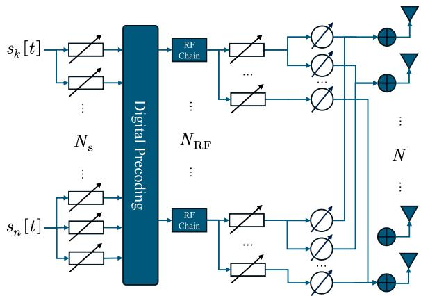  
Fig. 5. Digital delay-based wideband BDAT architecture.

$$
- \nu _ { \mathrm { C P } } \leq \nu _ { k ^ { \prime } k p m } ^ { l } \leq \nu _ { \mathrm { C P } }
$$

is notated as a set

$$
\begin{array} { r } { \mathcal { N } _ { l k ^ { \prime } p } = \left\{ \left( k , m \right) \left| - \nu _ { \mathrm { C P } } \leq \nu _ { k ^ { \prime } k p m } ^ { l } \leq \nu _ { \mathrm { C P } } , \forall k \neq k ^ { \prime } , m \right. \right\} , } \end{array}
$$

where $\nu _ { \mathrm { C P } } = T _ { \mathrm { C P } } / 2 .$ . Then, (8) can be rewritten

$$
\begin{array} { l } { { \displaystyle y _ { k ^ { \prime } } \left[ t \right] } } \\ { { \displaystyle = e ^ { - j \vartheta _ { \mathrm { C P } } } \sum _ { l , p , m } \alpha _ { l k ^ { \prime } m } h _ { l k ^ { \prime } p } \xi _ { l k ^ { \prime } p } ^ { \dagger } \mathbf { w } _ { l k ^ { \prime } m } s _ { k ^ { \prime } } \left[ t - \nu _ { k ^ { \prime } } ^ { \mathrm { m a x } } \right] } } \\ { { \displaystyle ~ + e ^ { - j \vartheta _ { \mathrm { C P } } } \sum _ { l , p , ( k , m ) \in \mathcal { N } _ { l k ^ { \prime } p } } \alpha _ { l k m } h _ { l k ^ { \prime } p } \xi _ { l k ^ { \prime } p } ^ { \dagger } \mathbf { w } _ { l k m } s _ { k } \left[ t - \nu _ { k ^ { \prime } } ^ { \mathrm { m a x } } \right] } } \\ { { \displaystyle ~ + n _ { k ^ { \prime } } \left[ t \right] } } \end{array}
$$

where $\nu _ { k ^ { \prime } } ^ { \mathrm { m a x } } = \tau _ { k ^ { \prime } } ^ { \mathrm { m a x } } - \nu _ { \mathrm { C P } }$ . Then with given $\{ \alpha _ { l k p } \}$ and $\mathbf { F } _ { l } .$ the following similar optimization can be obtained

$$
\underset { \{ \mathbf { w } _ { l k p } \} } { \operatorname* { m a x } } \underset { k ^ { \prime } } { \operatorname* { m i n } } \frac { \sum _ { l , p , m } \alpha _ { l k ^ { \prime } m } \beta _ { l k ^ { \prime } p } \left\| \boldsymbol { \xi } _ { l k ^ { \prime } p } ^ { \dagger } \mathbf { w } _ { l k ^ { \prime } m } \right\| ^ { 2 } } { \sum _ { \substack { l , p , ( k , m ) \in \mathcal { N } _ { l k ^ { \prime } p } } } \alpha _ { l k m } \beta _ { l k ^ { \prime } p } \left\| \boldsymbol { \xi } _ { l k ^ { \prime } p } ^ { \dagger } \mathbf { w } _ { l k m } \right\| ^ { 2 } + \sigma _ { k ^ { \prime } } ^ { 2 } }\tag{21}
$$

$$
\begin{array} { r l } & { \mathrm { s . t . } \ \alpha _ { l k m } \pmb { \xi } _ { l k ^ { \prime } p } ^ { \dagger } \mathbf { w } _ { l k m } = 0 , \forall l , k ^ { \prime } , ( k , m ) \in \mathcal { N } _ { l k ^ { \prime } p } } \\ & { \mathrm { ( 1 3 \ - \ } \mathrm { ) } } \end{array}\tag{21-a}
$$

Similarly, zero space can be utilized

$$
\begin{array} { r l r } {  { \operatorname* { m a x } _ { \{ { \bf { b } } _ { l k p } \} } \operatorname* { m i n } _ { k ^ { \prime } } \frac { \sum _ { l , p , m } \alpha _ { l k ^ { \prime } m } \beta _ { l k ^ { \prime } p } \| \boldsymbol { \xi } _ { l k ^ { \prime } p } ^ { \dagger } { \bf Q } _ { l k ^ { \prime } m } { \bf b } _ { l k ^ { \prime } m } \| ^ { 2 } } { \delta _ { l k m } \beta _ { l k ^ { \prime } p } \| \boldsymbol { \xi } _ { l k ^ { \prime } p } ^ { \dagger } { \bf Q } _ { l k m } { \bf b } _ { l k m } \| ^ { 2 } + \sigma _ { k ^ { \prime } } ^ { 2 } } } } \\ & { } & { \mathrm { s . t . } \big ( 1 7 - a \big ) , \qquad ( 2 2 ) } \end{array}
$$

which cannot be solved with a distributed way as zero-forcing, however. Furthermore, we extend digital delay-based BDAT architecture to the wideband, the transceiver can be designated as Fig. 5, where digital delay modules are used to align delays and analog delay modules are adopted to improve the performance for wideband. This design consumes two kinds of delay modules, which could bring higher cost. Considering

Remark 1, we conclude that digital delay-based BDAT is not appreciated for CF-mMIMO from the processing and economic perspectives.

## C. Analog Delay Implementation

In this subsection, the analog delay module is considered to implement BDAT and it is further extended to wideband BDAT. Different from digital delay-based BDAT architecture, the signal waiting to be transmitted is

$$
\sum _ { k = 1 } ^ { K } \sum _ { p = 1 } ^ { P } \alpha _ { l k p } \tilde { \mathbf { f } } _ { l k p } x _ { l k p } \left[ t - \varDelta _ { l k p } \right] ,\tag{23}
$$

where the precoded and delayed signal $x _ { l k p } \left[ t - \Delta _ { l k p } \right]$ is

$$
x _ { l k p } \left[ t - \varDelta _ { l k p } \right] = { \bf w } _ { l k p } { \bf s } \left[ t - \varDelta _ { l k p } \right] .\tag{24}
$$

Then (37) can be rewritten as (38) in Appendix 1. With $\varDelta _ { l k p } =$ $\tau _ { k } ^ { \mathrm { m a x } } - \tau _ { l k p } .$ we have

$$
\begin{array} { r l } & { 2 \kappa : | | \boldsymbol { \mathcal { T } } | | } \\ & { = \displaystyle \left( \sum _ { j = 1 } ^ { \infty } \alpha _ { j , j } \kappa _ { j , j } ^ { ( 1 ) } , \hat { \kappa } _ { j , j } ^ { ( 1 ) } , \hat { \kappa } _ { j , j } ^ { ( 1 ) } , \hat { \kappa } _ { j , j } ^ { ( 1 ) } , \hat { \kappa } _ { j , j } ^ { ( 1 ) } \right) \alpha _ { j , j } \kappa _ { j , j } \kappa _ { j , } \hat { \kappa } _ { j , } \hat { \kappa } _ { j , } \hat { \kappa } _ { j , } \hat { \kappa } _ { j , } } \\ & { \quad - \displaystyle \sum _ { j = 1 } ^ { \infty } \alpha _ { j , j } \kappa _ { j , j } ^ { ( 1 ) } , \hat { \kappa } _ { j , j } ^ { ( 1 ) } , \hat { \kappa } _ { j , j } ^ { ( 1 ) } , \hat { \kappa } _ { j , j } ^ { ( 1 ) } , \hat { \kappa } _ { j , } \hat { \kappa } _ { j , } \hat { \kappa } _ { j , } \hat { \kappa } _ { j , } \hat { \kappa } _ { j , } \hat { \kappa } _ { j , } } \\ & { \quad \quad + \displaystyle \sum _ { j = 1 } ^ { \infty } \alpha _ { j , j } \kappa _ { j , j } ^ { ( 1 ) } , \hat { \kappa } _ { j , j } ^ { ( 1 ) } , \hat { \kappa } _ { j , j } ^ { ( 1 ) } , \hat { \kappa } _ { j , } \hat { \kappa } _ { j , } \hat { \kappa } _ { j , } \hat { \kappa } _ { j , } \hat { \kappa } _ { j , } \hat { \kappa } _ { j , } \hat { \kappa } _ { j , } \hat { \kappa } _ { j , } \hat { \kappa } _ { j , } \hat { \kappa } _ { j , } } \\ &  \quad \quad + \displaystyle \sum _ { j = 1 } ^ { \infty } \alpha _ { j , j } \kappa _ { j , j } ^ { ( 1 ) } , \hat { \kappa } _ { j , j } ^ { ( 1 ) } , \hat { \kappa } _ { j , } \hat  \end{array}
$$

Obviously, it is not possible to realize full zero-forcing directly as done in the digital implementation. If precoders try their best to zero-force interference including the 3rd and 5th items in (25), which results Proposition 2.

Proposition 2: To avoid ICI and ISI, AP l should serve UEs on multi-paths semi-synchronized, and the path set is referred as a semi-synchronized path set (SSP-Set) $\begin{array} { r l } { \mathcal { C } _ { l } } & { { } = } \end{array}$ $\left\{ ( k , p ) \ \middle | - \nu _ { \mathrm { C P } } \leq \nu _ { k n p m } ^ { l } \leq \nu _ { \mathrm { C P } } , \forall k , n , p , m \right\}$

Proof: $\forall k ^ { \prime } , p$ we have $w _ { l k m k ^ { \prime } } = 0$ to erase potential ICI and ISI, $i . e . , \ ( k , m ) \in \mathcal { N } _ { l k ^ { \prime } p }$ . Then the severed path set is $\begin{array} { r l } { \bigcup _ { k ^ { \prime } , p } \mathcal { N } _ { l k ^ { \prime } p } \cup \{ ( k ^ { \prime } , m ) | \forall m \} } \end{array}$ , which is exactly $\mathcal { C } _ { l }$

It is worth noticing that there exists significant difference between the proposed SSP-Set and conventional cellular set. As illustrated in Fig. 6, SSP-Set never implies the discard of wide cooperation as done in the common cell-free, which adopts the delay compensation instead of the ‘absolute’ distance to separate the users. SSP-Set bridges the gap of the low performance of conventional cellular massive MIMO or small cell (where the asynchronous effects are not serious) and the asynchronicity in cell-free. Cellular base stations serve UAVs within the cell and APs in our low-altitude coverage cell-free select UAVs with similar time compensation, which is the difference between the dashed line (connecting the farthest AP and the UAV) and the dotted line (connecting the nearest AP and the UAV) for each UAV. Obviously, SSP-Set reserves the potential of cooperative transmission, which is the fatal benefit of cell-free.

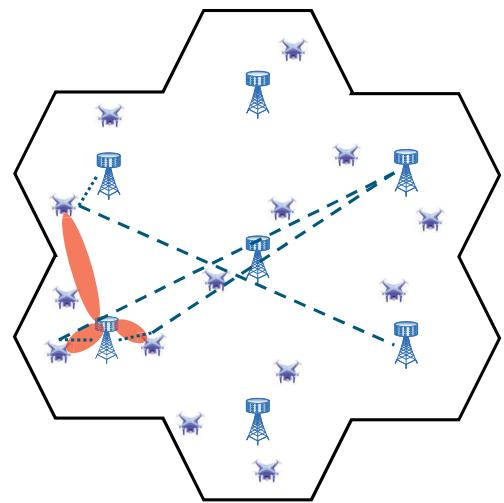  
Fig. 6. SSP-Set reserves the potential of wide range cooperative transmission.

With substituting small time shifts by phase shifts and fixing the analog precoder and the association strategy, we have

$$
\begin{array} { r l } {  { y _ { l k ^ { \prime } } [ \mathbf { \boldsymbol { t } } ] } } \\ & { = [ ( \sum _ { \{ ( k ^ { \prime } , p ) \vert ( k ^ { \prime } , p ) \in \mathcal { C } _ { l } , \forall p \} } h _ { l k ^ { \prime } p } \pmb { \dot { \xi } } _ { l k ^ { \prime } p } ^ { \dagger } ) \mathbf { w } _ { l k ^ { \prime } } ] s _ { k ^ { \prime } } [ \mathbf { \boldsymbol { t } } - \boldsymbol { \tau } _ { k ^ { \prime } } ^ { \mathrm { m a x } } ] } \\ & { + ( \sum _ { \{ ( k , p ) \vert ( k , p ) \in \mathcal { C } _ { l } , \forall k \neq k ^ { \prime } , \forall p \} } h _ { l k ^ { \prime } p } \pmb { \dot { \xi } } _ { l k ^ { \prime } p } ^ { \dagger } ) \mathbf { w } _ { l k } s _ { k } [ \mathbf { \boldsymbol { t } } - \boldsymbol { \tau } _ { k ^ { \prime } } ^ { \mathrm { m a x } } ] , } \end{array}\tag{26}
$$

where $\begin{array} { r } { y _ { k ^ { \prime } } [ t ] = \sum _ { l } y _ { l k ^ { \prime } } [ t ] + n _ { k ^ { \prime } } [ t ] } \end{array}$ . Unfortunately, the lack of instantaneous CSI $h _ { l k p }$ requires the satisfaction of $\mathbf { w } _ { l k ^ { \prime } p }$ zero-forcing $\pmb { \xi } _ { l k m } , \forall k , m$ , which leads to the same RF chain crisis as the digital delay-based implementation. In fact, the cross items with different delays and symbols are caused by the symbol crossing in the digital precoding. We remove the digital precoder in the hybrid precoding architecture to simplify (25) considering that analog precoder plays the main role in beamforming with massive antenna arrays.

Fig. 7 presents the considered analog delay-based BDAT architecture, where we separate different UE symbols before the analog delay modules. Based on Fig. 7, the received signal in k<sup>0</sup>-th UE is (27), shown at the bottom of the next page, with $\varDelta _ { l k p } = \tau _ { k } ^ { \mathrm { m a x } } - \tau _ { l k p }$ , where $\breve { \mathbf { a } } _ { l k p } = e ^ { - j ( \tau _ { k } ^ { \operatorname* { m a x } } - \tau _ { l k p } ) w _ { m } } \mathbf { a } _ { l k p } , \mathcal { P } _ { l k }$ is the selected path set from l-th AP to k-th UE, and $\vartheta _ { \mathrm { C P } }$ is corresponding phase shifts raised by $\nu _ { \mathrm { C P } }$ . Then the following optimization problem is established

$$
\begin{array} { l }  \displaystyle \operatorname* { m a x } _ { \{ { \bf x } _ { l k } \} } \operatorname* { m i n } _ { k ^ { \prime } } \frac { { \bf x } _ { l k ^ { \prime } } ^ { \mathrm { T } } { \bf H } _ { l k ^ { \prime } k ^ { \prime } } { \bf x } _ { l k ^ { \prime } } } { \displaystyle \sum _ { l } \sum _ { \{ ( k , p ) \} ( { l ( k , p ) \in \mathcal { C } _ { l } , \forall k , \exists p \} } { \bf x } _ { l k } ^ { \mathrm { T } } { \bf \Pi } _ { l k ^ { \prime } k } { \bf x } _ { l k } + \sigma _ { k ^ { \prime } } ^ { 2 } } } \\ { \mathrm { s . t . } \ \displaystyle \sum _ { k \in { \cal K } _ { l } } { \bf x } _ { l k } ^ { \mathrm { T } } { \bf x } _ { l k } \leqslant 1 , \forall l \ } & { \mathrm { ( 2 8 - a ) } } \end{array}
$$

where $\mathbf { x } _ { l k } = \left[ x _ { l k 1 } , \cdot \cdot \cdot , x _ { l k P } \right] ^ { \mathrm { T } }$ and $\begin{array} { r } { x _ { l k p } = \sqrt { \frac { \eta _ { l k p } } { P _ { \mathrm { A P } } } } . \ \Pi _ { l k ^ { \prime } k } } \end{array}$ in (28) is

$$
\Lambda _ { l k } ^ { \dagger } \left( \sum _ { \{ ( k ^ { \prime } , p ) | ( k ^ { \prime } , p ) \in \mathcal { C } _ { l } , \forall p \} } \beta _ { l k ^ { \prime } p } \check { \mathbf { a } } _ { l k ^ { \prime } p } \check { \mathbf { a } } _ { l k ^ { \prime } p } ^ { \dagger } \right) \Lambda _ { l k } ,
$$

where

$$
\pmb { \Lambda } _ { l k } = \sum _ { \{ ( k , m ) | ( k , m ) \in \mathcal { C } _ { l } , \forall k \neq k ^ { \prime } , \forall m \} } \sqrt { \eta _ { l k m } } \check { \mathbf { a } } _ { l k m } .
$$

(28) can also be solved by bisection method.

Remark 2: The considered analog delay-based BDAT architecture can be extended to wideband as Fig. 5, where the analog delay modules for beam split calibration can be reused for UE symbol synchronization, which save the extra costs.

## IV. PROPOSED WIDEBAND ASYNCHRONOUS ARCHITECTURE AND GCN-BASED SSP-SET

In this section, we propose a novel architecture which enables the potential of serving more UEs with the same number of RF chains. Then a geometric scattering GCN is proposed to obtain SSP-Sets.

## A. Multi-Phase-Shifter Architecture

We find that the adopted architecture in Fig. 7 modulates the same UE signal several times for the corresponding serving paths, which weakens the ability to cover more UEs. To improve this constraint, we proposed the co-RF chain structure in Fig. 8, where $s _ { k } ^ { \mathrm { R F } } [ t ]$ is the modulated signal, and the architecture is demonstrated in Fig. 9. In Fig. 9, to serve UEs

$$
\begin{array} { r l } { \| y _ { k } \| ^ { 2 } = \sum _ { \stackrel { h \in \mathbb { R } } { \operatorname* { R e } } } \rho _ { 0 } ^ { 4 } \log _ { \infty } \{ ( k , m ) \sum _ { \stackrel { h \in \mathbb { R } } { \operatorname* { R e } } } \gamma _ { 0 } ^ { 2 } \} } & { \sqrt { \eta _ { k \in \mathbb { R } } } \sum _ { 1 } \lambda _ { i \in \mathcal { R } _ { k } \cap \mathcal { R } _ { k } } \{ \tilde { \varepsilon } - \tilde { \eta } _ { k } ^ { \mathrm { i d s } } + \tilde { \eta } _ { k \in \mathbb { R } _ { k } } ^ { \mathrm { i d s } } \} + \eta _ { k } \| \tilde { \varepsilon } \| } \\  = \sum _ { \stackrel { h \in \mathbb { R } } { \operatorname* { R e } } } \rho _ { 0 } ^ { 4 } \log _ { \infty } \{ \underset { \{ k : m \} \leq 1 } { \sum _ { \stackrel { h \in \mathbb { R } } { \operatorname* { R e } } } \gamma _ { 0 } ^ { 4 } \zeta _ { 1 } , \eta _ { k } , 0 \} } & { \sqrt { \eta _ { k \in \mathbb { R } } \gamma _ { 0 } ^ { 4 } \log _ { k } \gamma _ { \infty } } \{ \tilde { \varepsilon } - \tilde { \eta } _ { k } ^ { \mathrm { i d s } } + \nu _ { k \in \mathcal { R } _ { k } } ^ { \mathrm { i d s } } \} } \\ { } & { \quad + \sum _ { \stackrel { \varepsilon } { \varepsilon } } \eta _ { k \in \mathbb { R } } \rho _ { 0 } ^ { 4 } \log _ { \infty } \{ ( k , m ) \{ k , m \} \varepsilon \} _ { 0 } ^ { 2 } \sqrt { \eta _ { k \in \mathbb { R } } \gamma _ { 0 } ^ { 4 } \log _ { k } \gamma _ { \infty } } \{ \tilde { \varepsilon } - \tilde { \eta } _ { k } ^ { \mathrm { i d s } } + \nu _ { k \in \mathcal { R } _ { k } } ^ { \mathrm { i d s } } \} } \\ { } &  = \sum _  \stackrel  h \in \mathbb { R } \end{array}\tag{27}
$$

$$
\begin{array} { r l } { \| \boldsymbol { y } _ { k } \cdot \| = \sum \sum } & { \sum \underset { t } { \overset { \boldsymbol { h } } { \boldsymbol { y } } } \displaystyle \mu _ { k \in \mathbb { N } ^ { 3 } } \displaystyle \mathrm { a d } _ { \mathcal { C } _ { k } } \leq \sum } & { \sum \sum } \\ { = \sum } & { \underset { t } { \overset { \boldsymbol { h } } { \boldsymbol { y } } } \displaystyle \mu _ { k \in \mathbb { N } ^ { 3 } } \mathrm { a d } _ { \mathcal { C } _ { k } } \leq \sum } & { \sum } \\ { = \sum } & { \sum } & { \sum } \\ { = \sum } & { \underset { t } { \overset { \boldsymbol { V } } { \boldsymbol { y } } } \displaystyle \mu _ { k \in \mathbb { N } ^ { 3 } } \mathrm { a d } _ { \mathcal { C } _ { k } } \leq \sum } & { \sum } \\ & { \quad + \sum } & { \underset { t } { \overset { \boldsymbol { V } } { \boldsymbol { y } } } \displaystyle \mu _ { k \in \mathbb { N } ^ { 3 } } \mathrm { a d } _ { \mathcal { C } _ { k } } \leq \sum } &  \sqrt { 1 + \underset { t } { \overset { \boldsymbol { V } } { \boldsymbol } } \mathrm { a d } _ { \mathcal { C } _ { k } } \displaystyle \alpha _ { k \in \mathbb { N } ^ { 3 } } \omega _ { k } [ [ [ - \mathcal { T } _ { k } \omega ^ { \mathrm { a d } } + \delta \sigma _ { k } ^ { \mathrm { a d } } ] \sigma _ { k } ]  } \\ &  \quad  + \sum _ { t } ^ { \mathrm { i } } \sum _ { t } \gamma _ { k \in \mathbb { N } ^ { 3 } } \mathrm { a d } _ { \mathcal { C } _ { k } } ] ( \delta \boldsymbol { T } _ { k \cdot \infty } ) ( \delta \boldsymbol { T } _ { k \cdot \infty } ) \zeta \eta _ { k \in \mathbb { N } ^ { 3 } } [ [ \boldsymbol { T } _ { k } \omega ^ { \mathrm { a d } } + \delta \boldsymbol { T } _ { k } \omega ^ { \mathrm { a d } } ] + \eta _ { k \cdot \infty } [ \delta \boldsymbol { T } _  k \end{array}\tag{29}
$$

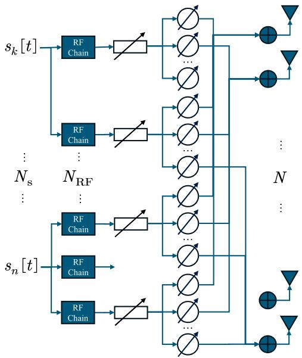  
Fig. 7. Analog delay-based BDAT architecture.

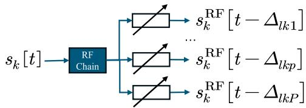  
Fig. 8. Analog delay modules for the single RF chain.

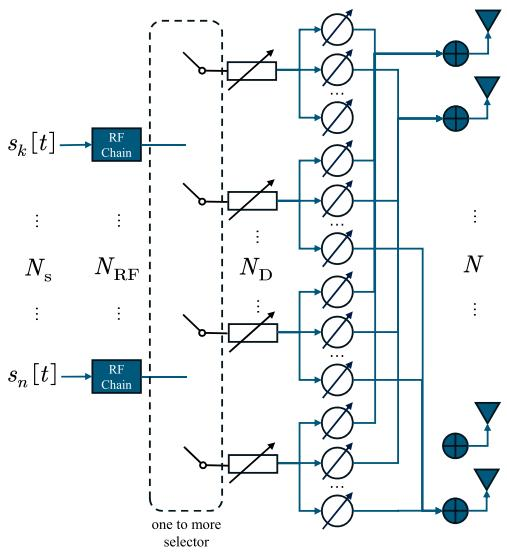  
Fig. 9. Analog delay-based BDAT architecture with multiple sets of phase shifters.

on different paths with a flexible way, a ‘one-to-more’ selector is exploited. Compared with Fig. 7, Fig. 9 can serve more UEs with the same number of RF chains with the affordable extra of cost of $N _ { \mathrm { D } } - N _ { \mathrm { R F } }$ sets of analog delay module and phase shift array.

The received signal for the typical k<sup>0</sup>-th UE can be expressed as (29), shown at the bottom of the previous page, where the most difference is that we optimize power factor for each UE on each AP instead of each UE path because the multi-path signals for the same UE are modulated from a single RF chain. Then, the optimization problem can be established

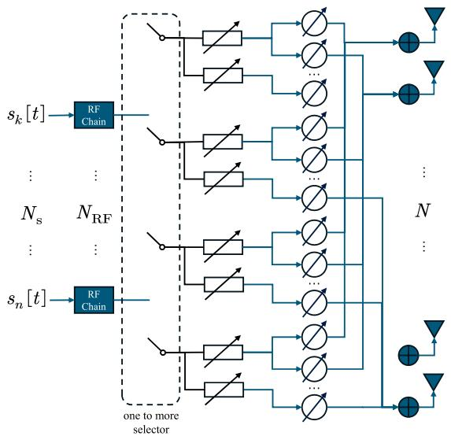  
Fig. 10. Analog delay-based wideband BDAT architecture with multiple sets of phase shifters.

$$
\begin{array} { l }  \displaystyle \operatorname* { m a x } _ { \{ \eta _ { l k } \} } \operatorname* { m i n } _ { k ^ { \prime } } \frac { \displaystyle l , \{ ( k ^ { \prime } , p ) | ( k ^ { \prime } , p ) \in \mathcal { C } _ { l } , \exists p \} } { \displaystyle \sum _ { l , \{ k ^ { \prime } k \} \in \mathcal { I } _ { k } } \sum _ { \ell = k ^ { \prime } } \sum _ { \substack { v \in \mathcal { C } _ { l } , \forall k \neq k ^ { \prime } , \exists p \} } \zeta _ { l k ^ { \prime } k } + \sigma _ { k ^ { \prime } } ^ { 2 } } } \\ { \mathrm { s . t . } \ \sum _ { \substack { \{ ( k , p ) | ( k , p ) \in \mathcal { C } _ { l } , \forall k , \exists p \} } } \eta _ { l k } \leqslant P _ { \mathrm { A P } } } \end{array}\tag{30}
$$

(30-a)

where

$$
\zeta _ { l k ^ { \prime } k } = \sum _ { p } \beta _ { l k ^ { \prime } p } \left| \check { \mathbf { a } } _ { l k ^ { \prime } p } ^ { \dagger } \left( \sum _ { \{ ( k , m ) | ( k , m ) \in \mathcal { C } _ { l } , \forall m \} } \check { \mathbf { a } } _ { l k m } \right) \right| ^ { 2 } .
$$

With x being the flattened vector composed of $\begin{array} { r l } { x _ { l k } } & { { } = } \end{array}$ $\begin{array} { r } { \frac { \eta _ { l k } } { P _ { \mathrm { A P } } } , \forall l , k , \ \gamma _ { k } ^ { \check { - } 1 } = \sigma _ { k } ^ { 2 } / P _ { \mathrm { A P } } , \ \mathbf { D } _ { t } \ \in \ \mathbb { R } ^ { L K \check { \times } K } , \ \mathbf { C } \ \in \ \mathbb { R } ^ { \check { L } K \times L } } \end{array}$ and u $\in \mathbb { R } ^ { 2 L + 2 K }$ defined as follows:

$$
\begin{array} { r } { ( \mathbf D _ { r } ) _ { [ ( l - 1 ) K + k , k ^ { \prime } ] } = \left\{ \begin{array} { l l } { - r \zeta _ { l k ^ { \prime } k } } & { k = k ^ { \prime } } \\ { z e t a _ { l k ^ { \prime } k } } & { k \neq k ^ { \prime } } \end{array} \right. } \end{array}\tag{31}
$$

$$
( \mathbf { C } ) _ { [ ( l - 1 ) K + k , l ] } = \left\{ { \begin{array} { l l } { 1 } & { k \in { \mathcal { K } } _ { l } } \\ { 0 } & { k \notin { \mathcal { K } } _ { l } } \end{array} } \right.\tag{32}
$$

$$
( \mathbf { u } ) _ { [ i ] } = \left\{ \begin{array} { l l } { 1 } & { i = 1 , \cdots , L } \\ { - \gamma _ { i - L } ^ { - 1 } } & { i = L + 1 , \cdots , L + K } \\ { 0 } & { i = L + K + 1 , \cdots , 2 L + 2 K ^ { \prime } } \end{array} \right.\tag{33}
$$

```latex
Algorithm 1 BDAT based on the proposed Wideband asyn
chronous architecture with given SSP-Set
Input: $\{ \beta _ { l k p } , \tau _ { l k p } | \forall l , k , p \} , \{ \mathcal { C } _ { l } | \forall l \} , \left\{ \sigma _ { k } ^ { 2 } | \forall k \right\} , \epsilon$
Output: $\{ \eta _ { l k } \rfloor \forall l , k \in \{ \bar { k } | ( k , p ) \in \mathcal { C } _ { l } , \exists p \} \} ,$
$\left\{ \varDelta _ { l k p d } \left| \forall l , ( k , p ) \in \mathcal { C } _ { l } , d \right. \right\} \left\{ \tilde { \mathbf { f } } _ { l k p } \left| \forall l , ( k , p ) \in \mathcal { C } _ { l } \right. \right\}$
1: for $l = 1 , \cdots , L$ do
2: for $( k , p ) \in \{ ( k , p ) | ( k , p ) \in \mathcal { C } _ { l } \}$ do
3: estimate $\phi _ { l k p }$ and $\sigma _ { k } ^ { 2 } ;$
4: $\begin{array} { r } { \ddot { \bf f } _ { l k p }  { \bf a } ( \phi _ { l k p } ) ; } \end{array}$
5: for $d = 1 , \cdots , N _ { \mathrm { W D } }$ do
6: $\begin{array} { r l r } {  { ( \tilde { \mathbf { f } } _ { l k p } ) _ { [ \frac { d N } { N _ { \mathrm { W D } } } + 1 : \frac { ( d + 1 ) N } { N _ { \mathrm { W D } } } ] } } } \end{array}$ ← $e ^ { j \frac { \pi ( d - 1 ) N \phi _ { l k p } } { N _ { \mathrm { W D } } } }$
$\begin{array} { r l } & { \left( \tilde { \mathbf { f } } _ { l k p } \right) _ { \left[ \frac { d N } { N _ { \mathrm { W D } } } + 1 : \frac { \left( d + 1 \right) N } { N _ { \mathrm { W D } } } \right] } - } \\ & { \quad \bullet \sim \quad . } \end{array}$ [37];
7: if $\dot { \phi } _ { l k p } \dot { < } \ddot { 0 }$ then
8: $\begin{array} { r } { \dot { \Delta _ { l k p d } }  ( N _ { \mathrm { W D } } - 1 ) | \frac { N \phi _ { l k p } } { 2 N _ { \mathrm { D } } } | T _ { c } \ + d \frac { N \phi _ { l k p } } { 2 N _ { \mathrm { W D } } } T _ { c } } \end{array}$
[37];
9: else
10: $\begin{array} { r } { \varDelta _ { l k p d } \gets d \frac { N \phi _ { l k p } } { 2 N _ { \mathrm { W D } } } T _ { c } } \end{array}$ [37];
11: end if
12: $\varDelta _ { l k p d } \gets \varDelta _ { l k p d } + \tau _ { k } ^ { \mathrm { m a x } } - \tau _ { l k p } ;$
13: end for
14: end for
15: end for
16: obtain C and u by (32) and (33);
17: initialize $r _ { \operatorname* { m a x } }  1 , r _ { \operatorname* { m i n } }  0 ;$
18: while $r _ { \mathrm { m a x } } - r _ { \mathrm { m i n } } > \epsilon$ do
19: $\begin{array} { r } { r _ { \mathrm { m i d } } \gets \frac { r _ { \mathrm { m a x } } + r _ { \mathrm { m i n } } } { 2 } ; } \end{array}$
20: obtain $\mathbf { D } _ { r _ { \mathrm { m i d } } }$ by (31);
21: construct problem $\mathcal { P } _ { r _ { \mathrm { m i d } } }$ as (34-a) with $r = r _ { \mathrm { m i d } } ;$
22: if $\mathcal { P } _ { r _ { \mathrm { m i d } } }$ is feasible then
23: r<sub>max</sub> ← r<sub>mid</sub>;
24: else
25: r<sub>min</sub> $ r _ { \mathrm { n } }$ <sub>mid</sub>;
26: end if
27: end while
28: $\eta _ { l k } \gets ( \mathbf { x } ) _ { [ ( i - 1 ) K + k ] } , \forall l , k \in \{ k | ( k , p ) \in \mathcal { C } _ { l } , \exists p \} ;$
29: return $\left\{ \eta _ { l k } \left| \forall l , k \in \left\{ k \left| ( k , p ) \in \mathcal { C } _ { l } , \exists p \right. \right\} \right. \right\}$
$\{ \varDelta _ { l k p d } | \forall l , ( k , p ) \in \mathcal { C } _ { l } , d  \} ,  \{ \tilde { \mathbf { f } } _ { l k p } | \forall l , ( k , p ) \in \mathcal { C } _ { l }  \}$
```

we can rewrite (30) to a standard convex optimization problem by the fractional programming<sup>3</sup>

$$
\begin{array} { r l } & { \underset { \mathbf { x } } { \operatorname* { m i n } } r } \\ & { ~ \mathrm { s . t . } ~ [ \mathbf { C D } _ { r } - \mathbf { I } ] ^ { \mathrm { T } } \mathbf { x } \preccurlyeq \mathbf { u } , } \end{array}\tag{34}
$$

(34-a)

where r is the auxiliary variable. To this end, we can extend Fig. 9 to the wideband scenario as shown in Fig. 10, where each set of analog delay modules serve for asynchronous transmission and beam splitting calibration simultaneously. We present the proposed algorithm in Algorithm 1 in the next two pages and SSP-Set can be solved by the next subsection.

## B. GCN-Based SSP-Set

To obtain an SSP-Set with good performance, we view the SSP-Set as a subset of a maximal clique and induce a GCN with the geometric scattering transform to achieve the maximal clique candidates.

From the perspective of $\mathrm { ~ A P ~ } l ,$ model each path of UEs as a graph $\mathcal { G } _ { l } ~ = ~ \{ \gamma _ { l } , \mathcal { E } _ { l } \}$ , where $\mathcal { V } _ { l } ~ = ~ \{ ( k , p ) | \forall k , p \}$ and $\mathcal { E } _ { l }$ contains edges between $( k , p )$ and $( n , m )$ when $\left| \nu _ { k n p m } ^ { l } \right| \leq$ $\nu _ { \mathrm { C P } }$ , as shown in Fig. 11. A subset V of $\mathcal { V } _ { l }$ is called ‘clique when the arbitrary pair of elements exists an edge just like the vertexes with green checkmarks in Fig. 11. Obviously, SSP-Set is exactly a clique. For the potential best performance, we should select a so-called maximal clique from $\nu _ { l } ,$ which is defined as Definition 1, and SSP-Set is the subset of a maximal clique by selecting several best paths.

Definition 1: (Maximal Clique)

A maximal clique C in a graph $\mathcal { G } = ( \nu , \mathcal { E } )$ means there exists no vertex $v \in \mathcal V$ satisfying ${ \mathcal { C } } \cup \{ v \}$ being a clique.

The baseline method, Bron-Kerbosch algorithm [40] is often used for clique searching, which unfortunately works better in a small and sparse graph and the complexity cannot be tolerated in a practical communication system. Here we adopt a geometric scattering GCN to detect maximal cliques, which embeds the graph structure as a feature for every vertex and this output feature indicates the potential of clique existence [41]. In this paper, such GCN $G ( \cdot )$ is utilized as a featurerefiner that it refines the initial feature $\{ \tau _ { k } ^ { \mathrm { m a x } } - \tau _ { l k p } \ : | \forall k , p \}$ into an explicit feature $\{ \lambda _ { l k p } | \forall k , p \}$

$$
\lambda = G ( \tau ; \mathcal { E } , \Theta )\tag{35}
$$

where λ is the stack of $\lambda _ { l k p } , \forall k , p$ and similarly for $\tau . \Theta$ in (35) is the learnable parameter set in GCN. The refined explicit feature λ can lead to maximal cliques sorted by cardinal, and SSP-Set can be selected as Algorithm 2 in the next two pages. C<sup>ˆ</sup> is the candidate maximal clique which could contain the optimal SSP-Set $\mathcal { C } _ { \beta }$

As the final paragraph of this subsection, we add more details of the adopted geometric scattering GCN about the acquisition of well-trained $G ( \cdot )$ . The model structure can be found in [41] and the other GCN structures can also be considered as candidates. The fatal point of this GCN for maximal clique detection is the loss function which is composed of two parts. The first one is to maximize the weights of connected points intuitively and the second one comes from Lemma 2.

Lemma 2 ([41, Lemma 1]): Consider a graph $\mathcal { G } = ( \nu , \mathcal { E } )$ and an output feature $\lambda \succcurlyeq 0 ,$ and define the support of λ as $\mathrm { s u p p } ( \bar { \lambda } ) \stackrel { - } { = } \{ v | \lambda _ { v } > 0 \} . \ \lambda ^ { \mathrm { T } } \bar { \bf A } \lambda = 0$ if and only if there exists a clique $\mathcal { C } \subset \mathcal { V }$ such that supp(λ) is contained in C, where A is the adjacent matrix based on $\mathcal { E }$ and $\bar { \mathbf { A } } = \mathbf { I } - \mathbf { A }$

Therefore, the loss function can be presented

$$
\mathcal { L } ( \lambda ) = - \lambda ^ { \mathrm { { T } } } \mathbf { A } \lambda + \omega \lambda ^ { \mathrm { { T } } } \bar { \mathbf { A } } \lambda ,\tag{36}
$$

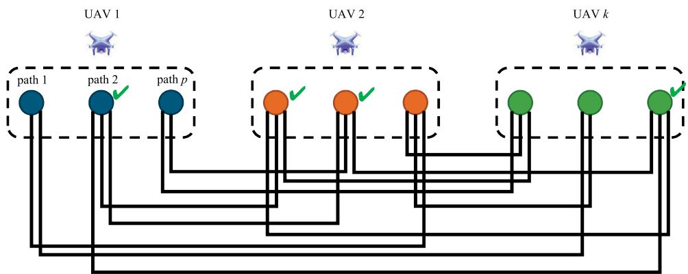  
Fig. 11. View UE paths as a graph and select SSP-Set as a clique.

where the previous element selects densely connected vertexes, the post one enforce the selected vertexes to form a clique and the weight to balance these two loss elements is $\omega .$

## C. Complexity & Fronthaul Overhead

To summarize, the proposed BDAT can be implemented by the distributed phase and centralized phase. The distributed phase is composed of

1) AP l estimate $\beta _ { l k p } , \forall k , p$ and $\tau _ { l k p } , \forall k , p ;$

2) AP l decides $\mathcal { C } _ { l }$ by Algorithm 2;

3) AP l conducts beamforming and time delay for selected paths in $\mathcal { C } _ { l }$ as step 1 to step 15 in Algorithm 1.

The centralized phase for global power optimization contains steps from 16 to 28 in Algorithm 1.

The complexity in APs can be expressed as $\mathcal { O } ( K ^ { 2 } N )$ which is derived as follows. The first block of nested loops in Algorithm 2 has complexity $\mathcal { O } ( K ^ { 2 } P ^ { 2 } )$ . The complexity of GCN, permutation and the second block of nested loops are $\mathcal { O } ( K ^ { 2 } P ^ { 2 } )$ $\mathcal { O } ( K P \log K P )$ and $\mathcal { O } ( \kappa N _ { \mathrm { D } } K P )$ respectively. Then the total complexity of Algorithm 2 is $\mathcal { O } ( K ^ { 2 } P ^ { 2 } )$ considering κ and $N _ { \mathrm { D } }$ is relatively small. Additionally, the complexity in Algorithm 1 is $\mathcal { O } ( N _ { \mathrm { D } } N )$ for each l and $\mathcal { O } ( K ^ { 2 } N )$ for $\zeta _ { l k ^ { \prime } k } , \forall k ^ { \prime } , k$ . The total complexity for APs is obtained.

On the other, the complexity for the centralized phase in CPU is $\mathcal { O } ( - \log \epsilon L ^ { 3 } K ^ { 3 } )$ which is composed of the binary searching complexity $\mathcal { O } ( - \log \epsilon )$ with given threshold  and simplex optimization complexity ${ \mathcal { O } } ( L ^ { 3 } { \bar { K } } ^ { 3 } )$ .

The fronthaul overhead based the proposed wideband asynchronous architecture and the corresponding two algorithms is $L N _ { \mathrm { D } } ^ { 2 } + L N _ { \mathrm { D } } + K$ for uploading $\zeta _ { l k ^ { \prime } k } , \mathcal { C } _ { l }$ and $\sigma _ { k }$ because $\zeta _ { l k ^ { \prime } k } = 0$ when $k ^ { \prime }$ or k is not in $\mathcal { C } _ { l }$

## V. NUMERICAL RESULTS

In this section, we present the effectiveness of the proposed BDAT based on the wideband asynchronous architecture. The simulation setups are listed in TABLE I. We adopt the geometric scattering GCN in [41] which is composed of a linear input layer, 3 SCTConv layers and two linear layers. The detailed design especially the implementation of SCTConv can be found in [41]. The training hyperparameters are as follows:

TABLE I  
SIMULATION SETUPS
<table><tr><td>Parameter</td><td>Value</td></tr><tr><td>Area</td><td>1km × 1km</td></tr><tr><td>CP duration</td><td> $2 . 3 4 \mu \mathrm { s }$ </td></tr><tr><td>MmWave AP number  $L$ </td><td>18</td></tr><tr><td>Antenna array size  $N$ </td><td>128</td></tr><tr><td>UAV number K</td><td>20/30/40</td></tr><tr><td>(Maximal) multi-path number  $P$ </td><td>3</td></tr><tr><td>RF chain number for each AP  $N _ { \mathrm { R F } }$ </td><td>10</td></tr><tr><td>Delay set number for each AP  $N _ { \mathrm { D } }$ </td><td>20</td></tr><tr><td>Delay module number in each set  $N _ { \mathrm { W D } }$ </td><td>16</td></tr><tr><td>AP maximal power  $P _ { \mathrm { A P } }$ </td><td>1W</td></tr></table>

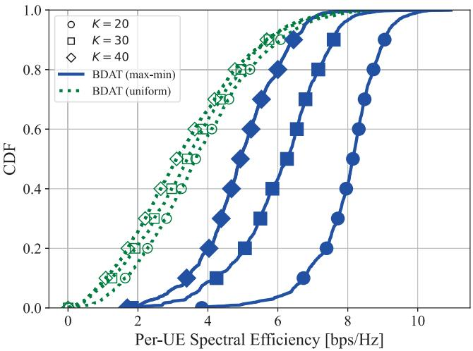  
Fig. 12. SE CDF comparison between max-min-optimized power versus uniformly-allocated power under different UAV UE numbers.

0.002 for learning rate, 0.09 for penalty coefficient and 0.5 for dropout in the SCTConv layers and 200 for training epochs.

In Fig. 12, we compare the cumulative distribution function (CDF) of max-min-optimized BDAT and uniform power BDAT under UAV number 20, 30 and 40 to validate the effectiveness of the proposed binary searching algorithm. The centralized phase can provide an excellent global optimization for APs, which achieves a more than threefold improvement when $K \ = \ 2 0$ and twofold in ultra-dense UAVs. Fig. 12 demonstrates a convergence in performance between maxmin power allocation and uniform power allocation with increasing UE density. We also investigate the influence of N in Fig. 13, where the SE is improved according to antenna array size. However, Fig. 14 exhibits the gap between these two strategies regardless of the UE density. Obviously, with the proper power optimization, the energy efficiency (EE) is improved significantly. In Fig. 14, we plot the CDF of ratio of sum SE to sum power and of sum power under UAV number 20, 30 and 40. It concludes that the proposed wideband asynchronous architecture and the corresponding BDAT method can provide high SE and save transmitting power significantly. It is total possible to consider energy efficiency (EE) based on the proposed wideband asynchronous architecture after the GCN-based SSP-Set determination. The EE optimization can be solved by the similar bisection method with quadratic constraints instead of the linear constraints.

Algorithm 2 Graphic maximal clique detector based SSP-Set   
for each AP l   
Input: $\{ \beta _ { l k p } , \tau _ { l k p } | \forall k , p \} , N _ { \mathrm { R F } } , N _ { \mathrm { D } }$   
Output: $\mathcal { C } _ { l }$   
1: obtain $\tau _ { k } ^ { \operatorname* { m a x } } , \forall k , \mathcal { E } _ { l } \gets \emptyset ;$   
2: for $k = 1 , 2 , \cdots , K$ do   
3: for $p = 1 , 2 , \cdots , P$ do   
4: $\pmb { \tau } _ { [ ( l - 1 ) K P + ( k - 1 ) P + p ] }  \tau _ { k } ^ { \operatorname* { m a x } } - \tau _ { l k p } ;$   
5: for $n = 1 , 2 , \cdots , K$ do   
6: for $m = 1 , 2 , \cdots , P$ do   
7: if $| \tau _ { k } ^ { \operatorname* { m a x } } - \tau _ { l k p } - \tau _ { n } ^ { \operatorname* { m a x } } + \tau _ { l n m } | \leq \nu _ { \mathrm { C P } }$ then   
8: $\mathcal { E } _ { l } \gets \mathcal { E } _ { l } \cup \{ ( ( k , p ) , ( n , m ) ) \} \{$   
9: end if   
10: end for   
11: end for   
12: end for   
13: end for   
14: $\lambda  G ( \tau ; \mathcal { E } _ { l } , \Theta ) ;$   
15: Order nodes via permutation $\begin{array} { r l r l r l } { \pi } & { { } } & { : } & { { } } & { \mathcal { V } } & { { } \to } \end{array}$   
$\{ n | n = 1 , 2 , \cdots , K P \}$ satisfying $\lambda _ { [ \pi ^ { - 1 } ( 1 ) ] }$ ≥   
$\lambda _ { [ \pi ^ { - 1 } ( 1 ) ] } \geq \cdots \geq \lambda _ { [ \pi ^ { - 1 } ( K P ) ] } ;$   
16: $\mathcal { C } _ { l } ^ { ' } \gets \partial , \beta _ { \mathrm { { m a x } } } \gets 0 ;$   
17: for $i = 1 , 2 , \cdots , \kappa$ do   
18: $\hat { \mathcal { C } } \gets \emptyset ;$   
19: for $j = i + 1 , \cdots , K P$ do   
20: if $\hat { \mathcal C } \cup \{ \pi ^ { - 1 } ( j ) \}$ is a clique then   
21: ${ \hat { \mathcal { C } } } \gets { \hat { \mathcal { C } } } \cup \{ \pi ^ { - 1 } ( j ) \}$ ;   
22: end if   
23: end for   
24: Order nodes via permutation $\begin{array} { r l r l } { \pi _ { \beta } } & { { } : } & { \hat { \mathcal { C } } } & { { } \to } \end{array}$   
$\{ n | n = 1 , 2 , \cdots , | { \hat { \mathcal { C } } } | \}$ satisfying $\beta _ { l \pi _ { \beta } ^ { - 1 } ( 1 ) }$ ≥   
$\vec { \beta } _ { l \pi _ { \beta } ^ { - 1 } ( 2 ) } \geq \cdots \geq \beta _ { l \pi _ { \beta } ^ { - 1 } ( | \hat { c } | ) } ;$   
25: $\mathcal { C } _ { \beta } \stackrel { \sim } {  } \emptyset , \beta ^ { \prime } \gets 0 , n \stackrel { \sim } {  } \dot { 0 } , \dot { j } \gets 1 ;$   
26: while $n \le N _ { \mathrm { R F } }$ and $j \le N _ { \mathrm { D } }$ do   
27: $\mathcal { C } _ { \beta } \gets \mathcal { C } _ { \beta } \cup \{ \pi _ { \beta } ^ { - 1 } ( j ) \} , \beta ^ { \prime } \gets \beta ^ { \prime } + \beta _ { l \pi _ { \beta } ^ { - 1 } ( j ) } ;$   
28: if UE index of $\pi _ { \beta } ^ { - 1 } ( j )$ not contained in $\mathcal { C } _ { \beta }$ then   
29: $n \gets n + 1 ;$   
30: end if   
31: $j  j + 1 ;$   
32: end while   
33: if $\beta ^ { \prime } > \beta _ { \mathrm { m a x } }$ then   
34: $\mathcal { C } _ { l } \gets \mathcal { C } _ { \beta } , \beta _ { \mathrm { m a x } } \gets \beta ^ { \prime } ;$   
35: end if   
36: end for   
37: return $\mathcal { C } _ { l } .$

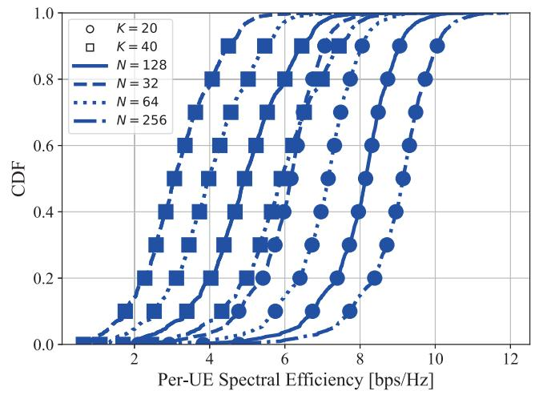  
Fig. 13. SE CDF comparison between N = 32, 64, 128, 256.

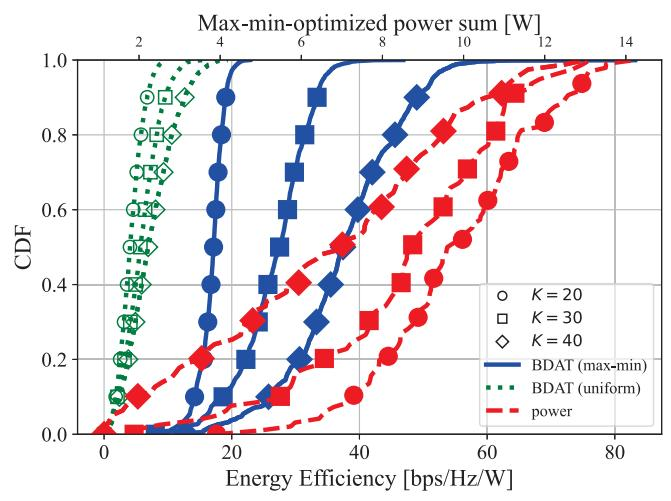  
Fig. 14. EE CDF comparison between max-min-optimized power versus uniformly-allocated power and power CDF under different UAV UE numbers.

We have also verified the advantages of the proposed wideband asynchronous architecture in Fig. 15, where the proposed architecture with BDAT overwhelms the one simply combining BDAT and the time delay network for beam split. Owing to the fully exploiting of multi-paths instead of eliminating all mismatched signals, the proposed architecture provides an excellent performance even without digital precoding. Hybrid delay hybrid beamforming architecture as Fig. 5 loses the potential of cross item gains as

$$
\zeta _ { l k ^ { \prime } k } = \sum _ { p } \beta _ { l k ^ { \prime } p } \left| \check { \mathbf { a } } _ { l k ^ { \prime } p } ^ { \dagger } \left( \sum _ { \{ ( k , m ) | ( k , m ) \in \mathcal { C } _ { l } , \forall m \} } \check { \mathbf { a } } _ { l k m } \right) \right| ^ { 2 }
$$

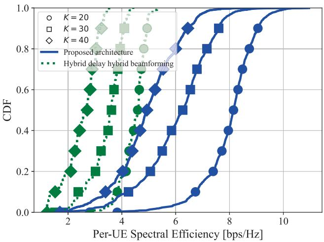  
Fig. 15. SE CDF comparison between the proposed wideband asynchronous architectures versus simple hybrid delay hybrid beamforming combined architectures under different UAV UE numbers.

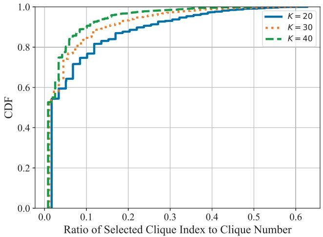  
Fig. 16. CDF of the ratio of the selected clique for the corresponding GCNbased SSP-Set to clique number.

and it only exploits

$$
\sum _ { p } \beta _ { l k ^ { \prime } p } \left| \check { \mathbf { a } } _ { l k ^ { \prime } p } ^ { \dagger } \check { \mathbf { a } } _ { l k ^ { \prime } p } \right| ^ { 2 }
$$

as equivalent channel gain. What is more important, the architecture in Fig. 5 requires the extra digital delay modules and the proposed architecture as Fig. 10 reuses the analog delay modules proposed in [37].

Finally, we validate the efficiency of the geometric scattering GCN to find the optimal maximal clique. We plot the position of the selected maximal clique in the total maximal clique list obtained by Bron-Kerbosch algorithm and sorted by clique cardinal in Fig. 16. The x-axis means the ratio of the index i of the selected maximal clique C<sup>ˆ</sup> to the length $L _ { \mathrm { c l q } }$ of the total maximal clique list, i.e., i/L. According to Fig. 16, the adopted geometric scattering GCN can find the optimal maximal clique with a small κ and we set $\kappa = 2 0$ in our experiments. It is observed that the optimal maximal clique trends to be the maximum clique whose cardinal is the largest, which enhance the advantages of geometric scattering GCN.

## VI. CONCLUSION AND FUTURE WORKS

In this paper, we investigate the implementation of asynchronous beamforming in a wideband CF-mMIMO for low-altitude coverage. A BDAT mechanism is proposed to allow the system to benefit from joint downlink regardless of asynchronous reception and an SSP-Set is adopted to avoid asynchronous interference. Based on proposed wideband asynchronous architecture, we conduct BDAT and SSP-Set with low hardware cost with a distributed way. Then a binary searching method is utilized to complete a global power optimization with scalable fronthaul overhead (regardless of UE number). Finally, a geometric scattering GCN is used to obtained a (sub)-optimal SSP-Set to avoid unaffordable latent brought by conventional iterative Bron-Kerbosch algorithm.

In the future works, the joint precoding and power allocation can be considered to obtain an optimal BDAT method, and the discussion of imperfect DoD and delay acquisition is important for a practical BDAT.

## APPENDIX A LARGE FORMULAS

$$
\begin{array} { r l } & { \mathbb { E } \{ \sum _ { k = 0 } ^ { N } \int _ { 0 } ^ { \infty } \log \hat { \Psi } _ { k } ( \hat { \textbf { r i } } ) \} + \sum _ { k = 0 } ^ { N } \exp \{ - \sum _ { k = 0 } ^ { N } \log ( \hat { \textbf { r i } } \cdot \hat { \textbf { r i } } ) \} } \\ & { = \sum _ { k = 0 } ^ { N } \exp \{ - \sum _ { k = 0 } ^ { N } \sum _ { 0 } ^ { N } \exp \hat { \Psi } _ { k } ( \hat { \textbf { r i } } ) \} + \sum _ { k = 0 } ^ { N } \exp \{ - \sum _ { k = 0 } ^ { N } \exp \{ - \sum _ { k = 0 } ^ { N } \hat { \Psi } _ { k } ( \hat { \textbf { r i } } ) \} \} } \\ & { = \sum _ { k = 0 } ^ { N } \exp \{ - \sum _ { k = 0 } ^ { N } \exp \hat { \Psi } _ { k } ( \hat { \textbf { r i } } ) \} + \sum _ { k = 0 } ^ { N } \exp \{ - \sum _ { k = 0 } ^ { N } \exp \{ - \sum _ { k = 0 } ^ { N } \hat { \Psi } _ { k } ( \hat { \textbf { r i } } ) \} \} } \\ & { = \sum _ { k = 0 } ^ { N } \exp \{ - \sum _ { k = 0 } ^ { N } \exp \hat { \Psi } _ { k } ( \hat { \textbf { r i } } ) \} + \sum _ { k = 0 } ^ { N } \exp \{ - \sum _ { k = 0 } ^ { N } \exp \{ - \sum _ { k = 0 } ^ { N } \hat { \Psi } _ { k } ( \hat { \textbf { r i } } ) \} \} } \\ &  = - \sum _ { k = 0 } ^ { N } \sum _ { 0 } ^ { N } \exp \{ - \sum _ { k = 0 } ^ { N } \exp \hat { \Psi } _ { k } ( \hat { \textbf { r i } } ) \} + \sum _ { k = 0 } ^ { N } \exp \{ - \sum _ { k = 0 } ^ { N } \exp \{ - \sum _ { k = 0 } ^ \end{array}\tag{7}
$$

$$
\begin{array} { l } { { \displaystyle y _ { l k ^ { \prime } } [ t ] } } \\ { { \displaystyle = \sum _ { p = 1 } ^ { P } { \bf h } _ { l k ^ { \prime } p } ^ { \dagger } \sum _ { k = 1 } ^ { K } \sum _ { m = 1 } ^ { P } \alpha _ { l k m } { \tilde { \bf f } } _ { l k m } x _ { l k m } \left[ t - \varDelta _ { l k m } - \tau _ { l k ^ { \prime } p } \right] } } \\ { { \displaystyle = \sum _ { p = 1 } ^ { P } { \bf h } _ { l k ^ { \prime } p } ^ { \dagger } \sum _ { k = 1 } ^ { K } \sum _ { m = 1 } ^ { P } \alpha _ { l k m } { \tilde { \bf f } } _ { l k m } \sum _ { n = 1 } ^ { K } w _ { l k m n } s _ { n } \left[ t - \varDelta _ { l k m } - \tau _ { l k ^ { \prime } p } \right] } } \end{array}
$$

$$
\begin{array} { r l } & { \quad \sum _ { n = 1 } ^ { N } \displaystyle \sum _ { i = \nu } ^ { N } \sum _ { i = \nu } ^ { N } \sum _ { \alpha = 1 } ^ { N } \alpha _ { i , \alpha } \alpha _ { i + \alpha } \alpha _ { i + \alpha } \alpha _ { i + \alpha } \alpha _ { i + \alpha } \alpha _ { i + \alpha } \alpha _ { i + \alpha } \alpha _ { i + \alpha } } \\ & { \quad \quad \quad \quad \quad \quad \quad \quad \quad \quad \quad \quad \quad \quad \quad \quad \quad \quad \quad \quad \quad \quad \quad \quad \quad \quad \quad \quad \quad \quad \quad \quad \quad \quad \quad \quad \quad \quad \quad \quad \quad \quad \quad \quad \quad \quad \quad \quad \quad \quad \quad \quad } \\ & { \quad \quad \quad \quad \quad \quad \quad \quad \quad \quad \quad \quad \quad \quad \quad \quad \quad \quad \quad \quad \quad \quad \quad \quad \quad \quad \quad \quad \quad \quad \quad \quad \quad \quad \quad \quad \quad \quad \quad \quad \quad \quad \quad \quad \quad \quad \quad \quad \quad \quad \quad \quad \quad \quad \quad \quad } \\ & { \quad \quad \quad \quad \quad \quad \quad \quad \quad \quad \quad \quad \quad \quad \quad \quad \quad \quad \quad \quad \quad \quad \quad \quad \quad \quad \quad \quad \quad \quad \quad \quad \quad \quad \quad \quad \quad \quad \quad \quad \quad \quad \quad \quad \quad \quad \quad \quad \quad \quad \quad \quad \quad \quad \quad \quad \quad } \\ & { \quad \quad \quad \quad \quad \quad \quad \quad \quad \quad \quad \quad \quad \quad \quad \quad \quad \quad \quad \quad \quad \quad \quad \quad \quad \quad \quad \quad \quad \quad \quad \quad \quad \quad \quad \quad \quad \quad \quad \quad \quad \quad \quad \quad \quad \quad \quad \quad \quad \quad \quad \quad \quad } \\ & { \quad \quad \quad \quad \quad \quad \quad \quad \quad \quad \quad \quad \quad \quad \quad \quad \quad \quad \quad \quad \quad \quad \quad \quad \quad \quad \quad \quad \quad \quad \quad \quad \quad \quad \quad \quad \quad \quad \quad \quad \quad \quad \quad \quad \quad \quad \quad \quad } \\ &  \quad \quad \quad \quad \quad \quad \quad \quad \quad \quad \quad \quad \quad \quad \quad \quad \quad \quad \quad \quad \quad \quad \quad \quad \quad  \end{array}\tag{38}
$$

## REFERENCES

[1] C. Huang, S. Fang, H. Wu, Y. Wang, and Y. Yang, “Low-altitude intelligent transportation: System architecture, infrastructure, and key technologies,” J. Ind. Inf. Integr., vol. 42, Nov. 2024, Art. no. 100694.

[2] Y. Jiang et al., “6G non-terrestrial networks enabled low-altitude economy: Opportunities and challenges,” 2023, arXiv:2311.09047.

[3] L. Gupta, R. Jain, and G. Vaszkun, “Survey of important issues in UAV communication networks,” IEEE Commun. Surveys Tuts., vol. 18, no. 2, pp. 1123–1152, 2nd Quart., 2016.

[4] M. Giordani and M. Zorzi, “Non-terrestrial networks in the 6G era: Challenges and opportunities,” IEEE Netw., vol. 35, no. 2, pp. 244–251, Mar. 2021.

[5] J. Li et al., “Low altitude 3-D coverage performance analysis of cellfree RAN for 6G systems,” IEEE Trans. Veh. Technol., vol. 72, no. 12, pp. 16163–16176, Dec. 2023.

[6] W. Zhou, W. Jiao, L. Suo, and C. Li, “Max-min energy efficient optimization for RIS-aided cell-free MIMO systems with statistical CSI,” IEEE Wireless Commun. Lett., vol. 13, no. 12, pp. 3518–3522, Dec. 2024.

[7] W. Zhou, Y. Xu, M. Hua, and C. Li, “Capacity optimization for 6G cellfree MIMO systems over spatially correlated Rayleigh fading channels,” IEEE Trans. Veh. Technol., vol. 74, no. 4, pp. 6733–6738, Apr. 2025.

[8] D. Wang et al., “Full-spectrum cell-free RAN for 6G systems: System design and experimental results,” Sci. China Inf. Sci., vol. 66, no. 3, Mar. 2023, Art. no. 130305.

[9] F. Zeng et al., “Multi-static ISAC based on network-assisted fullduplex cell-free networks: Performance analysis and duplex mode optimization,” Sci. China Inf. Sci., vol. 68, no. 5, May 2025, Art. no. 150303.

[10] J. Zheng, J. Zhang, and B. Ai, “UAV communications with WPT-aided cell-free massive MIMO systems,” IEEE J. Sel. Areas Commun., vol. 39, no. 10, pp. 3114–3128, Oct. 2021.

[11] J. Li, Z. Wu, Z. Wan, P. Zhu, D. Wang, and X. You, “Structured tensor CP decomposition-aided pilot decontamination for UAV communication in cell-free massive MIMO systems,” IEEE Commun. Lett., vol. 26, no. 9, pp. 2156–2160, Sep. 2022.

[12] M. Elwekeil, A. Zappone, and S. Buzzi, “Power control in cell-free massive MIMO networks for UAVs URLLC under the finite blocklength regime,” IEEE Trans. Commun., vol. 71, no. 2, pp. 1126–1140, Feb. 2023.

[13] Y. Qin, M. A. Kishk, and M.-S. Alouini, “Stochastic geometry-based analysis of cell-free massive MIMO systems with aerial users,” IEEE Trans. Commun., vol. 73, no. 7, pp. 5231–5246, Jul. 2025.

[14] J. Xu, X. Sun, J. Li, P. Zhu, and D. Wang, “Mobility management in lowaltitude cell-free radio access network,” IEEE Trans. Green Commun. Netw., early access, Jan. 20, 2025, doi: 10.1109/TGCN.2025.3532114.

[15] Y. Xiao et al., “Space-air-ground integrated wireless networks for 6G: Basics, key technologies, and future trends,” IEEE J. Sel. Areas Commun., vol. 42, no. 12, pp. 3327–3354, Dec. 2024.

[16] S. Euler, X. Lin, E. Tejedor, and E. Obregon, “High-altitude platform stations as international mobile telecommunications base stations: A primer on HIBS,” IEEE Veh. Technol. Mag., vol. 17, no. 4, pp. 92–100, Dec. 2022.

[17] H. A. Ammar, R. Adve, S. Shahbazpanahi, G. Boudreau, and K. V. Srinivas, “User-centric cell-free massive MIMO networks: A survey of opportunities, challenges and solutions,” IEEE Commun. Surveys Tuts., vol. 24, no. 1, pp. 611–652, 1st Quart., 2022.

[18] S. Xu, Z. Zhang, Y. Xu, C. Li, and L. Yang, “Deep reciprocity calibration for TDD mmWave massive MIMO systems toward 6G,” IEEE Trans. Wireless Commun., vol. 23, no. 10, pp. 13285–13299, Oct. 2024.

[19] S. Xu, Y. Cao, C. Li, D. Wang, and L. Yang, “Spanning tree method for over-the-air channel calibration in 6G cell-free massive MIMO,” IEEE Trans. Wireless Commun., vol. 22, no. 8, pp. 5567–5582, Aug. 2023.

[20] X. Li et al., “Integrated sensing, communication, and computation overthe-air: MIMO beamforming design,” IEEE Trans. Wireless Commun., vol. 22, no. 8, pp. 5383–5398, Aug. 2023.

[21] X. Li, G. Zhu, Y. Gong, and K. Huang, “Wirelessly powered data aggregation for IoT via over-the-air function computation: Beamforming and power control,” IEEE Trans. Wireless Commun., vol. 18, no. 7, pp. 3437–3452, Jul. 2019.

[22] X. Li, Y. Gong, K. Huang, and Z. Niu, “Over-the-air integrated sensing, communication, and computation in IoT networks,” IEEE Wireless Commun., vol. 30, no. 1, pp. 32–38, Feb. 2023.

[23] H. Yan and I.-T. Lu, “Asynchronous reception effects on distributed massive MIMO-OFDM system,” IEEE Trans. Commun., vol. 67, no. 7, pp. 4782–4794, Jul. 2019.

[24] J. Li, M. Liu, P. Zhu, D. Wang, and X. You, “Impacts of asynchronous reception on cell-free distributed massive MIMO systems,” IEEE Trans. Veh. Technol., vol. 70, no. 10, pp. 11106–11110, Oct. 2021.

[25] J. Zheng, Z. Zhao, J. Zhang, J. Cheng, and V. C. M. Leung, “Performance analysis of cell-free massive MIMO systems with asynchronous reception,” in Proc. IEEE Globecom Workshops, Apr. 2022, pp. 190–195.

[26] J. Zheng, J. Zhang, J. Cheng, V. C. M. Leung, D. W. K. Ng, and B. Ai, “Asynchronous cell-free massive MIMO with rate-splitting,” IEEE J. Sel. Areas Commun., vol. 41, no. 5, pp. 1366–1382, May 2023.

[27] Y. Qi, J. Dang, Z. Zhang, L. Wu, and Y. Wu, “Downlink precoding for cell-free FBMC/OQAM systems with asynchronous reception,” IEEE Commun. Lett., vol. 27, no. 9, pp. 2427–2431, Sep. 2023.

[28] G. Li, S. Wu, C. You, W. Zhang, G. Shang, and X. Zhou, “Cellfree massive MIMO-OFDM: Asynchronous reception and performance analysis,” IEEE Internet Things J., vol. 11, no. 7, pp. 11894–11906, Apr. 2024.

[29] M. Jafri, S. Srivastava, N. K. D. Venkategowda, A. K. Jagannatham, and L. Hanzo, “Cooperative hybrid transmit beamforming in cell-free mmWave MIMO networks,” IEEE Trans. Veh. Technol., vol. 72, no. 5, pp. 6023–6038, May 2023.

[30] M. Jafri, S. Srivastava, P. Kumar, A. K. Jagannatham, and L. Hanzo, “Cooperative hybrid beamforming for the mitigation of realistic asynchronous interference in cell-free mmWave MIMO networks,” IEEE Trans. Commun., vol. 72, no. 11, pp. 6737–6751, Nov. 2024.

[31] L. You, X. Gao, G. Y. Li, X.-G. Xia, and N. Ma, “BDMA for millimeter-wave/Terahertz massive MIMO transmission with perbeam synchronization,” IEEE J. Sel. Areas Commun., vol. 35, no. 7, pp. 1550–1563, Jul. 2017.

[32] P. Xin, Y. Cao, Y. Wu, D. Wang, X. You, and J. Wang, “Hybrid precoding with per-beam timing advance for asynchronous cell-free mmWave massive MIMO-OFDM systems,” 2024, arXiv:2411.05305.

[33] D. Headland, Y. Monnai, D. Abbott, C. Fumeaux, and W. Withayachumnankul, “Tutorial: Terahertz beamforming, from concepts to realizations,” APL Photon., vol. 3, no. 5, May 2018, Art. no. 051101.

[34] X. Liu and D. Qiao, “Space-time block coding-based beamforming for beam squint compensation,” IEEE Wireless Commun. Lett., vol. 8, no. 1, pp. 241–244, Feb. 2019.

[35] H. Hashemi, T.-S. Chu, and J. Roderick, “Integrated true-time-delaybased ultra-wideband array processing,” IEEE Commun. Mag., vol. 46, no. 9, pp. 162–172, Sep. 2008.

[36] C. Lin, G. Y. Li, and L. Wang, “Subarray-based coordinated beamforming training for mmWave and sub-THz communications,” IEEE J. Sel. Areas Commun., vol. 35, no. 9, pp. 2115–2126, Sep. 2017.

[37] L. Dai, J. Tan, Z. Chen, and H. V. Poor, “Delay-phase precoding for wideband THz massive MIMO,” IEEE Trans. Wireless Commun., vol. 21, no. 9, pp. 7271–7286, Sep. 2022.

[38] NR; Physical Channels and Modulation, document TS 38.211, 3rd Generation Partnership Project, Jan. 2018.

[39] Z. Hong, T. Li, S. Xu, C. Li, D. Wang, and X. You, “User-centric alignment transmission for asynchronous mmWave cell-free massive MIMO downlink with cooperative computation,” in Proc. IEEE Wireless Commun. Netw. Conf. (WCNC), Mar. 2025, pp. 01–06.

[40] A. Khanfor, H. Ghazzai, Y. Yang, and Y. Massoud, “Application of community detection algorithms on social internet-of-things networks,” in Proc. 31st Int. Conf. Microelectron. (ICM), Cairo, Egypt, 2019, pp. 94–97.

[41] Y. Min, F. Wenkel, M. Perlmutter, and G. Wolf, “Can hybrid geometric scattering networks help solve the maximum clique problem?,” in Proc. Adv. Neural Inf. Process. Syst., 2022, pp. 22713–22724.

  
Ziyao Hong (Graduate Student Member, IEEE) received the M.S. degree in signal and information processing from Nanjing University of Posts and Telecommunications (NJUPT), Nanjing, China, in 2021. He is currently pursuing the Ph.D. degree in communication and information systems. He is with the National Mobile Communications Research Laboratory, Southeast University (SEU), Nanjing, China. His current research interests and activities include cell-free networks, distributed calculation, and artificial intelligence applications in communi-

cations. He received the Excellent Master’s Thesis Award from NJUPT and Jiangsu Province of China in 2022.


Ting Li received the B.S., M.S., and Ph.D. degrees from the School of Information Science and Engineering, Southeast University, Nanjing, China, in 2001, 2004, and 2009, respectively. He is currently an Associate Professor at the College of Communication and Information Engineering, Nanjing University of Posts and Telecommunications, China. He has published more than 40 research articles. His research interests include wireless communication for 6G, quantum computing, and quantum machine learning.


Shu Xu (Member, IEEE) received the B.S. degree in electronic and information engineering from Nanjing University of Aeronautics and Astronautics, Nanjing, China, in 2020. He is currently pursuing the Ph.D. degree in information and communication engineering with the School of Information Science and Engineering, Southeast University. His current research interests include 6G cell-free distributed MIMO wireless communications, integrated sensing and communication (ISAC) systems, reciprocity calibration, and wireless big data.


Chunguo Li (Senior Member, IEEE) received the bachelor’s degree in wireless communications from Shandong University in 2005 and the Ph.D. degree in wireless communications from Southeast University, Nanjing, China, in 2010.

2014, he was with the DSL Laboratory of Stanford University as a Visiting Associate Professor. From August 2017 to July 2019, he was an Adjunct Professor with Xizang Minzu University under the support of the Tibet Program organized by China National Human Resources Ministry. His research interests include 6G cell-free distributed MIMO wireless communications, information theories, and AI-based audio signal processing. He is a fellow of IET and China Institute of Communications (CIC) and the Chair of the IEEE Computational Intelligence Society Nanjing Chapter and the Advisory Committee for the Instruments Industry in Jiangsu. He has served as an editor for a couple of international journals and as the session chair for many international conferences.

In July 2010, he joined the faculty of Southeast University, where he was an Associate Professor from 2012 to 2016 and has been a Full Professor since 2017. From June 2012 to June 2013, he was a Post-Doctoral Researcher with Concordia University, Montreal, Canada. From July 2013 to August

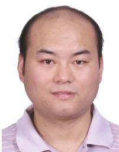

Dongming Wang (Member, IEEE) received the B.S. degree from Chongqing University of Posts and Telecommunications in 1999, the M.S. degree from Nanjing University of Posts and Telecommunications in 2002, and the Ph.D. degree from Southeast University, China, in 2006. He joined the National Mobile Communications Research Laboratory, Southeast University, in 2006, where he is currently a Professor. His research interests include signal processing for wireless communications and large-scale distributed MIMO systems (cell-free massive MIMO).


Xiaohu You (Fellow, IEEE) received the B.S., M.S., and Ph.D. degrees in electrical engineering from Nanjing Institute of Technology, Nanjing, China, in 1982, 1985, and 1989, respectively. From 1987 to 1989, he was with Nanjing Institute of Technology as a Lecturer. Since 1990, he has been with Southeast University as an Associate Professor and later as a Professor. He is currently the Chief of the Technical Group of China 3G/B3G Mobile Communication Research and Development Project. His research interests include mobile communications, adaptive signal processing, and artificial neural networks with applications to communications and biomedical engineering. He received the Excellent Paper Prize from China Institute of Communications in 1987 and the Elite Outstanding Young Teacher Awards from Southeast University in 1990, 1991, and 1993. He was also a recipient of the 1989 Young Teacher Award of the Fok Ying Tung Education Foundation, State Education Commission of China.