# V-Recover: Virtual Machine Recovery When Live Migration Fails

Dinuni Fernando , Jonathan Terner , Ping Yang , and Kartik Gopalan

Abstract— Live migration is a critical technology used in cloud infrastructures to transfer running virtual machines (VMs). When live migration fails, as it often does, it is critical that any VMs in transit are not lost. There are two primary live migration techniques – pre-copy and post-copy. Pre-copy transfers a VM’s memory to the destination before its virtual CPUs are transferred, whereas post-copy does the reverse. Both pre-copy and post-copy will lose the VM if the source machine fails during migration. Additionally, post-copy can lose the VM if the destination machine or network fail since the VM’s memory and execution state are split across the source and destination machines. We present V-Recover, an approach to recover a VM when the source, destination, or network fails during live migration. V-Recover consists of two techniques: (1) a forward incremental checkpointing (FIC) mechanism to handle source machine failure during both pre-copy and post-copy, and (2) a reverse incremental checkpointing (RIC) mechanism to handle destination or network failure during post-copy. We present the design, implementation, and evaluation of V-Recover in the KVM/QEMU virtualization platform. Our evaluations show that V-Recover effectively recovers a VM upon migration failure with acceptable overheads on migration metrics and application performance.

Index Terms—Virtual machine, live migration, fault tolerance.

## I. INTRODUCTION

V IRTUAL machine (VM) migration transfers a VM froma source physical machine to a destination physical machine. In live VM migration, the VM keeps executing during migration for all but a short duration, known as downtime, which is usually when its CPU execution state is transferred. Live VM migration is a key technology used in cloud platforms for routine server maintenance, load balancing, scaling to meet performance demands, and consolidation to save energy. Most major hypervisors such as VMware [1], [2], KVM [3], Xen [4], [5], [6], and Hyper-V [7] support live VM migration. Live VM migration is also used by many cloud platforms, such as in Google’s production infrastructure, which performs over a million migrations each month [8].

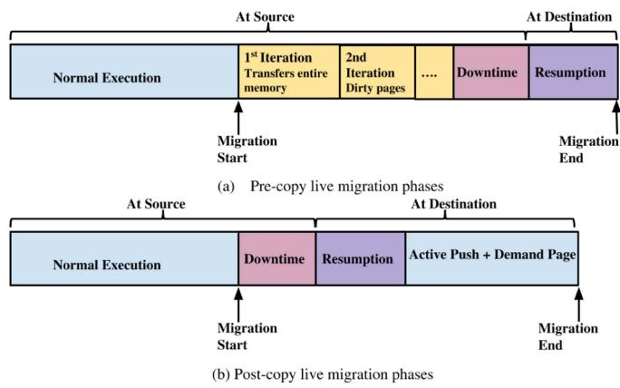  
Fig. 1. Timeline of pre-copy and post-copy live migration.

Existing live VM migration techniques aim to migrate VMs as quickly as possible to the destination with minimal performance impact on applications running inside the VM. There are two predominant live VM migration techniques: pre-copy [1], [6] and post-copy [9], [10]. The two techniques differ in whether a VM’s memory pages are transferred before or after the transfer of its virtual CPUs (VCPUs).

In the rest of this section, we first provide a brief overview of pre-copy and post-copy live migration, then describe the problem of failure resilience in live migration, followed by a summary of our contributions in this paper.

## A. Overview of Pre-Copy and Post-Copy

Fig. 1 shows the timeline of traditional pre-copy and post-copy live migration techniques. In pre-copy migration, the VM to be migrated initially continues execution at the source machine while its memory contents are concurrently transferred to the destination over multiple rounds (or iterations). In the first round, all memory pages are transferred, whereas subsequent rounds transfer only the pages modified (or dirtied) by the VM during the preceding round. The downtime begins when the number of dirty pages remaining becomes less than a predefined threshold. During downtime, the source machine pauses the VM’s VCPUs and transfers all the dirty pages and VCPU states to the destination. The VM is then resumed at the destination and migration completes.

Pre-copy works well for VMs that mostly read from memory, i.e., read-intensive VMs. However, for write-intensive VMs, pre-copy rounds may not converge quickly to downtime, if ever, because each round would have substantial amount of dirty memory pages to transfer from the preceding round. Thus, for write-intensive VMs, pre-copy migration experiences a long total migration time (due to many pre-copy rounds) and significant downtime (due to many dirty pages transferred during the downtime).

Post-copy migration solves the above deficiency of pre-copy in migrating write-intensive VMs. In post-copy, the VM is first suspended on the source machine and it’s VCPU states are transferred to the destination. The VCPUs are immediately resumed at the destination even though the VM’s memory pages have not yet been transferred. Concurrently, the memory pages are actively pushed from the source to the destination, with the expectation that most pages would reach the destination before they are accessed by the VM. If the VM accesses a page at the destination that has not yet been pushed from the source, then a page fault is triggered. The faulted page is then demand paged (explicitly requested) over the network from the source machine. Such remotely-serviced page faults may temporarily slow down the VM’s progress at the destination until its full working set is transferred from the source. To reduce the number of page-faults, the source machine can prioritize pushing the VM’s working set, such as pages around the location of the last page-fault, so that most pages can be sent before the VM faults on them.

Post-copy works equally well whether a VM’s workload is read-intensive or write-intensive because each page is transferred over the network exactly once. In contrast, pre-copy transfers dirtied pages multiple times, causing increased network traffic and longer migration time. Google’s data centers [8] use both techniques depending on whether the VM’s workload is read-intensive or write-intensive.

## B. Failure Resilience Problem of Live Migration

An important consideration in live VM migration, and the focus of this paper, is the robustness of the live migration mechanism. Specifically, the source, the destination, or the network can fail during the live migration. Since a VM encapsulates a cloud customer’s critical workload, it is essential that the VM’s execution state is preserved accurately and not lost due to failures during live migration.

In both techniques, the failure of the source machine during the migration could result in a permanent loss of the VM because some or all of the latest VM state resides at the source machine. Specifically, for pre-copy, the source contains the latest dirtied memory pages and execution state (VCPUs and I/O); for postcopy the source contains pages that have not yet been transferred to the destination. A loss of the source in either case would leave the VM in an unrecoverable state.

However, pre-copy and post-copy differ in their resilience to failure of the destination machine or the network. It turns out that post-copy has worse failure resilience than pre-copy. For pre-copy, a failure of the destination machine or the network is not catastrophic, because the source machine still holds an up-to-date copy of the VM’s memory and execution state and hence the VM is not lost. However, for post-copy, a destination or network failure is still catastrophic because the latest state of the VM is split between the source and the destination machines. The destination machine has a more up-to-date copy of the VM’s execution state and some of its memory pages that have been transferred, whereas the source machine holds pages that are yet to be transferred. Thus, a destination or network failure during post-copy migration results in an irrecoverable loss of the VM.

To the best of our knowledge, the above failure scenarios involving a potential loss of the VM and its recovery has not been addressed by other researchers. The problem is important because a VM is particularly vulnerable during live migration. VM migration may last anywhere from a few seconds to several minutes, depending on a number of factors such as the VM’s memory size, the applications running inside the VM, and other workload in the cluster. Thus the window of vulnerability is significant. In addition, because the VM is live during the migration, it might communicate over the network with remote entities, altering the external world’s view of the VM’s state. Hence, upon failure, one cannot simply revert the VM to an older snapshot that was saved before the migration began.

## C. Contributions

We propose a technique called V-Recover to recover a VM upon the failure of the source, destination, or network during live migration. V-Recover has two components: (1) forward incremental checkpointing (FIC) to handle source machine failure, and (2) reverse incremental checkpointing (RIC) to handle destination or network failure.

The key idea behind FIC is as follows. Prior to migration, the source machine periodically saves forward incremental checkpoints of the VM to another machine (other than the source). Each forward checkpoint consists of the incremental state of the VM since the previous checkpoint. For pre-copy migration, the incremental checkpointing continues during the live pre-copy rounds. A final forward incremental checkpoint is performed for both pre-copy and post-copy just before downtime begins. If the source machine fails during live migration, then the lost VM state can be recovered by combining the VM states saved in the forward incremental checkpoint and the state already transferred to the destination.

RIC, on the other hand, can be used during post-copy to handle destination and network failures. Once a VM resumes execution at the destination, the destination transmits incremental checkpoints of the VM to an in-memory checkpoint store at another machine (either a third machine or the source itself). Reverse checkpointing proceeds concurrently, and in coordination with, the forward post-copy migration from source to destination. These reverse checkpoints can be sent either periodically or upon external I/O activities of the VM (i.e., event-based checkpointing). If the destination or the network fails during the post-copy, then the source machine restores the VM from the last consistent reverse checkpoint received from the destination.

Note that the incremental checkpoints are much smaller than full-VM checkpoints because they consist of only the VM’s modified memory pages since the last checkpoint, plus its VCPU and I/O states. We store the incremental checkpoints in an in-memory checkpoint store, instead of a disk, to reduce the time spent in transferring the checkpoints and to speed up the restoration process. For checkpoint consistency, packet transmissions from the VM to the external world are buffered between successive incremental checkpoints.

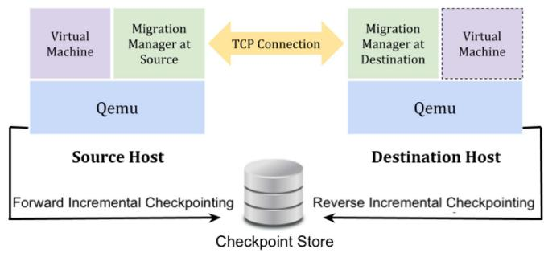  
Fig. 2. The architecture of V-Recover.

We implemented and evaluated a prototype of V-Recover in the KVM/QEMU virtualization platform. Our evaluations of the prototype using a variety of benchmarks show that V-Recover can effectively recover a VM upon live migration failure with acceptable overheads on live migration metrics and application performance.

A preliminary version of this paper [11] addressed destination and network failure during post-copy through reverse incremental checkpointing. This paper significantly extends our prior work by addressing source failures during both pre-copy and post-copy migration. We have also conducted extensive additional experiments to evaluate the effectiveness of V-Recover using various standard benchmarks such as STREAM, Sysbench and YCSB.

The rest of the paper is organized as follows. Sections II and III present the design and the implementation of V-Recover, respectively. Section IV provides the evaluation results of V-Recover. Related work is discussed in Sections V and VI concludes the paper.

## II. V-RECOVER DESIGN

V-Recover is designed to recover a VM when the source, the destination, or the network fails during live migration of the VM. Figs. 2 and 3 provide V-Recover’s architecture and operation timeline, respectively. As mentioned earlier, V-Recover consists of two main components: forward incremental checkpointing (FIC) and reverse incremental checkpointing (RIC). FIC can be used with both pre-copy and post-copy to handle source machine failure whereas RIC is specifically designed for post-copy to handle the failure of the destination machine or the network. FIC operates prior to downtime in both pre-copy and post-copy, whereas RIC operates after downtime only in post-copy.

Upon source failure, for pre-copy, one must resort to non-live VM recovery using forward checkpoints. On the other hand, post-copy can perform live VM recovery upon source failure because the destination is executing the latest VM state and only the VM’s missing memory pages need to be restored. Upon a destination or network failure, pre-copy migration is not affected as discussed earlier. However for post-copy, one must perform non-live VM recovery by loading the latest reverse checkpoints captured by RIC.

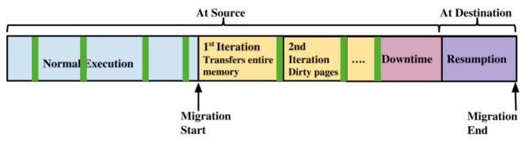  
(a) Pre-copy : FIC before downtime.

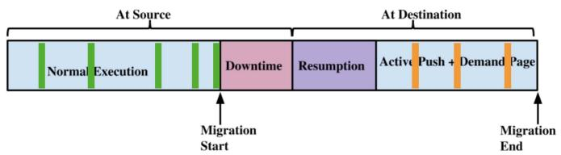  
(b) Post-copy : FIC before downtime and RIC after downtime  
Fig. 3. Timeline of V-Recover in pre-copy and post-copy. Vertical bars in the timeline represent incremental checkpoints. FIC operates before downtime. RIC operates in post-copy after downtime.

Our failure model in V-Recover is as follows. We assume that only one failure occurs before the VM is recovered, i.e., only one of the source machine, the destination machine, or the network fails. We assume that there are no additional failures during VM recovery. We further assume that the machine containing the incremental checkpoints (the checkpoint server) remains accessible over the network to the machine performing the recovery. Specifically, the destination machine should be able to access forward checkpoints to recover from source failures and the source machine should be able to access reverse checkpoints to recover from destination and network failures. Additionally, upon a network failure that prevents the source and destination from communicating, to prevent VM duplication by both the source and destination machines, we assume that the checkpoint server is placed such that it is accessible only by the source and not by the destination, so that only the source machine can perform the VM recovery. For instance, when migrating a VM across two racks, the above conditions can be met by placing the checkpoint server on the source rack, further assuming that there are no intra-rack network failures. We do not consider multiple failure scenarios in this paper even though some of them could be potentially handled by our techniques; for instance, the checkpoint server could potentially reconstruct a VM on its own in case both the source and destination machines fail together. Failures that occur before or after the live migration can be handled by existing fault tolerance solutions [12], [13]. Storage failures can be mitigated using existing storage redundancy and recovery techniques [14]. Migration failures due to software bugs are not considered in this paper.

## A. Forward Incremental Checkpointing (FIC)

FIC aims to recover a VM when the source machine fails during live migration. When a VM starts, FIC transfers an initial full VM checkpoint to a checkpoint store, which is an in-memory key-value store located at a third staging machine. Thereafter, during the VM’s normal execution at the source, FIC periodically saves partial incremental checkpoints of the VM’s modified memory pages to the checkpoint store. Just before downtime is to begin, the VM’s execution at the source is paused and FIC transfers a final and consistent incremental checkpoint of the VM to the checkpoint store.

Overhead Reduction. FIC periodically transfers incremental partial memory checkpoints during the normal execution of the VM with limits on the rate of memory transfer. The VM’s execution is not paused during partial checkpoints since only modified memory pages are transferred. Specifically, at every periodic time interval I (a few minutes or seconds) FIC transfers modified memory pages that haven’t yet been transferred to the checkpoint store. The number of pages transferred in each interval is bounded by either a maximum count N or a time limit T , whichever is reached first. All three parameters I, N, and T are configurable to reduce the overhead of FIC on the normal execution of VMs. These partial memory checkpoints together constitute progress towards a complete incremental checkpoint, when the VCPU execution state is also captured. To reduce the impact on application performance during VM recovery, the checkpoint store periodically merges the incremental checkpoints into a latest memory checkpoint.

Instead of performing incremental live checkpointing prior to migration, one could alternatively checkpoint the VM’s entire memory and execution state once just before live migration begins. If such a checkpointing was non-live, then it would introduce significant downtime. Additionally, network transfer to checkpoint store would compete for network bandwidth with live migration, thus prolonging the total migration time. Hence we chose a live FIC design that performs periodic partial incremental memory checkpointing to amortize the cost of FIC over the lifetime of the VM at the source.

Multiple VMs. In cloud environments, a physical machine often hosts multiple VMs, any of which can be migrated in advance. As a result, FIC must periodically checkpoint all VMs’ memory states to different checkpoint store instances. Partial memory checkpointing allows FIC to limit the rate at which memory pages are checkpointed and transferred periodically. It is also possible that FIC may be checkpointing one VM while another VM is being live migrated, leading to contention on the shared network interface. To reduce this contention, FIC monitors the available outgoing network bandwidth on the source machine prior to checkpointing and, if necessary, reduces the checkpointing frequency and the amount of memory checkpointed periodically.

Recovery From Source Failure. The source and destination machines use a heartbeat mechanism to monitor each other’s availability during live migration. When successive heartbeat messages are not acknowledged by the source, the destination concludes that either the source or the network has failed and the restoration manager at the destination triggers a VM recovery. If the checkpoint store is reachable from the destination, then the restoration manager loads any missing pages from the checkpoint store instead of the failed source machine.

The VM recovery process in post-copy is live, during which the VM is continuously running at the destination. Therefore, the recovery mechanism does not impose any significant additional downtime on post-copy, other than the time for switching page transfers from the source machine to the checkpoint store upon detecting source failure. On the other hand, pre-copy migration keeps the VM running at the source. Hence, if the source machine fails during pre-copy migration then the VM’s recovery must be performed non-live using the forward checkpoint saved in the checkpoint store.

## B. Reverse Incremental Checkpointing (RIC)

RIC aims to recover a VM when the destination or the network fails during post-copy. (As mentioned earlier, these two failures during pre-copy can be trivially handled by continuing to run the VM at the source.) The first step of post-copy is to transfer the VCPU state of the VM to the destination. The VM is then resumed at the destination while concurrently receiving the VM’s memory pages from the source. RIC superimposes a reverse incremental checkpointing mechanism over this forward transfer of the VM state. Specifically, once a VM is resumed at the destination, RIC captures the VM’s initial execution state and modified memory at the destination and transfers them to a checkpoint store. Then onward, RIC saves any incremental changes in the VM’s state to the checkpoint store, including the execution state and any modified memory pages, either periodically or upon any external I/O activity by the VM. RIC stops once the migration succeeds.

To ensure the consistency of the reverse checkpoints, RIC buffers packet transmissions from the VM to external world between successive incremental checkpoints. The incoming network packets of the migrating VM are delivered to the VM immediately, but the outgoing network packets are buffered until the current reverse checkpoint is committed, after which any packets in the network buffer are transmitted and the VM is resumed. This ensures that the external world’s view of the VM does not change before the corresponding checkpoint is committed to the checkpoint store. Thus, if the destination or network fails during the migration, RIC guarantees that the latest committed checkpoint reflects a consistent state of the VM.

Overhead Reduction. To minimize impact on normal postcopy migration, RIC executes concurrently with the VM. The only time RIC affects the VM’s execution is when the VCPUs are suspended briefly to capture the VM’s execution state. The active-push phase of post-copy from the source to the destination runs concurrently with the RIC mechanism even when the VC-PUs are paused. This helps RIC to achieve similar total migration time as post-copy. Periodic checkpointing may also impact the performance of write-intensive VMs whose pages are dirtied often. To reduce this impact, RIC performs VM checkpointing in two stages. In Stage 1, RIC checkpoints only the modified memory pages of the VM, but not its execution state (i.e., the VM’s CPU and device states). The modified memory pages are checkpointed without pausing the VM to avoid interrupting the VM’s workloads. In Stage 2, the VM is paused briefly to capture the VM’s execution state, after which the VM resumes its execution. The committed checkpoint contains the memory pages checkpointed in both stages. If a memory page is checkpointed in both stages, then the version checkpointed in Stage 1 is overwritten by that in Stage 2 to ensure that the checkpoint contains the most up-to-date page. Checkpointing in two stages significantly reduces the performance impact compared to if the VM was fully paused during memory capture.

Recovery From Destination or Network Failure During Post-Copy. The source and destination machines use heartbeat messages to monitor the liveness and reachability of each other. When successive heartbeat messages are not acknowledged by the destination, the source concludes that the migration has failed, either due to a destination failure or a network partition, and the restoration manager at the source machine triggers a VM recovery. The source machine then recovers the VM by restoring the last consistent reverse checkpoint of each memory page from the checkpoint store onto the VM’s memory address space at the source. Pages not modified by the destination do not need to be overwritten. Finally, the VM is resumed at the source from the latest checkpointed execution state to complete the VM’s recovery.

## III. IMPLEMENTATION DETAILS

We have implemented V-Recover in the KVM/QEMU [3], [15] virtualization platform. Each VM is associated with a userspace management process, called QEMU, which performs device emulation and various management functions, including live migration and checkpointing. A kernel module, called KVM, uses hardware virtualization features and coordinates with QEMU to execute the VM in guest mode (or non-root mode). We modify pre-copy and post-copy migration code in QEMU (about 1500 lines of new code) to implement both FIC and RIC. The guest OS and applications inside the VM are unmodified in our implementation.

## A. FIC Implementation

FIC is implemented as a separate thread in QEMU on the source machine and executes concurrently with the normal execution of the VM prior to the start of downtime.

Dirty Page Tracking. FIC utilizes the dirty page tracking mechanism in KVM/QEMU to identify modified memory pages of a VM for forward checkpointing. The dirty page tracking mechanism represents the VM’s memory content as a bitmap, in which each bit specifies whether a guest page has been modified or not since the last check. FIC uses a separate bitmap, called ft\_bitmap, to identify the VM’s memory pages modified during each checkpointing round. During a VM’s normal execution, FIC makes an ioctl() call to ask KVM to start dirty page tracking. In each forward checkpointing cycle, FIC makes another ioctl() call to synchronize the ft\_bitmap with the KVM’s bitmap to ensure that ft\_bitmap reflects the latest VM state. FIC then captures the modified memory pages by reading ft\_bitmap in QEMU and transfers the memory pages to the checkpoint store. Just before downtime begins, FIC uses the ft\_bitmap to capture a final incremental checkpoint at the source.

Computing Available Bandwidth. As mentioned earlier, FIC controls the checkpoint transfer rate based on the available bandwidth. In FIC, the network usage of the source machine is measured by capturing the total data packets received and transmitted over the Ethernet interface using the ifconfig utility, which provides statistics about the network interface. The bandwidth monitoring module on the source machine uses message queues to send the available network bandwidth to the checkpoint transfer thread running in QEMU. The checkpoint transfer thread then estimates the maximum number of pages to transfer based on bandwidth availability.

Source Failure Detection and Live Recovery. The destination machine for a VM may be unknown until its migration is required. To reduce the recovery time, the checkpoint staging machine periodically pre-loads and merges incremental checkpoints from the checkpoint store to build up the latest memory state. Source failure is detected by the destination machine using heartbeat messages, as with destination failure described earlier. Upon source failure, the QEMU at the destination machine communicates with the checkpoint store to identify pages that have not yet been transferred to the destination by the failed source machine. The checkpoint store then concurrently transfers these missing pages to the destination, even as the VM continues to execute at the destination.

## B. RIC Implementation

Like FIC at the source machine, RIC is implemented as a thread in QEMU on the destination machine. This thread executes concurrently with post-copy live migration and keeps track of all modified memory pages and execution states of the VM on the destination machine. Any pages modified by the VM during post-copy migration are transferred to the checkpoint store on another machine.

Capturing Modified Memory and Execution States. To begin, RIC at the destination inserts a network barrier to buffer outgoing network packets from the VM between successive incremental checkpoints. The checkpointing thread then periodically sends the incremental memory state of the VM to the checkpoint store. Unlike in FIC , where dirty page tracking is performed at the source machine to track modified memory pages, RIC performs dirty page tracking at the destination machine. We modified the default post-copy implementation in QEMU to perform dirty page tracking at the destination. Once the VM resumes at the destination during post-copy, the RIC thread in QEMU makes an ioctl() call to request KVM to start dirty page tracking. To identify any modified VM pages during each checkpointing cycle, RIC uses another ioctl() call to retrieve the latest dirty page bitmap from the KVM kernel module and updates another bitmap maintained by QEMU in user space. RIC then transfers the modified memory pages identified by the QEMU bitmap to the checkpoint store.

The execution state of a VM consists of its VCPU and I/O device states, which keep changing during the VM’s execution at the destination. At the end of each checkpointing cycle, RIC captures the execution state of the VM and writes to a channel buffer (a QEMU facility to perform buffered I/O operations) which then transfers the execution state to the checkpoint store on the staging machine.

Reducing Performance Impact of RIC. We have also implemented an event-based reverse checkpointing mechanism to reduce network packet buffering latency. The event-based approach checkpoints the VM’s state when either (a) an external event is triggered, such as an outgoing network packet transmission or other I/O from the VM, which might alter the external world’s view of the VM, or (b) when a significant amount of memory has been dirtied by the VM. As a result, our event-based approach pauses the VM for checkpointing only when necessary, as opposed to periodic checkpointing, and hence reduces the impact on VM’s performance.

The overhead of traversing the dirty bitmap and transferring each modified page to the remote checkpoint store can potentially affect the VM’s performance during migration. To reduce this performance impact, instead of sending checkpoints directly to the checkpoint store, the checkpoint is first stored in an in-memory local store called checkpoint\_stage at the destination and then transferred to the external checkpoint store. This local checkpoint\_stage is similar to Linux Kernel cache-slab [16], [17] and consists of a vector of pointers that point to contiguous memory chunks. Each memory chunk contains a series of page data and page keys. Once all chunks are filled, the list is doubled, and new chunks are allocated. First storing checkpointed state locally reduces the performance impact on the VM caused by synchronous network transmissions and provides the assurance of completeness in checkpoint. Since this local store contains the complete VM state, the VM can resume while RIC concurrently transfers the checkpointed state to the remote store and then releases any buffered network packets.

Destination Failure Detection and VM Recovery. The heartbeat module is implemented as a separate thread on both the source and destination machines to continuously monitor the availability of the other machine by sending periodic network packets to each other. If the heartbeat module does not receive a response for a specific timeout interval, then a VM recovery is triggered to recover the VM from the latest available consistent state.

Once a destination or network failure is detected in post-copy, the restoration process on the source machine initiates the VM’s recovery from the checkpoint store. The restoration mechanism is non-live by nature because the VM was running on the destination machine when the migration failed. The restoration process loads the incremental checkpoints to rebuild the VM’s consistent memory image, which is then memory mapped into QEMU’s address space. The restoration process finally loads the most recent VCPU state and resumes the VM.

## C. Incremental Checkpoint Store

We consider several factors when selecting an external checkpoint store for V-Recover. In order to quickly and consistently store incremental checkpoints, the checkpoint store should be an in-memory storage, provide duplicate filtering, and allow for checkpoint versioning. Each checkpoint also needs to be stored along with its version that represents the most recently committed checkpoint. That way we can discard incomplete checkpoints if a failure occurs in the middle of a checkpoint. The checkpoint store was implemented using the Redis [18] in-memory key-value store. The Redis clients reside on the source and destination machines while the Redis server resides on a checkpoint server which is neither the source nor the destination machine. The memory state of the checkpoint is stored in Redis as a key-value pair in the map data structure where the offset and the address of a page are used as a key to uniquely identify the page. Each complete checkpoint per cycle is separated with a version number to denote the checkpointing round.

As V-Recover may checkpoint multiple VMs running at the source and destination machines, we need to be able to distinguish the checkpoints for different VMs. To do so, we use a separate checkpoint store instance to maintain the memory state of each VM. The checkpoint store instances are created in advance. When a VM starts, V-Recover selects an available checkpoint store instance from the instance pool and updates the availability status of the checkpoint store to “unavailable.” When a VM terminates or completes the migration, the corresponding checkpoint instance is cleared and returned to the instance pool and the availability status is updated to “free.” V-Recover also transfers memory pages to Redis store in batches, rather than one at a time, to reduce synchronization overhead on write requests.

## IV. EVALUATION

In this section, we show that V-Recover can recover a VM from failures during live migration with acceptable performance overheads. We focus on the following metrics.

\- Total migration time: Time taken to transfer a VM’s state entirely from the source machine to the destination machine.

\- Downtime: Duration that a VM is not executing during the live migration.

\- Replication time: Time taken to transfer the checkpoint to a checkpoint store.

\- Application performance: Performance of applications running inside the VM during live migration.

\- Network bandwidth: Network bandwidth during migration and checkpointing.

\- Recovery time: The time taken to restore the VM from the last committed checkpoint after failure.

Our evaluation environment consists of dual six-core 2.1 GHz Intel Xeon machines with 128 GB memory connected through a Gigabit Ethernet switch with 1 Gbps full-duplex ports. To avoid network interference, separate network interfaces are used for VM-generated traffic and management traffic generated by live migration and checkpointing. VMs are configured with one VCPU unless specified otherwise. Virtual disks are accessed by VMs over a local area network from an NFS server. Due to space constraints, we use post-copy to evaluate both FIC and RIC. Each data point reported is an average over five runs of each experiment.

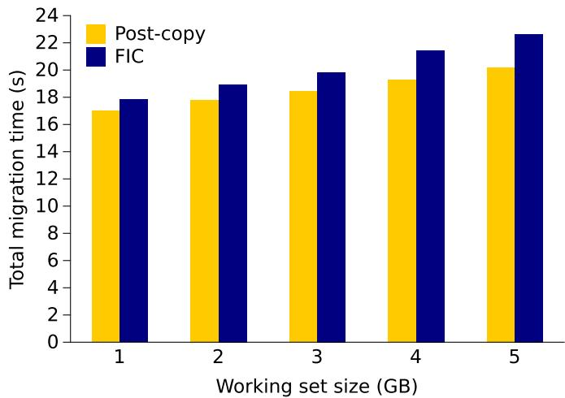  
Fig. 4. Total migration time of write-intensive VM with FIC.

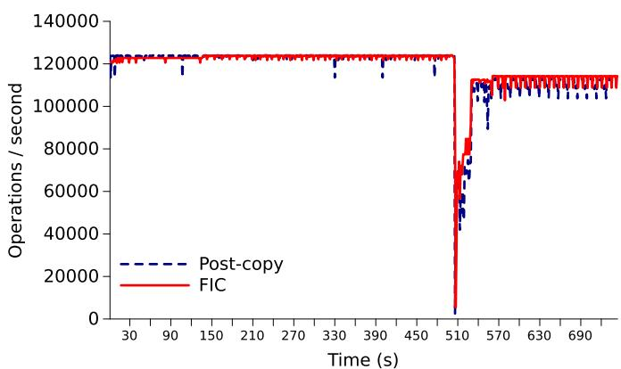  
Fig. 5. The impact of FIC on the CPU intensive workload.

## A. Performance of FIC

1) Live Migration Performance: We first evaluate the overhead of FIC on the source machine without triggering a migration failure. Fig. 4 compares the total migration time of a write-intensive VM using post-copy with FIC versus vanilla post-copy. The figure shows that FIC imposes a very small overhead of 1%–4% on total migration time for write-intensive VMs. The corresponding overhead for migrating idle VMs (not shown) is only 0.2%–0.7%. The downtime with FIC is between 7.5 ms to 11.7 ms, which is only slightly higher than vanilla post-copy (7ms–11.6 ms).

2) Impact on CPU-Intensive Workload: We measured how FIC affects the performance of CPU-intensive applications running inside the VM using a Quicksort benchmark, which is a CPU-intensive application. The Quicksort benchmark repeatedly allocates 400 MB of memory, writes random integers to the allocated memory segment, and sorts the integers using the Quicksort algorithm. Fig. 5 shows that the number of sorting operations performed per second during migration is similar for both FIC and vanilla post-copy. At downtime there is a sharp but similar reduction in Quicksort performance for both FIC and post-copy. This shows that FIC does not have an observable impact on CPU-intensive workloads.

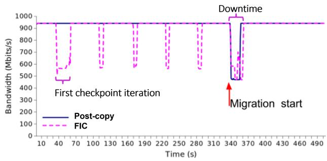  
Fig. 6. Impact of FIC on iPerf bandwidth during migration.

3) Impact on Network-Intensive Workload: To measure the impact of FIC on network-intensive VM workloads we used iPerf [19], a network-intensive benchmark, to measure the network throughput from the VM before and during the migration. The iPerf server runs on an external machine (i.e., neither source nor destination) in the same cluster and the iPerf client resides inside the VM being migrated. The iPerf client continuously sends data to the server through a TCP connection. The measured network bandwidth is reported by iPerf every second. Fig. 6 shows the measured network bandwidth of iPerf client before, during, and after the migration, when migrating a 1 GB VM. The checkpoint interval is set to 50 seconds for better visualization of the bandwidth fluctuations. The figure shows that, during the first checkpointing round of FIC, when the entire memory state is transferred to the destination, the bandwidth reported by iPerf client drops from 940 Mbps to 580 Mbps for about 20 seconds. Subsequent incremental checkpoints are shorter in duration and consequently the bandwidth drops are also shorter. In addition, just before the migration starts, the final checkpoint is transferred in parallel to the live migration, which leads to contention on the outgoing network link on the source machine. Therefore, we see a slightly longer network bandwidth drop in FIC than vanilla post-copy. We also measured the iPerf bandwidth for larger VMs on the source machine. The results are similar except that when the VM size increases, the duration of the network bandwidth drop in the first checkpointing round also increases.

4) Impact on Concurrent Migrations: Earlier, we discussed the possibility of FIC for one VM impacting the migration of another VM due to network contention. To address this issue, FIC dynamically adjusts its checkpointing speed based on the available bandwidth to minimize impact on other migrations.

Fig. 7 shows that the time taken to migrate an idle VM using post-copy during which another co-located VM is checkpointed using FIC. The checkpoint interval is 50 seconds, and the size of the VM ranges from 1 GB to 8 GB. The figure shows that FIC imposes 0.3%–1% overhead on the total migration time. For write-intensive concurrent VMs, FIC similarly imposes an overhead of 0.4%–1.9% on total migration time.

5) Recovering From Source Failure in Post-Copy: We now consider the scenario of recovering a VM when the source machine fails during post-copy migration. In this scenario, since the VM’s latest memory state is saved over multiple incremental checkpoints by FIC, the final VM’s memory state needs to be merged from all the incremental checkpoints. Fig. 8 plots the recovery time of FIC and the number of loaded memory pages for migrating an idle VM. As expected, as the VM size increases, it takes longer time to transfer and merge the incremental checkpoints and hence the time taken to recover the VM also increases. The recovery time varies from around 3 seconds for a 1 GB VM to around 10 seconds for a 8 GB VM. Note that this VM recovery is live for source failures because the VM keeps executing at the destination node during recovery. To further hide the cost of recovery, one could also perform the merge ahead of time before a failure occurs, though at the expense of additional computation.

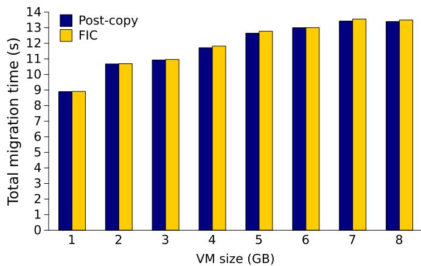  
Fig. 7. FIC impact on concurrent migration of another VM.

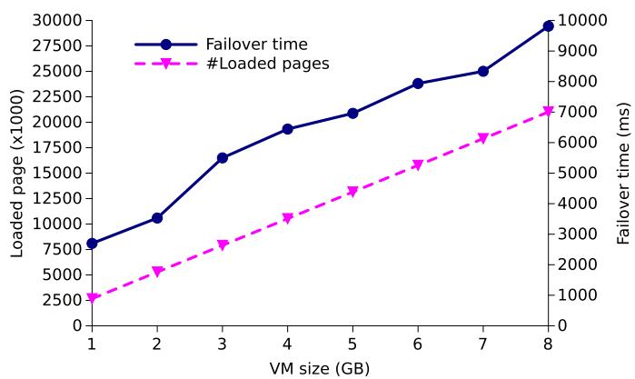  
Fig. 8. Recovering a VM after source failure with FIC .

## B. Performance of RIC

1) Live Migration Performance: Fig. 9 compares the total migration time of a write-intensive VM using post-copy with RIC versus vanilla post-copy. The write-intensive VM executes a program that continuously writes random numbers to a large region of main memory. The working set size (i.e., size of the memory written) is varied from 1 GB to 5 GB. The figure shows that the total migration time of post-copy with and without RIC are almost the same. This is because in post-copy, the source machine actively pushes pages to the destination even when the VCPUs are paused at the destination (due to demand-paging or RIC), thus allowing these operations to complete concurrently.

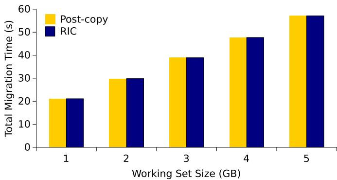  
Fig. 9. Impact of RIC on total migration time when migrating a write-intensive VM.

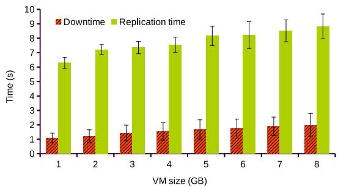

(a)  
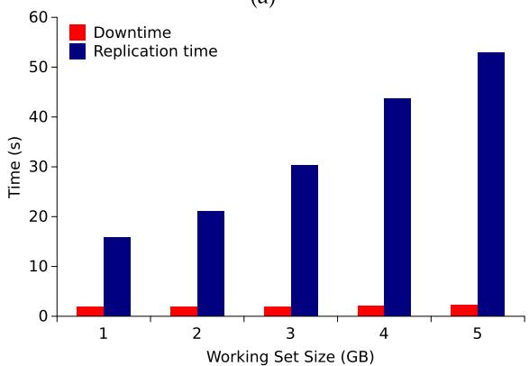  
(b)  
Fig. 10. Cumulative downtime and replication time of RIC for migrating (a) idle VM and (b) write-intensive VM.

Similar results are observed for migrating an idle VM and hence not shown.

Fig. 10(a) shows the cumulative downtime and replication time of migrating idle VMs using RIC. The cumulative downtime is the sum of all the times that the VM is paused by RIC during migration. We purposely chose an aggressive checkpointing interval of 100µs to stress test RIC. The cumulative downtime with RIC ranges between 1.1 s and 1.9 s. For longer checkpointing intervals, the cumulative downtime will correspondingly reduce. As discussed earlier, RIC is split into two stages and only Stage 2 requires pausing the VM. Vanilla post-copy pauses the VM only once at the start of migration and hence it has a downtime of only 9ms–11.6 ms. The figure also shows that the replication time increases with increasing VM size. Fig. 10(b) shows the cumulative downtime and replication time of RIC for migrating a write-intensive VM. The cumulative downtime remains fairly stable between 1.8 s and 2.2 s. The figure also shows that the replication time increase when the working set size increases due to an increase in the number of dirty pages that need to be checkpointed by RIC.

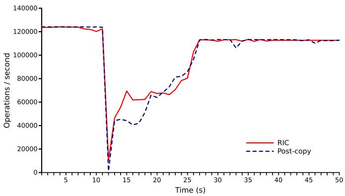  
Fig. 11. Impact of RIC on CPU-intensive workload.

2) Impact on CPU-Intensive Workload: We measured how RIC affects the performance of applications running inside the VM using a Quicksort benchmark (described in Section IV-A2). Fig. 11 shows that the number of sorts performed per second is constant in both RIC and post-copy except that there is a sudden reduction in the performance at downtime. RIC and post-copy also have similar performance during the migration, which means that the reverse incremental checkpointing does not impose observable overhead on the application performance.

3) Checkpointing Frequency: Fig. 12(a) shows the total migration time of migrating a VM running the STREAM [20] benchmark when the checkpointing interval is varied between 0.1 ms and 100 ms. Checkpointing interval 0 refers to the vanilla post-copy migration. STREAM is an industry standard for measuring the sustained memory bandwidth and the corresponding computation rate for simple vector kernels. STREAM allocates 1.5 GB of array elements, runs 50 iterations on each vector kernel, and continuously executes during the VM migration. The figure shows that RIC does not incur any overhead compared to the post-copy. Fig. 12(b) shows that when the checkpoint interval increases, the downtime decreases. As checkpointing is performed less frequently the overhead of bitmap synchronization, state transfer, network buffering, and pausing the VCPUs also decrease. The figure also shows that, when the checkpoint interval increases, more pages are dirtied during the interval. We also measured the impact of varying the checkpointing interval on the total migration time and downtime of migrating idle VM and write-intensive VM. The results are similar to the above. Finally, we measured the impact of the checkpointing interval on the performance of applications running inside the VM using the Sysbench [21] CPU-intensive workload during VM migration. Sysbench reports the time taken to find the 20,000th prime number. Our experimental results show that the checkpointing interval has little to no effect on the execution time of Sysbench (about 45 s for all intervals).

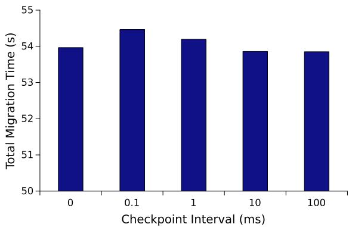

(a)  
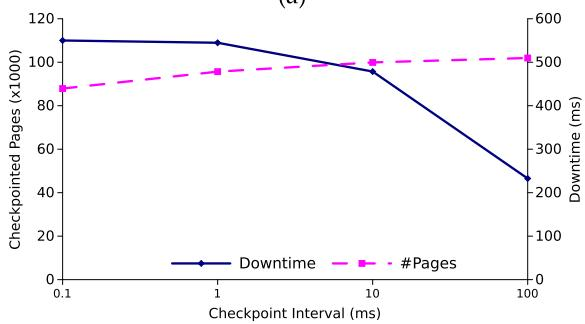  
(b)

Fig. 12. The impact of checkpointing interval on (a) total migration time and (b) downtime and checkpointed page count for RIC with the STREAM benchmark.  
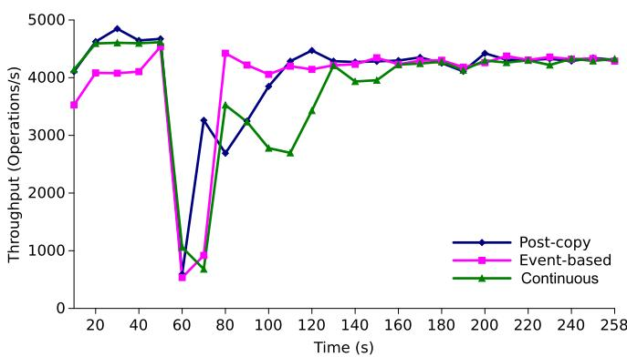  
Fig. 13. YCSB throughput variation during migration.

4) Packet Buffering and Release: We now consider the impact of packet buffering and release on application throughput and latency when using RIC. Using Redis [18] and Yahoo Cloud Serving Benchmark (YCSB) [22], we generated outgoing and incoming network packets as query requests and responses. Redis is a key value in-memory database that runs on an external machine. YCSB is a database benchmark client that resides in the migrating VM and interacts with Redis. Redis first loads its database. Then YCSB client queries 1 GB of data using update operations (read/update ratio is 50/50) while the VM is being live migrated. Figs. 13 and 14 show throughput and latency variation, respectively. Both figures show that, during the downtime, there is a sudden drop in the throughput and increase in latency. However, event-based checkpointing has more consistent throughput and lower latency degradation than continuous checkpointing. This is because, in event-based checkpointing, requests are not buffered unless an event occurs, while in continuous checkpointing, requests are periodically buffered every checkpoint interval.

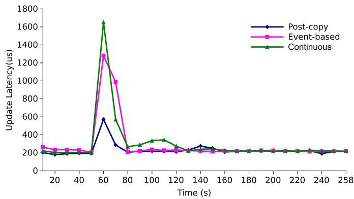  
Fig. 14. YCSB latency variation during migration.

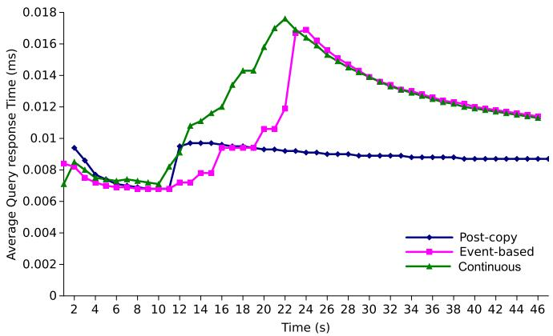  
Fig. 15. Impact on Sysbench OLTP response time of post-copy with continuous and event-based RIC.

We also measured packet buffering and release overhead when running Sysbench Online Transaction Processing (OLTP) benchmarking tool. We ran a MYSQL server inside the VM and queried the database using a Sysbench client from an external host. Fig. 15 shows the average query response time over 50 seconds during live migration. In this setting, query requests are incoming network requests as seen by the VM. Even though we do not buffer incoming network packets, query responses are treated as outgoing packets with respect to the VM. The figure shows that, during live migration, event-based checkpointing has lower average response time compared to continuous checkpointing. Once the migration completes, both response times gradually converge to that of vanilla post-copy.

5) Network Overhead and Recovery Time: Next, we evaluate the network overhead of RIC. Fig. 16 shows total checkpointed page count when migrating a write-intensive VM with working set size of 5 GB when the checkpointing interval is varied from 0.1 ms to 100 ms. The checkpointed page count reduces when the checkpointing interval increases. Since the same page may be dirtied multiple times, longer checkpointing interval reduces the number of times that a dirtied page needs to be checkpointed.

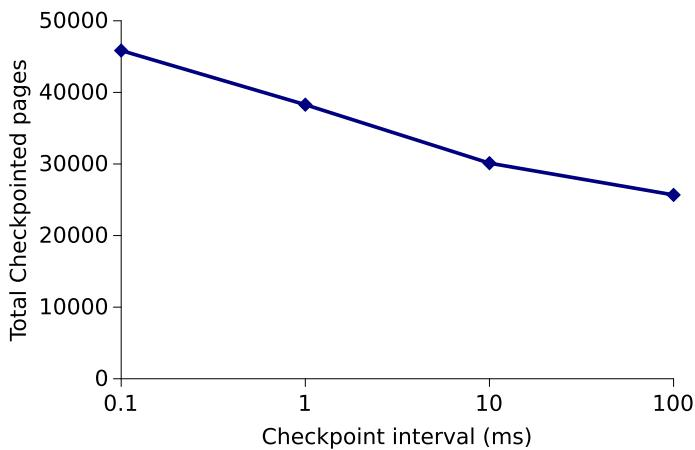  
Fig. 16. Checkpointed pages versus checkpoint interval in RIC .

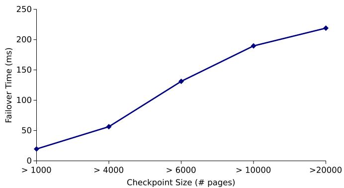  
Fig. 17. Recovery time versus checkpoint size with RIC.

Next we varied the number of checkpointed pages with RIC and captured the time taken to restore the VM on the source when migrating a write-intensive VM. As expected, Fig. 17 shows that the recovery time with RIC increases when the checkpoint size increases. Even with 20,000 checkpointed pages, the recovery time is only around 200 ms.

## V. RELATED WORK

To the best of our knowledge, V-Recover is the first approach to address recovery from failures during live migration. Live migration mechanisms in Google’s datacenters [8] compare memory checksums of a migrating VM at the source and destination machines to detect memory corruption during migration. The VM is discarded if the checksums do not match. QEMU supports a feature called PostcopyRecovery [23] that allows an ongoing post-copy migration to be resumed once a broken network connection between the source and destination is restored. However it does not support recovering the VM when the source or the destination fail, or the network connection cannot be reestablished.

As mentioned earlier, our conference paper in IEEE Infocom 2019 [11] addressed the problem of destination and network failure during post-copy. This paper significantly extends the conference version by addressing source failures via FIC as well as conducting extensive additional evaluations using several benchmarks.

All major virtualization platforms [3], [4], [24] support VM checkpointing and restoration. Checkpointing can be performed at either the application-level [25], [26] or VM-level [12], [13], [27], [28], [29], [30], [31], [32], [33]. Compared to application specific checkpointing schemes, whole system checkpoints provide a cleaner and more complete encapsulation of application state. Checkpointing-based VM fault tolerance can be performed using active-passive and active-active approaches. In active-passive approaches [12], [34], [35], a VM’s state is regularly checkpointed on a backup machine’s memory or disk. When the primary VM or machine fails then the VM image on the backup machine is activated. In active-active replication [13], [27], [36], [37], [38], [39], [40], [41], [42], [43], the primary and backup VMs execute in consistent lockstep. Record/replay mechanisms can record external events at a primary VM and replay those events on a backup VM to ensure that a consistent replica is always available. Event recording can be performed by the hypervisor but deterministic replay can be difficult on multi-core CPUs. In contrast to the above efforts which guard against failures during a VM’s normal execution, V-Recover uses incremental checkpointing to guard against failures during live migration.

Live migration itself can also be used as a fault-tolerance technique. One can quickly migrate a VM upon imminent failure of a source machine [44], [45], [46]. One can also use process migration [47], [48], [49], [50] for fault tolerance, though at the risk of leaving residual dependencies in the source machine. Some techniques [51], [52], [53] perform fast intra-host live migration to handle hypervisor updates/failures by co-mapping a VM’s memory to a new co-located VM. However the above techniques do not address the failure of live migration mechanism itself. Several techniques [54], [55], [56], [57], [58] estimate the required bandwidth for live migration based on the system’s resource usage. V-Recover also adapts to available bandwidth to avoid network contention with colocated VMs.

## VI. CONCLUSION

In this article, we presented V-Recover, a mechanism to seamlessly recover a virtual machine when live migration mechanism fails due to source, destination, or network failure. V-Recover incorporates a forward incremental checkpointing mechanism to recover from source machine failures and a reverse incremental checkpointing mechanism to recover from destination machine or network failures. We described the design, implementation, and evaluation of V-Recover on the KVM/QEMU platform. Our evaluations show that V-Recover can effectively recover a VM upon migration failure with acceptable overheads on live migration metrics and performance.

## REFERENCES

[1] M. Nelson, B. H. Lim, and G. Hutchins, “Fast transparent migration for virtual machines,” in Proc. USENIX Annu. Tech. Conf., 2005, pp. 391–394.

[2] VMWare Inc., “vSphere vMotion,” 2007. [Online]. Available: https:// www.vmware.com/pdf/vmotion\_datasheet.pdf

[3] A. Kivity, Y. Kamay, D. Laor, U. Lublin, and A. Liguori, “KVM: The Linux virtual machine monitor,” in Proc. Linux Symp., 2007, pp. 225–230.

[4] P. Barham et al., “Xen and the art of virtualization,” ACM SIGOPS Operating Syst. Rev., vol. 37, no. 5, pp. 164–177, Oct. 2003.

[5] P. Barham et al., “Xen and the art of virtualization,” in Proc. ACM Symp. Operating Syst. Princ., 2003, pp. 164–177.

[6] C. Clark et al., “Live migration of virtual machines,” in Proc. USENIX Symp. Netw. Syst. Des. Implementation, 2005, pp. 273–285.

[7] Microsoft Corporation, “Hyper-V architecture,” 2022. [Online]. Available: https://docs.microsoft.com/en-us/virtualization/hyper-v-on-windows/ reference/hyper-v-architecture

[8] A. Ruprecht et al., “VM live migration at scale,” in Proc. ACM Int. Conf. Virtual Execution Environ., 2018, pp. 45–56.

[9] M. Hines, U. Deshpande, and K. Gopalan, “Post-copy live migration of virtual machines,” ACM SIGOPS Operating Syst. Rev., vol. 43, no. 9, pp. 14–26, Jul. 2009.

[10] M. R. Hines and K. Gopalan, “Post-copy based live virtual machine migration using adaptive pre-paging and dynamic self-ballooning,” in Proc. ACM Int. Conf. Virtual Execution Environ., 2009, pp. 51–60.

[11] D. Fernando, J. Terner, K. Gopalan, and P. Yang, “Live migration ate my VM: Recovering a virtual machine after failure of post-copy live migration,” in Proc. IEEE Int. Conf. Comput. Commun., 2019, pp. 343–351.

[12] B. Cully, G. Lefebvre, D. Meyer, M. Feeley, N. Hutchinson, and A. Warfield, “Remus: High availability via asynchronous virtual machine replication,” in Proc. USENIX Symp. Netw. Syst. Des. Implementation, 2008, pp. 161–174.

[13] Y. Dong et al., “COLO: Coarse-grained lock-stepping virtual machines for non-stop service,” in Proc. ACM Symp. Cloud Comput., 2013, Art. no. 3.

[14] D. A. Patterson, G. Gibson, and R. H. Katz, “A case for redundant arrays of inexpensive disks (RAID),” ACM SIGMOD Rec., vol. 17, no. 3, pp. 109– 116, Jun. 1988.

[15] F. Bellard, “QEMU, a fast and portable dynamic translator,” in Proc. USENIX Annu. Tech. Conf., 2005, Art. no. 41.

[16] J. Mauro and R. McDougall, Solaris Internals: Core Kernel Components. Santa Clara, CA, USA: Sun Microsystems Press, 2001.

[17] J. Bonwick and J. Adams, “Magazines and Vmem: Extending the slab allocator to many CPUs and arbitrary resources,” in Proc. USENIX Annu. Tech. Conf., 2001, pp. 15–33.

[18] Redis Ltd., “Introduction to redis,” [Online]. Available: https://redis.io/ docs/about

[19] Iperf. 2023. [Online]. Available: https://iperf.fr

[20] J. D. McCalpin, “Memory bandwidth and machine balance in current high performance computers,” IEEE Comput. Soc. Tech. Committee Comput. Archit. Newslett., pp. 19–25, Dec. 2023.

[21] Sysbench. [Online]. Available: https://en.wikipedia.org/wiki/Sysbench

[22] B. F. Cooper, A. Silberstein, E. Tam, R. Ramakrishnan, and R. Sears, “Benchmarking cloud serving systems with YCSB,” in Proc. ACM Symp. Cloud Comput., 2023, pp. 143–154.

[23] QEMU Wiki, “PostcopyRecovery,” [Online]. Available: https://wiki. qemu.org/Features/PostcopyRecovery

[24] C. Chaubal, “Architecture of VMware ESXi,” VMWare White Paper, Oct. 2022. [Online]. Available: https://www.vmware.com/techpapers/ 2007/architecture-of-vmware-esxi-1009.html

[25] C. Wang, F. Mueller, C. Engelmann, and S. L. Scott, “Proactive processlevel live migration in HPC environments,” in Proc. ACM/IEEE Conf. Supercomputing, 2008, pp. 1–12.

[26] D. Marques, G. Bronevetsky, R. Fernandes, K. Pingali, and P. Stodghill, “Optimizing checkpoint sizes in the C3 system,” in Proc. IEEE Int. Parallel Distrib. Process. Symp., 2005, pp. 7 pp.-.

[27] D. Marques, G. Bronevetsky, R. Fernandes, K. Pingali, and P. Stodghill, “Optimizing checkpoint sizes in the C3 system,” in Proc. Workshop 10 - NSF Next Gener. Softw. Prog., IEEE Int. Parallel Distrib. Process. Symp., 2005.

[28] R. Jhawar, V. Piuri, and M. Santambrogio, “Fault tolerance management in cloud computing: A system-level perspective,” IEEE Syst. J., vol. 7, no. 2, pp. 288–297, Jun. 2013.

[29] C. Engelmann, G. R. Vallee, T. Naughton, and S. L. Scott, “Proactive fault tolerance using preemptive migration,” in Proc. Euromicro Int. Conf. Parallel Distrib. Netw.-Based Process., 2009, pp. 252–257.

[30] E. Park, B. Egger, and J. Lee, “Fast and space-efficient virtual machine checkpointing,” in Proc. ACM Int. Conf. Virtual Execution Environ., 2011, pp. 75–86.

[31] M. Lu and T. Chiueh, “Fast memory state synchronization for virtualization-based fault tolerance,” in Proc. IEEE/IFIP Int. Conf. Dependable Syst. Netw., 2009, pp. 534–543.

[32] A. Kangarlou, P. Eugster, and D. Xu, “VNsnap: Taking snapshots of virtual networked infrastructures in the cloud,” IEEE Trans. Serv. Comput., vol. 5, no. 4, pp. 484–496, Fourth Quarter 2012.

[33] Y. Kwon, M. Balazinska, and A. Greenberg, “Fault-tolerant stream processing using a distributed, replicated file system,” in Proc. VLDB Endowment, vol. 1, no. 1, pp. 574–585, Aug. 2008.

[34] M. Hines, “Micro checkpointing,” [Online]. Available: https://wiki.qemu. org/Features/MicroCheckpointing

[35] C. Wang et al., “PLOVER: Fast, multi-core scalable virtual machine faulttolerance,” in Proc. USENIX Symp. Netw. Syst. Des. Implementation, 2015, pp. 483–499.

[36] D. J. Scales, M. Nelson, and G. Venkitachalam, “The design of a practical system for fault-tolerant virtual machines,” ACM SIGOPS Operating Syst. Rev., vol. 44, no. 4, pp. 30–39, 2010.

[37] C. Wang, X. Chen, Z. Wang, Y. Zhu, and H. Cui, “A fast, general storage replication protocol for active-active virtual machine fault tolerance,” in Proc. IEEE Int. Conf. Parallel Distrib. Syst., 2017, pp. 151–160.

[38] Y. Tamura, K. Sato, S. Kihara, and S. Moriai, “Kemari: Virtual machine synchronization for fault tolerance,” in Proc. USENIX Annu. Tech. Conf., 2008, pp. 1–2.

[39] T. C. Bressoud and F. B. Schneider, “Hypervisor-based fault tolerance,” in Proc. ACM Symp. Operating Syst. Princ., 1995, pp. 1–11.

[40] G. W. Dunlap, S. T. King, S. Cinar, M. A. Basrai, and P. M. Chen, “ReVirt: Enabling intrusion analysis through virtual-machine logging and replay,” ACM SIGOPS Operating Syst. Rev., vol. 36, pp. 211–224, Dec. 2002.

[41] G. W. Dunlap, “Execution replay for intrusion analysis,” Ph.D. dissertation, Univ. Michigan, USA, 2006.

[42] S. T. King, G. W. Dunlap, and P. M. Chen, “Debugging operating systems with time-traveling virtual machines,” in Proc. USENIX Annu. Tech. Conf., 2005, Art. no. 1.

[43] M. Xu, R. Bodik, and M. D. Hill, “A “flight data recorder” for enabling fullsystem multiprocessor deterministic replay,” in Proc. Int. Symp. Comput. Architecture, 2003, pp. 122–135.

[44] U. Deshpande, Y. You, D. Chan, N. Bila, and K. Gopalan, “Fast server deprovisioning through scatter-gather live migration of virtual machines,” in Proc. IEEE Int. Conf. Cloud Comput., 2014, pp. 376–383.

[45] U. Deshpande, D. Chan, S. Chan, K. Gopalan, and N. Bila, “Scatter-gather live migration of virtual machines,” IEEE Trans. Cloud Comput., vol. 6, no. 1, pp. 196–208, First Quarter 2018.

[46] D. Fernando et al., “Quick eviction of virtual machines through proactive live snapshots,” in Proc. Int. Conf. Utility Cloud Comput., 2016, pp. 99–107.

[47] A. Barak and R. Wheeler, “MOSIX: An integrated UNIX for multiprocessor workstations,” Int. Comput. Sci. Inst., Berkeley, CA, USA, Tech. Rep. TR 88–004, Oct. 1988.

[48] J. K. Ousterhout, A. R. Cherenson, F. Douglis, M. N. Nelson, and B. B. Welch, “The sprite network operating system,” Computer, vol. 21, no. 2, pp. 23–36, Feb. 1988.

[49] R. F. Rashid and G. G. Robertson, “Accent: A communication oriented network operating system kernel,” in Proc. ACM Symp. Operating Syst. Princ., 1981, pp. 64–75.

[50] S. Mullender, G. van Rossum, A. Tananbaum, R. van Renesse, and H. van Staveren, “Amoeba: A distributed operating system for the 1990s,” Computer, vol. 23, no. 5, pp. 44–53, May 1990.

[51] S. Doddamani, P. Sinha, H. Lu, T.-H. K. Cheng, H. H. Bagdi, and K. Gopalan, “Fast and live hypervisor replacement,” in Proc. ACM Int. Conf. Virtual Execution Environ., 2019, pp. 45–58.

[52] H. Bagdi, R. Kugve, and K. Gopalan, “HyperFresh: Live refresh of hypervisors using nested virtualization,” in Proc. Asia-Pacific Workshop Syst., 2017, Art. no. 18.

[53] P. K. Sinha, S. S. Doddamani, H. Lu, and K. Gopalan, “mWarp: Accelerating intra-host live container migration via memory warping,” in Proc. IEEE Int. Conf. Comput. Commun. Workshops, 2019, pp. 508–513.

[54] V. Mann et al., “Remedy: Network-aware steady state VM management for data centers,” in Proc. IFIP Int. Conf. Netw., 2012, pp. 190–204.

[55] H. Wang, Y. Li, Y. Zhang, and D. Jin, “Virtual machine migration planning in software-defined networks,” IEEE Trans. Cloud Comput., vol. 7, no. 4, pp. 1168–1182, Fourth Quarter 2019.

[56] H. Liu and B. He, “VMbuddies: Coordinating live migration of multi-tier applications in cloud environments,” IEEE Trans. Parallel Distrib. Syst., vol. 26, no. 4, pp. 1192–1205, Apr. 2015.

[57] D. Fernando, P. Yang, and H. Lu, “SDN-based order-aware live migration of virtual machines,” in Proc. IEEE Int. Conf. Comput. Commun., 2020, pp. 1818–1827.

[58] H. Li, G. Xiao, Y. Zhang, P. Gao, Q. Lu, and J. Yao, “Adaptive live migration of virtual machines under limited network bandwidth,” in Proc. ACM Int. Conf. Virtual Execution Environ., 2021, pp. 98–110.

  
Dinuni Fernando received the PhD degree from Computer Science Department, Binghamton University, in 2019. She is a senior lecturer with the School of Computing, University of Colombo. Her research interests include virtualization, networks, and security.

Jonathan Terner received the BS degree in computer science from Binghamton University, in 2018. He is currently working toward the MS degree in computer science with Georgia Tech. He is presently a GNR Core software developer with IBM.

Ping Yang received the PhD degree from Stony Brook University, in 2006. She is an associate professor with Computer Science Department, Binghamton University and the director of the Center for Information Assurance and Cybersecurity. Her research interests include virtualization and AI-based security.

Kartik Gopalan received the PhD degree from Stony Brook University, in 2003. He is a professor with Computer Science Department, Binghamton University. His research interests include virtualization, cloud computing, security, operating systems, and networks.