# Wireless Relay Communications with Unmanned Aerial Vehicles: Performance and Optimization

PENGCHENG ZHAN

Quantenna Communications

KAI YU

Ericsson AB

A. LEE SWINDLEHURST, Fellow, IEEE

The University of California at Irvine

In this paper, we investigate a communication system in which unmanned aerial vehicles (UAVs) are used as relays between ground-based terminals and a network base station. We develop an algorithm for optimizing the performance of the ground-to-relay links through control of the UAV heading angle. To quantify link performance, we define the ergodic normalized transmission rate (ENTR) for the links between the ground nodes and the relay, and derive a closed-form expression for it in terms of the eigenvalues of the channel correlation matrix. We show that the ENTR can be approximated as a sinusoid with an offset that depends on the heading of the UAV. Using this observation, we develop a closed-form expression for the UAV heading that maximizes the uplink network data rate while keeping the rate of each individual link above a certain threshold. When the current UAV relay assignments cannot meet the minimum link requirements, we investigate the deployment and heading control problem for new UAV relays as they are added to the network, and propose a smart handoff algorithm that updates node and relay assignments as the topology of the network evolves.

Manuscript received August 3, 2009; revised February 9 and August 2, 2010; released for publication August 20, 2010.

IEEE Log No. T-AES/47/3/941781.

Refereeing of this contribution was handled by M. Rice.

This work was conducted during the second author’s post-doctoral research at Brigham Young University.

Authors’ addresses: P. Zhan, Quantenna Communications, 3450 W. Warren Ave., Fremont, CA 94538; K. Yu, Ericsson AB, Kistagngen 20, SE-16480 Stockholm, Sweden; A. Lee Swindlehurst, Dept. of Electrical Engineering and Computer Science, The University of California at Irvine, Irvine, CA 92697, E-mail: (swindle@uci.edu).

# I. INTRODUCTION

Recently, unmanned aerial vehicles (UAVs) have attracted considerable attention in many military as well as civilian applications [1—5]. An attractive feature of using UAVs for networked communications is that they can be quickly deployed as relays to extend coverage and improve network connectivity [6—11]. Employing UAVs in this manner is especially helpful in situations where nodes are widely scattered or obstacles such as hills or large buildings deteriorate the quality of the link between a base station (BTS) and an access point (AP). The advantages of using relays in more generic wireless network scenarios have been the subject of considerable interest recently (e.g., see [12], [13]).

Ayyagari in [3] presented a network architecture that deployed airborne unmanned relay platforms to form equivalent “cellular towers” in the sky for implementing rapidly deployable, broadband wireless networks. In [2], [4], the authors are concerned with the routing issues of a hierarchical network with UAV nodes relaying messages at higher levels. Hierarchical algorithms are modified to reduce routing overhead and improve the throughput. Rubin proposed a protocol that synthesized the topology of a mobile network backbone, which made use of unmanned vehicles including UAVs [5] and dealt with the resulting network routing and resource allocation problems. In [7] the flocking rules of birds and insects were used to study the UAV placement and navigation problem with the end goal of improving network connectivity. Using graph theory, [11] approached a similar problem by optimizing various connectivity criteria. The feasibility of using orthogonal frequency division multiplexing (OFDM) transmission techniques for UAV wireless communication was investigated in [14]. Like [14], Palat in [8] focused on the physical layer aspects of UAV relay communications, and studied the performance of distributed transmit beamforming and distributed orthogonal space-time block coding (OSTBC) schemes under ideal and nonideal UAV flight conditions. Cheng [6] considered a special relay communications scenario for delay-tolerant applications, where the UAV relays carry data and deliver them upon approaching the user terminals.

Inspired by the above work on UAV communications, this paper investigates a network with multiple UAVs relaying messages from ground APs to a remote BTS. Unlike [2], [4], [5], we are not concerned with routing algorithms; the UAV acts as a relay to connect the set of isolated APs to the BTS in a single hop. We focus instead on various aspects of the network, including: the physical layer communication link properties, i.e., analysis of the link-level throughput of the proposed transmission scheme and the symbol error rate (SER) for each

0018-9251/11/\$26.00 c 2011 IEEE

AP-to-UAV link, the media access control (MAC) layer handoff algorithm that the APs use to switch between different UAV relays for better performance as the network evolves over time, and the network layer UAV relay deployment problems including UAV placement and optimal motion control.

This paper differs from the previously cited literature in the assumptions made about the network, the criteria used for quantifying network performance, and the development of a closed-loop UAV heading control process that allows this performance metric to be optimized. We consider a tactical communications scenario, where a set of distributed APs in a remote area is trying to communicate with a BTS, and a team of UAVs is deployed to help establish the communication links. We assume that, in general, the APs and UAVs have multiple antennas, and we use a channel model that allows us to account for different levels of spatial correlation at the APs and UAVs. We focus on “uplink” performance (here, “uplink” refers to communications from the APs to the UAVs), and we assume that the UAVs have sufficient bandwidth resources so that all AP transmissions are orthogonal and interference free. This limits application of the proposed approach to situations where the number of APs is not too large. Even if ad hoc networks are present on the ground, the system-level communications are still likely to be implemented in a hierarchical way (i.e., only a subset of the ground communications needs to be routed through the relays, and even those messages would likely be funneled through a smaller set of communication centers), and thus this should not be a significant restriction in most practical situations.

Under the above assumptions, the primary contribution of the paper is the development of a heading control algorithm for the UAV relays that maximizes the sum uplink transmission rate under the constraint that the rate for each AP is above a certain threshold. We propose the use of the ergodic normalized transmission rate (ENTR) as the performance metric for each link, and show that it can be approximated in such a way that the optimal UAV heading can be found in closed form. Since the topology of the network is constantly changing due to the mobility of the APs and relays, the varying link strengths require that the APs be periodically reassigned to different relays for better performance. Consequently, a handoff algorithm is developed for the network that takes into account the special motion constraints of the UAV relays. When the current UAV configuration is insufficient to accommodate all the APs at the specified quality of service (QoS), one must determine where to deploy a new UAV relay and how to command its motion to improve the network’s ENTR. This problem is also addressed in the paper.

The paper is organized as follows. Section II describes the mathematical models assumed in this work, including the channel model, and the modulation and coding schemes employed. In Section III, we derive a closed-form expression for the average uplink data rate, and analyze the SER for each AP-UAV link. We also formulate in this section the problem of finding the optimal heading of the UAVs to maximize the network ENTR. Section IV illustrates how to improve the network throughput by allowing the APs to switch relays when necessary using a handoff algorithm developed for this specific type of network. In this section, we also discuss how to handle situations where UAVs must be added to the network to maintain connectivity. Section V presents some simulation results for the network protocol we propose. Section VI concludes the paper and gives some insights into possible future work. Some of the critical derivations can be found in the Appendix.

# II. SYSTEM DESCRIPTION

# A. System Model

We assume a multi-user uplink scenario, with a UAV deployed to relay messages from a collection of APs to a given BTS. We further assume that the APs employ orthogonal transmissions so that inter-user interference can be ignored. We consider a general multi-antenna setting, where each AP has $M _ { a }$ transmit antennas, and the UAV relay has $N _ { a }$ receive antennas. With these assumptions, the signal from the kth AP to the UAV can be written as

$$
\mathbf {y} _ {k} = \sqrt {\frac {E _ {k}}{M _ {a}}} \mathbf {H} _ {k} \mathbf {s} _ {k} + \mathbf {n} _ {k} \tag {1}
$$

where $\mathbf { y } _ { k }$ is the received signal from AP k at the UAV, $\mathbf { H } _ { k }$ is the $N _ { a } \times M _ { a }$ channel matrix between AP k and the UAV, $\mathbf { s } _ { k }$ is the transmitted signal from AP k, $E _ { k }$ represents the symbol energy for AP k at the transmitter side, and ${ \bf n } _ { k }$ is additive temporally and spatially white noise.

# B. Channel Model

We assume correlated Rayleigh fading channels $\mathbf { H } _ { k }$ with large scale path loss related to the distance between each AP and the UAV, i.e.,

$$
\mathbf {H} _ {k} = \frac {\mathbf {H} _ {\text { norm }} ^ {k}}{d _ {k} ^ {\alpha_ {k}}} \tag {2}
$$

where $d _ { k }$ is the distance between the kth AP and the UAV, and $\mathbf { H } _ { \mathrm { n o r m } } ^ { k }$ norm is a normalized complex Gaussian matrix which when stacked in an $N _ { a } M _ { a } \times 1$ vector has the distribution $\mathcal { C N } ( \mathbf { 0 } , \mathbf { R } _ { H } ^ { k } )$ . Although ground-to-air communications can occur under line-of-sight conditions, we focus here on the Rayleigh case with an arbitrary (possibly rank-one) channel correlation matrix. For free space transmission, the path-loss exponent $\alpha _ { k }$ is unity [15], while values of $\alpha _ { k } > 1$

are typical in obstructed environments. Note that log-normal shadow fading can easily be incorporated into the channel model and the analysis below. Assume the three-dimensional coordinates of the kth AP and UAV are given as $[ x _ { k } y _ { k } h _ { k } ] ^ { \mathrm { T } }$ and $[ x _ { u } \ y _ { u } \ h _ { u } ] ^ { \mathrm { T } }$ , respectively, so that $d _ { k }$ can be calculated as

$$
d _ {k} = \sqrt {(x _ {u} - x _ {k}) ^ {2} + (y _ {u} - y _ {k}) ^ {2} + (h _ {u} - h _ {k}) ^ {2}}. \tag {3}
$$

We use the well-known Kronecker model [16, 17] to describe the correlation matrix $\mathbf { R } _ { H } ^ { k }$ of the multiple input, multiple output (MIMO) wireless channel, i.e., $\mathbf { R } _ { H } ^ { k } = \mathbf { R } _ { \mathrm { T x } } ^ { k } \otimes \mathbf { R } _ { \mathrm { R x } } ^ { k } .$ , where $\mathbf { R } _ { \mathrm { T x } } ^ { k }$ and $\mathbf { R } _ { \mathrm { R x } } ^ { k }$ are the normalized transmit and receive channel correlation matrices for the link between the kth AP and the UAV, respectively. The normalized channel matrix can be expressed as

$$
\mathbf {H} _ {\text { norm }} ^ {k} = (\mathbf {R} _ {\mathrm{Rx}} ^ {k}) ^ {1 / 2} \mathbf {G} [ (\mathbf {R} _ {\mathrm{Tx}} ^ {k}) ^ {1 / 2} ] ^ {\mathrm{T}} \tag {4}
$$

where the $N _ { a } \times M _ { a }$ matrix G contains independent and identically distributed (IID) CN (0, 1) elements, $( \cdot ) ^ { \mathrm { T } }$ denotes transpose, $( \cdot ) ^ { 1 / 2 }$ is defined such that ${ \bf R } ^ { 1 / 2 } ( { \bf R } ^ { 1 / 2 } ) ^ { \mathrm { H } } = { \bf R }$ , and $( \cdot ) ^ { \mathrm { H } }$ is the Hermitian transpose.

# C. Adaptive Modulation

We assume that the system employs adaptive modulation based on the current channel signal-to-noise ratio (SNR) for each link, denoted by $\gamma _ { i }$ . Each modulation class i is specified by a given constellation with $Z _ { i }$ points, and a rate $r _ { i }$ $( 0 < r _ { i } \le 1 )$ channel code. The effective number of bits-per-symbol for the ith modulation class is thus $r _ { i } \log _ { 2 } ( Z _ { i } )$ . The SNR thresholds that control the selection of the modulation classes can be chosen using a variety of criteria. Here we take the approach of using the uncoded SER as the system design target [18—20], which can be approximated as [21, 22]:

$$
P _ {e} \approx \bar {N} _ {e} Q \left(\sqrt {\frac {\gamma_ {k} d _ {\min} ^ {2}}{2}}\right) \tag {5}
$$

where $P _ { e }$ is the symbol error probability, $\bar { N } _ { e }$ is the number of nearest neighbor constellation points, and $d _ { \mathrm { m i n } }$ is the minimum separation distance between points in the underlying constellation. Assume that $\gamma ^ { ( i ) }$ and $\gamma ^ { ( i + 1 ) }$ are the predetermined SNR thresholds for the ith and (i + 1)th modulation schemes, respectively. If $\gamma ^ { ( i + 1 ) } > \gamma _ { k } \geq \gamma ^ { ( i ) }$ , the ith modulation scheme will be used to transmit the message. $\mathrm { H } \gamma _ { k } < \gamma ^ { ( 1 ) }$ , no transmit scheme will be chosen, which indicates there will be no transmission between the transmitter and the receiver.

# D. Orthogonal Space-Time Block Coding

We assume that only the receiver knows the channel matrix. Hence, orthogonal space-time block codes (OSTBC) [23] are used to transmit the data. For example, in the $2 \times 2$ case, the well-known Alamouti code [24] is employed. Since adaptive modulation is used, the receiver needs to determine/predict a suitable modulation scheme and feed this information back to the transmitter. In this paper we assume that this feedback is perfect, i.e., the transmitter knows which modulation scheme to use.

# III. SYSTEM ANALYSIS

Below, we first investigate the single-link SNR and data rate. We then extend the results to the multi-link scenario. Note that we drop the subscript k for separate APs in the single-link analysis. The subscript is reintroduced when multiple links are taken into account.

# A. Single-Link SNR

It is well known that the performance of OSTBC can be characterized by the following SNR expression based on the model in (1):

$$
\gamma = \| \mathbf {H} \| _ {F} ^ {2} \frac {E}{M _ {a} \sigma_ {n} ^ {2}} = \| \mathbf {H} \| _ {F} ^ {2} \rho \tag {6}
$$

where $\rho$ is defined as $\rho = E / M _ { a } \sigma _ { n } ^ { 2 } , \sigma _ { n } ^ { 2 }$ is the noise power, E is the transmit symbol energy, and $\| \cdot \| _ { F }$ denotes the Frobenius norm. Plugging (2) into (6), we obtain

$$
\gamma = \frac {\left\| \mathbf {H} _ {\text { norm }} \right\| _ {F} ^ {2}}{d ^ {2 \alpha}} \rho . \tag {7}
$$

In [25], the probability density function (pdf) of $\| \mathbf { H } _ { \mathrm { n o r m } } \| _ { F } ^ { 2 }$ is derived as

$$
f (x) = \sum_ {j = 1} ^ {P} \sum_ {k = 1} ^ {m _ {j}} A _ {j k} \frac {x ^ {k - 1}}{(k - 1) ! \sigma_ {j} ^ {k}} e ^ {- x / \sigma_ {j}} u (x) \tag {8}
$$

where $\sigma _ { i } ( j = 1 , 2 , . . . , P )$ are the distinct non-zero eigenvalues of $\mathbf { R } _ { H } , m _ { j }$ denotes the multiplicity of $\sigma _ { j } ,$ and $A _ { j k }$ can be determined by solving a system of linear equations [25]. Defining

$$
\begin{array}{l} g (n, \alpha , x) = \int \frac {x ^ {n}}{n !} e ^ {\alpha x} d x = \frac {1}{n !} \frac {e ^ {\alpha x}}{\alpha^ {n + 1}} \sum_ {i = 0} ^ {n} (- 1) ^ {n - i} \frac {n !}{i !} (\alpha x) ^ {i} \\ = \frac {e ^ {\alpha x}}{\alpha^ {n + 1}} \sum_ {i = 0} ^ {n} (- 1) ^ {n - i} \frac {(\alpha x) ^ {i}}{i !} \tag {9} \\ \end{array}
$$

the cumulative distribution function (cdf) of $\| \mathbf { H } _ { \mathrm { n o r m } } \| _ { F } ^ { 2 }$ can be expressed as:

$$
\begin{array}{l} F (x) = \int_ {- \infty} ^ {x} f (t) d t \\ = \sum_ {j = 1} ^ {P} \sum_ {k = 1} ^ {m _ {j}} \frac {A _ {j k}}{\sigma_ {j} ^ {k}} \left[ g (k - 1, - \frac {1}{\sigma_ {j}}, x) - g (k - 1, - \frac {1}{\sigma_ {j}}, 0) \right] \\ = \sum_ {j = 1} ^ {P} \sum_ {k = 1} ^ {m _ {j}} \frac {A _ {j k}}{\sigma_ {j} ^ {k}} g \left(k - 1, - \frac {1}{\sigma_ {j}}, x\right). \tag {10} \\ \end{array}
$$

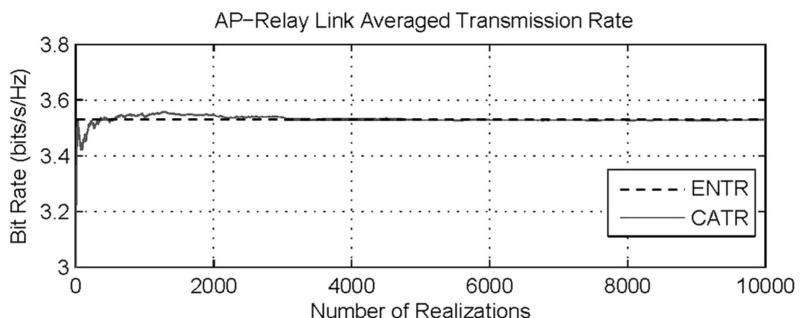

line

| Number of Realizations | ENTR Bit Rate (bits/s/Hz) | CATR Bit Rate (bits/s/Hz) |
| ---------------------- | ------------------------- | ------------------------- |
| 0                      | 3.4                       | 3.4                       |
| 2000                   | 3.5                       | 3.5                       |
| 4000                   | 3.5                       | 3.5                       |
| 6000                   | 3.5                       | 3.5                       |
| 8000                   | 3.5                       | 3.5                       |
| 10000                  | 3.5                       | 3.5                       |

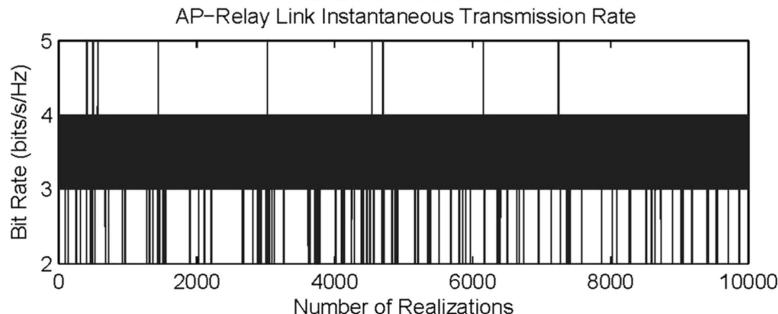

bar

| Number of Realizations | Bit Rate (bits/s/Hz) |
| ---------------------- | -------------------- |
| 0                      | 2                    |
| 1000                   | 3                    |
| 2000                   | 2                    |
| 3000                   | 3                    |
| 4000                   | 3                    |
| 5000                   | 3                    |
| 6000                   | 3                    |
| 7000                   | 3                    |
| 8000                   | 2                    |
| 9000                   | 3                    |
| 10000                  | 3                    |

Fig. 1. Link level transmission rate simulation: averaged and instantaneous rates.

# B. Single-Link ENTR and SER

We define the ENTR as the normalized raw transmission rate and use it as the criteria to quantify the performance of the link. The ENTR R(t) is defined as follows:

$$
R (t) = \beta \cdot E (\log_ {2} K (t)) \tag {11}
$$

where, due to the use of adaptive modulation, we have

$$
\begin{array}{l} K (t) = K ^ {(1)} u (\gamma (t) - \gamma^ {(1)}) \\ + \sum_ {i = 1} ^ {L _ {M} - 1} (K ^ {(i + 1)} - K ^ {(i)}) u (\gamma (t) - \gamma^ {(i + 1)}) \tag {12} \\ \end{array}
$$

u( ) is the unit-step function, $L _ { M }$ is the total number of modulation schemes used, and $\beta$ is a scalar that takes into account the rate loss when OSTBC is used. For example, $\beta = 1$ for the 2 2 Alamouti code. In (12), $K ^ { ( i ) } = Z _ { i } ^ { r _ { i } }$ represents the effective number of constellation points for the ith modulation scheme, taking the channel code into account. Defining $C ^ { i } ( t ) =$ $( \gamma ^ { ( i ) } / \bar { \rho } ) d ^ { 2 \alpha } ( t )$ , it is straightforward to show that the ENTR of the AP-UAV link (i.e., the uplink between an AP and UAV relay) can be written as that the use of ENTR leads to a simple closed-form solution for the optimal UAV heading, even for the multiple antenna case.

To verify the above analysis, we simulate a case where the AP and UAV are separated by a distance of 3640 m, and both have two antennas. The carrier frequency is assumed to be 1 GHz, the system bandwidth is 20 kHz, the AP transmit power is 2 W, and the noise power spectral density at the UAV relay is $1 0 ^ { - 1 6 }$ W/Hz. The path-loss exponent ® is assumed to be 1.5, which results in an effective SNR of about 13 dB at the UAV. Seven different minimum phase-shift keying (MPSK) modulation schemes are used in the simulations, i.e., from binary phase-shift keying (BPSK) to 128 phase-shift keying (PSK), and for simplicity we assume no channel coding. We assume a rich scattering environment at the AP side, so that the correlation matrix at the AP side is given by

$$
\mathbf {R} _ {\mathrm{Tx}} = \left[ \begin{array}{c c} 1 & 0 \\ 0 & 1 \end{array} \right].
$$

At the UAV side, high spatial correlation is assumed:

$$
\begin{array}{l} R (t) = \beta \cdot \left\{\sum_ {i = 1} ^ {L _ {M} - 1} \log_ {2} K ^ {(i)} \int_ {C ^ {i} (t)} ^ {C ^ {i + 1} (t)} f (x) d x + \log_ {2} K ^ {\left(L _ {M}\right)} \int_ {C ^ {L _ {M}} (t)} ^ {\infty} f (x) d x \right\} \\ = \beta \cdot \left\{\sum_ {i = 1} ^ {L _ {M} - 1} \log_ {2} K ^ {(i)} [ F (C ^ {i + 1} (t)) - F (C ^ {i} (t)) ] + \log_ {2} K ^ {(L _ {M})} [ 1 - F (C ^ {L _ {M}} (t)) ] \right\}. \tag {13} \\ \end{array}
$$

While the ENTR does not take rate loss due to transmission errors into account, when compared with theoretical spectral efficiency it is likely to be more representative of the achievable rate in a practical adaptive modulation scheme. Additionally, we will see

$$
\mathbf {R} _ {\mathrm{Rx}} = \left[ \begin{array}{c c} 1 & 0. 8 \\ 0. 8 & 1 \end{array} \right].
$$

A simulation involving $1 0 ^ { 5 }$ random channel realizations was run to generate the plot in Fig. 1.

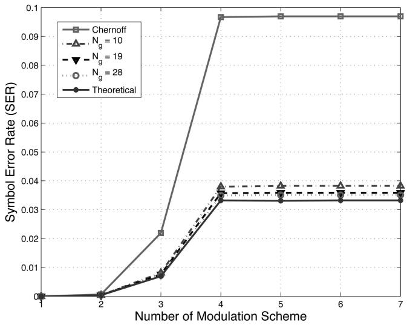

line

| Number of Modulation Scheme | Chernoff | Ng = 10 | Ng = 19 | Ng = 28 | Theoretical |
| --------------------------- | -------- | ------- | ------- | ------- | ----------- |
| 1                           | 0.0000   | 0.0000  | 0.0000  | 0.0000  | 0.0000      |
| 2                           | 0.0000   | 0.0000  | 0.0000  | 0.0000  | 0.0000      |
| 3                           | 0.0220   | 0.0080  | 0.0080  | 0.0080  | 0.0080      |
| 4                           | 0.0970   | 0.0380  | 0.0360  | 0.0350  | 0.0350      |
| 5                           | 0.0970   | 0.0380  | 0.0360  | 0.0350  | 0.0350      |
| 6                           | 0.0970   | 0.0380  | 0.0360  | 0.0350  | 0.0350      |
| 7                           | 0.0970   | 0.0380  | 0.0360  | 0.0350  | 0.0350      |

Fig. 2. Upper bound on the SER for each AP-UAV communication link. The x-axis in figure denotes number of modulation schemes used in system, and $N _ { g }$ in the legend denotes number of points evaluated on grid.

The upper plot shows the ENTR and the calculated averaged transmission rate (CATR) defined as $\sum _ { i = 1 } ^ { N _ { s } } \bar { S } ^ { ( i ) } / N _ { s }$ , where $N _ { s }$ is the number of channel realizations, and $S ^ { ( i ) }$ is the instantaneous spectral efficiency of the ith channel realization. For the ith channel realization, $S ^ { ( i ) } = \log _ { 2 } K ^ { ( i ) }$ , where $K ^ { ( i ) }$ is the effective number of constellation points for the selected modulation class. Clearly, the CATR is simply the sample average of the ENTR random variable, which converges in probability to the expected value by the weak law of large numbers. The fact that the CATR quickly converges to the ENTR expression verifies our derivation. The lower plot in Fig. 1 shows the instantaneous transmission rate of the link.

A closed-form expression for the single link SER has also been derived in [10]: very well with our simulation results and illustrates that the upper bound derived in the Appendix, Section A2 accurately describes the actual SER. The superior performance of the derived bounds compared with the Chernoff bound is evident in this example.

# C. Heading Optimization in the Multi-Link Scenario

Assuming the UAV flies with a constant speed, the UAV dynamics are governed by the following discrete-time model:

$$
x _ {u} ^ {t} = x _ {u} ^ {t - 1} + V \Delta \cos \delta_ {t - 1} \tag {15}
$$

$$
y _ {u} ^ {t} = y _ {u} ^ {t - 1} + V \Delta \sin \delta_ {t - 1}
$$

where V is the UAV speed, $\delta _ { t - 1 }$ is the UAV heading at time step t ¡ 1, ¢ is the length of the time step, and where we have added superscripts to $x _ { u }$ and $y _ { u }$ to indicate that the UAV position varies with time. The minimum length of the time step $\Delta ,$ which also determines the maximum UAV heading update rate, is ultimately a function of how rapidly the heading optimization procedure can be performed. In practical situations, however, it is unlikely that the heading rate would have to be updated more than once every few seconds, which provides ample time for implementing the optimization. We assume that the UAV is able to predict the position of each AP at the next time step, which is reasonable given the likely availability of GPS information and the relatively slow update interval $\Delta .$ . The change in distance between the APs and the UAV over one time step can be expressed as a function of the UAV heading $\delta _ { t - 1 }$ by plugging (15) into the equation for $d _ { k }$ in (3).

The average data rate $R _ { k } ( t )$ for each UAV k is a function of $d _ { k }$ , and hence a function of the UAV heading as well, and it is reasonable to choose the UAV heading to maximize the overall system data rate, i.e.,

$$
\begin{array}{l} P _ {s} = \frac {1}{\pi} \left\{\sum_ {i = 1} ^ {L _ {M} - 1} \int_ {0} ^ {\pi / 2} \sum_ {j = 1} ^ {P} \sum_ {k = 1} ^ {m _ {j}} \frac {\bar {N} _ {e} (i) A _ {j k}}{\sigma_ {j} ^ {k}} \left[ g (k - 1, - \left(\frac {\rho d _ {\min} ^ {2} (i)}{4 \sin^ {2} \theta} + \frac {1}{\sigma_ {j}}\right), C ^ {i + 1} (t)) \right. \right. \\ \left. - g \left(k - 1, - \left(\frac {\rho d _ {\min} ^ {2} (i)}{4 \sin^ {2} \theta} + \frac {1}{\sigma_ {j}}\right), C ^ {i} (t)\right) \right] d \theta - \int_ {0} ^ {\pi / 2} \sum_ {j = 1} ^ {P} \sum_ {k = 1} ^ {m _ {j}} \frac {\bar {N} _ {e} \left(L _ {M}\right) A _ {j k}}{\sigma_ {j} ^ {k}} g \left(k - 1, - \left(\frac {\rho d _ {\min} ^ {2} \left(L _ {M}\right)}{4 \sin^ {2} \theta} + \frac {1}{\sigma_ {j}}\right), C ^ {L _ {M}} (t)\right) d \theta \Bigg \}. \tag {14} \\ \end{array}
$$

The complexity of integrating the SER expression (14) can be reduced by resorting to the evaluation of SER bounds given in (34) of the Appendix. We use the bounds derived in [26], whose tightness can be controlled through the choice of the number of grids $N _ { g }$ used in the approximation. Fig. 2 shows that the analytical expression derived in (14) agrees

$$
\underset {\delta_ {t}} {\arg \max} R _ {T} (t) = \sum_ {k = 1} ^ {K} R _ {k} (t) \tag {16}
$$

$\mathrm { s . t . } \quad R _ { k } ( t ) \geq R _ { \mathrm { m i n } } \qquad \mathrm { a n d } \qquad | \delta _ { t } - \delta _ { t - 1 } | \leq \Delta \delta$

where $R _ { \mathrm { m i n } }$ is the minimum data rate requirement for each $\mathrm { U A V - A P }$ link, and $\Delta \delta$ defines the maximum

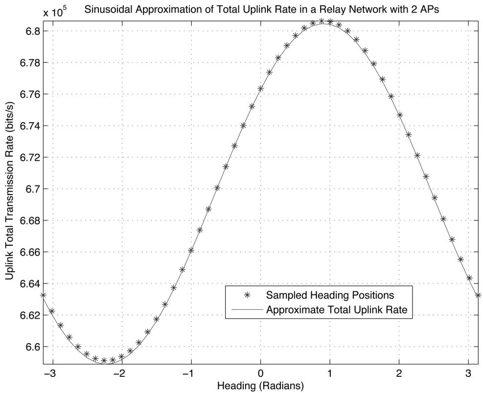

line

| Heading (Radians) | Uplink Total Transmission Rate (bits/s) |
| ------------------ | ---------------------------------------- |
| -3.0               | 6.635                                    |
| -2.8               | 6.620                                    |
| -2.6               | 6.605                                    |
| -2.4               | 6.595                                    |
| -2.2               | 6.590                                    |
| -2.0               | 6.585                                    |
| -1.8               | 6.595                                    |
| -1.6               | 6.610                                    |
| -1.4               | 6.630                                    |
| -1.2               | 6.650                                    |
| -1.0               | 6.670                                    |
| -0.8               | 6.690                                    |
| -0.6               | 6.710                                    |
| -0.4               | 6.730                                    |
| -0.2               | 6.750                                    |
| 0.0                | 6.770                                    |
| 0.2                | 6.780                                    |
| 0.4                | 6.790                                    |
| 0.6                | 6.800                                    |
| 0.8                | 6.805                                    |
| 1.0                | 6.805                                    |
| 1.2                | 6.800                                    |
| 1.4                | 6.790                                    |
| 1.6                | 6.770                                    |
| 1.8                | 6.750                                    |
| 2.0                | 6.730                                    |
| 2.2                | 6.710                                    |
| 2.4                | 6.690                                    |
| 2.6                | 6.670                                    |
| 2.8                | 6.650                                    |
| 3.0                | 6.635                                    |

Fig. 3. Sinusoidal approximation for total subnet uplink communication rate.

turning radius of the UAV in one time step. The first constraint in (16) guarantees a minimum level of performance for each AP, assuming that each AP-UAV link uses the same bandwidth. Note that if the bandwidth could be allocated dynamically for different APs, it would result in a more complicated optimization problem since not only would the total rate be the weighted sum of each AP-UAV link data rate, but also the data rate of each link would be a function of bandwidth due to the white noise assumption. For some scenarios, there is no solution to the above problem. In such cases, a single UAV is not enough to provide coverage for the entire network, and additional UAVs are needed in order to achieve the minimum requirements.

In general, the above optimization problem is very complicated, and does not admit a simple solution. A key result of this paper is derived in the Appendix, where it is shown that under some mild conditions, $R _ { k } ( t )$ at each step t can be approximated as a sinusoid plus an offset:

$$
R _ {k} (t) = \beta_ {k} (\eta_ {k} (t) \cos (\delta_ {t} - \theta_ {k} ^ {0} (t)) + \zeta_ {k} (t)). \tag {17}
$$

Expressions for the terms $\eta _ { k } ( t )$ and $\zeta _ { k } ( t )$ can be found in the Appendix. Using this approximation, the complexity of the optimization problem is significantly reduced. The total network throughput $R _ { T } ( t )$ is thus also approximately a sinusoid plus a constant offset, and if no constraints were imposed on the UAV turning radius, the optimal UAV heading would be given by

$$
\delta_ {t} = \arctan \frac {\sum_ {k = 1} ^ {K} \beta_ {k} \eta_ {k} (t) \sin \theta_ {k} ^ {0} (t)}{\sum_ {k = 1} ^ {K} \beta_ {k} \eta_ {k} (t) \cos \theta_ {k} ^ {0} (t)} \tag {18}
$$

as derived in (47). To solve the optimization with the heading constraint, we simply compute $\delta _ { t }$ as above, and determine if it falls within the region determined by the turning radius and the minimum rate contraint. If yes, this solution is used as the UAV’s heading for the next time interval. If not, a finite number of angles determined by both constraints is checked, and the one that results in the largest rate is chosen. Section IV discusses this process in more detail.

To validate our derivation, we simulated a scenario with two APs randomly positioned on the ground within a 2000 m-by-2000 m square and one UAV located at [0 0 3600]T in the air. Most of the simulation parameters are the same as in the previous example, except that the bandwidth of each AP is assumed to be 200 kHz and the update time interval is set to 15 s. In order to make the simulation more realistic, we use Lee’s channel model described in [27] to generate $\mathbf { R } _ { \mathrm { T x } }$ and ${ \bf R } _ { \mathrm { R x } }$ . Besides the parameters mentioned above, we set the antenna separation at the UAV to be twice the wavelength of the transmitted EM wave and the antenna separation at the APs as half the wavelength. We also assume that 40 scatterers are uniformly placed on a circle with radius 100 wavelengths around each AP. The simulation results are plotted in Fig. 3. It is clear that the total

uplink transmission rate is well approximated by the sinusoidal expression derived in the Appendix. The importance of optimizing the UAV’s motion can be seen from the 20 kbit/s date rate difference yielded by simply assuming a better heading. This difference by itself is capable of supporting an additional user for voice communication in most commercial standards. The accuracy of the approximation can be further improved when the update time interval is smaller and the conditions stated in the Appendix are better satisfied.

# IV. UAV CONTROL FOR ADAPTIVE HANDOFFS

The assumption of mobile APs and relays causes the average link SNR for each AP-UAV link to vary at every time update. As time goes by, the original association of APs to UAVs may no longer be optimal, and improved network throughput could be obtained by switching some of the APs to a different relay host. In this section, we study the AP handoff problem in the context of a mobile-relay-assisted network. In this section, we assume that $N _ { R }$ airborne relays are in service, each hosting a set of APs with an index set $\begin{array} { r } { \mathcal { T } _ { i } , 1 \le i \le N _ { R } , } \end{array}$ , whose elements are the indices of the APs that the ith UAV is servicing. We suppose there are $L _ { \mathrm { A P } }$ total APs requesting service, so that $\cup _ { i = 1 } ^ { N _ { R } } \mathcal { T } _ { i } = \mathcal { Q } \equiv \{ z \mid z = 1 , 2 , . . . , L _ { \mathrm { A P } } \}$ and $\cap _ { i = 1 } ^ { N _ { R } } \mathcal { T } _ { i } =$ Ø. In other words, the current $N _ { R }$ UAVs are able to host all of the $L _ { \mathrm { A P } }$ APs for the time interval of interest. If this is not the case, new UAVs need to be deployed. The problem of deploying new UAVs to the network will be briefly addressed in Section IVC. For notational convenience, and since we focus here on a single time step, we drop the explicit dependence on t for most variables in this section and in the Appendix.

Various handoff algorithms for cellular networks based on received signal strength (RSS) are discussed in [28]. The basic idea behind these algorithms is that the mobile terminal, the AP in this case, measures the received signal strength from various BTS over some time window, and associates itself with the BTS that provides the strongest link. With some modifications, a similar idea can be used in developing a handoff algorithm for our mobile-UAV-assisted network. The mobility of the UAV relays, the motion constraint for their turning radius, and the minimum rate constraint for each AP in (16) complicates the handoff procedure, as discussed below.

# A. Problem Formulation

Define subnet i as the set of nodes served by UAV relay i. Section IIIC gives an approximate closed-form solution for the optimal UAV heading command for each subnet configuration when the new computed UAV position falls in the area reachable by the UAV and leads to a link throughput that satisfies the minimum rate constraint. If the constraints are not met, boundary points need to be checked to yield the best heading solution. To provide a better understanding of the constraints and the so-called “boundary,” we introduce a few new concepts as follows. The link allowable region for the kth AP in the jth subnet is defined as the range of headings −kj where for all $\delta \in \Omega _ { i } ^ { k }$ , we have $R _ { j } ^ { k } \ge R _ { \mathrm { m i n } }$ , where $R _ { j } ^ { k }$ is the data rate that the jth subnet can provide for the kth AP. According to the sinusoidal approximation in (17), we find the link allowable region for the kth AP to be

$$
\Omega_ {j} ^ {k} \equiv \left\{ \begin{array}{l l} [ 0 & 2 \pi ] \\ \emptyset & \beta_ {k} \zeta_ {k} - \beta_ {k} | \eta_ {k} | \geq R _ {\min} \\ [ t _ {1} & t _ {2} ] \\ [ 0 & t _ {1} ] \bigcup [ t _ {2} & 2 \pi ] \end{array} \quad (t _ {1} - \theta_ {j} ^ {0, k}) \cdot (t _ {2} - \theta_ {j} ^ {0, k}) <   0 \right. \tag {19}
$$

where

$$
\theta_ {j} ^ {0, k} = \left\{ \begin{array}{l l} \lfloor \arctan \left(\frac {y _ {u} ^ {t - 1} - y _ {k} ^ {t}}{x _ {u} ^ {t - 1} - x _ {k} ^ {t}}\right) \rfloor_ {2 \pi} & \eta_ {k} > 0 \\ \lfloor \pi + \arctan \left(\frac {y _ {u} ^ {t - 1} - y _ {k} ^ {t}}{x _ {u} ^ {t - 1} - x _ {k} ^ {t}}\right) \rfloor_ {2 \pi} & \eta_ {k} <   0 \end{array} \right. \tag {20}
$$

and $t _ { 1 }$ and $t _ { 2 }$ are defined as

$$
\begin{array}{l} t _ {1} = \min \left\{\psi_ {j} ^ {k}, 2 \pi - \psi_ {j} ^ {k} \right\}, \quad t _ {2} = \max \left\{\psi_ {j} ^ {k}, 2 \pi - \psi_ {j} ^ {k} \right\} \\ R _ {i j} = \beta_ {i} \cdot C _ {i j} \end{array} \tag {21}
$$

$$
\psi_ {j} ^ {k} \equiv \left\lfloor \arccos \frac {R _ {\min} - \beta_ {k} \cdot \zeta_ {k}}{\beta_ {k} \cdot | \eta_ {k} |} + \theta_ {j} ^ {0, k} \right\rfloor_ {2 \pi}
$$

where we use $\lfloor \cdot \rfloor _ { 2 \pi }$ to denote the mod-2¼ operation. Therefore, the solution to the optimization problem is a subset of the intersection of all $\Omega _ { j } ^ { k }$ for each subnet. An illustration for different link allowable regions is given in Fig. 4. As can be seen from the figure, the link allowable region is defined as the heading region where the sinusoidal curve is above the dashed horizontal line.

The reachable region is defined as the set of heading angles that are within the turning radius of the UAV:

$$
\mathcal {C} _ {j} \equiv \left\{\delta_ {t}: \left| \delta_ {t} - \delta_ {t - 1} ^ {j} \right| \leq \Delta \delta_ {j} \right\} \tag {22}
$$

where $\delta _ { t - 1 } ^ { j }$ is the previous heading for the jth relay and $\Delta \delta _ { j }$ is the turning constraint for the jth relay. The intersection between $\Omega _ { j } ^ { k }$ and $\mathcal { C } _ { j }$ defines the admissible region for the kth AP with respect to the jth relay:

$$
\Xi_ {j} ^ {k} \equiv \Omega_ {j} ^ {k} \cap \mathcal {C} _ {j}. \tag {23}
$$

A nonempty admissible region is a necessary but not sufficient condition for the jth relay to host the kth AP. For the jth relay to simultaneously support all nodes in the set $\mathcal { T } _ { j }$ , satisfying both the minimum rate and turning radius constraints, its feasible region, defined as the intersection of the admissible regions of all the hosted APs, has to be nonempty:

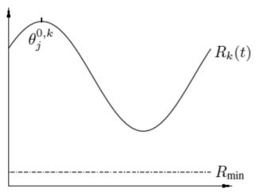

line

| R_min | R_k(t) |
|-------|--------|
| 0     | 0      |
| Peak  | θ_j^0,k |
| 1     | 0      |
| Minimum | R_min |

(a)

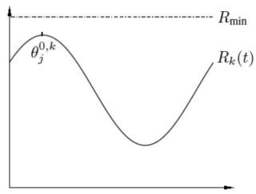

text_image

Rmin
θj^0,k
Rk(t)

(b)

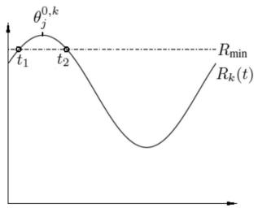

text_image

θj^0,k
t1 t2
Rmin
Rk(t)

（c）

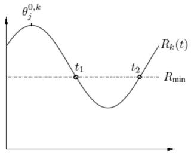

line

| Point | Value |
|-------|-------|
| t1    | 0     |
| t2    | 0     |

(d)   
Fig. 4. Illustration of link allowable region for different scenarios, where $\theta _ { i } ^ { 0 , k }$ is angle at which maximum link rate $R _ { k } ( t )$ is j  achieved for user k, and t 1 and t 2 are angles where Rk(t) = Rmin. $\therefore k ,$ $t _ { 1 }$ $t _ { \gamma }$ $R _ { k } ( t ) = \ddot { R } _ { \operatorname* { m i n } } .$   
(a) $\beta _ { k } \zeta _ { k } - \beta _ { k } | \eta _ { k } | \overset { \cdot } { \geq } R _ { \mathrm { m i n } } . \mathbf { \tilde { ( b ) } } \ \beta _ { k } \zeta _ { k } + \beta _ { k } | \eta _ { k } | < R _ { \mathrm { n } }$ in .   
(c) $( t _ { 1 } - \theta _ { j } ^ { 0 , k } ) \cdot ( t _ { 2 } - \theta _ { j } ^ { 0 , k } ) < 0 .$ (d) $( t _ { 1 } - \theta _ { j } ^ { 0 , k } ) \cdot ( t _ { 2 } - \theta _ { j } ^ { 0 , k } ) > 0 .$

$$
\mathcal {S} _ {j} \equiv \bigcap_ {i = 1} ^ {| \mathcal {I} _ {j} |} \Xi_ {j} ^ {\mathcal {I} _ {j} (i)} \neq \emptyset \tag {24}
$$

where $| { \mathcal { T } } _ { j } |$ is the cardinality of the set $\mathcal { T } _ { j }$ . For the potential entry of AP $p$ into subnet $q ,$ not only does the admissible region $\Xi _ { q } ^ { p }$ have to be nonempty, but it should also be compatible with the set of APs that the qth relay is currently hosting, i.e., $\Xi _ { q } ^ { p } \cap { \cal S } _ { q } \not = \emptyset$ . We consider this to be a sufficient condition for allowing an AP to register with a potential relay. We can conclude that for each subnet $j ,$ if the relay’s feasible region $\boldsymbol { \mathcal { S } } _ { j }$ is nonempty and the computed heading falls in the range defined by $\boldsymbol { \mathscr { S } } _ { j }$ , the optimal solution is achieved by commanding the jth relay to fly at the angle determined by (18). If $\boldsymbol { \mathscr { S } } _ { j }$ is nonempty but the angle given by the aforementioned equation does not fall in $\boldsymbol { \mathcal { S } } _ { j } .$ , the boundary points of $\boldsymbol { \mathscr { S } } _ { j }$ are checked to yield the best possible solution. In this scenario, $\boldsymbol { \mathcal { S } } _ { j }$ may consist of a number of nonoverlapping regions. Since the total rate for the jth subnet is approximated as an offset sinusoid and the global maximum for the unconstrained solution provided by (18) does not fall in any of these regions, the maximum value for each region will be attained at the boundary points that define the region. This is valid because of the monotonicity of the sinusoidal function in each of its half cycles. Therefore all the boundary points determined by each of these regions are checked to find the optimal solution that yields the largest total subnet rate. If $\boldsymbol { \mathcal { S } } _ { j }$ itself is empty, it means the APs in $\mathcal { T } _ { j }$ are not compatible; either some of the APs must be handed off to other relays currently in service, or new relays have to be deployed to accommodate their communication requirements.

The registration of an AP with a new subnet will change the feasible region of that relay node, thereby affecting the ability of other APs to switch over to this subnet in the future. Hence, the order in which the APs are handed off will affect network performance. An optimal algorithm that solves this handoff problem, involving a joint optimization over all the subnets, can be formulated as follows:

$$
\underset {\mathcal {I} _ {1}, \dots , \mathcal {I} _ {N _ {R}}} {\arg \max} \sum_ {j = 1} ^ {N _ {R}} \sum_ {i = 1} ^ {| \mathcal {I} _ {j} |} R _ {j} ^ {\mathcal {I} _ {j} (i)}
$$

$$
\text { s.t. } \quad \bigcup_ {j = 1} ^ {N _ {R}} \mathcal {I} _ {j} = \mathcal {Q}, \quad \bigcap_ {j = 1} ^ {N _ {R}} \mathcal {I} _ {j} = \emptyset \tag {25}
$$

$$
\mathcal {S} _ {j} \neq \emptyset , \quad \forall j \in [ 1, \dots , N _ {R} ].
$$

Once the AP-relay associations $\mathcal { T } _ { 1 } , \ldots , \mathcal { T } _ { N _ { R } }$ are determined, the optimal headings for the relays can be obtained using the method presented above. Obviously, although knowledge of the positions of the relays and APs can be used to narrow the search space, the above optimization problem is very difficult.

# B. Handoff Algorithm

An ad-hoc handoff algorithm with less complexity is presented below and an example given to clarify the procedure. Each AP in the network is assumed to continuously monitor the quality of its link with all relays. Link quality can be quantified in different ways, including achievable throughput, RSS, etc. We use RSS as our metric in the discussion below, realizing that it would have to be carefully defined in situations involving multiple antennas. When it is detected that a better link than the current one exists for a given AP, a handoff can be requested either by the AP or the relay that is currently hosting the $\mathbf { A } \mathbf { P } ^ { 1 }$ A list H is compiled of such handoff requests over some time interval, and all pairs of candidate APs and their potential new relay hosts are sorted in order of decreasing RSS. The entries of H are periodically examined one by one to see if the admissible region of the candidate APs intersect with the feasible region of the potential relays. If so, the AP is handed off to the new relay, the feasible regions for the new and old relay are updated, and the remainder of the entries in H that are associated with this specific AP are deleted. If the handoff request cannot be accommodated, the

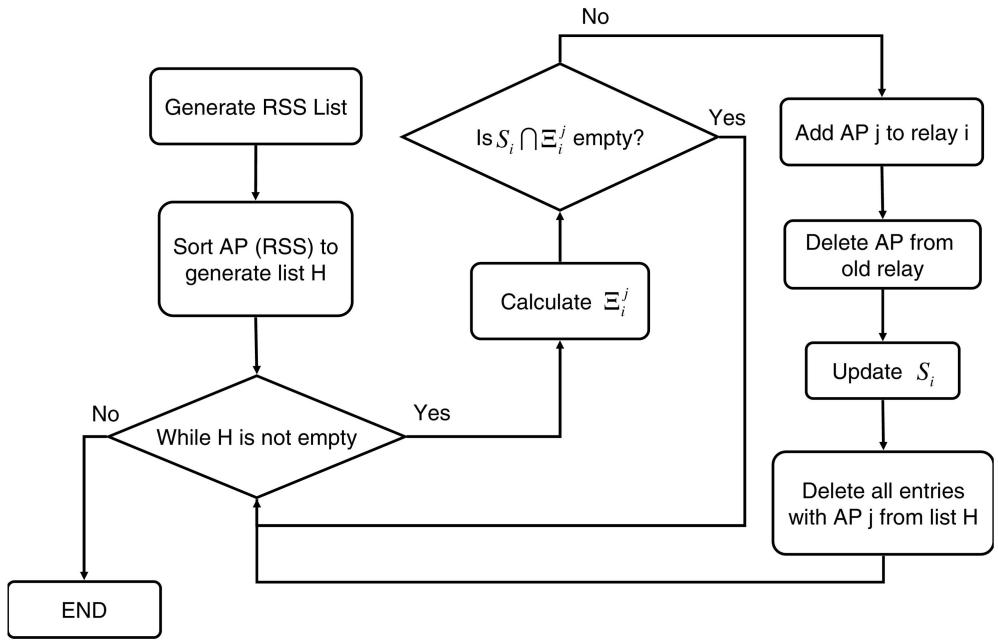

flowchart

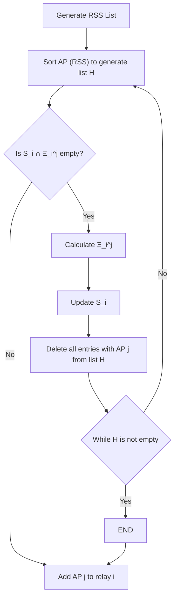

Fig. 5. Flowchart of handoff algorithm for $\mathrm { A P } \ ^ { \ast } j ^ { \ast }$ to handoff to relay $\ " _ { i } \ " $ in UAV assisted network.

corresponding entry in H is deleted, and we proceed to the next entry. This process repeats itself until the list H is empty. A flowchart for the proposed handoff algorithm is shown in Fig. 5.

An example is given here to better explain the proposed procedure. Assume there are 5 airborne relays and 10 APs requesting service. At a certain time instant, AP3, AP5, and AP7 are found to benefit from a possible handoff, with candidate relays (R1, R3, R5) for AP3, (R2, R4) for AP5 and (R1, R2, R5) for AP7. The list H is generated by sorting the RSS of all the possible pairs, and we have, for example:

$$
\begin{array}{l} H = \left\{\left(\mathrm{R} 2, \mathrm{AP} 5\right), (\mathrm{R} 1, \mathrm{AP} 3), (\mathrm{R} 5, \mathrm{AP} 3), (\mathrm{R} 3, \mathrm{AP} 3), \right. \\ (R 2, \mathrm{AP} 7), (R 4, \mathrm{AP} 5), (R 1, \mathrm{AP} 7), (R 5, \mathrm{AP} 7) \}. \tag {26} \\ \end{array}
$$

When the first entry of H is under consideration, the admissible region $\dot { \Xi } _ { 2 } ^ { 5 }$ is tested to see if it intersects with the feasible region of relay 2, i.e., $ { \boldsymbol { S } } _ { 2 }$ . If so, the handoff is made, and H reduces to

$$
\begin{array}{l} H = \left\{\left(\mathrm{R} 1, \mathrm{AP} 3\right), (\mathrm{R} 5, \mathrm{AP} 3), (\mathrm{R} 3, \mathrm{AP} 3), (\mathrm{R} 2, \mathrm{AP} 7), \right. \\ (R 1, \text { AP7 }), (R 5, \text { AP7 }) \}. \\ \end{array}
$$

Now the pair (R1, AP3) is checked. If AP3 is not allowed to hand off to relay 1 due to an empty intersection between $\Xi _ { 1 } ^ { 3 }$ and $\boldsymbol { \mathcal { S } } _ { 1 }$ , this entry is deleted and (R5, AP3) is the next pair of interest. The process continues until H is empty. This ad-hoc algorithm is not optimal in the sense that the order in which the handoffs are carried out will possibly preclude other requested handoffs further down the list, handoffs that might lead to an improved network throughput. However, the proposed approach has low complexity and provides reasonable performance, as illustrated in Section V.

# C. UAV Deployment

The above discussion is based on the assumption that each UAV already has a list of APs it is servicing. The problem of how to partition the APs into various subnets (clusters) remains unaddressed. Furthermore, due to the mobility of both the APs and relays, the signal strength of each link is always changing. It is likely that, as the network evolves, situations will arise where one or more APs cannot communicate with any of the relays even with the possibility of handoffs as discussed above. In such circumstances, additional UAVs must be added to the network in order to maintain connectivity. While one could pose the problem in a formal way and attempt to find an optimal solution, such an approach would likely be intractable and subject to immediate change due to the high degree of network mobility. Instead, we suggest the use of simple deployment strategies and rely on the optimal heading control and adaptive handoff algorithms described above to adjust the relay assignments to improve network performance. Two distinct situations should be considered: the initial deployment of relays to the network, and deployment updates that must be made as the network evolves.

Define the “no-service” list $\mathcal { M } \equiv \mathcal { Q } - \cup _ { j = 1 } ^ { N _ { R } } \mathcal { T } _ { j }$ as the set of APs that cannot be supported by the current set of relays. In many instances, such as during a deployment update,  will only contain a single UAV. In these situations, the deployment problem is trivial, and the new UAV is dispatched to a location near the outlying AP. The adaptive handoff process discussed earlier will allow the new UAV to assume relay control of other APs in the vicinity, and the

effect of these new assignments will ripple through the network as the other UAVs adjust their positions accordingly. When multiple APs are in , such as at the initial deployment stage, a reasonable approach would be to uniformly assign a set of relays in a grid that covers the area encompassed by all APs. While simple, this approach may lead to too many or too few UAVs for the given network configuration. A simple greedy approach is described below that assigns one UAV at a time to the network until all APs are accommodated.

The channel model we assume implies that, on average, each relay has a circular coverage shape. According to (7), at the fringe of the jth relay’s coverage area, the average received SNR can be expressed as

$$
\bar {\gamma} _ {j} = \frac {E (\| \mathbf {H} _ {\text { norm }} \| _ {F} ^ {2})}{(d _ {j , u} ^ {0}) ^ {2 \alpha}} \rho \tag {27}
$$

where $d _ { j , u } ^ { 0 }$ is the distance from the AP at the fringe of the coverage area to the jth relay. For all APs in the coverage area to be able to communicate at a minimum rate $R _ { \operatorname* { m i n } } , d _ { j , u } ^ { 0 }$ must be chosen such that $\bar { \gamma } _ { j }$ will lead to $R ( t ) \geq \dot { R } _ { \operatorname* { m i n } }$ in (13). The complicated expression in (13) does not provide any insight for analytically determining $d _ { j , u } ^ { 0 } .$ although numerical results could easily be obtained. To design the system with some error margin and also for the sake of a simpler solution, we require that at the fringe of each UAV’s coverage, the APs can communicate with the largest constellation that it is capable of achieving a predetermined SER:

$$
\bar {\gamma} _ {j} = \frac {2 \left[ Q ^ {- 1} \left(\frac {P e}{\bar {N} _ {e} (K ^ {(L _ {M})})}\right) \right] ^ {2}}{d _ {\min} ^ {2} (K ^ {(L _ {M})})} \tag {28}
$$

where $N _ { e } ( \cdot )$ and $d _ { \mathrm { m i n } } ( \cdot )$ are defined in (5), and $P _ { e }$ is the maximum tolerable SER. The radius of coverage for the jth relay is further determined as

$$
d _ {j, u} ^ {0} = \left(\frac {E (\| \mathbf {H} _ {\text {norm}} \| _ {F} ^ {2}) \cdot \rho}{\bar {\gamma} _ {j}}\right) ^ {1 / 2 \alpha}.
$$

We can evaluate $E ( \| \mathbf { H } _ { \mathrm { n o r m } } \| _ { F } ^ { 2 } )$ by using the pdf derived in (8).

For an AP to be served by a given relay, the relay must lie within a cithe AP, with radius $r _ { j , u } ^ { 0 } = \sqrt { ( d _ { j , u } ^ { 0 } ) ^ { 2 } - h ^ { 2 } }$ enter is at, where h is the altitude of the UAV. If a set of such circles is drawn for the APs in M, those whose circles overlap can share a common UAV relay. To deploy a UAV, we find the area of overlap that involves the largest number of APs, and assign the UAV to any point in the overlap area. An algorithm for determing the area in common among a set of circles can be found in [29]. The optimal heading algorithm described earlier can then control the movement of the UAV to the optimal position. Once the UAV is deployed, M is updated and the process can be repeated until all APs have been assigned. Again, the suboptimality of the above approach does not concern us, as we rely on the optimal heading control and adaptive handoff algorithms to provide fine tuning of the network performance.

# V. SIMULATION RESULTS

Two simulations with the same initial conditions are run separately to study the behavior of the network with and without the adaptive handoff algorithm implemented. In the simulations, 10 APs are assumed to be moving on the ground in a straight line with random initial directions. Fig. 6 shows the initial positions and headings of the APs and the single UAV that is initially assigned to the network. The AP positions are randomly placed on the ground within a 2500 m  2500 m square, and the initial UAV is placed at $[ 0 \mathrm { ~ 0 ~ } 3 6 0 0 ] ^ { \mathrm { \bar { T } } }$ m. The deployment algorithm described earlier is used to add UAVs to the network as necessary. An uncoded system with seven different MPSK modulation schemes are used in the simulations, i.e., from BPSK to 128-PSK. Each of the APs is assumed to have 3 antennas and 2W of transmit power, and they are all assumed to be moving at 10 m/s. All APs are assumed to have the same type of propagation environment with ® = 1:5, 40 scatterers, and an equivalent scattering radius of 100 wavelengths. We consider a narrowband scenario where each AP has a bandwidth of 20 kHz. All the UAVs are assumed to have 2 antennas with 2 wavelengths separation and fly at a height of 3600 m. The UAVs fly at a speed of 50 m/s with the heading constraint $\Delta \delta \le \pi / 9$ . The minimum transmission rate constraint is set to be $R _ { i . u } \geq 6 . 6 \times 1 0 ^ { 4 }$ bits/s. The update time interval is 0.5 s, and the simulation is run for 150 s. Fig. 7 shows a sample plot of the instantaneous heading for UAV 1 for both the handoff and nonhandoff cases during the 150 s simulation. Note that after its initial deployment, the UAV typically flies in a circular holding pattern, occasionally reversing direction or making a slight shift of position.

A sample of the link data rates for the two different networks is shown in Fig. 8. The periodic variations are due to the circular motion of the UAV relays when the distance between the relay and AP is relatively small. In general, the network without handoff support has slightly higher data rates for some specific APs than the handoff-enabled network, but (as shown below) this comes at the expense of requiring more UAV relays. In fact, the jump in data rate for AP-8 at about 130 s is due to the addition of a relay in the nonhandoff network in the vicinity of AP-8. The benefit of using our adaptive handoff algorithm is clearly illustrated in Fig. 9, which shows the number of UAV relays used in the two networks, and the resulting spectral efficiency (total sum uplink data rate divided by the total available bandwidth). The use of the adaptive handoff algorithm enables the minimum communication requirements to be met using only two UAV relays throughout the entire simulation, while 3—5 relays are needed without proper handoffs.

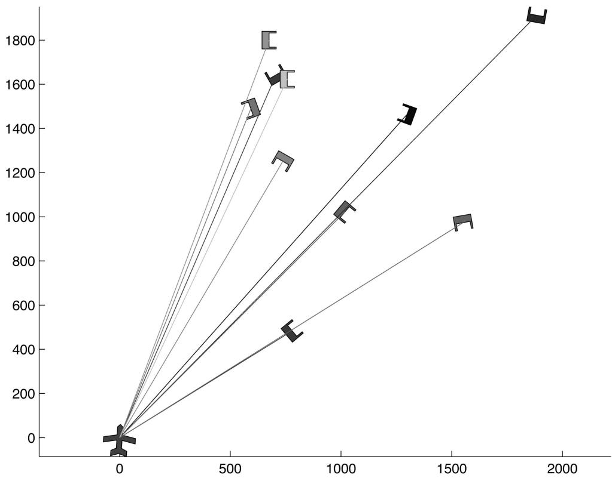

line

| x    | y     |
| ---- | ----- |
| 0    | 0     |
| 600  | 1500  |
| 700  | 1600  |
| 800  | 1250  |
| 1000 | 1000  |
| 1300 | 1450  |
| 1500 | 950   |
| 1900 | 1900  |

Fig. 6. Initial network simulation setup. Airplane represents initial position of UAV relay.

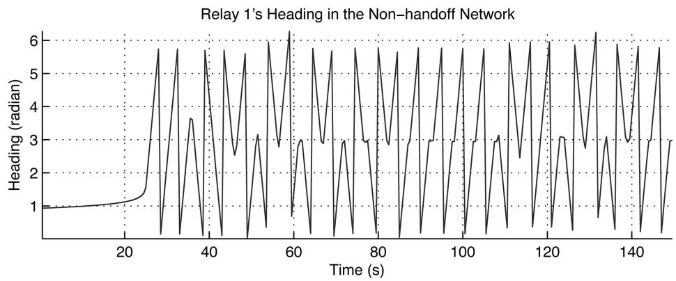

line

| Time (s) | Heading (radian) |
| -------- | ---------------- |
| 0        | 1.0              |
| 20       | 1.0              |
| 30       | 6.0              |
| 40       | 3.5              |
| 50       | 2.5              |
| 60       | 6.0              |
| 70       | 3.0              |
| 80       | 2.8              |
| 90       | 3.0              |
| 100      | 2.8              |
| 110      | 3.0              |
| 120      | 2.5              |
| 130      | 3.0              |
| 140      | 2.8              |
| 150      | 3.0              |

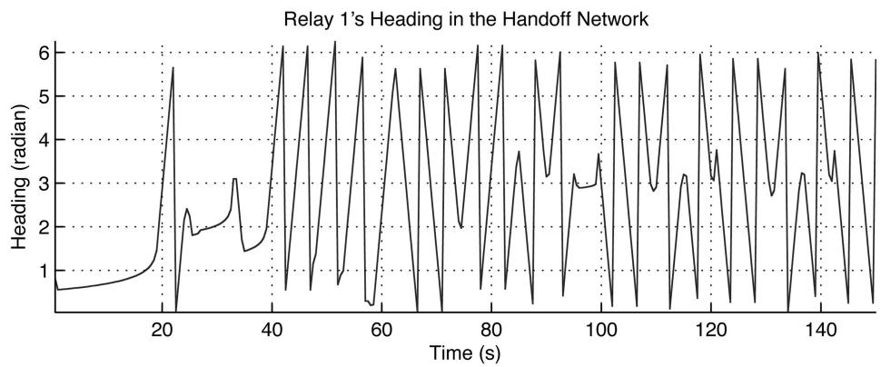

line

| Time (s) | Heading (radian) |
| -------- | ---------------- |
| 0        | 0.5              |
| 20       | 1.0              |
| 40       | 6.0              |
| 60       | 0.5              |
| 80       | 6.0              |
| 100      | 3.0              |
| 120      | 6.0              |
| 140      | 3.0              |

Fig. 7. Sample heading of UAV-1.

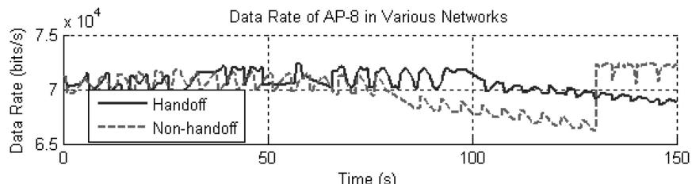

line

| Time (s) | Handoff (bits/s) | Non-handoff (bits/s) |
| -------- | ---------------- | -------------------- |
| 0        | ~70000           | ~70000               |
| 50       | ~70000           | ~70000               |
| 100      | ~70000           | ~68000               |
| 150      | ~70000           | ~72000               |

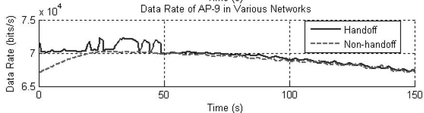

line

| Time (s) | Handoff (bits/s) | Non-handoff (bits/s) |
| -------- | ---------------- | -------------------- |
| 0        | 70000            | 68000                |
| 50       | 70000            | 69000                |
| 100      | 69000            | 68500                |
| 150      | 68000            | 67500                |

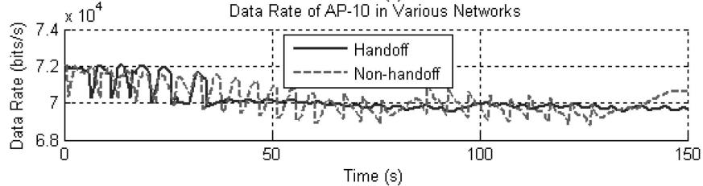

line

| Time (s) | Handoff (bits/s) | Non-handoff (bits/s) |
| -------- | ---------------- | -------------------- |
| 0        | 7.2              | 7.2                  |
| 50       | 7.0              | 7.0                  |
| 100      | 7.0              | 7.0                  |
| 150      | 7.0              | 7.0                  |

Fig. 8. Uplink transmission rate comparison for AP-8, AP-9 and AP-10 for both handoff-enabled and nonhandoff networks.

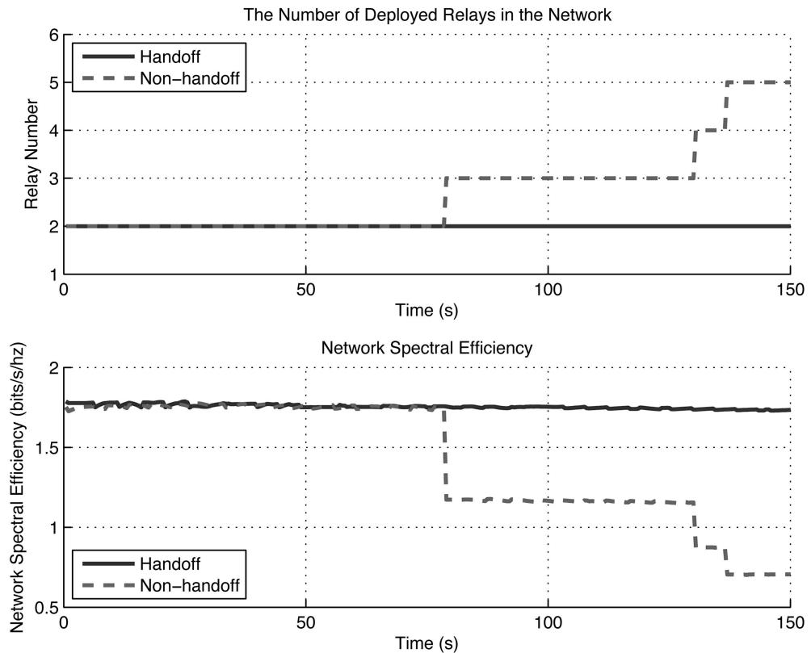

line

| Time (s) | Handoff Relay Number | Non-handoff Relay Number | Handoff Network Spectral Efficiency | Non-handoff Network Spectral Efficiency |
| -------- | -------------------- | ------------------------ | ------------------------------------ | ----------------------------------------- |
| 0        | 2                    | 2                        | 1.8                                  | 1.8                                       |
| 75       | 2                    | 3                        | 1.8                                  | 1.2                                       |
| 150      | 2                    | 5                        | 1.8                                  | 0.7                                       |

Fig. 9. Network efficiency comparison between handoff-enabled and nonhandoff networks.

The topologies of the two networks at a few stages of the simulation are shown in Fig. 10 and Fig. 11. Both simulations are initialized in the same way with only one UAV to begin with. However, as we can see from Figs. 10(a) and 11(a), an additional UAV must immediately be deployed to support all of the APs. As time elapses, some of the APs move away from each other, and a third relay is deployed in the nonhandoff network, as shown in Fig. 10(b). However, a few handoff events take place during this period to address the communication demands from all the APs in the handoff-enabled network, as depicted in

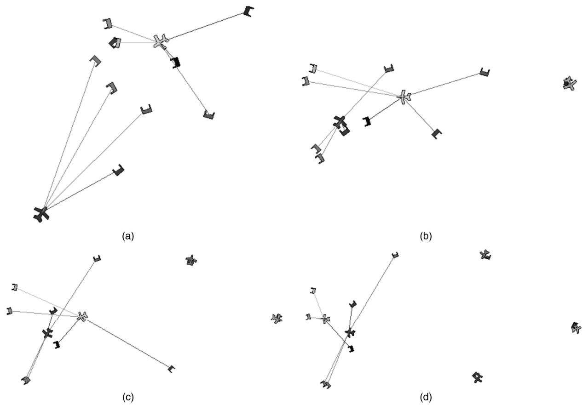

Fig. 10. UAV network simulation without handoff algorithm. (a) Network configuration at $t = 4 \mathrm { ~ s . ~ } ( \mathrm { b } )$ New UAV at $t = 7 8$ s deployment. (c) New $\mathrm { U A V ~ a t } ~ t = 1 3 0 ~ \mathrm { s } .$ . (d) Final network topology.   
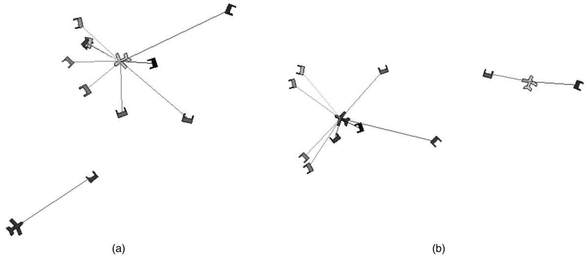

natural_image

Three abstract diagrams labeled (a), (b), showing connected nodes with arrows and lines, no text or symbols present.

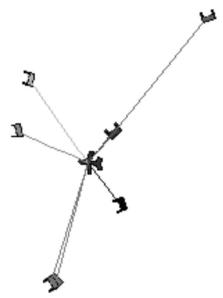

flowchart

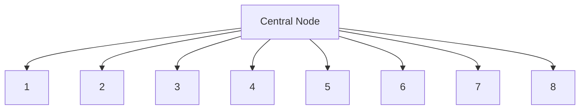

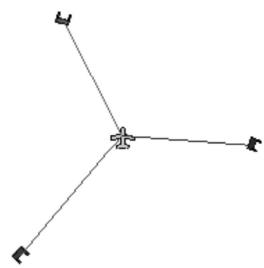

natural_image

Simple 3D coordinate axes diagram with no labels or text

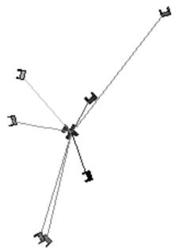

flowchart

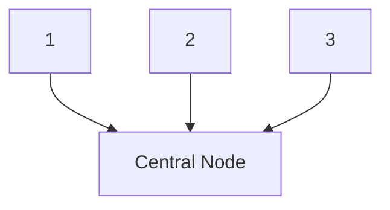

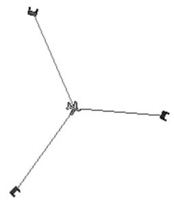

natural_image

Pure geometric lines forming a Y-shape with no text, numbers, or symbols

(d)   
Fig. 11. UAV network simulation with handoff algorithm implemented. (a) Network configuration at t = 4 s. (b) Network configuration at t = 78 s. (c) Handoff during evolution at $t = 1 3 0 \mathrm { ~ s } . \mathrm { ~ } ( \mathrm { d } )$ Final network topology.

Fig. 11(b). As the AP positions change over time, another relay deployment in the nonhandoff network happens at $t \approx 1 3 0 \mathrm { ~ s ~ } ( \mathrm { F i g . ~ } 1 0 ( \mathrm { c } ) )$ , but appropriate handoff events eliminate the need for additional relays in the handoff-enabled network (Fig. 11(c)). The final network topologies are shown in Figs. 10(d) and 11(d).

# VI. SUMMARY

In this paper, we investigated the performance of UAVs acting as relays for ground-based nodes in a hierarchical wireless network. We derived expressions for the SNR distribution and the ENTR for each AP-UAV link assuming adaptive modulation and space-time coding when multiple antennas are present. A sinusoidal approximation was found to accurately approximate the single link data rate as a function of the UAV heading. Using this result, we derived a closed-form expression for the optimal UAV heading that achieves the highest overall data rate in the multi-user uplink system. Given the fact that the network under consideration is highly mobile, we also developed an adaptive handoff algorithm to dynamically adjust the UAV-AP assignments in order to improve network performance. The benefits of the optimal heading and handoff algorithms were demonstrated via a simple simulation example.

Several simplifying assumptions were made in the paper that could be relaxed for future work on this problem. For example, we assumed scenarios with a relatively small number of APs, which allowed us in turn to assume orthogonal communications (no interference) and no bandwidth restrictions on the AP-UAV link. For larger networks, one would have to consider the effects of interference and develop methods (e.g., frequency reuse, beamforming, etc.) to mitigate its effects. Futhermore, the handoff algorithm would need to be modified to take into account the bandwidth utilization of each UAV; switching an AP to an already heavily loaded UAV may not be the best strategy even if the resulting AP signal strength is best suited for the UAV. In this paper, we treated the initial UAV deployment problem in a rather simple way, ignoring the impact of the inherent delay and path planning that must occur between the time the UAV is assigned to an area and when it actually arrives in the area. Finally, we assumed error-free communications between the UAVs, without taking the UAV-UAV communication overhead into account or addressing the additional relaying that would be required to keep the UAVs connected. Additional constraints on the motion of the UAVs would be necessary in order to ensure that the UAV relay network was connected, either via direct links or hopping.

# APPENDIX

# A. Link Level SER Analysis

In this section, we present the link level SER analysis. Once the error analysis for each link has been performed, the SER of the whole system can be calculated.

1) Closed-Form SER Expression: The SER can be expressed as follows:

$$
\begin{array}{l} P _ {s} = \sum_ {i = 1} ^ {L _ {M} - 1} \int_ {C ^ {i} (t)} ^ {C ^ {i + 1} (t)} \bar {N} _ {e} (i) \cdot Q \left(\sqrt {\frac {x \rho d _ {\min} ^ {2} (i)}{2}}\right) f (x) d x \\ + \int_ {C ^ {L _ {M}} (t)} ^ {\infty} \bar {N} _ {e} (L _ {M}) \cdot Q \left(\sqrt {\frac {x \rho d _ {\min} ^ {2} (i)}{2}}\right) f (x) d x. \tag {29} \\ \end{array}
$$

In [30], an alternative definite integral form for the Gaussian Q-function is given as

$$
Q (x) = \frac {1}{\pi} \int_ {0} ^ {\pi / 2} \exp \left(- \frac {x ^ {2}}{2 \sin^ {2} \theta}\right) d \theta , \quad x \geq 0. \tag {30}
$$

Using this alternative form, interchanging the order of the integrations, and recalling the definition in (9), it is straightforward to derive the SER expression given in (14):

$$
\begin{array}{l} P _ {s} = \frac {1}{\pi} \left(\sum_ {i = 1} ^ {L _ {M} - 1} \int_ {0} ^ {\pi / 2} \int_ {C ^ {i} (t)} ^ {C ^ {i + 1} (t)} \bar {N} _ {e} (i) \right. \\ \cdot \exp \left(- \frac {x \rho d _ {\min} ^ {2} (i)}{4 \sin^ {2} \theta}\right) f (x) d x \cdot d \theta + \int_ {0} ^ {\pi / 2} \int_ {C ^ {L _ {M}} (t)} ^ {\infty} \\ \cdot \bar {N} _ {e} (L _ {M}) \cdot \exp \left(- \frac {x \rho d _ {\min} ^ {2} (L _ {M})}{4 \sin^ {2} \theta}\right) f (x) d x \cdot d \theta). \tag {31} \\ \end{array}
$$

2) SER Upper Bound: In order to reduce the computational burden of evaluating (14), an upper bound for the SER is derived by resorting to the results of [26]. In Chiani’s work, an improved exponential bound for the Q function is given as

$$
Q (x) \leq \frac {1}{2} \sum_ {i = 1} ^ {N _ {\mathrm{g}}} a _ {i} \exp \left(- \frac {b _ {i} x ^ {2}}{2}\right) \tag {32}
$$

where

$$
a _ {i} = \frac {2 (\theta_ {i} - \theta_ {i - 1})}{\pi} \quad \text { and } \quad b _ {i} = \frac {1}{\sin^ {2} \theta_ {i}}. \tag {33}
$$

In (32), $N _ { g }$ determines the number of grids in the range $[ 0 , { \bar { \pi } } / 2 ]$ , and $\theta _ { i - 1 }$ and $\theta _ { i }$ are the boundary points for the ith grid. When equal-size grids are used, $\theta _ { 0 } = 0 , \theta _ { N _ { o } } = \pi / 2$ , and $\theta _ { i } = \pi \cdot i / ( 2 N _ { g } )$ . Note that this bound is much better than the popular Chernoff bound. After some manipulation, the upper bound for the SER is found to be given by

where

$$
\lambda_ {k} ^ {i} = \frac {\gamma^ {(i)}}{\rho_ {k}} L _ {k} ^ {\alpha_ {k}}
$$

$$
L _ {k} = (x _ {u} ^ {t - 1} - x _ {k} ^ {t}) ^ {2} + (y _ {u} ^ {t - 1} - y _ {k} ^ {t}) ^ {2} + h _ {u} ^ {2} + V ^ {2} \Delta^ {2}
$$

$$
\begin{array}{l} P _ {s} \leq \sum_ {i = 1} ^ {L _ {M} - 1} \frac {\bar {N} _ {e} (i)}{2} \sum_ {j = 1} ^ {P} \sum_ {k = 1} ^ {m _ {j}} \sum_ {n = 1} ^ {N _ {g}} \frac {a _ {n} A _ {j k}}{\sigma_ {j} ^ {k}} \left[ g \left(k - 1, - \left(\frac {b _ {n} \rho d _ {\min} ^ {2} (i)}{4} + \frac {1}{\sigma_ {j}}\right), C ^ {i + 1} (t)\right) - g \left(k - 1, - \left(\frac {b _ {n} \rho d _ {\min} ^ {2} (i)}{4} + \frac {1}{\sigma_ {j}}\right), C ^ {i} (t)\right) \right] \\ - \frac {\bar {N} _ {e} (L _ {M})}{2} \sum_ {j = 1} ^ {P} \sum_ {k = 1} ^ {m _ {j}} \sum_ {n = 1} ^ {N _ {g}} \frac {a _ {n} A _ {j k}}{\sigma_ {j} ^ {k}} g \left(k - 1, - \left(\frac {b _ {n} \rho d _ {\min} ^ {2} (L _ {M})}{4} + \frac {1}{\sigma_ {j}}\right), C ^ {L _ {M}} (t)\right). \tag {34} \\ \end{array}
$$

As we can see in Fig. 2, when $N _ { g }$ increases, the SER bound closely approaches the theoretical value.

# B. Approximation of F(y) and the Rate R(t)

In this section, we show that the cdf $F ( y )$ of the Frobenius norm of the channel can be approximated by a sinusoid under certain assumptions. Let us first assume a single ring scattering model [16] (i.e., the APs are surrounded by the effective scatterers on a ring, and the UAV has no scatterers around it), and a Kronecker structure for the channel correlation matrix (4). Under such assumptions, the channel is ill-conditioned with only one dominant eigenmode. Assuming there is no spatial correlation at the APs, the channel correlation matrix $R _ { H } ^ { k }$ between the UAV and the kth AP has only one distinct non-zero eigenvalue $\sigma$ with multiplicity $m ,$ where m is the number of antennas at the AP side. Therefore, the Laplace transform of the pdf of $\| \mathbf { H } _ { \mathrm { n o r m } } \| _ { F } ^ { 2 }$ can be expressed as

$$
\psi (s) = \frac {1}{(1 + \sigma) ^ {m}} \tag {35}
$$

and the cdf can be written as

$$
F (y) = \left(1 - \sum_ {l = 0} ^ {m - 1} \frac {\left(\frac {y}{\sigma}\right) ^ {l}}{l !} e ^ {- y / \sigma}\right) u (y). \tag {36}
$$

We can see from (13) that calculating the ENTR for the kth link would involve evaluating $F ( y )$ at the values $C _ { k } ^ { i } = ( \gamma ^ { ( i ) } / \rho _ { k } ) d _ { k } ^ { 2 \alpha _ { k } }$ , where the subscript k indicates the kth link. Now assume that at time t ¡ 1 the UAV is at position $( x _ { u } ^ { t - 1 } , y _ { u } ^ { t - 1 } , h _ { u } )$ , and at the next time $t ,$ the kth AP is at $( x _ { k } ^ { t } , y _ { k } ^ { t } , 0 )$ ). Recall that $d _ { k } ^ { 2 } = ( x _ { u } ^ { t } - x _ { k } ^ { t } ) ^ { 2 } + ( y _ { u } ^ { t } - y _ { k } ^ { t } ) ^ { 2 } + \ddot { h _ { u } ^ { 2 } }$ as described in Section III. By plugging the constant speed model (15) into these expressions, after some mathematical manipulations, we have

$$
C _ {k} ^ {i} = \lambda_ {k} ^ {i} \left(1 + \frac {2 r _ {k}}{L _ {k}} \cos (\delta - \theta_ {k} ^ {0})\right) ^ {\alpha_ {k}} \tag {37}
$$

$$
r _ {k} = \sqrt {(x _ {u} ^ {t - 1} - x _ {k} ^ {t}) ^ {2} + (y _ {u} ^ {t - 1} - y _ {k} ^ {t}) ^ {2}} V \Delta
$$

$$
\theta_ {k} ^ {0} = \arctan \frac {y _ {u} ^ {t - 1} - y _ {k} ^ {t}}{x _ {u} ^ {t - 1} - x _ {k} ^ {t}}.
$$

Consider the function $f ( x ) = e ^ { k ( 1 + x ) ^ { \alpha } }$ , where k and ® are both constants. When x is small, linearizing f(x) around $x = 0$ using the Taylor expansion, we have $f ( x ) \approx e ^ { k } + \alpha k e ^ { k } x$ . Therefore

$$
e ^ {- y / \sigma} = e ^ {- \mathbf {C} ^ {i} / \sigma} \approx e ^ {- \lambda_ {k} ^ {i} / \sigma} - \alpha_ {k} \frac {\lambda_ {k} ^ {i}}{\sigma} e ^ {- \lambda_ {k} ^ {i} / \sigma} \frac {2 r _ {k}}{L _ {k}} \cos (\delta - \theta_ {k} ^ {0}) \tag {38}
$$

$$
\frac {y}{\sigma} = \frac {C _ {k} ^ {i}}{\sigma} \approx \frac {\lambda_ {k} ^ {i}}{\sigma} + \frac {\alpha_ {k} \lambda_ {k} ^ {i}}{\sigma} \frac {2 r _ {k}}{L _ {k}} \cos (\delta - \theta_ {k} ^ {0}). \tag {39}
$$

Let us define

$$
a _ {k} (i) = \frac {\lambda_ {k} ^ {i}}{\sigma}, \qquad b _ {k} (i) = \alpha_ {k} \frac {\lambda_ {k} ^ {i}}{\sigma} \cos (\delta - \theta_ {k} ^ {0})
$$

$$
q _ {k} = \frac {2 r _ {k}}{L _ {k}}, \qquad c _ {k} (i) = e ^ {- \lambda_ {k} ^ {i} / \sigma}
$$

$$
d _ {k} (i) = \alpha_ {k} \frac {\lambda_ {k} ^ {i}}{\sigma} e ^ {- \lambda_ {k} ^ {i} / \sigma} \cos (\delta - \theta_ {k} ^ {0}).
$$

If we recall the binomial expansion theorem, we have

$$
(a + b) ^ {n} = \sum_ {j = 0} ^ {n} \binom {n} {j} a ^ {j} b ^ {n - j}. \tag {40}
$$

Note that in most of the scenarios we consider, $L _ { k } \gg$ $2 r _ { k }$ and therefore $q _ { k }$ is close to 0. In such scenarios, each term in (36) can be written as

$$
\begin{array}{l} \frac {1}{l !} \left(\frac {C _ {k} ^ {i}}{\sigma}\right) ^ {l} e ^ {- C _ {k} ^ {i} / \sigma} \\ \approx \frac {1}{l !} (a _ {k} (i) + b _ {k} (i) q _ {k}) ^ {l} (c _ {k} (i) - d _ {k} (i) q _ {k}) \\ = \frac {1}{l !} \left(\sum_ {j = 0} ^ {l} \binom {l} {j} a _ {k} ^ {j} (i) b _ {k} ^ {l - j} (i) q _ {k} ^ {l - j}\right) \left(c _ {k} (i) - d _ {k} (i) q _ {k}\right). \tag {41} \\ \end{array}
$$

Since $q _ { k }$ is assumed to be a number close to zero, we drop all the terms involving $q _ { k }$ with higher than first order. Hence

$$
\frac {1}{l !} \left(\frac {C _ {k} ^ {i}}{\sigma}\right) ^ {l} e ^ {- C _ {k} ^ {i} / \sigma}
$$

$$
\approx \frac {1}{l !} (a _ {k} ^ {l} (i) + l a _ {k} ^ {l - 1} (i) b _ {k} (i) q _ {k}) (c _ {k} (i) - d _ {k} (i) q _ {k})
$$

$$
\approx \frac {1}{l !} [ a _ {k} ^ {l} (i) c _ {k} (i) + a _ {k} ^ {l - 1} (i) (l b _ {k} (i) c _ {k} (i) - a _ {k} (i) d _ {k} (i)) q _ {k} ]
$$

$$
\approx \mu_ {k} ^ {(l)} + \nu_ {k} ^ {(l)} \cos (\delta - \theta_ {k} ^ {0}) \tag {42}
$$

where $\mu _ { k } ^ { ( l ) } ( i ) = ( 1 / l ! ) ( a _ { k } ^ { l } ( i ) c _ { k } ( i ) )$ and $\nu _ { k } ^ { ( l ) } =$

$( 1 / l ! ) \alpha _ { k } a _ { k } ^ { l } ( i ) c _ { k } ( i ) q _ { k } ( l - a _ { k } ( i ) )$ . The above derivation shows that each term in (36) is a sinusoid of the same frequency with some dc offset. Therefore, the sum of these terms is also a sinusoid with the same frequency but a different dc offset. When a single ring model is assumed, the cdf $F ( y )$ of the channel’s Frobenius norm using the ith modulation scheme for AP k, $C _ { k } ^ { i } ,$ can be approximated as

$$
F _ {k} (i) = U _ {k} (i) + V _ {k} (i) \cos (\delta - \theta_ {k} ^ {0}) \tag {43}
$$

where $\begin{array} { r } { U _ { k } ( i ) = 1 - \sum _ { l = 0 } ^ { m - 1 } \mu _ { k } ^ { ( l ) } ( i ) } \end{array}$ and $V _ { k } ( i ) =$

$\textstyle - \sum _ { l = 0 } ^ { m - 1 } \nu _ { k } ^ { ( l ) } ( i )$ . Using (13) we can write the average transmission rate of AP k as

$$
R _ {k} = \beta_ {k} (\eta_ {k} \cos (\delta - \theta_ {k} ^ {0}) + \zeta_ {k}) \tag {44}
$$

where

$$
\begin{array}{l} \zeta_ {k} = \sum_ {i = 1} ^ {L _ {M} - 1} \log_ {2} K ^ {(i)} \cdot (U _ {k} (i + 1) - U _ {k} (i)) \\ + \log_ {2} K ^ {(L _ {M})} - \log_ {2} K ^ {(L _ {M})} \cdot U _ {k} (L _ {M}) \\ \end{array}
$$

$$
\eta_ {k} = \sum_ {i = 1} ^ {L _ {M} - 1} \log_ {2} K ^ {(i)} \cdot (V _ {k} (i + 1) - V _ {k} (i)) - \log_ {2} K ^ {(L _ {M})} \cdot V _ {k} (L _ {M}).
$$

Although the derivation above assumes a single ring scattering model for the channel, we show here how the analysis can be extended to the case where the channel has more than one dominant eigenmode. Under this circumstance the cdf of the channel norm is derived in (10). With the definition of the $g \cdot$ -function in (9), we can write

$$
F (x) = \sum_ {j = 1} ^ {P} \sum_ {t = 1} ^ {m _ {j}} (- 1) ^ {2 t - 1} A _ {j t} \sum_ {l = 0} ^ {t - 1} \frac {1}{l !} \left(\frac {x}{\sigma_ {j}}\right) ^ {l} e ^ {- x / \sigma_ {j}}. \tag {45}
$$

To calculate the rate, $F ( x )$ needs to again be evaluated at $C _ { k } ^ { i } .$ , and we can see that every term in the inner-most summation sign in (45) has a form identical to (42), except $\sigma$ is replaced with $\sigma _ { j } .$ . Using reasoning similar to that above, each term can be approximated as a sinusoidal function with a dc offset:

$$
\frac {1}{l !} \left(\frac {C _ {k} ^ {i}}{\sigma_ {j}}\right) ^ {l} e ^ {- C _ {k} ^ {i} / \sigma_ {j}} \approx \mu_ {k, j} ^ {(l)} (i) + \nu_ {k, j} ^ {(l)} (i) \cos (\delta - \theta_ {k} ^ {0}). \tag {46}
$$

This expression is almost identical to (42) except that the subscript $j$ is introduced to describe its dependence on $\sigma _ { j } .$ . Plugging the equations in, we have

$$
\mu_ {k, j} ^ {(l)} (i) = \frac {1}{l !} \left(\frac {\gamma^ {(i)} L _ {k} ^ {\alpha_ {k}}}{\sigma_ {j} \rho_ {k}}\right) ^ {l} \cdot e ^ {- \gamma^ {(i)} L _ {k} ^ {\alpha_ {k}} / \sigma_ {j} \rho_ {k}}
$$

$$
\nu_ {k, j} ^ {(l)} (i) = \alpha_ {k} \mu_ {k, j} ^ {(l)} (i) \frac {2 r _ {k}}{L _ {k}} \left(l - \frac {\gamma^ {(i)} L _ {k} ^ {\alpha_ {k}}}{\sigma_ {j} \rho_ {k}}\right).
$$

Similarly, (43) still holds with

$$
U _ {k} (i) = \sum_ {j = 1} ^ {P} \sum_ {t = 1} ^ {m _ {j}} (- 1) ^ {2 t - 1} A _ {j t} \sum_ {l = 0} ^ {t - 1} \mu_ {k, j} ^ {(l)}
$$

$$
V _ {k} (i) = \sum_ {j = 1} ^ {P} \sum_ {t = 1} ^ {m _ {j}} (- 1) ^ {2 t - 1} A _ {j t} \sum_ {l = 0} ^ {t - 1} \nu_ {k, j} ^ {(l)}.
$$

This implies (44) still holds, which means when the above assumption holds, the average transmission rate for each link can be approximated as a sinusoid with a dc offset. Thus the sum uplink rate will be approximated as a sum of sinusoids with the same frequency but different offsets. Furthermore, it can be shown that:

$$
R _ {T} = \sum_ {k = 1} ^ {K} R _ {k} = \Gamma \cos (\delta - \theta) + \Upsilon
$$

$$
\Gamma = \sqrt {\left(\sum_ {k = 1} ^ {K} \beta_ {k} \eta_ {k} \cos \theta_ {k} ^ {0}\right) ^ {2} + \left(\sum_ {k = 1} ^ {K} \beta_ {k} \eta_ {k} \sin \theta_ {k} ^ {0}\right) ^ {2}} \tag {47}
$$

$$
\theta = \arctan {\frac {\sum_ {k = 1} ^ {K} \beta_ {k} \eta_ {k} \sin \theta_ {k} ^ {0}}{\sum_ {k = 1} ^ {K} \beta_ {k} \eta_ {k} \cos \theta_ {k} ^ {0}}}
$$

$$
\Upsilon = \sum_ {k = 1} ^ {K} \beta_ {k} \zeta_ {k}.
$$

It can be clearly seen from the above derivation that, if no other constraint is imposed on the $\mathrm { U A V } \mathbf { \hat { s } }$ heading, the sum rate of the system can be maximized by assuming the heading angle μ given in (47).

# REFERENCES

[1] Zhan, P., Casbeer, D., and Swindlehurst, A. L. A centralized control algorithm for target tracking with UAVs. In Proceedings of the 39th IEEE Asilomar Conference, Oct. 2005.

[2] Xu, K., et al. Landmark routing in large wireless battlefield networks using UAVs. In Proceedings of the IEEE Military Communications Conference (MILCOM 2001), vol. 1, 2001, 561—573.   
[3] Ayyagari, A., Harrang, J. P., and Ray, S. Airborne information and reconnaissance network. In Proceedings of the IEEE Military Communications Conference, Oct. 1996, 230—234.   
[4] Gu, D., et al. UAV aided intelligent routing for ad-hoc wireless network in single-area theater. In Proceedings of the IEEE Wireless Communications & Networking Conference (WCNC), vol. 3, 2000, 1220—1225.   
[5] Rubin, I., et al. Ad hoc wireless networks with mobile backbones. In Proceedings of the IEEE Personal, Indoor, Mobile and Radio Communications Symposium (PIMRC), vol. 1, 2004, 566—573.   
[6] Cheng, C., et al. Maximizing throughput of UAV-relaying networks with the load-carry-and-deliver paradigm. In Proceedings of the IEEE Wireless Communications & Networking Conference (WCNC), 2007, 4417—4424.   
[7] Basu, P., Redi, J., and Shurbanov, V. Coordinated flocking of UAVs for improved connectivity of mobile ground nodes. In Proceedings of the IEEE Military Communications Conference (MILCOM), vol. 3, 2004, 1628—1634.   
[8] Palat, R., Annamalau, A., and Reed, J. Cooperative relaying for ad-hoc ground networks using swarm UAVs. In Proceedings of the IEEE Military Communications Conference (MILCOM), vol. 3, 2005, 1588—1594.   
[9] Han, Z., et al. Smart deployment/movement of unmanned air vehicle to improve connectivity in MANET. In Proceedings of the IEEE Wireless Communications and Networking Conference, 2006, 252—257.   
[10] Zhan, P., Yu, K., and Swindlehurst, A. L. Wireless relay communications using an unmanned aerial vehicle. In IEEE Workshop on Signal Processing Advances in Wireless Communications (SPAWC), 2006, 1—5.   
[11] Han, Z., Swindlehurst, A., and Liu, K. J. R. Optimization of MANET connectivity via smart deployment/movement of unmanned air vehicles. IEEE Transactions on Vehicular Technology, 7, (2009), 3533—3546.   
[12] Kramer, G., Gastpar, M., and Gupta, P. Cooperative strategies and capacity theorems for relay networks. IEEE Transactions on Information Theory, 51, 9 (2005), 3037—3063.   
[13] Bolcskei, H., et al.¨ Capacity scaling laws in MIMO relay networks. IEEE Transactions on Wireless Communications, 5, 6 (2006), 1433—1444.   
[14] Wu, Z., Kumar, H., and Davari, A. Performance evaluation of OFDM transmission in UAV wireless communication. In Proceedings of the Thirty-Seventh Southeastern Symposium on System Theory, 2005, 6—10.   
[15] Rappaport, T. S. Wireless Communications, Principles and Practice. Upper Saddle River, NJ: Prentice-Hall PTR, 1996.

[16] Shiu, D-S., et al. Fading correlation and its effect on the capacity of multielement antenna systems. IEEE Transactions on Communications, 48, 3 (Mar. 2000), 502—513.   
[17] Yu, K., et al. Modeling of wideband MIMO radio channels based on NLOS indoor measurements. IEEE Transactions on Vehicular Technology, 53, 3 (May 2004), 655—665.   
[18] Chung, S. T. and Goldsmith, A. Degrees of freedom in adaptive modulation: A unified view. IEEE Transactions on Communications, 49, 9 (Sept. 2001), 1561—1571.   
[19] Ahmed, W. and Balachandran, K. Uncoded symbol error rate estimation: Methods and analysis. IEEE Transactions on Vehicular Technology, 54, 6 (Nov. 2005), 1950—1962.   
[20] Alouini, M. S., Tang, X., and Goldsmith, A. An adaptive modulation scheme for simultaneous voice and data transmission over fading channels. IEEE Journal on Selected Areas in Communications, 17, 5 (May 1999), 837—850.   
[21] Proakis, J. G. Digital Communications. Columbus OH: McGraw-Hill, 2001.   
[22] Paulraj, A., Nabar, R., and Gore, D. Introduction to Space-Time Wireless Communications. New York: Cambridge University Press, 2003.   
[23] Tarokh, V., Jafarkhani, H., and Calderbank, A. R. Space-time block codes from orthogonal designs. IEEE Transactions on Information Theory, 45, 5 (July 1999), 1456—1467.   
[24] Alamouti, S. M. A simple transmit diversity technique for wireless communications. IEEE Journal on Selected Areas in Communications, 16, 8 (1998), 1451—1458.   
[25] Nabar, R. U., Bolcskei, H., and Paulraj, A. J.¨ Outage properties of space-time block codes in correlated Rayleigh or Ricean fading environments. In Proceedings of the IEEE International Conference on Acoustics, Speech, and Signal Processing, vol. 3, 2002, 2381—2384.   
[26] Chiani, M., Dardari, D., and Simon, M. K. New exponential bounds and approximations for the computation of error probability in fading channels. IEEE Transactions on Wireless Communications, 2, 4 (July 2003), 840—845.   
[27] Ertel, R. B., et al. Overview of spatial channel models for antenna array communication systems. IEEE Personal Communications, 5, 1 (Feb. 1998), 10—22.   
[28] Stuber, G. L. Principles of Mobile Communication. New York: Springer, 2001.   
[29] Vakulenko, A. Overlapping region of the collection of circles. http://www.mathworks.com/matlabcentral/fileexchange/, 2005.   
[30] Simon, M. K. and Alouini, M-S. A unified approach to the performance analysis of digital communication over generalized fading channels. Proceedings of the IEEE, 86, 9 (1998), 1860—1877.

natural_image

Portrait of a young man wearing glasses (no text or symbols visible)

Pengcheng Zhan received the B.S. degree in electrical engineering from Tsinghua University, Beijing, China in 2002, and the Ph.D. degree in electrical engineering from Brigham Young University, Provo, UT, in 2007.

From 2008—2010, he was employed at ArrayComm, LLC, San José, CA, where he worked on multi-antenna signal processing for wireless communications. He joined Quantenna Communications, Fremont, CA in 2010 as a senior systems engineer, where he continues to develop signal processing algorithms for MIMO Wi-Fi chips.

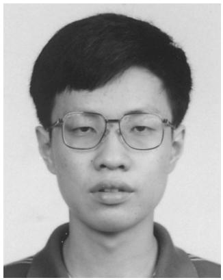

natural_image

Portrait of a young man wearing glasses (no text or symbols visible)

Kai Yu received a B.Eng. degree from Shanghai University, China, and an M.Sc. degree (with distinction) from the University of Liverpool, UK, both in electrical engineering. He received a Ph.D. degree from the Signal Processing Group, Royal Institute of Technology (KTH), Sweden in 2005.

In 2003, he was a visiting researcher at the Smart Antennas Research Group, Stanford University. He was a post-doctoral researcher at Brigham Young University, Utah in 2005—2006 and a member of technical staff at Bell Labs Research, Swindon, UK in 2006—2008. He jointed Ericsson AB in Stockholm in Septermber 2008 as a systems manager. His current research interests are in the general area of wireless communications and networks, especially MIMO channel characterization, array signal processing, multi-user MIMO systems, and MIMO mesh networks.

natural_image

Portrait of a smiling man in business attire (no text or symbols visible)

A. Lee Swindlehurst (M’83–SM’99–F’04) received the B.S., summa cum laude, and M.S. degrees in electrical engineering from Brigham Young University, Provo, UT, in 1985 and 1986, respectively, and the Ph.D. degree in electrical engineering from Stanford University in 1991.

From 1986—1990, he was employed at ESL, Inc., of Sunnyvale, CA, where he was involved in the design of algorithms and architectures for several radar and sonar signal processing systems. He was on the faculty of the Department of Electrical and Computer Engineering at Brigham Young University from 1990—2007, where he was a full professor and served as department chair from 2003—2006. During 1996—1997, he held a joint appointment as a visiting scholar at both Uppsala University, Uppsala, Sweden, and at the Royal Institute of Technology, Stockholm, Sweden. From 2006—07, he was on leave working as Vice President of Research for ArrayComm LLC in San Jose, CA. He is currently a Professor of Electrical Engineering and Computer Science at the University of California at Irvine. His research interests include sensor array signal processing for radar and wireless communications, detection and estimation theory, and system identification, and he has over 190 publications in these areas.

Dr. Swindlehurst is a past secretary of the IEEE Signal Processing Society, past Editor-in-Chief of the IEEE Journal of Selected Topics in Signal Processing, and past member of the Editorial Boards for the EURASIP Journal on Wireless Communications and Networking, IEEE Signal Processing Magazine, and the IEEE Transactions on Signal Processing. He is a recipient of several paper awards: the 2000 IEEE W. R. G. Baker Prize Paper Award, the 2006 and 2010 IEEE Signal Processing Society’s Best Paper Award, the 2006 IEEE Communications Society Stephen O. Rice Prize in the Field of Communication Theory, and is co-author of a paper that received the IEEE Signal Processing Society Young Author Best Paper Award in 2001.