# Workload-Aware Performance Model Based Soft Preemptive Real-Time Scheduling for Neural Processing Units

Yuan Yao , Member, IEEE, Yujiao Hu , Yi Dang, Wei Tao, Kai Hu, Qiming Huang, Zhe Peng , Member, IEEE, Gang Yang , Member, IEEE, and Xingshe Zhou, Member, IEEE

Abstract—A neural processing unit (NPU) is a microprocessor which is specially designed for various types of neural network applications. Because of its high acceleration efficiency and lower power consumption, the airborne embedded system has widely deployed NPU to replace GPU as the new accelerator. Unfortunately, the inherent scheduler of NPU does not consider real-time scheduling. Therefore, it cannot meet real-time requirements of airborne embedded systems. At present, there is less research on the multi-task real-time scheduling of the NPU device. In this article, we first design an NPU resource management framework based on Kubernetes. Then, we propose WAMSPRES, a workloadaware NPU performance model based soft preemptive real-time scheduling method. The proposed workload-aware NPU performance model can accurately predict the remaining execution time of the task when it runs with other tasks concurrently. The soft preemptive real-time scheduling algorithm can provide approximate preemption capability by dynamically adjusting the NPU computing resources of tasks. Finally, we implement a prototype NPU scheduler of the airborne embedded system for the fixed-wing UAV. The proposed models and algorithms are validated on both the simulated and realistic task sets. Experimental results illustrate that WAMSPRES can achieve low prediction error and high scheduling success rate.

Index Terms—Embedded system, soft preemptive scheduling, real-time scheduling, computing power, dynamic-quota, NPU performance model.

## I. INTRODUCTION

W ITH the rapid development of artificial intelligence tech-nology, more and more intelligent tasks, such as image nology, more and more intelligent tasks, such as image processing, video processing, object detection and intelligent decision, are deployed on the airborne embedded system [1]. They often involve extensive data processing and algorithmic calculations. But traditional general-purpose processors cannot meet their requirements both on computing performance and power efficiency. Neural processing unit(NPU) is a dedicated accelerator for neural network computations. It provides highperformance neural network computing capabilities through hardware-level optimizations, such as specialized neural network instruction sets, efficient parallel computing capabilities, and memory optimizations. This satisfies the complex computational demands of the airborne embedded system and enhances their perception and decision-making capabilities. Compared with the traditional CPU+GPU architecture, NPU has higher energy efficiency which can meet the low-power requirements of the airborne embedded system. Moreover, compared with the disadvantages of larger and heavier GPU devices, the small size and lightweight design of NPU make it easier to integrate into airborne embedded systems. It is more suitable to deploy on the small aircraft, without imposing a significant burden on flight performance and stability.

Tasks running on airborne embedded systems require strict isolation from each other. Different types of tasks may involve various types of data, such as image data, sensor data, control commands, and more. These tasks need to utilize shared hardware resources, including processors, memory, sensors, and others. To address this issue, NPU hardware itself usually provides a certain level of parallel task isolation. NPU typically features multiple computing units, multiple storage units, and various data pathways. This parallel architecture enables the NPU to simultaneously execute multiple tasks and isolate the computation and data operations of each task, thereby achieving task isolation. Each task can be assigned to different computing or processing units and independently perform calculations and data transfers to avoid interference and conflicts between different tasks. However, the level of task isolation in NPU is constrained by hardware design and software management. NPU does not provide a complete resource management mechanism. For example, Huawei Atlas 200 NPU provides a simple resource sharing and isolation mode that all tasks share NPU resources equally. We test an object detection model on Atlas 200 platform. From Fig. 1, we observe that the execution time of object detection task increases rapidly with the number of co-executing tasks. Assuming that the object detection is a high-priority task, it would most probably miss the deadline if it is running concurrently with multiple low-priority tasks. (The execution time of the object detection is greater than the relative deadline when it is running concurrently with two tasks.) Therefore, in practical applications, to manage NPU resources effectively and achieve higher levels of task isolation, software-level resource management techniques are needed. Resource management interfaces and algorithms specific to NPU should be provided at the operating system or middleware level. Through appropriate scheduling algorithm and allocation strategies, effective management and utilization of NPU resources can be achieved.

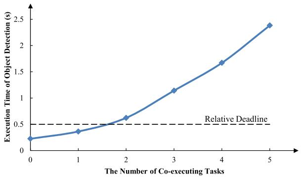  
Fig. 1. The execution time changes with the number of co-executing tasks.

In addition, there is a significant difference between cloud platforms and airborne embedded systems. Typically, the scheduling goal of cloud platforms is to achieve high efficiency and throughput. However, airborne embedded systems are typical real-time systems with strict timing constraints for tasks. The scheduling goal in such systems is to guarantee timeliness. However, NPU hardware does not support preemptive scheduling and task prioritization. When a low-priority task requests the NPU, the inherent scheduler immediately processes it and allocates the available NPU computing resources to the task as much as possible. At this point, if a high-priority task arrives, it will be blocked by the low-priority task. Obviously, this scheduling mechanism cannot meet the real-time requirements of airborne embedded systems. Therefore, it is necessary to improve the existing NPU task scheduling strategies.

In this paper, we propose WAMSPRES, a Workload-Aware performance Model based Soft Preemptive Real-time Scheduling strategy for the airborne embedded systems based on workload-aware NPU performance model. The main contributions of this paper are in four aspects:

1) We design an NPU resource management framework based on Kubernetes and implement a specific Device Plugin for the Atlas 200 NPU. It provides a flexible computational resources management mode for the NPU device.

2) We propose a workload-aware NPU performance model that consider both workload indicators and input sizes into account. It can accurately predict the remaining execution time for each task in multi-task concurrent scenarios.

3) We design a soft preemptive scheduling method that dynamically allocates computing resources for each task according to priority and deadline. When a high-priority task arrives, the scheduler reduces the computing resources held by low-priority tasks to achieve an approximation of preemptive scheduling.

4) We implement a prototype of the airborne embedded system based on Huawei Atlas 200 NPU for a small fixed-wing UAV. The effectiveness of the proposed WAMSPRES is validated on both simulated and realistic task sets. Experimental results demonstrate that WAMSPRES can provide better real-time performance than the inherent NPU scheduler.

The rest of this paper is organized as follows. Section II summarizes the current research status of NPU multi-task real-time scheduling. Section III introduces the complete architecture of WAMSPRES. Section IV describes the proposed NPU performance model. Section V presents the soft preemptive real-time scheduling algorithm based on the greedy strategy. Section VI validates the proposed models and algorithms on both simulation and real embedded systems. Finally, Section VII draws the conclusion.

## II. RELATED WORK

## A. AI Accelerator Virtualization

Virtualizing AI accelerators is aimed at improving resource utilization, enhancing system flexibility and scalability, achieving task isolation, and simplifying resource management and task deployment processes. Zeng et al. abstract multiple AI accelerator cores into a virtualized resource pool and dynamically allocates accelerator cores to inference tasks at runtime to achieve performance isolation for multi-task sharing of AI accelerators [2]. Ghodrati et al. propose a spatial-temporal multiplexing sharing approach based on dynamic computation unit composition and partitioning for pulse array accelerators similar to Google TPUs. They group multiple computation units with a storage unit, enabling finer-grained allocation of computational resources and data reuse [3]. Lee et al. further extend the work of Ghodrati by directly constructing a complete pulse array instead of combining computation units with shared memory as sub-arrays. This approach further enhances the flexibility of spatial multiplexing architecture [4]. However, these solutions are specific to particular hardware architectures and lack generality. Zhang et al. improve the API redirection virtualization method for GPUs by using zero-copy transfer techniques to increase data bandwidth [5]. Chen et al. design a virtual Hadoop framework using Docker containers to encapsulate heterogeneous computing nodes such as GPUs [6]. Compared to the relatively mature research on GPU virtualization, research on NPU virtualization is still relatively limited, and related technologies and solutions are still being explored and developed.

## B. NPU/GPU Performance Model

NPU/GPU performance model is aiming to estimate and predict the execution time and performance of NPU/GPU tasks. Baghsorkhi et al. introduce an abstract interpretation of a GPU kernel, which they called work flow graph, to estimate the execution time of a GPU kernel [7]. Hong and Kim propose an analytical model that estimates the number of parallel memory requests. Based on the degree of memory warp parallelism, the model estimates the cost of memory requests, thereby estimating the overall execution time of a program [8]. Zhang et al. use a microbenchmark-based approach to develop a throughput model for three major components of GPU execution time: the instruction pipeline, shared memory access, and global memory access [9]. However, these analytical modeling approaches typically rely on micro-architecture information, a minor change in the architecture may require extensive work to adapt the model to the new architecture. Dao et al. construct a sampling-based linear model to predict the runtime of an arbitrary OpenCL kernel. They also propose a model based on machine learning techniques to improve the proposed linear performance model [10]. Lym et al. design a GPU performance model, DeLTA, specially for the deep learning applications like CNNs. DeLTA accurately models traffic across all memory hierarchy levels [11]. Choi et al. analyze the characteristics of neural network inference tasks running on Google TPUs and predicted their execution time [12]. Yao et al. propose a workload-aware GPU performance model, using lightweight self-organizing fuzzy neural network to implement GPU performance model [13], [14].

## C. NPU/GPU Real-Time Scheduling

NPUs and GPUs are both designed to provide high computing power for applications that require intensive calculations. However, they lack preemptive scheduling, which is a critical feature for real-time systems. Preemptive scheduling allows for the interruption of low-priority tasks when high-priority tasks need to be executed. In the absence of preemptive scheduling, the inherent scheduler of the NPU or GPU may allocate computing resources to a low-priority application for an extended period, even when a high-priority application is waiting. This situation, known as priority inversion [15], can lead to delays and inefficiencies in executing high-priority tasks. GPUs employ the SIMT (Single Instruction, Multiple Thread) execution model, and thread scheduling is managed at the granularity of thread blocks. Previous research on GPU preemption solutions [16], [17] has primarily been built upon this foundation. Existing research on GPU scheduling can be roughly categorized into the following three types. Scheduling methods based on operating system kernels and device drivers [18], [19], [20]. Hardware-based preemption scheduling technology [16], [17], [21]. Software-based methods which support kernel preemption, namely kernel slicing technology [22], [23], [24], [25], [26], [27].

Multi-Process Service (MPS) is a technology introduced by NVIDIA to enhance GPU utilization by reducing the overhead of context switches caused by multiple workloads sharing the same GPU. MPS allows different applications to run simultaneously on the same GPU without significant performance degradation. A CUDA application can receive a specified portion of SM cores from the GPU. While this framework provides an effective means to share GPU resources, it does not offer complete isolation. As a result, if one workload fails, it can potentially disrupt other workloads running on the same GPU.

To solve this problem, Wu et al. [28] developed interfaces and algorithms that use signal handling and thread synchronization to achieve safe process quitting. This ensures that when one GPU process exits, it does not interfere with or cause failures in other concurrent processes. Sometimes MPS may not handle workload variability and network traffic characteristics as efficiently, Dhakal et al. [29] employs self-learning schemes to adapt to these factors, ensuring low inference latencies and high resource utilization.

Multi-Instance GPU (MIG) allows a single GPU to be partitioned into multiple independent instances of varying sizes. MIG enables the dynamic division of a GPU into smaller instances, each of which can be configured for different tasks. Compared to the MPS, MIG ensures that tasks running on one slice do not interfere with those on another, providing more reliable performance and security. Li et al. [30] introduced MISO, a method to dynamically allocate GPU resources among concurrent tasks, addressing the need for sustainable computing. MISO reduces the average job completion time by 49% compared to using an unpartitioned GPU. Expenshade et al. [31] conducted an extensive evaluation of the MIG technology, and MIG was shown to generally improve energy efficiency and performance across a range of models, with at least 15% energy savings and maintained or higher throughput for medium-scale fine-tuning tasks. This study provides valuable insights into effectively utilizing MIG technology to optimize deep learning workloads. Ohshima et al. [32] conducted a study on QR factorization of block low-rank matrices using MIG. Their research demonstrated that leveraging MIG’s capabilities resulted in a 53.3% performance improvement compared to CPU execution and a 77.6% improvement compared to using a GPU without MIG. These results underscore the effectiveness of MIG in low-rank matrix computations.

As GPU SIMT programming abstraction, the underlying GPU micro-architecture and task scheduling granularity dramatically differ from how NPUs are programmed and executed. It is challenging to apply the scheduling solution of CPUs or GPUs directly to NPU architecture. Choi et al. introduce a dedicated preemption module to the Google TPU to record and store information about each task. They proposed a multi-task scheduling method that utilizes a heuristic integral sorting approach. This approach considers the priority, waiting time, and expected execution time of tasks in the queue to determine whether a task in the queue should be executed at the current time point. In addition, they employed a dynamic preemption method to determine whether to preempt the current task and execute the selected task or to wait for the current task to complete before executing the selected task [12]. Rhu et al. solve the problem of NPU local memory oversubscription by copying the overflow data from local memory to CPU memory. During the runtime, when it is observed that NPU memory usage is near its limit, the DMA unit can migrate the checkpointed state from the NPU to CPU memory while the inference is being serviced to hide migration overhead. Unfortunately, the preemption scheduling proposed by them requires an additional on-chip SRAM module to store the context of the preemption task. In addition, it is necessary to note that their research focuses on the low latency requirement of cloud server and does not consider the real-time nature of tasks [33].

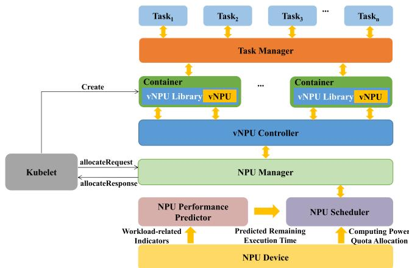  
Fig. 2. System architecture.

## III. SYSTEM ARCHITECTURE

We have implemented the complete architecture of WAMSPRES for airborne embedded systems, which is shown in Fig. 2. The whole system consists of the following several modules.

1) Kubelet. Kubernetes provides a mechanism called Device Plugin to manage and schedule device resources on nodes within a cluster. Device plugin allows users to take specific types of devices (such as GPUs, FPGAs, NPUs, etc.) as schedulable resources, abstract and encapsulate them in Docker containers for use in Kubernetes clusters. Device plugin runs on NPU nodes in the form of gRPC server. On one hand, Kubelet establishes a ListAndWatch long-lived connection with the NPU Device Plugin to obtain real-time information about the device resources available on the node. On the other hand, Kubelet initiates an Allocate request to the NPU Device Plugin to acquire specific NPU resource information on the node. Based on this information, the Kubelet allocates NPU resources to containers.

2) NPU Manager. NPU Manager is implemented using the Device Plugin mechanism to manage and provide access to NPU hardware devices. Upon startup, the NPU Device Plugin registers with the Device Plugin Manager within the Kubelet and initiates a gPRC request to communicate with Kubelet through a unix socket on the local path. Subsequently, the NPU Device Plugin starts a gRPC service, maintains a ListAndWatch long-lived connection with the Kubelet and provides the service as a gRPC server for kubelet to access. NPU Device Plugin sends a list of NPU devices to Kubelet via ListAndWatch and notifies Kubelet whenever the state of the devices on the node changes (such as a device failure).

3) vNPU. vNPU stands for virtual NPU. We use containerized approach to abstract NPU devices. Running neural network inference tasks on NPU devices requires the installation of NPU drivers and runtime libraries. Therefore, when creating the NPU container image, it is necessary to specify the base system image of the container and install NPU drivers and runtime libraries in it, while ensuring the proper configuration of environment variables within the container.

4) vNPU Controller. vNPU Controller manages and maintains a list of vNPU containers, while continuously monitoring the status of the containers. If it detects that a container is in a non-operational state or has terminated, the vNPU Controller takes appropriate action to remove the container from the list, thereby freeing up the vNPU resources for other containers to utilize.

5) Task Manager. Task Manager is designed to sense the arrival of new tasks and the exit of old tasks in real time. When a new task arrives, it is first registered with the Task Manager. Registered tasks are maintained by Task Manager, including the status and parameters of the task. An important part of the registration is the task priority, which serves as the basis for task scheduling. It should be emphasized that in our WAMSPRES system, the task identifier is the unique identifier used to recognize the presence of a task in the system. When a task exits, Task Manager clears all associated information of that task.

6) NPU Performance Predictor. NPU Performance Predictor predicts the remaining execution time of a task as a key indicator for task scheduling. It collects real-time workload indicators information of NPU devices and takes it as input along with parameter information related to task execution. Then, through the pre-trained NPU performance model, NPU Performance Predictor obtains the remaining execution time of the task as output.

7) NPU Scheduler. NPU Scheduler receives scheduling requests from NPU Manager and allocates computing resources to each task. The NPU scheduler we designed implement a soft preemptive scheduling strategy. It dynamically adjusts the computing resources allocated to tasks based on their real-time demands. For a low-priority task, NPU Scheduler reduces the computing resources allocated to it at the scheduling point instead of directly removing the task.

Notations used in this paper are summarized in Table I.

## IV. WORKLOAD-AWARE NPU PERFORMANCE MODEL

In this section, we detail our proposed Workload-Aware NPU Performance Model. We will introduce them from the following three aspects. First, we analyze the relationship between task execution time and NPU computing resources assigned to the task, and describe the indicators we selected related to NPU workloads. Second, we introduce the BPNN (Back Propagation Neural Network) we adopted and analyze its network structure. Lastly, we demonstrate how we train the BPNN neural network with a given set of tasks.

## A. NPU Workload-Related Indicators

Concurrently executing multiple tasks on a single NPU device will result in resource competition and affect NPU performance, which can lead to decreased efficiency in task execution.

TABLE I NOTATIONS USED IN THE PAPER

<table><tr><td>Notation</td><td>Description</td></tr><tr><td> $\tau_{i}^{\delta,L}$ </td><td>the actual execution time of  $Task_{i}$  running with computing power quota  $\delta$  under the workload  $L$ </td></tr><tr><td> $\gamma_{i}^{\delta,L}$ </td><td>the predicted remaining execution time of  $Task_{i}$  running with computing power quota  $\delta$  under the workload  $L$ </td></tr><tr><td> $\sigma$ </td><td>the minimal granularity of the NPU computing power unit</td></tr><tr><td> $\delta$ </td><td>the computing power quota allocated to a certain NPU task (the integer multiple of  $\sigma$ )</td></tr><tr><td> $\delta_{i,j}$ </td><td>the computing power quota allocated to  $Task_{i}$  after the  $j^{th}$  workload changing</td></tr><tr><td> $L_{i,j}$ </td><td>the workload indicators of  $Task_{i}$  after the  $j^{th}$  workload changing</td></tr><tr><td> $F_{i,j}$ </td><td>the completion rate of  $Task_{i}$  at the end of the  $j^{th}$  workload changing</td></tr><tr><td> $D_{i}$ </td><td>the relative deadline of  $Task_{i}$ </td></tr><tr><td> $P_{i}$ </td><td>the fixed priority of  $Task_{i}$ </td></tr></table>

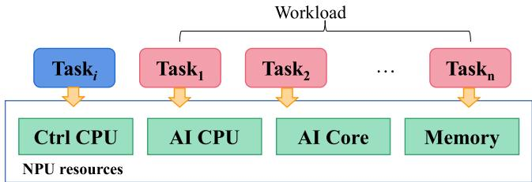  
Fig. 3. Workload for T aski.

TABLE II  
THE WORKLOAD-RELATED INDICATORS

<table><tr><td>Resources</td><td>Indicators</td></tr><tr><td rowspan="2">AI Core</td><td>ai_core_utilization_rate</td></tr><tr><td>ai_core_frequency</td></tr><tr><td>AI CPU</td><td>ai_cpu_utilization_rate</td></tr><tr><td rowspan="2">Ctrl CPU</td><td>ctrl_cpu_utilization_rate</td></tr><tr><td>ctrl_cpu_frequency</td></tr><tr><td rowspan="3">Memory</td><td>memory_utilization_rate</td></tr><tr><td>memory_bw_utilization_rate</td></tr><tr><td>memory_frequency</td></tr></table>

Moreover, different tasks have different requirements for NPU resources, and the execution time of the same task also varies in different system states. Therefore, the remaining execution time of each task in a multi-task concurrent environment is difficult to predict. In order to ensure the real-time performance of the tasks in a multi-task concurrent environment, it is necessary to accurately predict the execution time of the executing task and make further scheduling decisions based on this.

For a specific T ask , we define the workload as the other tasks concurrently executing with T ask as shown in Fig. 3. In this paper, we considers four workload-related NPU resources, including AI Core, AI CP U, Ctrl CP U, and Memory. These resources have significant impacts on the execution time of a task. The workload-related indicators are detailed in Table II. The proposed NPU performance model takes these indicators as input. The NPU devices we used is Huawei Atlas 200 with Ascend AI processor, which provide DSMI (Device System Manage Interface) to manage Ascend AI processors. The DSMI interface supports multi-thread or multi-process calls in concurrent scenarios. Through this interface, we can obtain the relevant indicators of the above NPU resources.

1) AI Core. AI Core is the most critical computing unit of Ascend NPU, responsible for performing matrix, vector, and scalar computing intensive operator tasks. AI Core adopts Da Vinci architecture, including CUBE matrix arithmetic unit, Vector arithmetic unit and Scalar arithmetic unit, etc., in which different types of instructions can be executed in parallel with pipelines. We chose two indicators: ai\_core\_utilization\_rate and ai\_core\_frequency. The ai\_core\_utilization\_rate is the utilization rate of AI Core, which reflects the bustle of the AI Core in a past sampling period. The ai\_core\_frequency is the frequency of AI Core, which will directly affect the current running speed of the AI Core.

2) AI CP U. AI CP U is responsible for non-matrix complex calculations, and these operator tasks are not suitable for running on AI Core. We chose an indicator, ai\_cpu\_utilization\_rate. The ai\_cpu\_utilization\_rate is the utilization rate of the AI CP U, its values reflect the busy degree of the AI CP U worked during the past sampling period.

3) Ctrl CP U. Ctrl CP Us are dedicated to controlling the overall operation of the Ascend chip. It is mainly composed of system control module, instruction cache, scalar instruction processing queue, instruction transmission module and event synchronization module. The significance of Ctrl CP U is to ensure the optimization of resource performance on the entire chip. We chose two indicators: ctrl\_cpu\_utilization\_rate and ctrl\_cpu\_frequency. The ctrl\_cpu\_utilization\_rate is the utilization of Ctrl CP U, which reflects the bustle of Ctrl CP U in a past sampling period. The ctrl\_cpu\_frequency is the frequency of Ctrl CP U, and its value will directly affect the current operating speed of Ctrl CP U.

4) Memory. There are multiple levels of memory within the Ascend SOC chip. The computing core is equipped with two-level buffer memory. L2 buffer memory provides high-bandwidth, low-latency storage access for AI Core and AI CP U. The Cache&Buffer module is used to ensure the normal operation of AI CP U and Ctrl CP U. In addition, the SOC integrates a LPDDR4x controller on-chip to provide larger DDR memory. We select three indicators (memory\_utilization\_rate, memory\_bw\_utilization\_rate, and memory\_frequency) for the primary storage unit, which represent memory utilization, memory bandwidth utilization, and memory frequency, respectively.

In addition to the above indicators, the input variables we specify also include the device\_temperature. Due to the operating environment of the processor, the busy degree of the processor, the continuous operation duration of the processor and other factors, the temperature of the device will change significantly. When the temperature reaches a certain threshold, the power of the device will change, which will affect the execution efficiency of the inference task on the board. In addition, the computational power quota assigned to the task is also one of the indicators (detailed in Section V), which reflects the usage of computing resources for the task. It should be noted that this indicator is not acquired by DSMI, but is dynamically set by the NPU scheduler.

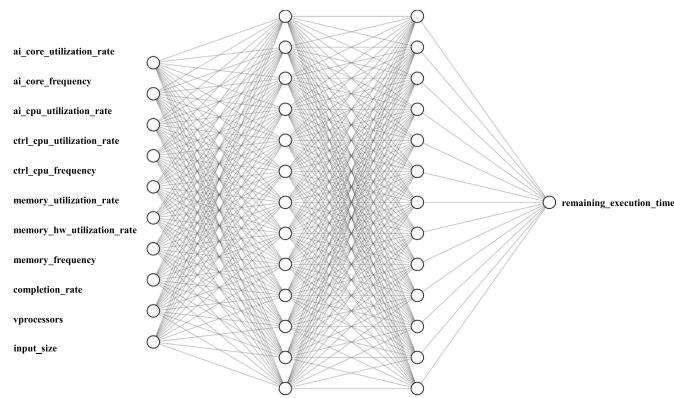  
Fig. 4. The structure of BPNN.

## B. BPNN Based NPU Performance Model

We adopt a BPNN (Back Propagation Neural Network) to predict the NPU performance with different workloads. BPNN possesses learning and approximation capabilities, allowing it to learn the mapping between inputs and outputs through training. It is capable of adjusting its internal parameters to optimize the prediction or classification of given data. BPNN is a multi-layer feedforward neural network based on the backpropagation algorithm. The structure of BPNN consists of multiple neurons organized in layers, including an input layer, hidden layers, and an output layer. Each neuron is connected to all neurons in the previous layer, and signals are propagated through these connections with weighted values.

The training process of BPNN is achieved through the backpropagation algorithm. First, input samples are fed into the network, and the network’s output is computed through forward propagation. Then, the error between the output and the true value is calculated, and the error is propagated back from the output layer to the hidden layers. During the backpropagation process, the connection weights are adjusted based on the magnitude of the error to minimize it. This process iterates until the network’s output approaches the true value or the error falls within an acceptable range.

The structure of our BPNN for the NPU performance model is shown in Fig. 4.

It is a four-layer network. The first layer is the input layer that contains all workload-related indicators. Considering the impact of input size on the execution time of the NPU task, we take this parameter as a new input variable into account. The second and the third layers are hidden layers with 13 nerve cells, respectively. The last layer is the output layer.

## C. Training Data

Usually, airborne embedded systems have a fixed set of tasks, and the tasks performed on the NPU can be determined in advance. Therefore, we train our BPNN neural network based on a fixed task set Γ with N tasks $\{ T a s k _ { 1 } , T a s k _ { 2 } , . . . , T a s k _ { N } \}$ using experimental data from the actual run of the task. We implement a monitor thread to periodically collect the selected workload-related indicators as input variables for the BPNN neural network. The monitor thread starts at the beginning of a task and terminates at the end of a task. For each $T a s k _ { i }$ in the task set Γ, a BPNN model needs to be trained for it. There are two points to node. One is that $T a s k _ { i }$ needs to run in a variety of different workload environments to collect the corresponding task execution time. It is therefore necessary to randomly combine all tasks in the task set Γ except for T ask to traverse to each possible combination. Second, for $T a s k _ { i }$ itself, we need to assign it different NPU computing power quota to make it execute at the same time with the workload. To make the acquired training data more comprehensive, we make a further refinement based on the combination of the workload tasks in the task set Γ. For the workload task $T a s k _ { j }$ (where ${ \bf j } \neq { \bf i } )$ , we let it run under different computing power quota to obtain more comprehensive training data of $T a s k _ { i }$ . Based on the analysis of a large number of experimental data, we find that when the step size of the change of the computing power quota assigned to the task is less than a certain value, the effect on the remaining execution time of the task is negligible. Therefore, we set the step size of the computing power quota to 10, which can not only significantly affect the remaining execution time of the task, but also reduce the overhead of the data sampling. The sampling of input and output variable of BPNN neural network is shown in Fig. 5.

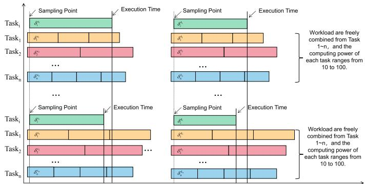  
Fig. 5. BPNN training data sampling.

Under different workload conditions, the system status parameters are recorded in real time, and the task execution time is predicted by using the system status parameters and the computing power occupied by the task as input values. When training a task model, other tasks in the task set Γ are randomly combined as workloads. Under a certain workload, it is necessary to ensure that the workload of the task is constant during execution. At the same time, the DSMI interface is called to obtain the system status parameters during this process. When $T a s k _ { i }$ starts, the monitor thread samples all selected workload-related system state parameters every 100 ms as input vector $X ^ { k }$ . When T ask is completed, calculate the remaining execution time $y _ { i } { } ^ { k }$ of $T a s k _ { i }$ at each sampling timestamp, and its calculation formula

is as follows:

$$
y _ {i} ^ {k} = t _ {e} ^ {k} - t _ {i} ^ {k}\tag{1}
$$

where $t _ { e } ^ { ~ k }$ represents the end time of $T a s k _ { i } , t _ { i } { } ^ { k }$ represents any timestamp sampled by the monitor thread during task execution, and the remaining task execution time $y _ { i } { } ^ { k }$ of all sampled time stamps is recorded $\mathrm { a s }$ vector $Y ^ { k }$ . In addition, the input parameters also include a vector $F ^ { k }$ , which consists of the task completion rate $f _ { i } { } ^ { k }$ at each sample point moment, which is calculated as follows:

$$
f _ {i} ^ {k} = \frac {t _ {i} ^ {k} - t _ {s} ^ {k}}{t _ {e} ^ {k} - t _ {s} ^ {k}}\tag{2}
$$

where $t _ { s } ^ { k }$ represents the start time of $T a s k _ { i } , t _ { e } { } ^ { k }$ represents the end time o $: T a s k _ { i } .$ , and $t _ { i } { } ^ { k }$ represents any timestamp sampled by the monitor thread during task execution. Given the computing power quota δ of T aski, we obtain an input vector $\langle X ^ { k } , { \bar { F } } ^ { k } , \delta { \bar { \rangle } }$ of $T a s k _ { i }$ , denoted as $I ^ { k }$ . Thus, we have an input-output pair $\langle I ^ { k } , Y ^ { k } \rangle$ , which represents the remaining execution time of the $T a s k _ { i }$ corresponding to the workload of each sampling timestamp. Therefore, $T a s k _ { i }$ performs completely once, obtaining several sets of input-output pairs of data. Finally, we can obtain different combinations of workloads under different computational power quotas, thus obtaining enough samples to train the BPNN neural network.

## V. SOFT PREEMPTIVE REAL-TIME SCHEDULING

Through the BPNN-based task remaining execution time prediction model proposed in the previous section, we can accurately predict the remaining execution time of each task. In this section, we introduce the proposed a soft preemptive real-time task scheduling strategy in detail. First, we present an NPU task model and demonstrate how to calculate the remaining execution time of a task when the workload changes. Then, the soft preemptive scheduling strategy based on the latest deadline is introduced, and the greedy scheduling policy based on priority is described in detail.

## A. Deadline-Based Soft Preemptive Scheduling

The inherent scheduler of NPU does not consider the priority of tasks, and does not meet the real-time requirements of airborne embedded systems well. To solve this problem, we propose a soft preemptive scheduling strategy. Consider an extreme case where a high-priority task is co-executing with a lowpriority task. If the scheduler directly removes the low-priority task from the NPU device, it introduces the extra scheduling overhead by context switch. However, the WAMSPRES scheduler just adjusts the computing power quota $\delta$ of each task dynamically according to its deadline. If it assigns very small computing resources to low-priority tasks, it can achieve the approximate preemption scheduling. The minimal granularity of the NPU computing power unit is set to be σ which is defined as below. Thus, the computing power quota δ allocated to an NPU task must be an integer multiple of σ.

$$
\sigma = \frac {1}{\text {period} _ {v i r}}\tag{3}
$$

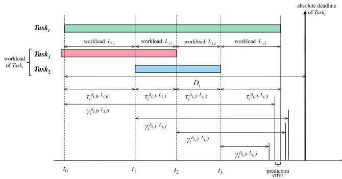  
Fig. 6. The workload and execution time of T aski.

where, $p e r i o d _ { v i r }$ is a fixed time slice. This period is not a clock period, but a virtual time period.

In this paper, we establish the task model as follows.

$$
T a s k _ {i} = \left\langle \tau_ {i} ^ {\delta , L}, \gamma_ {i} ^ {\delta , L}, F _ {i, j}, D _ {i}, P _ {i} \right\rangle\tag{4}
$$

$\tau _ { i } ^ { \delta , L }$ is the actual execution time of $T a s k _ { i }$ running with computing power quota $\delta$ under the workload $L ;$ ;

$\gamma _ { i } ^ { \delta , L ^ { \prime } }$ is the predicted remaining execution time of T ask running with computing power quota $\delta$ under the workload $L ;$

$F _ { i , j }$ is the completion rate of $T a s k _ { i }$ at the end of the $j ^ { t h }$ workload changing;

$D _ { i }$ is the relative deadline of T ask . In this paper, we adopt the implicit deadline model that $D _ { i }$ is equal to the period of the $T a s k _ { i }$

$P _ { i }$ is the fixed priority of $T a s k _ { i }$

Here, we take an example to illustrate the actual execution time and the predicted remaining execution time of an NPU task when the workload is changed. As shown in ${ \mathrm { F i g . ~ } } 6 ,$ the workload for T aski usually changes when a new task is launched (time $t _ { 0 }$ and $t _ { 1 } )$ or an existing task is finished (time $t _ { 2 }$ and $t _ { 3 } )$ Once the workload changes, the NPU performance predictor will estimate the remaining execution time $\gamma _ { i } ^ { \delta , L }$ based on the proposed BPNN model with workload-related indicators and input sizes of $T a s k _ { i }$

As mentioned in the previous section, the input vector of the NPU performance model includes the task completion rate. This indicator needs to be calculated in time when the NPU performance model is called. Different from the training process of the NPU performance model, during the actual execution of the task, the workload changes due to the arriving of new tasks or the exiting of existing tasks, which makes the calculation of task completion rate complicated. If the last time task completion rate (denoted by $F _ { i , j - 1 } , F _ { i , 0 }$ is set to 0) is recorded, we can calculate the current task completion rate $F _ { i , j }$ according to $F _ { i , j - 1 }$ , the predicted remaining execution time $\gamma _ { i } ^ { \delta _ { i , j } , L _ { i , j } }$ , and the actual execution time $\tau _ { i } ^ { \delta _ { i , j } , L _ { i , j } }$ , as follows.

$$
F _ {i, j} = \frac {\tau_ {i} ^ {\delta_ {i , j} , L _ {i , j}}}{\gamma_ {i} ^ {\delta_ {i , j} , L _ {i , j}}} (1 - F _ {i, j - 1}) + F _ {i, j - 1}\tag{5}
$$

In this way, we do not need to track the changes of previous workload, but only focus on the most recent load change. More importantly, as one of the input parameters of the proposed NPU performance model, the simpler the calculation process, the better.

Based on the above formula and the proposed NPU performance model, for $T a s k _ { i }$ , we can obtain a series different computing power $\delta _ { i , j }$ during task running. When the $k ^ { t h }$ workload changes, the minimum computing power quota $\delta _ { i , k }$ of $T a s k _ { i }$ should satisfy the following inequation.

$$
\gamma_ {i} ^ {\delta_ {i, k}, L _ {i, k}} \leq D _ {i} - \sum_ {j = 0} ^ {k - 1} \tau_ {i} ^ {\delta_ {i, j}, L _ {i, j}}\tag{6}
$$

where, $\gamma _ { i } ^ { \delta _ { i , k } , L _ { i , k } }$ is the predicted remaining execution time of $T a s k _ { i }$ and $\tau _ { i } ^ { \delta _ { i , j } , L _ { i , j } }$ is the actual execution time of $T a s k _ { i }$ when the workload changes for the $j ^ { t h }$ time.

## B. Priority Based Greedy Scheduling Policy

The soft preemptive real-time scheduling strategy is developed based on greedy algorithm. All $T a s k _ { i } \ \in \ \Gamma$ sorted in descending order according to the task priority. The larger the value of $P _ { i }$ for a task, the higher the priority of the task $( P _ { i } >$ $P _ { i + 1 } , i = \{ 1 , 2 , . . . N - 1 \} ,$ ). This greedy policy will prioritize time constraints for high-priority tasks.

NPU Scheduler receives scheduling requests from NPU Manager, dynamically adjusts the computing power quota assigned to the currently executing tasks, and feedback the scheduling results to NPU Manager. Whenever the system workload changes (new tasks arrive or old tasks exit), the scheduling is triggered. The NPU Scheduler obtains the predicted remaining execution time of the tasks through the NPU Performance Predictor based on the current system status, and the tasks beyond the established deadline need to adjust the computing power distribution. The real-time scheduling algorithm based on greedy policy is described in Algorithm 1.

In Algorithm 1, we check all tasks in Γ. If the $T a s k _ { i }$ is inactive, its computing power quota is set to 0, which means no NPU computing resource is allocated to $T a s k _ { i }$ . Otherwise, the amount of computing power allocated to $T a s k _ { i }$ should be adjusted the when the workload changes.

In Step 5, the function BPNN is based on the proposed NPU performance model to predict the remaining execution time of $T a s k _ { i }$ with the current task completion rate $F _ { i , j }$ , the workloadrelated indicators $L _ { i , j }$ and the computing power quota $\delta _ { i , j }$ to be assigned to it. Where, $F _ { i , j }$ is obtained through Step 4 with an initial value of zero. It is worth noting that the function BPNN returns a list of predicted results, each of which is a numerical pair consisting of the computing power quota and the remaining execution time.

In Step 6, the function FINDMINDELTA is to find the minimum number of the computing power quota assigned to the task while meeting the real-time requirements.

From Step 7 to Step 11, it is necessary to compare the sum of the allocated computing power quota with the entire computing power quota TOTAL.

Algorithm 1: Priority-Based Greedy Scheduling Algorithm.

Input: $\Gamma$: a task set, $N$: the number of Tasks, $j$: change times of the workload, $F_{i,j}$: the completion rate of $Task_i$ when the workload $j^{th}$ changes, $D_i$: the relative deadline of $Task_i$, $P_i$: the priority of $Task_i$, $\tau_i^{\delta_{i,j},L_{i,j}}$: the actual execution time of $Task_i$ with workload $L_{i,j}$ on computing power quota $\delta_{i,j}$, $\gamma_i^{\delta_{i,j},L_{i,j}}$: the predicted execution time of $Task_i$ with workload $L_{i,j}$ on computing power quota $\delta_{i,j}$.

Output: $\Delta[N]$: $\delta$ Array for All Tasks, The Element $\delta_{i,j} \in \Delta$ is Computing Power Quota Allocated to $Task_i$ in The $j^{th}$ Workload Change.

1: $F \leftarrow 0$, $P \leftarrow 0$, $Y \leftarrow 0$

2: for $Task_i \in \Gamma$ do

3: if $Task_i$ is active then

4: $F_{i,j} \leftarrow \frac{\tau_i^{\delta_{i,j},L_{i,j}}}{\gamma_i^{\delta_{i,j},L_{i,j}}} (1 - F_{i,j-1}) + F_{i,j-1}$

5: $Y \leftarrow BPNN(\delta_{i,j}, F_{i,j}, L_{i,j})$

6: $\delta_{i,j} \leftarrow FINDMINDELTA(Y)$

7: if Resource &gt; $\delta_{i,j}$ then

8: TOTAL &lt; TOTAL - $\delta_{i,j}$

9: end if

10: else

11: return$\Delta$

12: end if

13: end for

14: for $Task_i \in \Gamma$ do

15: if Resource &gt; 0 then

16: $\delta_{i,j} \leftarrow \min(100 - \delta_{i,j}, Resource)$

17: $\gamma_i^{\delta_{i,j},L_{i,j}} \leftarrow Y[\delta_{i,j}]$

18: Resource &lt; Resource - min(100 - $\delta_{i,j}$, Resource)

19: else

20: return$\Delta$

21: end if

22: end for

23: return $\Delta$

From Step 13 to Step 20, if there are available computing power quota, the system assigns the remaining computing power quota to tasks in priority order. It should be noted that after a large number of our experiments, a maximum of 100 computing power quota are allocated to one task, that is, an entire AI-CPU core. In this way, the computing resources of the system can be fully utilized.

## VI. EVALUATION

## A. Experimental Setup

We implement a WAMSPRES prototype on the airborne embedded system of the small fixed-wing UAV. The main control board of the system is designed based on two Huawei Atlas 200 NPU devices, as shown in Fig. 7. The AI computing engine of Huawei Atlas 200 includes 2 AI Core and 4 AI CP U. AI Core adopts the Da Vinci architecture, which realizes high throughput, large computing power and low power consumption through specially designed architectures and circuits. This architecture is especially suitable for handling common calculations necessary for neural networks in deep learning, such as matrix multiplication. AI-CPU is a CPU of ARM architecture, each CPU core has independent L1 and L2 caches, and all cores share an on-chip L3 cache. The processor specifications for the Huawei Atlas 200 are shown in Table III.

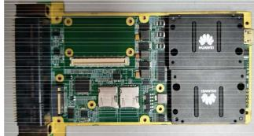  
(a) Main control board with Huawei Atlas 200

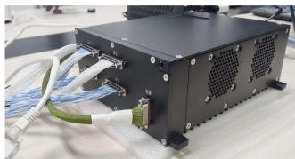  
(b) Airborne embedded system of the fixed-wing UAV

Fig. 7. Experiment platform.  
TABLE III  
THE PROCESSOR SPECIFICATIONS OF HUAWEI ATLAS 200

<table><tr><td>SPECIFICATIONS</td><td>DESCRIPTION</td></tr><tr><td>Architecture</td><td>AI co-processor</td></tr><tr><td rowspan="2">Performance</td><td>Up to 8T @FP16</td></tr><tr><td>Up to 16T @INT8</td></tr><tr><td>Codec</td><td>16 Channel Decoder-H.264/2651080P30 1 Channel Encoder</td></tr><tr><td>Memory Controller</td><td>LPDDR4X</td></tr><tr><td>Memory Bandwidth</td><td>2*64bit @3733MT/S</td></tr><tr><td>System Interface</td><td>PCIe3.0 /USB 3.0/GE</td></tr><tr><td>Package</td><td>15mm*15mm</td></tr><tr><td>Max Power</td><td>8Tops@4W,16Tops@8W</td></tr><tr><td>Process</td><td>12nm FFC</td></tr></table>

TABLE IV

SIMULATED TASK SET

<table><tr><td>Task (Abbr.)</td><td>WCET(s)</td><td>Period(s)</td><td>Priority</td></tr><tr><td>batchcrop(BC)</td><td>0.361</td><td>0.9~ 3.8</td><td>10</td></tr><tr><td>cropandpaste(CP)</td><td>0.305</td><td>0.8~ 3.2</td><td>9</td></tr><tr><td>googlenet_picture(GP)</td><td>0.298</td><td>0.6~ 3.0</td><td>8</td></tr><tr><td>googlenet_video(GV)</td><td>2.986</td><td>6.2~ 30.0</td><td>7</td></tr><tr><td>YOLOV8_SAR(YS)</td><td>5.816</td><td>11.5~ 60.0</td><td>6</td></tr><tr><td>YOLOV3_picture(YP)</td><td>0.265</td><td>0.8~ 2.6</td><td>5</td></tr><tr><td>YOLOV3_video(YV)</td><td>2.543</td><td>5.8~ 25.0</td><td>4</td></tr><tr><td>colorization_video(CV)</td><td>3.045</td><td>6.4~ 32.0</td><td>3</td></tr><tr><td>path_planning(PP)</td><td>4.245</td><td>9.2~ 45.0</td><td>2</td></tr><tr><td>WAVtoward (WW)</td><td>1.269</td><td>3.5~ 12.5</td><td>1</td></tr></table>

We verify the proposed NPU performance model on both the simulated and the realistic task sets respectively. The simulated task set is selected from Huawei Official community [34], which contains 10 tasks listed in Table IV. In Table IV, for each task, we calculate the WCET (Worst Case Execution Time) that runs individually without any workload on the entire NPU. For the simulated task set, the period of a task can be selected from a specific range in order to construct multiple task sets with different utilizations.

The realistic task set of the airborne embedded system contains 6 tasks: Object Detection (OD), SAR Processing (SP), Image Color Matching (ICM), Path Planning (PP), Image Classification (IC), and Visual Enhancement (VE). These tasks are designed based on neural network model which require the NPU to accelerate computation speed. The details of each task in the task set are shown in Table V.

TABLE V  
REALISTIC TASK SET

<table><tr><td>Task</td><td>WCET(s)</td><td>Period(s)</td><td>Priority</td></tr><tr><td>Object Detecion(OD)</td><td>9.516</td><td>20</td><td>6</td></tr><tr><td>SAR Processing(SP)</td><td>12.804</td><td>40</td><td>5</td></tr><tr><td>Image Color Matching(ICM)</td><td>23.556</td><td>60</td><td>4</td></tr><tr><td>Path Planning(PP)</td><td>25.723</td><td>80</td><td>3</td></tr><tr><td>Image Classification(IC)</td><td>36.240</td><td>100</td><td>2</td></tr><tr><td>Vision Enhancement(VE)</td><td>56.018</td><td>120</td><td>1</td></tr></table>

## B. Experimental Results of the Simulated Task Set

1) Model Training: The training phase of T ask in the task set Γ is conducted as described in Section IV. The workload consists of other tasks under different computing power quotas, and the workload runs simultaneously with $T a s k _ { i }$ until it is finished. In this paper, a monitor thread is implemented to collect the input parameter values of BPNN. The task executing time is calculated by system function, and all tasks keep running periodically.

In this process, the monitor thread is sampled every 100 milliseconds, so that the remaining execution time and the completion rate of $T a s k _ { i }$ can be calculated based on the timestamp and the actual completion time of the task. Then the sampled data of system status, the computing power quota assigned to the task and the calculated task completion rate are taken as the input of BPNN. The calculated remaining execution time of $T a s k _ { i }$ is taken as the output of BPNN. For each $T a s k _ { i }$ , we run it for 8000 times with different workload, and collect 600,000 sample pairs $\langle I ^ { k } , Y ^ { k } \rangle$ . 500,000 samples are used to train the BPNN model of $T a s k _ { i } .$ , and the rest samples are used to test the accuracy of the NPU performance model.

2) Overall Accuracy: We choose MAPE (Mean Absolute Percentage Error) as the accuracy metric which is defined as follows:

$$
M A P E = \frac {1}{M} \sum_ {k = 1} ^ {M} \frac {\left| S _ {m} ^ {k} - S _ {e} ^ {k} \right|}{S _ {e} ^ {k}} \times 100 \%\tag{7}
$$

where $S _ { m } ^ { k }$ is the measured execution time of task via the monitor thread, and $S _ { e } ^ { k }$ is the predicted remaining execution time of task via the BPNN model. In the evaluation, the workload still remains stable with the task being tested. From Fig. 8(a), the proposed NPU performance model can achieve a low average MAPE which is less than 5%.

In addition, we monitor the predicted remaining execution time at task runtime and the actual remaining execution time of the task, and select the Error\_Rate as a measure of the relationship between the prediction accuracy of the NPU performance model and the task running time, which is defined as follows:

$$
E r r o r _ {R a t e} = \frac {\left| r _ {t} ^ {E S T} - r _ {t} ^ {A C T} \right|}{r _ {t} ^ {A C T}}\tag{8}
$$

where $r _ { t } ^ { E S T }$ is the remaining execution time of the task predicted by the NPU performance model at time t, and $r _ { t } ^ { A \dot { C } T }$ is the actual remaining execution time of the task at time t. We let the WW task run for 1200 ms, changed the workload 4 times. The Error\_Rate is calculated at different moments, and the results are shown in Fig. 8(b). It can be seen that as the task running time goes on, the NPU performance model becomes more and more accurate for predicting the remaining execution time of the task.

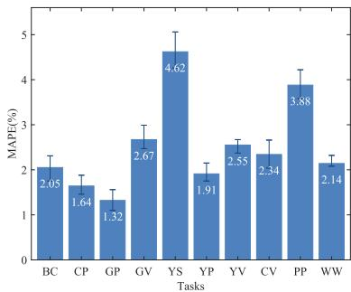  
(a) MAPE of the simulated task set

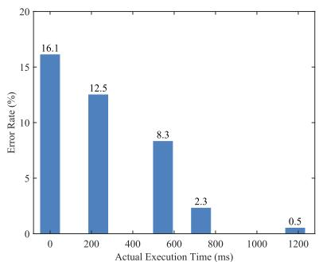  
(b) Error\_Rate of WW over workload changes

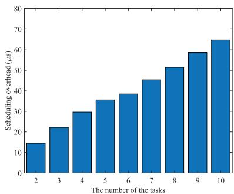  
(c) Average scheduling overhead

Fig. 8. Experimental results of the simulated task set.  
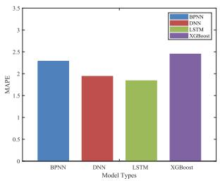  
(a) MAPE

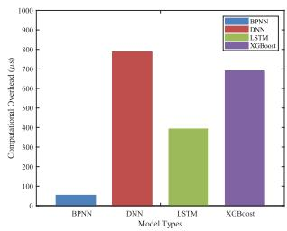  
(b) Overhead

Fig. 9. Comparison of different models.  
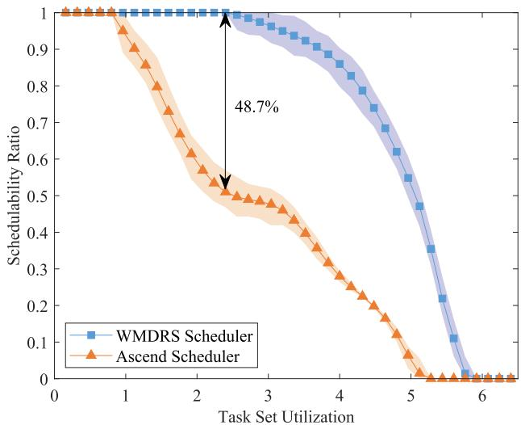  
Fig. 10. Schedulability versus utilization.

3) Scheduling Overhead: The scheduling overhead incurred by the WAMSPRES scheduler conducts a scheduling operation when workload changes. The number of the task set is from 2 to 10, and the task is running periodically. We record each scheduling overhead and the average value is shown in Fig. 8(c).

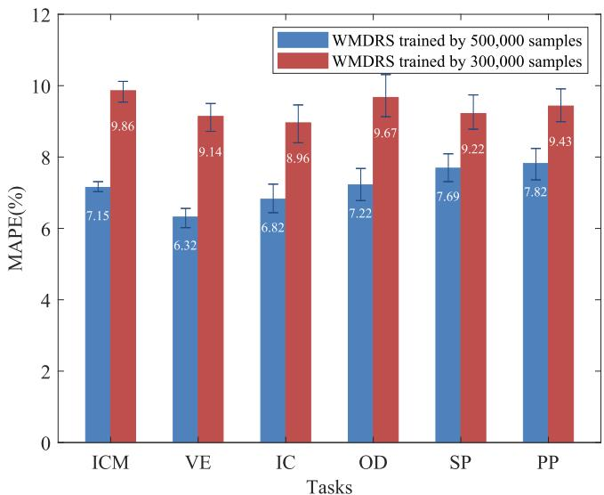  
Fig. 11. MAPE of the realistic task set.

Different from the hard preemptive scheduling method, WAMSPRES does not need the context switch. It can provide the approximate preemption by dynamically adjusting the computing power quota of active tasks. Moreover, we use a lightweight BPNN to predict NPU performance. Thus, the WAMSPRES scheduler has a very low scheduling overhead which is just 64.8 μs in a set with 10 tasks.

4) Model Comparison: We compare the BPNN model with other popular models, including Deep Neural Network (DNN), Long Short-Term Memory (LSTM) and eXtreme Gradient Boosting (XGBoost). The layers of the BPNN and DNN are 4 and 50 respectively. Fig. 9 shows the MAPE and the computational overhead of BPNN, DNN, LSTM and XGBosst models based on the simulated task set. We can observe that LSTM and DNN has higher predict accuracy, but the computational time is too long. Although, the MAPE of BPNN is a little higher than DNN and LSTM, the computational overhead of BPNN is considerably lower than all other models. By comprehensive comparison, the lightweight BPNN is a proper model considering both accuracy and overhead.

5) Schedulability: The experiments are conducted on different task sets generated by simulated tasks. We use the UUniSort algorithm [35] to set corresponding periods for tasks with a desired overall utilization U . It is calculated by

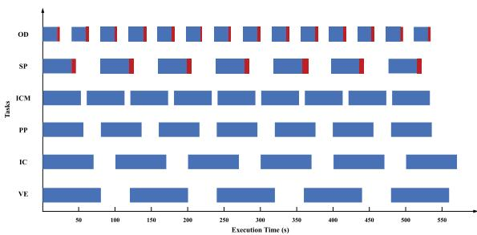  
(a) Scheduled by the Ascend scheduler

Fig. 12. Task execution sequence diagram.  
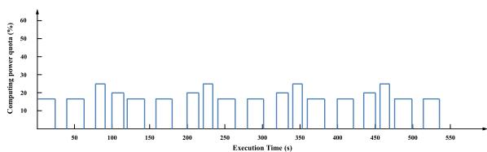  
(a) Scheduled by the Ascend scheduler  
Fig. 13. Computing power quota sequence diagram (OD).

$$
U = \sum_ {i = 1} ^ {N} \frac {\tau_ {i} ^ {\delta_ {f u l l} , L _ {e m p t y}}}{D _ {i}}\tag{9}
$$

where N is the number of the task set, $\tau _ { i } ^ { \delta _ { f u l l } , L _ { e m p t y } }$ is the measured WCET of T aski when it runs individually without any workload on full NPU computing resources, $D _ { i }$ is the related deadline of the $T a s k _ { i }$

Fig. 10 compares the schedulability ratio of the simulated task set between the inherent Ascend scheduler and the proposed WAMSPRES scheduler. Each point is the average ratio calculated by 50 randomly generated task set. For the inherent Ascend scheduler, the scheduling failure has occurred when $U > 0 . 8 .$ . Then, the schedulability ratio drops significantly. The proposed WAMSPRES scheduler maintains 100% success rate until $U > 2 . 4$ . At most 48.7% more tasks are schedulable under the WAMSPRES scheduler.

## C. Experimental Results of the Realistic Task Set

We collect more than 500,000 sample pairs to retrain BPNN model for the realistic task set in this paper. From Fig. 11, we can see that the MAPE of the realistic task set is less than 8%, which decreases about 2.2% comparing to our previous work [36]. It illustrates that the accuracy of the NPU performance model increases with the growth of training data, since more data can cover more combinations of co-executing tasks, which can simulate more conditions of workload for a task. Thus, the NPU performance model can be continued to improve by collecting more training data.

In order to analyze the schedulability of the WAMSPRES scheduler under the realistic task set, we record the start time and completion time series of each task via the designed monitor thread, as shown in Fig. 12. The overall utilization of the realistic task set is 2.34 obtained by Table V. The read part of the block represents that an execution cycle of the task misses the deadline. We made statistics on the execution of tasks scheduled by the WAMSPRES and the Ascend scheduler respectively for 2 hours. The results show that the schedulability ratio of the Ascend scheduler just 54.6%. The success rate of tasks OD and SP are only 32.5% and 30.2% respectively. On the contrary, no scheduling failure occurs under the WAMSPRES scheduler. On four long test runs (30, 60, 90, and 120 minutes respectively), the schedulability ratio of the WAMSPRES scheduler has always been 100%.

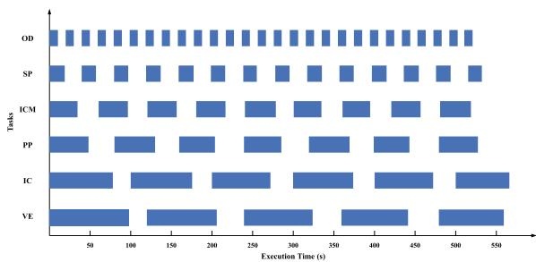  
(b) Scheduled by the WAMSPRES scheduler

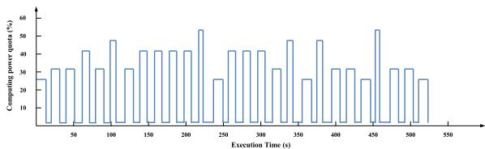  
(b) Scheduled by the WAMSPRES scheduler

Fig. 13 gives the computing power quota changing sequence of task OD. Since the Ascend scheduler does not distinguish priorities of tasks and allocates NPU resources equally to each task. Thus, tasks with short periods will probably miss the deadline. The WAMSPRES scheduler adjusts the computing power quota according to the deadline and priority of the task, which allocates more resources to high-priority or short-deadline tasks.

## D. Disscusion

WAMSPRES considers both workload indicators and input sizes for predicting remaining execution time for an NPU task when it is co-executing with other tasks. It provides a lightweight preemptive scheduling mechanism that dynamically allocates computing resources for each task according to priority and deadline, which does not remove the low-priority tasks. The average scheduling overhead of WAMSPRES in a set of 10 tasks is just $6 4 . 8 ~ \mu \mathrm { s }$ without any memory copy operation.

However, there are still some limitations in the prototype WAMSPRES scheduler. First, in order to balance scheduling overhead and prediction accuracy, we adopt a simple 4-layer BPNN model that each hidden layer contains 13 neurons. The simple structure can significantly reduce the scheduling overhead, but the prediction accuracy may also decrease. Second, WAMSPRES is specifically designed for the airborne embedded system which usually has a fixed task set. Thus, we can improve the prediction accuracy by constantly training with sufficient data. But, when the task set changes, it is likely to cause catastrophic forgetting after retaining the BPNN model. Third, the workload-related indicators require driver API provided by device manufacturers. In this paper, we use DSMI interface for Huawei Atlas 200 AI device. The workload-related indicators may need to be redesigned based on specific hardware. We will focus on addressing the aforementioned issues in our future work.

## VII. CONCLUSION

In this paper, we implement a soft preemptive NPU realtime scheduling mechanism, WAMSPRES, for the airborne embedded system. First, to better manage NPU computational resources, we design a resource sharing framework based on Kubernetes that provides fine-grained NPU resource virtualization and task isolation. Then, in order to accurately predict the remaining execution time of tasks under co-execution circumstance, we propose a workload-aware NPU performance model based on a lightweight BPNN. Moreover, a soft preemptive NPU scheduler is developed to deal with the real-time scheduling in the embedded system. The soft preemptive scheduler dynamically adjusts computing power quota assigned to the active tasks according to the priority and deadline. It can provide approximate preemption to high-priority tasks. Finally, we implement a prototype of WAMSPRES based on Huawei Atlas 200 and evaluate the proposed model on both simulated and realistic task sets. Experimental results illustrate that the average MAPE values of WAMSPRES scheduler are less than 5% and 8% respectively under the simulated and realistic task sets. In addition, it achieves at most 48.7% more scheduling success ratio than the inherent Ascend scheduler. For a realistic task set in the airborne embedded system, the scheduling success ratio of the WAMSPRES scheduler has always been 100% in four experiments with different durations.

## REFERENCES

[1] Y. Hu et al., “Industrial Internet of Things intelligence empowering smart manufacturing: A literature review,” IEEE Internet Things J., vol. 11, no. 11, pp. 19143–19167, Jun. 2024.

[2] S. Zeng et al., “Enabling efficient and flexible FPGA virtualization for deep learning in the cloud,” in Proc. 28th IEEE Int. Symp. Field- Program. Custom Comput. Machines, 2020, pp. 102–110.

[3] S. Ghodrati et al., “Planaria: Dynamic architecture fission for spatial multitenant acceleration of deep neural networks,” in Proc. IEEE Int. Symp. Microarchitecture, 2020, pp. 681–697.

[4] J. Lee, J. Choi, J. Kim, J. Lee, and Y. Kim, “Dataflow mirroring: Architectural support for highly efficient fine-grained spatial multitasking on systolic-array NPUs,” in Proc. 58th ACM/IEEE Des. Automat. Conf., 2021, pp. 247–252.

[5] Y. Zhang, B. Zhang, and Z. Zhou, “Zero-copy data transfer for an OpenCL API remoting system,” in Proc. IEEE Int. Conf. Cloud Comput. Big Data Analytics, 2020, pp. 255–259.

[6] Y. W. Chen, S. H. Hung, C. H. Tu, and C. W. Yeh, “Virtual hadoop: MapReduce over docker containers with an auto-scaling mechanism for heterogeneous environments,” in Proc. ACM Int. Conf. Res. Adaptive Convergent Syst., 2016, pp. 201–206.

[7] S. S. Baghsorkhi, M. Delahaye, S. J. Patel, W. D. Gropp, and W. W. Hwu, “An adaptive performance modeling tool for GPU architectures,” ACM SIGPLAN Notices, vol. 45, no. 5, pp. 105–114, 2010.

[8] S. Hong and H. Kim, “An analytical model for a GPU architecture with memory-level and thread-level parallelism awareness,” in Proc. ACM 36th Int. Symp. Comput. Archit., 2009, pp. 152–163.

[9] Y. Zhang and J. D. Owens, “A quantitative performance analysis model for GPU architectures,” in Proc. 17th IEEE Int. Symp. High Perform. Comput. Archit., 2011, pp. 382–393.

[10] T. T. Dao, J. Kim, S. Seo, B. Egger, and J. Lee, “A performance model for GPUs with caches,” IEEE Trans. Parallel Distrib. Syst., vol. 26, no. 7, pp. 1800–1813, Jul. 2015.

[11] S. Lym, D. Lee, M. O’Connor, N. Chatterjee, and M. Erez, “DeLTA: GPU performance model for deep learning applications with in-depth memory system traffic analysis,” in Proc. IEEE Int. Symp. Perform. Anal. Syst. Softw., 2019, pp. 293–303.

[12] Y. Choi and M. Rhu, “PREMA: A predictive multi-task scheduling algorithm for preemptible neural processing units,” in Proc. IEEE Int. Symp. High Perform. Comput. Archit., 2020, pp. 220–233.

[13] Y. Yao et al., “WAMP22S: Workload-aware GPU performance model based pseudo-preemptive real-time scheduling for the airborne embedded system,” IEEE Trans. Parallel Distrib. Syst., vol. 33, no. 11, pp. 2767–2780, Nov. 2022.

[14] Y. Yao et al., “Brief industry paper: Workload-aware GPU performance estimation in the airborne embedded system,” in Proc. 27th IEEE Real-Time Embedded Technol. Appl. Symp., 2021, pp. 417–420.

[15] G. A. Elliott and J. H. Anderson, “Real-world constraints of GPUs in real-time systems,” in Proc. 17th IEEE Int. Conf. Embedded Real-Time Comput. Syst. Appl., 2011, pp. 48–54.

[16] I. Tanasic, I. Gelado, J. Cabezas, A. Ramirez, N. Navarro, and M. Valero, “Enabling preemptive multiprogramming on GPUs,” in Proc. 41st IEEE Int. Symp. Comput. Archit., 2014, pp. 193–204.

[17] J. J. K. Park, Y. Park, and S. Mahlke, “Chimera: Collaborative preemption for multitasking on a shared GPU,” ACM SIGPLAN Notices, vol. 50, no. 4, pp. 593–606, 2015.

[18] S. Kato, K. Lakshmanan, A. Kumar, M. Kelkar, Y. Ishikawa, and R. Rajkumar, “RGEM: A responsive GPGPU execution model for runtime engines,” in Proc. IEEE Real-Time Syst. Symp., 2011, pp. 57–66.

[19] S. Kato, M. Mcthrow, C. Maltzahn, and S. Brandt, “Gdev: First-class GPU resource management in the operating system,” in Proc. USENIX Annu. Tech. Conf., 2012, pp. 401–412.

[20] G. A. Elliott, B. C. Ward, and J. H. Anderson, “GPUSync: A framework for real-time GPU management,” in Proc. 34th IEEE Real-Time Syst. Symp., 2013, pp. 33–44.

[21] Z. Wang, J. Yang, R. Melhem, B. Childers, Y. Zhang, and M. Guo, “Simultaneous multikernel GPU: Multi-tasking throughput processors via fine-grained sharing,” in Proc. IEEE Int. Symp. High Perform. Comput. Archit., 2016, pp. 358–369.

[22] J. Zhong and B. He, “Kernelet: High-throughput GPU kernel executions with dynamic slicing and scheduling,” IEEE Trans. Parallel Distrib. Syst., vol. 25, no. 6, pp. 1522–1532, Jun. 2014.

[23] H. Zhou, G. Tong, and C. Liu, “GPES: A preemptive execution system for GPGPU computing,” in Proc. 21st IEEE Real-Time Embedded Technol. Appl. Symp., 2015, pp. 87–97.

[24] G. Chen, Y. Zhao, X. Shen, and H. Zhou, “EffiSha: A software framework for enabling effficient preemptive scheduling of GPU,” in Proc. 22nd ACM SIGPLAN Symp., 2017, pp. 3–16.

[25] B. Wu, X. Liu, X. Zhou, and C. Jiang, “FLEP: Enabling flexible and efficient preemption on GPUs,” in Proc. Int. Conf. Architectural Support Program. Lang. Oper. Syst., 2017, pp. 483–496.

[26] C. Hartmann and U. Margull, “GPUart-An application-based limited preemptive GPU real-time scheduler for embedded systems,” J. Syst. Archit., vol. 97, pp. 304–319, 2019.

[27] H. Lee, H. Kim, C. Kim, H. Han, and E. Seo, “Idempotencebased preemptive GPU kernel scheduling for embedded systems,” IEEE Trans. Parallel Distrib. Syst., vol. 70, no. 3, pp. 332–346, Mar. 2021.

[28] H. Wu, W. Liu, Y. Gong, and J. Jin, “Safe process quitting for GPU multiprocess service (MPS),” in Proc. 40th IEEE Int. Conf. Distrib. Comput. Syst., 2020, pp. 1169–1170.

[29] A. Dhakal, S. G. Kulkarni, and K. K. Ramakrishnan, “GSLICE: Controlled spatial sharing of GPUs for a scalable inference platform,” in Proc. 11th ACM Symp. Cloud Comput., 2020, pp. 492–506.

[30] B. Li, T. Patel, S. Samsi, V. Gadepally, and D. Tiwari, “MISO: Exploiting multi-instance GPU capability on multi-tenant GPU clusters,” in Proc. 13th Symp. Cloud Comput., 2022, pp. 173–189.

[31] C. Espenshade et al., “Characterizing training performance and energy for foundation models and image classifiers on multi-instance GPUs,” in Proc. 4th Workshop Mach. Learn. Syst., 2024, pp. 47–55.

[32] S. Ohshima, A. Ida, R. Yokota, and I. Yamazaki, “QR factorization of block low-rank matrices on multi-instance GPU,” in Proc. Int. Conf. Parallel Distrib. Comput. Appl. Technol., 2022, pp. 359–369.

[33] M. Rhu, N. Gimelshein, J. Clemons, A. Zulfiqar, and S. W. Keckler, “vDNN: Virtualized deep neural networks for scalable, memory-efficient neural network design,” in Proc. 49th IEEE/ACM Int. Symp. Microarchitecture, 2016, pp. 1–13.

[34] 2022. [Online]. Available: https://gitee.com/ascend/samples/tree/v0.6.0/

[35] E. Bini and G. Buttazzo, “Measuring the performance of schedulability tests,” Real-Time Syst., vol. 30, no. 1, pp. 129–154, 2005.

[36] C. Liu et al., “WMDRS: Workload-aware performance model based multitask dynamic-quota real-time scheduling for neural processing units,” in Proc. 28th IEEE Int. Conf. Parallel Distrib. Syst., 2022, pp. 435–442.

Kai Hu received the BE degree from Anhui University, in 2022. He is currently working toward the master’s degree with the Department of Software Engineering, Northwestern Polytechnical University. His research interests include NPU virtualization and resource management.

  
Yuan Yao (Member, IEEE) received the BS, MS, and PhD degrees in computer science from Northwestern Polytechnical University, Xi’an, China, in 2007, 2009 and 2015, respectively. Currently, he is an associate professor with the School of Computer Science, Northwestern Polytechnical University. His research interests are in the area of real-time embedded system, distributed and parallel computing and system software.

Qiming Huang received the MS degree in software engineering from UESTC, in 2020. He is currently working towards the doctor’s degree with the Department of Computer Science, Northwestern Polytechnical University. His research interests include real-time scheduling, real-time locking protocal, virtualization and cyber-physical systems.

Yujiao Hu received the bachelor’s and PhD degrees from the Department of Computer Science, Northwestern Polytechnical University, Xi’an, China, in 2016 and 2021, respectively. From November 2018 to March 2020, she was a visiting PhD student with the National University of Singapore. Currently, she is a faculty member with Purple Mountain Laboratories. She focuses on deep learning, edge computing, multi-agent cooperation problems.

Yi Dang received the BE degree from Zhengzhou University, in 2021. She is currently working toward the master’s degree with the Department of Computer Science, Northwestern Polytechnical University. Her research interests include real-time embedded system and resource management.

Zhe Peng (Member, IEEE) received the BS degree from Northwestern Polytechnical University, the MS degree from the University of Science and Technology of China, and the PhD degree from The Hong Kong Polytechnic University. He was a visiting scholar with the Department of Electrical and Computer Engineering, Stony Brook University. He is currently a research assistant professor with the Department of Industrial and Systems Engineering, The Hong Kong Polytechnic University. His research interests include distributed computing, cyber-physical systems, autonomous systems.

Gang Yang (Member, IEEE) received the BE degree from the School of Automation, Second Artillery Engineering College of PLA, Xi’an, China, in 1998, and the MS and PhD degrees in computer science from Northwestern Polytechnical University, Xi’an, in 2002 and 2006, respectively. He is currently a professor with the School of Computer Science, Northwestern Polytechnical University. His research interests include distributed computing systems, intelligent swarm systems and cyber-physical systems.

Wei Tao received the bachelor of engineering degree from Hainan University, in 2023. He is currently working toward the master’s degree with the Department of Computer Science, Northwestern Polytechnical University. His research interests focus on NPU virtualization and resource management.

Xingshe Zhou (Member, IEEE) received the BS and MS degrees in computer science from Northwestern Polytechnical University, Xian, China, in 1980 and 1982, respectively. He is currently a professor with the School of Computer Science, Northwestern Polytechnical University. His research interests include distributed computing, embedded computing, and sensor networks.